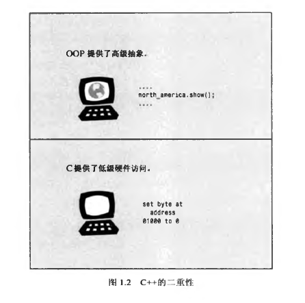
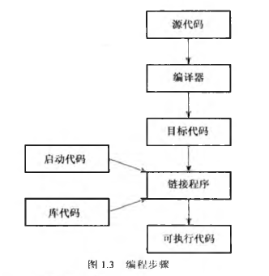

## 第 1 章 预备知识

它在 C 语言的基础上添加了对**面向对象编程**和**泛型编程**的支持

C++ 继承了 C 语言高效、简洁、快速和可移植性的传统

C++ 面向对象的特性带來了全新的编程方法，这种方法是为了应付复杂程度不断提商的现代编程任务而设计的

C++ 的模板特性提供了一种全新的编程方法-----泛型编程。

### 1.1 C++ 简介

C++ 融合了 3 种不同的编程方式
- C 语言代表的过程性语言
- C++ 在 C 语言基础上添加的类代表的面向对象语言
- C++ 模板支持的泛型编程

### 1.2 C++ 简史

体积更大、功能更强的计算机引出了更大、更复杂的程序，而这些程序在程序管理和维护方面带来了新的问题

C 和 Pascal 引领人们进入了结构化编程时代，这种机制把秩序和规程带进了迫切需要这种性质的领域中。

人们也见证了一种新编程模式的成长：面向对象编程（OOP)。SmallTalk 和 C++ 语言具备这种功能。

#### 1.2.1 C 语言

1970年代，贝尔实验室的 Dennis Ritchie 致力于开发 UNIX 操作系统。为完成这项工作，Ritchie 需要一种语言，它必须简洁，能够生成简洁、快速的程序，并能有效地控制硬件。

一种被称为编译器的特殊程序将高级语言翻译成特定计算机的内部语言。这样就可以通过每个平台使用不同的编译器来在不同的平台上使用同一个高级语言程序了。

Ritchie希望有一种语言能将低级语言的效率、硬件访问能力和高级语言的通性、可移植性融合在一起，于是他在旧语言的基础上开发了C语言。

#### 1.2.2 C 语言编程原理

一般来说，计算机语言要处理两个概念-----**数据和算法**。数据是程序使用和处理的信息，算法是程序使用的方法

过程化编程首先要确定计算机应采取的操作，然后使用编程语言来实现这些操作。程序命令计算机按照一系列流程生成特定的结果，就像菜谱指定了厨师做蛋糕时应遵循的一系列步骤一样。

C语言具有**结构化编程**的特性，结构化编程将分支限制为一小组行为良好的结构。C语言的词汇表中就包含了这些结构(`for` 循环、`while`循环、`do while` 循环和 `if else`语句)

另一个新原则是**自顶向下**（top-down) 的设计。在 C 语言中，其理念是将大型程序分解为小型、便于管理的任务

#### 1.2.3 面向对象编程

与强调算法的过程性编程不同的是，OOP**强调**的是**数椐**。OOP不像过程性编程那样，试图使问题满足语言的过程性方法，而是试图让语言满足问题的要求。

在 C++ 中，类是一种规范，它描述了这种新型数据格式，对象是根据这种规范构造的特定数据结构。

通常，类规定了可使用哪些数据来表示对象以及可以对这些数据执行哪些操作。

#### 1.2.4 C++ 与泛型编程

术语泛型是指创建独立于类型的代码

泛型编程提供了执行常见任务(如数据排序或合并链表)的工具

#### 1.2.5 C++ 的起源

C++ 也是在贝尔实验室诞生的， Bjarne Stroustrup于 20 世纪 80 年代在这里开发
出了这种语言。

>C++ 主要是为了我的朋友和我不必再使用汇编语言、C 语言或其他现代高级语言来编程而设计的。它的主要功能是可以更方便地编写出好程序，让每个程序员更加快乐。(Bjarne Stroustrup)

名称 C++ 来自 C 语言中的递增运算符，该运算符将变量加1。名称 C++ 表明，它是 C 的扩充版本。

有些 OOP 正统派把为 C 添加 OOP 特性看作是**为猪插上翅膀**，虽然这是头瘦骨嶙峋、非常能干的猪

### 1.3 可移植性和标准

可移植性的定义：如果在不修改代码的情况下，重新编译程序后，程序将运行良好，那么该程序是可移植的。

可移植性的两大障碍

1. 硬件。硬件特定的程序是不可移植的

2. 语言上的差异，虽然多数实现都希望其 C++ 版本与其他版本兼容，但如果没有准确描述语言工作方式的公开标准，这将很难做到

C++的第一个国际标准 : C++ 98

### 1.4 程序创建的技巧

程序创建的步骤

1. 使用文本编辑器**编辑**程序。并将其保存到文件中，这个文件就是程序的**源代码**

2. **编译**源代码。将源代码翻译为主机使用的机器语言(**目标代码**)

3. 将目标代码与其他代码**链接**起来，例如一些库函数，最终生成**可执行代码**

