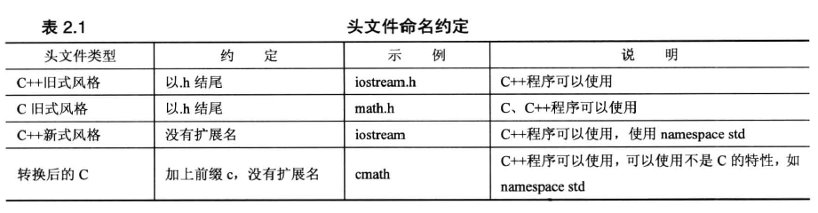

## 第 2 章 开始学习 C++

C++对大小写敏感，区分大写字符和小写字符

### 2.1 进入 C++

HelloWorld程序
````C++
#include <iostream>
int main(){
    using namespace std;
    cout << "Come up and C++ me some time.";
    cout << endl;
    cout << "You won't regret it!" << endl;
    return 0;
}
````

#### 2.1.1 main函数

通常 C++ 程序必须包含一个 `main()` 函数，作为程序的入口

存在一些例外条件，如 Windows 中的动态链接库(Dynamic-link library, DLL)，这是其他 Windows 程序可以使用的代码，不是独立的程序，所以不需要 `main()`

#### 2.1.2 C++注释

编译器忽略一切注释


两种注释的写法

- C++ 的单行注释以双斜杠(`\\`)打头

- C++ 的多行注释采用C风格的注释`/*leave your comments here*/`


#### 2.1.3 C++预处理器与iostream文件

C++ 预处理器

- 预处理器在进行主编译之前对源文件进行处理，这点与 C 一样

- 它处理以 `#` 开头的编译指令

- 不必执行特殊操作来调用该预处理器，它会在编译程序时自动运行

- 例如: `#include <iostream>` 指令，导致 iostream 文件中的内容随源代码文件的内容一起被发送给编译器。也就是说 iostream 文件的内容将取代程序中的代码行 `#include <iostream>`。

头文件

- 头文件又叫做包含文件

- C++ 编译器自带了很多头文件，每个头文件都支持一组特定的工具

- 通常，C++ 头文件没有扩展名

- 头文件命名约定如下图




#### 2.1.4 名称空间

名称空间，旨在让您在编写大型程序以及多个厂商现有的代码组合起来的程序时更容易，它还有助于组织程序。

名称空间让厂商能够将其产品封装在一个叫做名称空间的单元中，这样就可以用名称空间的名称来指出想使用哪个厂商的产品

C++ 的标准组件都被放置到 `std` 名称空间中

#### 2.1.5 C++源代码风格

1. 每个语句占一行

2. 每个函数都有一个开始花括号和一个结束花括号，这两个花括号各占一行

3. 函数中的语句都相对于花括号进行缩进

4. 与函数名称相关的圆括号周围没有空白

### 2.2 C++ 语句

1. 声明语句: 定义函数中使用的变量的名称和类型
 
2. 赋值语句: 使用赋值运算符( `=` )给变量进行赋值

3. 消息语句: 将消息发送给对象，激发某种活动

4. 函数调用: 执行函数。被调用的函数执行完毕后，程序返回到函数调用语句后面的语句

5. 函数原型: 声明函数的返回类型、函数接受的参数数量和类型

6. 返回语句: 将一个值从被调用的函数那里返回到调用函数中

### 2.3 函数

#### 2.3.1 函数的组成

一个函数由函数原型和函数定义两部分组成

- 函数原型
    - 函数原型描述了函数接口，即函数如何与程序的其他部分交互
    - 在使用函数前，C++编译器必须知道函数的参数类型和返回值类型，函数原型负责提供这些信息
    - 原型以分号结尾，省略函数体

- 函数定义: 负责定义函数，包含函数的代码

C 和 C++ 将库函数的这两项特性(原型和定义)分开了，库文件中包含了函数的编译代码，而头文件中包含了原型

#### 2.3.2 函数定义的格式

````c++
type function_name(argument_list){
    statements
}
````

>注意: C++不允许将函数定义嵌套到另一个函数中。所有函数都是平等的。java也能在方法中定义子方法，而 python 则可以。

#### 2.3.3 函数的特性

- 有函数头或函数体

- 接受0~n个参数

- 返回0~1个值

- 需要一个原型

### 2.4 关键字

关键字在C++中构成特殊的语言成分，如 `return`、`int`、`while`等都是关键字

关键字不能用作它用

>注意: `main` 不是关键字，因为它不是语言的组成部分。然而它是一个必不可少函数的名称。因此最好不要随意使用 `main`

### 2.5 类与对象

类

- 类是用户定义的一种数据类型

- 要定义类，需要描述它能够表示什么信息和可对数据执行哪些操作

对象

- 对象是根据类描述创建的实体

- 例如: `cout` 是 `ostream` 类的实体

C++向对象发送消息的两种方法

1. 使用类方法(本质上是函数调用)

2. 重新定义运算符

> 在 java 中，无法重新定义运算符，所以我们经常写出，`objectA.equal(objectB)` 这类的代码，James Gosling当时这样做好像是为了降低 java 语言的编程难度。而在 python 中，我们可以通过在类中实现一些"双下"方法，例如 `__eq()__` 等，使这个类支持运算符。

### 2.6 一个简单的包含函数调用的例子

````c++
#include <iostream>
int stonetolb(int);
int main(){
    using namespace std;
    int stone;
    cout << "Enter the weight in stone: ";
    cin >> stone;
    int pounds = stonetolb(stone);
    cout << stone << " stone = ";
    cout << pounds << " pounds." << endl;
    return 0;
}
int stonetolb(int sts){
    return 14 * sts;
}
````