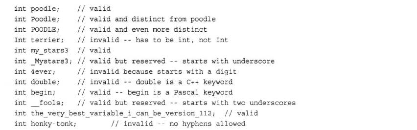
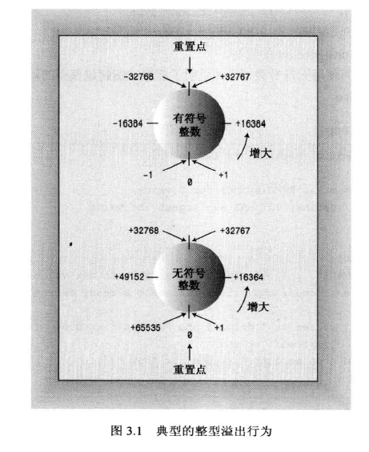

## 第 3 章 处理数据

内置的 C++ 类型分两组: 基本类型和复合类型

但是没有任何一种整型和浮点型能够满足所有编程要求，所以对于这两种数据有很多变体

### 3.1 简单变量

程序必须记录信息的三个基本属性

- 信息将存储在哪里

- 要存储什么值

- 存储何种类型的信息

#### 3.1.1 变量名

C++ 提倡使用一定含义的变量名

必须遵循几种简单的C++ 命名规范

1. 在名称中只能使用字母字符、数字和下划线(_)
2. 名称的第一个字符不能是数字
3. 区分大写字符和小写字符
4. 不能将 C++ 关键字用作名称
5. 以两个下划线或下划线和大写字母开头的名称被保留给实现使用，以一个下划线开头的名称被保留给实现，用作全局标识符(使用这种命名变量不会导致编译器错误，但是会导致程序的不确定性)
6. C++ 对于名称的长度没有限制，名称中所有的字符都有意义，但有些平台有长度限制(C只保证前63个字符有意义)

下面是一些有效和无效的 C++ 名称



如果想用两个或者更多的单词组成一个变量名称，有两种做法

1. 使用下划线将单词分开(C、python等语言如是)

2. 从第二个单词开始将每个单词的第一个字母大写(Pascal, java等语言如是)

#### 3.1.2 整型

不同的 C++ 整型使用不同的内存量来存储整数，使用的内存量越大，可以表示的整数值范围也越大。

有的类型有正负值之分，有的类型不能表示负值

C++ 的基本整型分别是`char`、`short`、`int`、`long`和`long long`

#### 3.1.3 short、int、long和long long

C++ 的`short`、`int`、`long`和`long long`类型通过使用不同数目的位来存储值

但在实际生活中，这些类型长度因计算机而异，但是通常遵循一定的标准
- `short`至少16位
- `int`至少与`short`一样长
- `long`至少32位，且至少与`int`一样长
- `long long`至少64位，且至少与`long`一样长

要知道系统中整数的最大长度，可以使用C++工具来检查类型的长度
- 使用`sizeof`运算符返回类型和变量的长度，单位为字节
- 头文件`climit`中包含了关于整型限制的信息，例如: `INT_MAX` 为 `int` 的最大取值，`CHAR_BIT`为字节的位数

>**符号常量--预处理方式**  
>在C++编译过程中，首先将源代码传递给预处理器。`#define`与`#include`一样，也是一个预处理编译指令。该指令告诉预处理器：在程序中查找`INT_MAX`，将所有的`INT_MAX`都替换成`32767`

#### 3.1.4 变量初始化

C++ 的变量初始化基本与 C 相同，但是有几种方式是C ++ 独有的
````C++
int wrens(432);//将 432 赋值给 wrens
int wrens = {432};//将 432 赋值给 wrens
int wrens{432};//将 432 赋值给 wrens
int wrens = {};//wrens被初始化为0
int wrens{};//wrens被初始化为0
````

>如果不对函数内部定义的变量进行初始化，该变量的值将是不确定的。这意味着该变量的值将是它被创建之前，相应内存单元保存的值

#### 3.1.5 C++的无符号类型和整型的溢出

无符号类型可以增大变量能够储存的最大值(因为省略了一位存储符号)

C++ 的整型溢出时，行为很像里程表。如果超越了界限，其值将为范围另一端的取值



#### 3.1.6 选择整型类型

通常，`int`被设置为对目标计算机而言最为自然的长度。自然长度指的是计算机处理起来效率最高的长度

#### 3.1.7 整形字面量

通常 `C++` 可以以三种不同的计数方式来书写整数: 基数为10、基数为8和基数为16。

- 使用`0`来标识8位数

- 使用`0x`来标识16位数

这些表示方式仅仅是为了表达上的方便。不管以何种方式书写字面量，都将被存储为二进制

`iostream`提供了`dec`、`hex`、`oct`分别用于指示`cout`以十进制、十六进制和八进制表示整数

#### 3.1.8 char类型: 字符和小整数

编程语言通过使用字母的数值编码解决了储存字母的问题，`char`类型是另一种整型。它足够长，可以表示目标计算机系统中的所有基本符号(所有字母、数字、标点符号等)

`C++` 实现使用的是其主机系统的编码。在美国，最常用的符号集是 `ASCII` 字符集。但是 `ASCII` 字符集很难满足国际化的需求。为了满足国际化需求，`C++` 支持的宽字符类型可以存储更多的值，如 `Unicode` 字符集使用的值

值的类型将引导cout选择如何显示值，例如将`char`显示为字符，将`int`显示为数字