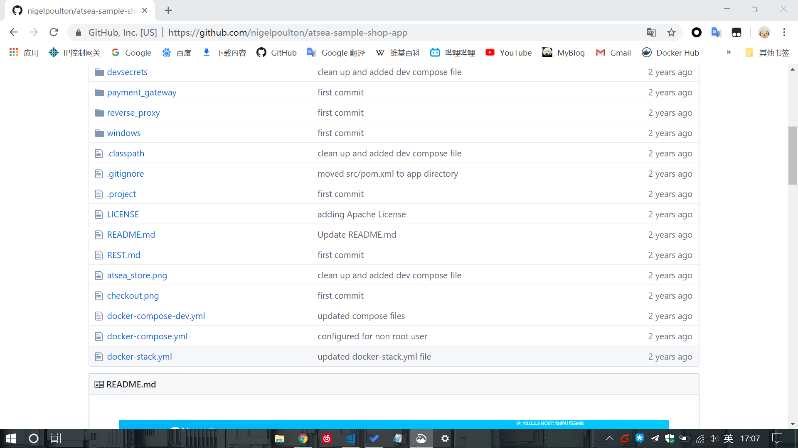

## 2 核心技术

### 2.1 Docker镜像

#### 2.1.1 Docker镜像

- Docker镜像就像停止运行的容器

- 可以从镜像仓库服务中拉取镜像，拉取操作会将镜像下载到本地Docker主机

- 使用镜像可以启动多个容器

- 镜像由很多层组成，每层叠加之后，在外部看就像一个独立的对象。

- 镜像内部是一个精简的操作系统，其中包含应用运行所必须的文件和依赖包

#### 2.1.2 镜像与容器

- 镜像可以启动一个或多个容器

- 一旦容器从镜像启动后，二者就是相互依赖的，并且在镜像上启动的容器全部停止之前，镜像是无法被删除的

#### 2.1.3 镜像通常较小

- 镜像中包含了应用/服务运行时必须的操作系统和应用文件

- 构建镜像时通常要剪裁掉不必要的部分，保持较小的体积

- 镜像不包含内核，共享操作系统内核

#### 2.1.4 镜像拉取和镜像仓库

- 通过 `docker pull`可将镜像拉取到本地主机

- Docker镜像存储在镜像仓库服务中。镜像仓库服务包含了多个镜像仓库。同样，一个镜像仓库包含多个镜像

- 官方仓库中的镜像是安全可靠的，大多数流行的操作系统和应用在Docker Hub的官方仓库中都有其对应得镜像

#### 2.1.5 镜像命名和标签

- 只需要给出镜像的名字和标签，就可以从官方仓库定位一个镜像，例如`alpine:latest`

- 从非官方仓库拉取镜像，需要在仓库名称面前加上对应作者Docker Hub的用户名，例如:`tough/test:v1`

#### 2.1.6 镜像与分层

- Docker镜像由一些松耦合的只读镜像层组成

- Docker负责堆叠这些镜像层，并且表示为单个统一的对象

- 所有的Docker镜像都起始于一个基础镜像层，当进行修改或增加新的内容时，就会在当前的镜像层之上创建新的镜像层，如下图所示

    
- docker通过存储引擎的方式来实现镜像层堆叠，并对外展示为统一的文件系统

#### 2.1.7 共享镜像层

- Docker可以识别出要拉取的镜像中，哪几层已经在本地存在了，然后共享这几层，可以有效节省空间并提升性能

- 每个存储引擎都有自己的镜像分层、镜像层共享以及写时复制

#### 2.1.8 镜像散列值(摘要)

- 内容散列: 散列值与镜像中所有文件的内容有关，修改镜像的配置或者修改任意的镜像层，都会导致加密散列值的变化

- 内容寻址模型极大提升了安全性，提供了一种方式来保证镜像和镜像层数据是一致的

### 2.2 Docker容器

#### 2.2.1 Docker容器

- 容器是镜像的运行时实例，可以从单个镜像上启动一个或多个容器

- 容器会随着其中运行应用的退出而终止

- 常用命令
    - 使用`docker run`命令可以启动容器
    - 使用`docker stop`命令可以暂停容器
    - 使用`docker start`命令可以重启容器
    - 使用`docker rm`命令可以删除容器

#### 2.2.2 容器vs虚拟机

- 容器和虚拟机都依赖于宿主机才能运行

- 容器模型
    1. 首先，OS也占用全部硬件资源
    2. 在OS层之上要安装容器引擎，容器引擎可以获得系统资源，
    3. 接着把资源分割为安全的互相隔离的资源结构，称之为容器
    3. 每个容器看起来像一个真实的操作系统，在其内部可以运行应用

- 更多的
    - Hypervisor是硬件虚拟化(Hardware Virtualization)将硬件物理资源划分为虚拟资源
    - 容器是操作系统虚拟化，将操作系统资源划分为虚拟资源

#### 2.2.3 虚拟机的额外开销

- 每个虚拟机都有一份OS损耗，而容器只有一份OS损耗

- 虚拟机因为需要启动操作系统，启动速度慢，容器只需要启动位于下层操作系统的共享内核，启动速度快

#### 2.2.4 容器进程

- 容器中的进程是精简的，比普通操作系统要少

- 杀死容器中的主进程，则容器也会被杀死，这个主进程一般是`pid`为`1`的进程，但是这种进程一般是杀不死的

#### 2.2.5 容器生命周期

生命周期
1. `docker run` 启动容器
    ````bash
    $ docker run --name percy -it ubuntu:latest:/bin/bash 
    ````

2. `docker stop` 停止容器
    ````bash
    $ docker stop percy
    ````

3. `docker start` 重启容器
    ````bash
    $ docker start percy
    ````
4. 删除容器需要两步，先停止容器再删除容器
    ````bash
    $ docker stop percy
    $ docker rm percy
    ````

其他
- 直到明确删除容器前，容器的数据都不会丢弃
- 就算删除了容器，如果将容器数据存储到卷中，数据也会被保存
- 尽量使用两步来删除容器，让容器有机会正常停止手头的工作

#### 2.2.6 重启策略

1. `always`: 除非容器被明确停止，否则该策略会一直尝试重启处于停止状态的容器

2. `unless-stopped`: 哪些处于Stopped状态的容器，不会在Docker daemon 重启的时候重启

3. `on-failure`: 在退出容器且返回值不是0的时候，重启容器

#### 2.2.7 `docker run`的一些参数

例如
````
$ docker run -d --name webserver -p 80:8080 nige/dock
````

- `-d`：表示后台模式，告知容器在后台运行

- `-p`将Docker主机的端口映射到容器内，这里是将Docker主机的80端口映射到容器内的8080端口，这意味着当有流量访问主机的80端口时，流量会直接映射到容器的8080端口

### 2.3 应用的容器化

- Docker的核心思想就是如何将应用整合到容器中，并且能在容器中实际运行，这个过程称为容器化

#### 2.3.1 容器化简介

- 容器是为应用而生

- 容器化的步骤
    1. 编写应用代码
    2. 创建一个`Dockerfile`，其中包括当前应用的描述、依赖以及该如何运行这个应用
    3. 对该`Dockerfile`执行`docker image build`命令
    4. 等待Docker将应用程序构建到`Docker`镜像中
    5. 运行，从镜像中产生容器

- 容器化的基本过程
    

#### 2.3.2 单体应用容器化

##### 1 获取应用代码
- 这里先介绍如何完成单节点应用的容器化，也可以使用Docker Compose完成多节点应用容器化

- [应用代码地址](https://github.com/nigelpoulton/psweb)

##### 2 分析Docker文件

- 源码
    ````
    # Test web-app to use with Pluralsight courses and Docker Deep Dive book
    # Linux x64
    FROM alpine

    LABEL maintainer="nigelpoulton@hotmail.com"

    # Install Node and NPM
    RUN apk add --update nodejs nodejs-npm

    # Copy app to /src
    COPY . /src

    WORKDIR /src

    # Install dependencies
    RUN  npm install

    EXPOSE 8080

    ENTRYPOINT ["node", "./app.js"]
    ````

- Dockerfile通常放到构建上下文的根目录

- Dockerfile的主要用途
    - Dockerfile对当前应用及其依赖有个清晰的描述
    - 可以指导Docker完成应用的容器化
    
- 上述docker文件的步骤
    1. 以alpine镜像为当前镜像基础
        - 每个Dockerfile的第一行都是`FROM`指令
        - `FROM`指令指定的镜像，会作为当前镜像的一个基础镜像
    2. 指定维护者，使用`LABEL`标签
    3. 安装Node.js和NPM
        - `RUN apk add --update nodejs nodejs-npm`指令使用alpine中的apk包管理器将nodejs和npm安装到当前镜像中
        - `RUN`指令会在`FROM`指定的alpine基础镜像之上，新建一个镜像层来存储这些安装内容
    4. 将应用的代码复制到镜像当中
        - `COPY . /src`指令将应用相关文件从构建上下文复制到当前镜像中，并新建一个镜像层来存储
    5. 设置新的工作目录
        - Dockerfile通过`WORKDIR`命令，为Dockerfile中尚未执行的指令设置工作目录
    6. 安装依赖包
        - `npm install`用来安装当前应用的相关依赖包，并且新建镜像层来保存相关的依赖文件
    7. 配置应用的网络端口
        - `EXPOSE 8080`指令可以完成相应端口的设置
        - 这个配置信息会作为镜像的元数据保存，不会产生新的镜像层
    8. 将`app.js`设置为默认运行的应用
        - 通过`ENTRYPOINT`指令指定当前镜像的入口程序。
        - 这个配置信息会作为镜像的元数据保存，不会产生新的镜像层

##### 3 构建镜像

- 执行如下指令
    ````
    $ docker image build -t web:latest .
    ````

- 其中，命令最后的`.`表示Docker在构建过程中，使用当前目录作为上下文

##### 4 推送镜像到仓库

- 可以将镜像保存在一个镜像仓库服务，这样存储比较安全，且可以被其他人访问到

- 需要为镜像打标签，且置于自己用户名的二级目录下，例如
    ````
    $ docker image tag web:latest t0ugh/web:latest
    ````

- 通过执行如下命令，将镜像推到仓库
    ````
    $ docker image push t0ugh/web:latest
    ````

##### 5 运行应用程序

- 运行如下指令，基于上述镜像启动容器
    ````
    $ docker run -d --name -c1 -p 80:8080 web:latest
    ````

- 这个命令会把容器内部的8080端口映射到Docker主机的80端口

##### 6 其他

- Dockerfile中的注释，使用`#`开头

- 除了注释之外，都是指令

- `Docker image build`命令会按行解析Dockerfile中的指令并且顺序执行

- 如果指令的作用是向镜像中增添新的文件或者程序，那么这条指令就会新建镜像层；如果只是告诉Docker如何完成构建或者如何运行程序，那么只会增加镜像的元数据

- `docker image history`查看构建过程中的历史

- `docker image inspect`查看镜像元数据

#### 2.3.3 生产环境中的多阶段构建

- 背景：如前所示，正常的构建过程有可能引入大量并不必须的内容，比如，下载完对应的包后，就不再需要NPM或者Maven。再比如，用webpack打包完js文件后，就不再需要node了

- 多阶段构建可以解决这个问题，让镜像的体积更小

- 它可以从之前的构建阶段中仅复制生产环境相关的应用代码，而不复制生产环境不需要的构件

#### 2.3.4 其他

1. 利用构建缓存

2. 合并镜像

3. 使用no-install-recommends:它可以保证使用API包管理器时，只安装核心依赖

4. 不要安装MSI包

### 2.4 使用Docker Compose部署应用

#### 2.4.1 简介

- Docker Compose主要用于部署分布在多容器中的应用

- 它是一个需要在Docker主机上进行安装的Python工具，使用时需要编写定义多容器应用的`YAML`文件，然后将其交给`docker-compose`命令处理，`docker-compose`会基于Docker引擎API完成应用的部署

- 还提供了一系列命令来管理应用的完整生命周期

- 可以将Docker Compose的配置文件置于版本管理系统中管理

    

#### 2.4.2 在Linux上安装Docker Compose

1. 使用curl命令下载二进制文件

2. 使用chmod命令将其置为可运行

#### 2.4.3 解读Compose文件

- Docker Compose使用YAML文件来定义多服务的应用

- 示例: docker-compose.yml
    ````yml
    version: "3.5"
    services:
        web-fe:
            build: .
            command: python app.py
            ports:
                - target: 5000
                - published: 5000
            networks:
                - counter-net
            volumes:
                - type: volume
                  source: conter-val
                  target: /code
            redis:
                image: "redis:alpine"
                networks:
                    counter-net:
    networks:
        counter-net:
    volumes:
        counter-vol:
    ````

- version是必须要指定的，而且要放到文件的第一行

- services用来定义不同的应用服务
    - 每个Service会部署到一个容器中
    - 会使用key来作为容器名字的一部分


#### 2.4.3 常用指令

- `docker-compose up`: 用来部署一个Compose应用。默认情况下该命令会读取名为`docker-compose.yml`或`docker-compose.yaml`的文件

- `docker-compose stop`命令会停止Compose应用相关的所有容器，但不会删除它们

- `docker-compose rm`命令用来删除已停止的Compose应用，它会删除容器和网络，但不会删除卷和镜像

- `docker-compose restart`命令会重启已停止的`Compose`应用。如果用户在停止之后对该应用进行了变更。变更的内容不会反映到重启后的应用中

- `docker-compose ps`列出`Compose`应用中的各个容器。输出内容包括当前的状态、容器运行的命令以及网络端口
