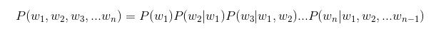
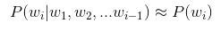
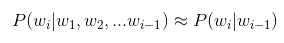
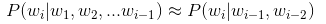
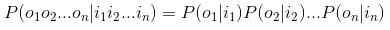
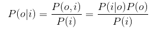
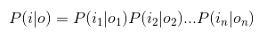
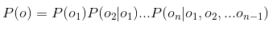
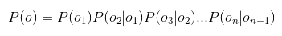
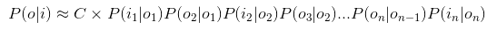

## 第三章 中文分词技术

>在语言理解中，词是最小的能够独立活动的有意义的语言成分。将词确定下来是理解自然语言的第一步，只有跨越了这一步，中文才能像英文那样过渡到短语划分、概念抽取以及主题分析，以至自然语言理解，最终达到智能计算的最高境界

### 3.1 中文分词简介

- 简介：中文分词技术通过计算机自动识别出句子中的词，在词间加入边界标识符，分隔出各个词汇

- 分词方法
    1. 规则分词：通过人工设立词库，按照一定方式进行匹配切分
    2. 统计分词：应用统计学方法进行分词
    3. 混合分词：前两种方法的混合

---

### 3.2 规则分词

- 简介
    - 基于规则的分词是一种机械分词方法，主要通过维护词典
    - 在切分语句时，将语句中每个字符串与词表中的词进行逐一匹配，找到则切分，否则不切分

- 几种匹配切分的方法
    
    1. 正向最大匹配法(Maximum Match Method, MM)
        - 从左到右取待切分语句的m个字符作为匹配字段，其中m为机器词典中最长词条的字符数
        - 查找机器词典并进行匹配。若匹配成功，则将这个匹配字段作为一个词切分出来。若不成功，则将这个匹配字段的最后一个字去掉，剩下的字符串作为新的匹配字段再次匹配。重复，直到切分出一个词或者字段长度为1
    
    2. 逆向最大匹配法(Reverse Maximum Match Method, RMM)
        - 原理同MM，只不过方向相反，使用逆序词典，从被处理文档的末端开始匹配扫描
        - 由于汉语中偏正结构较多，逆向匹配可以提高一定的精度
    
    3. 双向最大匹配法(Bi-directction Match Method)
        - 将MM和RMM得到的结果进行比较，然后按照最大匹配原则，选取词数切分最少的作为结果

---

### 3.3 统计分词

- 主要思想
    - 把每个词看做是由词的最小单位的各个字组成的
    - 如果**相连的字**在不同的文本中**出现的次数越多**，就证明着相连的字很可能是一个**词**
    - 我们可以利用**字与字相邻出现的频率**来反应**成词的可靠度**
    - 统计语料中相邻出现的各个字的组合的频率，当组合频率高于某个临界值时，我们便认为此**字组**可能构成一个**词**
---
#### 3.3.1 语言模型

- 简介
    - **为长度为n的字符串确定其概率分布P(w<sub>1</sub>, w<sub>2</sub>,...,w<sub>n</sub>)**
    - 其中,w<sub>1</sub>, w<sub>2</sub>,w<sub>n</sub>等表示字符串的第1,2,n个字符
    - P(w<sub>1</sub>, w<sub>2</sub>,...,w<sub>n</sub>)可以使用链式公式进行计算
    

- n-gram 模型
    - 如果字符串长度过长，可能会导致计算量巨大，这时，可以使用n-gram 模型，来降低计算量
    - **n-gram模型就是在估计条件概率的时候，忽略距离大于等于n的上文词的影响**，公式如下
    

- 几种 n-gram 模型
    - 一元模型 (unigram model) : n=1，完全损失句子中的词序信息  
        
    - 二元模型(bigram model)：n=2, 即条件概率只与前1个上下文有关  
        
    - 三元模型：n=3, 即条件概率只与前2个上下文有关  
        
---
#### 3.3.2 HMM模型(隐含马尔可夫模型)

1. 构词位置
    - 每个字在构造一个特定的词语的时候都占据着一个确定的构词位置(即词位)
    - 规定每个字最多只有4个构词位置
        - B 词首
        - M 词中
        - E 词尾
        - S 单独成词
    - 例如
        ````py
        中文, 分词, 是, 文本处理, 不可或缺, 的, 一步
        中(B)文(E), 分(B)词(E), 是(S), 文(B)本(M)处(M)理(E), 不(B)可(M)或(M)缺(E), 的(S), 一(B)步(E)
        ````

2. 任务
    - 输入:句子，如，`中文, 分词, 是, 文本处理, 不可或缺, 的, 一步`
    - 输出:标签序列，如，`中(B)文(E), 分(B)词(E), 是(S), 文(B)本(M)处(M)理(E), 不(B)可(M)或(M)缺(E), 的(S), 一(B)步(E)`
    - 我们的任务是寻找在已知输入句子的情况下,所有可能的输出标签序列中概率最大的一种，即MAX{P(o<sub>1</sub>,o<sub>2</sub>,...o<sub>n</sub>|i<sub>1</sub>,i<sub>2</sub>,...i<sub>n</sub>)}
    
3. 进行独立性假设
    - 因为P(o|i)是关于2n个变量的条件概率,且n不固定，因此几乎无法对P(o|i)进行计算
    - 这里引入独立性假设，即每个字的输出(o)仅仅与当前字有关(i),公式如下  
    
    - 然而这种方法完全没有考虑上下文的影响,且输出中会出现如BBB,BEM等不合理情况

4. 添加上下文影响
    - 首先对P(o|i)使用贝叶斯公式  
    
    - 其中，因为i是给定输入,所以P(i)为常数，可以忽略不计
    - 然后对P(i|o)也进行独立性假设，公式如下  
    
    - P(o)根据链式公式可求得为  
    
    - 然后对P(o)做齐次马尔科夫假设，即，每个输出仅仅与上一个输出有关
    
    - 于是P(o|i)最终等于  
    
    - 我们把P(i<sub>k</sub>|o<sub>k</sub>)称为发射频率,P(o<sub>k</sub>|o<sub>k-1</sub>)称为转移频率
    - 通过设置某些P(o<sub>k</sub>|o<sub>k-1</sub>)=0,就可以排除类似BBB、EM等不合理的情况

5. 如何寻找最大的P(i|o)P(o)
    - 通常采用Veterbi算法
    - 它是一种动态规划方法
    - 核心思想是：如果最终的最优路径经过某个o<sub>i</sub>，那么从初始节点到o<sub>i-1</sub>的路径必然也是最优路径
    - 根据这个思想，在考虑每个o<sub>i</sub>时只需要求出所有经过各o<sub>i-1</sub>的最优路径，然后再与当前的o<sub>i</sub>结合比较

6. 理解
    - HMM算法是一种基于统计学的切词算法
    - 它首先需要遍历给定语料库，计算发射概率和转移概率
    - 发射概率P(i<sub>k</sub>|o<sub>k</sub>)：是指当一个字被标记为O时(O为B、M、E、S中的一个),这个字是I的概率(I是语料库中所有字中的一个)
    - 转移概率P(o<sub>k</sub>|o<sub>k-1</sub>):是指当上一个标记为o<sub>k</sub>时，下一个标记为o<sub>k-1</sub>的概率,正是因为转移概率的引入，使得HMM算法可以考虑到上下文情况进行切词
    - 之后，当用户输入一个句子时，模型根据Veterbi算法,找到针对输入的句子出现概率最大的标记序列情况，完成切词
---
#### 3.3.3 其他统计分词算法
- 条件随机场(CRF)
    - 一种基于马尔科夫思想的统计模型
    - 可以解决HMM中，每个o只与上一个o有关这样的假设有偏差的问题
    - 在条件随机场中，每个状态不仅与它之前的状态有关，还与它后面的状态有关
- 神经网络分词算法
    - 采用CNN、LSTM等深度学习网络自动发现一些模式和特征
    - 然后结合CRF、softmax等分类算法进行分词预测
---

### 3.5 中文分词工具 Jieba

#### 3.5.1 简介

- Jieba分词结合了基于规则和基于统计这两类方法

- 首先基于前缀词典进行词图扫描构建包含全部可能分词结果的有向无环图，前缀字典是指词典中的词按照前缀包含的顺序排列

- 然后基于标注语料，使用动态规划的方法找到最大概率路径，并将其作为最终的分词结果

- 对于未登录词(词典里没有的词)，Jieba使用基于汉字成词的HMM模型，采用了Viterbi算法进行推导

#### 3.5.2 Jieba的三种分词模式

- 精确模式：试图将句子最精确地切开，适合文本分析

- 全模式：把句子中所有可以成词的词语都扫描出来，速度非常快，但是不能解决歧义

- 搜索引擎模式：在精确模式的基础上，对长词再次切分，提高召回率，适合用于搜索引擎分词

#### 3.5.2 样例代码
````py
import jieba

# 全模式分词,并且不使用HMM来处理未登录词
seg_list = jieba.cut("我来到北京清华大学", cut_all=True, HMM=False)
print("Full Mode: " + "/ ".join(seg_list))  # 全模式

# 精确模式分词,并且使用HMM来处理未登录词
seg_list = jieba.cut("我来到北京清华大学", cut_all=False, HMM=True)
print("Default Mode: " + "/ ".join(seg_list))  # 默认模式

# 默认精确模式分词,并且使用HMM来处理未登录词
seg_list = jieba.cut("他来到了网易杭研大厦", HMM=True)
print(", ".join(seg_list))

# 默认精确模式分词,不使用HMM来处理未登录词
seg_list = jieba.cut("他来到了网易杭研大厦", HMM=False)
print(", ".join(seg_list))

# 搜索引擎模式分词
seg_list = jieba.cut_for_search("小明硕士毕业于中国科学院计算所，后在日本京都大学深造", HMM=False)  # 搜索引擎模式
print(", ".join(seg_list))

'''
Full Mode: 我/ 来到/ 北京/ 清华/ 清华大学/ 华大/ 大学
Default Mode: 我/ 来到/ 北京/ 清华大学
他, 来到, 了, 网易, 杭研, 大厦
他, 来到, 了, 网易, 杭, 研, 大厦
小, 明, 硕士, 毕业, 于, 中国, 科学, 学院, 科学院, 中国科学院, 计算, 计算所, ，, 后, 在, 日本, 京都, 大学, 日本京都大学, 深造
'''
````
---


