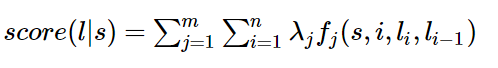
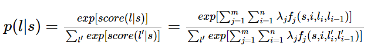

### 4.2 命名实体识别

---
#### 4.1.1 词性标注简介

---
#### 4.1.2 词性标注规范

---
#### 4.1.3 基于条件随机场的词性标注

- [原文参考地址](https://www.jianshu.com/p/55755fc649b1)

- 特征函数
    - 它接受四个参数
        1. 句子s
        2. i，用来表示句子s中的第i个单词
        3. li，表示要评分的标注序列给第i个单词标注的词性
        4. li-1，表示要评分的标注序列给第i-1个单词标注的词性
    - 它的输出值是0或者1
        - 0 表示不符合这个特征
        - 1 表示要评分的标注序列符合这个特征

- 从特征函数到概率
    - 定义好一组特征函数后，我们要给每个特征函数fj赋予一个权重λj。
    - 现在，只要有一个句子s，有一个标注序列l，我们就可以利用前面定义的特征函数集来对l评分。
    - 下式中有两个求和，外面的求和用来求每一个特征函数fj评分值的和，里面的求和用来求句子中每个位置的单词的的特征值的和。
    - 得分公式如下  
    
    - 对这个分数进行指数化和标准化，我们就可以得到标注序列l的概率值p(l|s)，如下所示：  
    

- 总结
    - 为了建一个条件随机场，我们首先要定义一个特征函数集，每个特征函数都以整个句子s，当前位置i，位置i和i-1的标签为输入
    - 然后为每一个特征函数赋予一个权重
    - 然后针对每一个标注序列l，对所有的特征函数加权求和
    - 必要的话，可以把求和的值转化为一个概率值
    
---

### 4.2 命名实体识别
#### 4.2.1 命名实体识别简介
#### 4.2.2 基于条件随机场的命名实体识别
