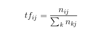
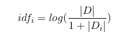
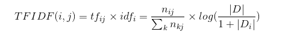

## 第5章 关键词提取算法

- 关键词是代表文章重要内容的一组词，对文本聚类、分类、自动摘要等起重要作用

---
### 5.1 关键词提取技术概述

- 关键词提取算法一般也可以分为有监督和无监督两类

- 监督式关键词提取
    - 简介：主要通过分类的方式进行
    - 介绍：通过构建一个较为丰富和完善的词表，然后通过判断每个文档与词表中每个词的匹配程度，以类似打标签的方式，达到关键词提取的效果
    - 优缺点：有监督的方法能够获取到较高的精度，但缺点是需要大批量的标注数据，人工成本过高

- 无监督关键词提取
    - 无监督提取对数据的要求比较低
    - 既不需要一张人工生成、维护的词表，也不需要人工标准语料辅助进行训练

---

### 5.2 关键词提取算法TF-IDF算法

- TF-IDF算法(Term Frequency-Inverse Document Frequency， 词频-逆文档频次算法)是一种基于统计的计算方法，常用于评估在一个文档集中一个词对某份文档的重要程度

- TF-IDF算法由两部分组成:TF算法以及IDF算法
    - TF算法
        - 简介：统计一个词在一篇文档中出现的频次
        - 基本思想：一个词在文档中出现的次数越多，则其对文档的表达能力就越强
    - IDF算法
        - 简介：统计一个词在文档集的多少个文档中出现
        - 基本思想：如果一个词在越少的文档中出现，则其对文档的区分能力也就越强

- 我们将这两种算法综合起来使用，构成TF-IDF算法，从词频、逆文档频次两个角度对词的重要性进行衡量

- TF的计算常用式  
      
    也就是 tf(word) = (word在文档中出现的次数)/(文档总词数)

- IDF的计算常用式  
      
    - `|D|`表示**文档集**中文档的总数
    - `|Di|`为文档集中出现词i的文档数量
    - 分母加1是采用了拉普拉斯平滑

- TF-IDF算法计算式  
    

---
