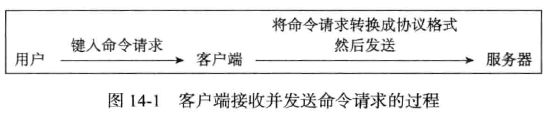
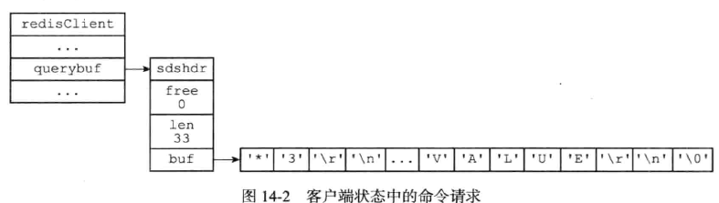
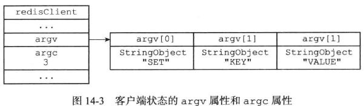
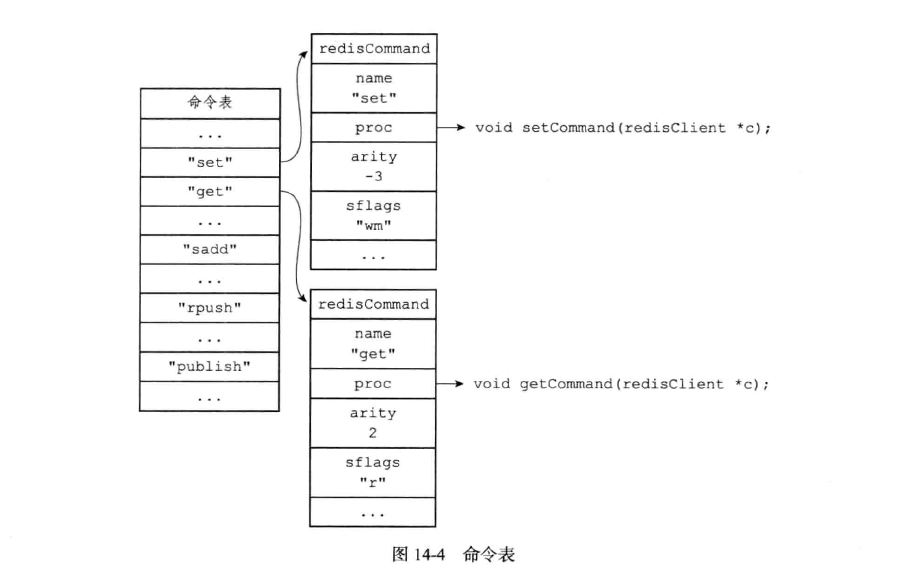
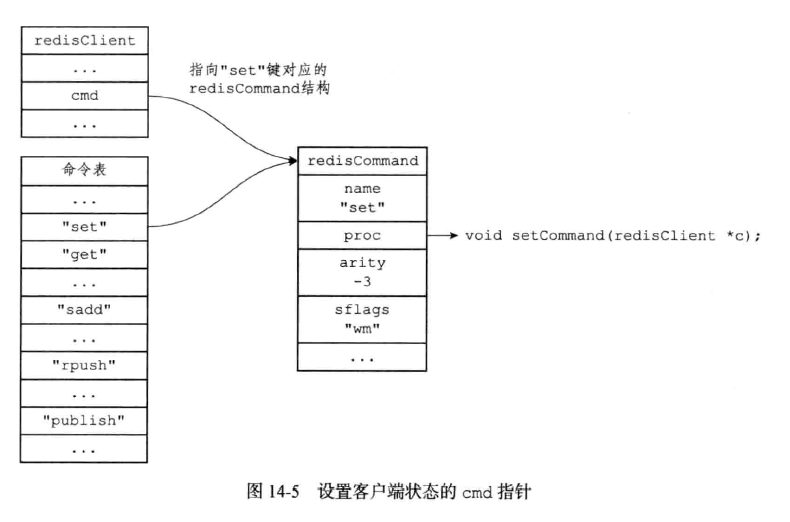
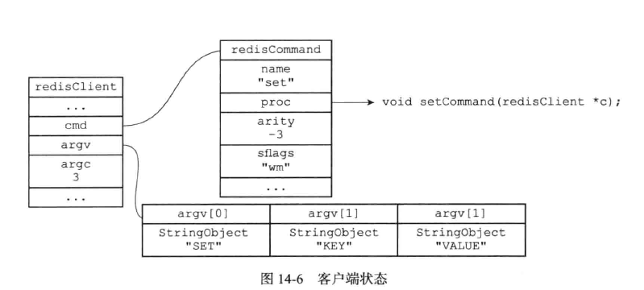

## 第 14 章 服务器

Redis服务器负责与多个客户端建立**网络连接**，**处理**客户端发送的**命令请求**，在**数据库**中**保存**客户端执行命令所产生的数据，并通过**资源管理**来维持服务器自身的运转。

### 14.1 命令请求的执行过程

下面我们将以`SET`命令为例子，详细描述命令请求的执行全过程

#### 14.1.1 发送命令请求

Redis服务器的命令请求来自Redis客户端，当用户在客户端中键入一个命令请求时，客户端会将这个命令请求转换成**协议格式**，然后通过连接到服务器的套接字，将协议格式的命令请求**发送给服务器**



#### 14.1.2 读取命令请求

当客户端与服务器之间的**连接套接字**因为客户端的写入而变得**可读**时，服务器将调用**命令请求处理器**来执行以下操作
1. **读取**套接字中协议格式的命令请求，并将其保存到客户端状态的**输入缓冲区**中，如下图

2. 对输入缓冲区中的命令请求进行**分析**，**提取**命令请求中包含的**命令参数**，以及命令参数的个数，然后分别将参数和参数个数保存到客户端状态的`argv`属性和`argc`属性中

3. 调用**命令执行器**，执行客户端指定的命令

#### 14.1.3 命令执行器：查找命令实现

首先，命令执行器根据客户端状态的`argv[0]`参数，在命令表中查找参数指定的命令，并将找到的命令保存到客户端状态的`cmd`属性中

命令表是一个**字典**，字典的键是命令的名字，而字典的值是`redisCommand`结构，这个结构的源代码如下
````c
/*
 * Redis 命令
 */
struct redisCommand {

    // 命令名字
    char *name;

    // 实现函数
    redisCommandProc *proc;

    // 参数个数，如果是-N，则说明参数的数量大于等于N
    int arity;

    // 字符串表示的 FLAG
    char *sflags; /* Flags as string representation, one char per flag. */

    // 实际 FLAG
    int flags;    /* The actual flags, obtained from the 'sflags' field. */

    /* Use a function to determine keys arguments in a command line.
     * Used for Redis Cluster redirect. */
    // 从命令中判断命令的键参数。在 Redis 集群转向时使用。
    redisGetKeysProc *getkeys_proc;

    /* What keys should be loaded in background when calling this command? */
    // 指定哪些参数是 key
    int firstkey; /* The first argument that's a key (0 = no keys) */
    int lastkey;  /* The last argument that's a key */
    int keystep;  /* The step between first and last key */

    // 统计信息
    // microseconds 记录了命令执行耗费的总毫微秒数
    // calls 是命令被执行的总次数
    long long microseconds, calls;
};
````

下图是一个命令表的例子



当程序在命令表中查找到了对应的命令，则会将其保存到客户端状态的`cmd`指针中，如下图



#### 14.1.4 命令执行器：执行预备操作

目前为止，命令执行需要的信息已经收集齐了，但是为了保证命令的正确执行，还需要进行一些预备工作，包括

- 检查客户端状态的`cmd`指针是否指向`NULL`

- 根据客户端`cmd`属性指向的`redisCommand`结构的`arity`属性，检查命令请求所给定的参数个数是否正确

- 检查客户端是否已经通过了身份验证，未通过身份验证的客户端只能执行`AUTH`命令

- 如果服务器因为执行Lua脚本而超时并进入阻塞状态，那么服务器只会执行客户端发来的`SHUTDOWN nosave`命令和`SCRIPT KILL`命令，其他命令都会被服务器拒绝。

- 如果客户端正在执行事务，那么服务器只会执行客户端发来的`EXEC`、`DISCARD`、`MULT`、`WATCH`四个命令，其他命令都会被放进事务队列中。

- 等等

#### 14.1.5 命令执行器：调用命令的实现函数

此时，我们不但准备好了执行命令所需的信息，而且还进行了预备工作，那么只要执行以下语句就可以执行命令了

````c
client->cmd->proc(client)
````

`cmd->proc`指针指向的是之前绑定的命令实现函数，通过这个函数，就可以对指定命令进行执行，并产生对应的操作，写入到客户端的输出缓冲区中。在这之后，命令实现函数还将为客户端套接字管理命令回复处理器，然后这个处理器可以在客户端可写的时候将回复返回给客户端。

如下图



#### 14.1.6 命令执行器：执行后续操作

在执行完实现函数后，还需要执行一些后续工作
- 如果服务器开启了慢查询日志功能，那么慢查询日志模块会检查是否执行了刚刚执行完的命令请求添加一条新的慢查询日志
- 更新被执行命令的`redisCommand`结构记录的总时长和次数
- 如果开启了AOF，则将刚执行的命令写入到AOF缓冲区
- 将刚执行的命令传播给所有从服务器

#### 14.1.7 将命令回复发送给客户端

前面说过，命令实现函数会将命令回复保存到客户端的输出缓冲区里面，并为客户端的套接字关联命令回复处理器，当客户端套接字变为可写状态时，服务器就会执行命令回复处理器，将保存在客户端输出缓冲区中的命令回复发送给客户端。

#### 14.1.8 客户端接收并打印命令请求

当客户端接收到协议格式的命令回复之后，它会将这些回复转换成人类可读的格式，并打印给用户观看

### 14.2 serverCron函数

这个函数负责管理服务器的资源，并保持服务器自身的良好运转

#### 14.2.1 更新服务器时间缓存

Redis服务器中有不少功能需要获取系统的当前时间，而每次获取系统的当前时间都需要执行一次系统调用，为了减少系统调用的执行次数，服务器状态中的`unixtime`属性和`mstime`属性被用作当前时间的缓存

````c
struct redisServer{
    //...

    // 保存了秒级精度的系统当前时间戳
    time_t unixtime;

    // 保存了毫秒级精度的系统当前UNIX时间戳
    long long mstime;
} 
````

`serverCron`默认每100毫秒执行一次，所以这两个时间戳并不准确，若需要更高精度的时间，比如为键设置过期时间、添加慢查询日志等，则还是需要通过系统调用的方式。

#### 14.2.2 更新LRU时钟

服务器状态中的`lruclock`属性保存了服务器的`LRU`时钟。每个Redis对象都有一个`lru`属性，它保存了对象最后一次被命令访问的时间。

`serverCron`函数默认会每10秒更新一次`lruclock`属性的值，所以这个时钟精度很差，通过它计算出的对象空转时间也只是个模糊值

#### 14.2.3 更新服务器每秒执行命令次数

略

#### 14.2.4 更新服务器内存峰值记录

`serverCron`还负责记录服务器运行期间的最大内存使用量

#### 14.2.5 处理SIGTERM信号

在启动服务器时，Redis会为服务器进程的`SIGTERM`信号关联处理器`sigtermHandler`函数，这个信号处理器负责在服务器接到`SIGTERM`信号时，打开服务器状态的`shutdown_asap`标识

````c
void sigtermHandler(int sig){

    //打印日志
    redisLogFromHandler(REDIS_WARNING, "Received SIGTERM, scheduling shutdown...");

    //打开关闭标志
    server.shutdown_asap = 1;
}
````

每次`serverCron`函数执行时，程序都会对服务器状态的`shutdown_asap`属性进行检查，并根据属性的值来决定是否关闭服务器

#### 14.2.6 管理客户端资源

`serverCron`每次执行都会调用`clientsCron`，它会进行如下检查
- 如果客户端超时，则释放客户端
- 如果客户端上次执行命令请求之后，输入缓冲区大小超过了给定长度，则释放客户端当前的输入缓冲区，并新建一个输入缓冲区，以节省内存

#### 14.2.7 管理服务器资源

`serverCron`每次执行都会调用`databasesCron`函数，这个函数会对服务器的一部分数据库进行检查、删除其中的过期键，并在有需要的时候，对字典进行收缩操作

#### 14.2.8 执行被延迟的BGREWRITEAOF

每次`serverCron`函数执行时，函数都会检查`BGSAVE`命令或者`BGREWRITEAOF`命令是否正在执行，如果这两个命令都没在执行，并且有之前被推延的`BGREWRITEAOF`，那么服务器就会执行它。

#### 14.2.9 检查持久化操作的运行状况

略

#### 14.2.10 将AOF缓冲区中的内容写入AOF文件

略

#### 14.2.11 关闭异步客户端

服务器会关闭那些输出缓冲区大小超过限制的客户端

#### 14.2.12 增加cronloops计数器的值

`cronloops`记录了`serverCron`的执行次数，所以`serverCron`函数还有负责更新自己的执行次数

### 14.3 初始化服务器

#### 14.3.1 初始化服务器状态结构

初始化服务器的第一步是创建一个`redisServer`类型的实例变量`server`作为服务器的状态，并且为结构中的各个属性设置**默认值**。

这一步由`redis.c/initServerConfig`来完成，它设置的主要是一些常量，并且会创建**命令表**数据结构，但是**不会创建**服务器状态的**其他数据结构**，理由下面会解释。

#### 14.3.2 载入配置选项

用户可以通过配置参数或者配置文件来修改服务器的默认配置。

服务器在用`initServerConfig`初始化完`server`变量之后，会载入用户自定义的配置，并且对第一步初始化的`server`变量进行修改。

配置的规则是
- 如果用户自定义了新的值，那么服务器就使用用户自定义的值
- 否则沿用`initServerConfig`函数设置的默认值

#### 14.3.3 初始化服务器数据结构

这一步在`initServer`函数中执行，它主要初始如下数据结构
- `server.clients`链表：它记录了客户端状态
- `server.db`数组：包含了服务器的所有数组
- `server.pubsub_channels`字典：与发布订阅有关
- `server.lua`用来执行lua脚本的伪客户端
- `server.slowlog`用来保存慢查询日志

之所以将初始化工作分在`initServerConfig`和`initServer`两个函数，是因为如果只用一步的话，一旦用户通过配置文件更改了与数据结构相关的配置，那么服务器还要重新调整已经创建的数据结构。分为两步可以避免这种情况。

除此之外，`initServer`还进行了如下设置工作

- 为服务器设置**进程信号处理器**。

- **创建共享对象**：这些对象包含Reds服务器经常用到的一些值，比如包含"oK"回复的字符串对象，包含"ERR"回复的字符串对象，包含整数1到10000的字符串对象等等，服务器通过重用这些共享对象来避免反复创建相同的对象

- 打开服务器的**监听端口**，并为监听套接字关联连接应答事件处理器，等待服务器正式运行时接受客户端的连接。

- 为`serverCron`函数创建**时间事件**，等待服务器正式运行时执行`servercron`函数。

- 如果AOF持久化功能已经打开，那么**打开现有的AOF文件**，如果AOF文件不存在，那么创建并打开一个新的AOF文件，为AOF写入做好准备。

- 初始化服务器的**后台I/O模块**，为将来的LO操作做好准备。

#### 14.3.4 还原数据库状态

在完成了服务器变量的初始化工作，服务器需要载入AOF或者RDB文件来还原服务器的数据库状态

#### 14.3.5 执行事件循环

在初始化的最后一步，服务器将开始事件循环的执行