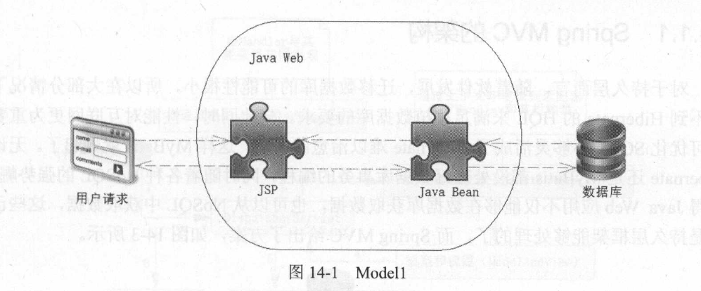
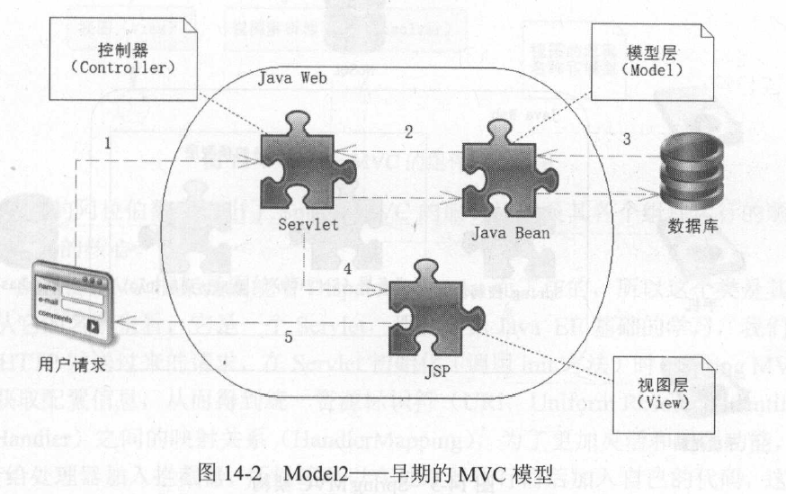
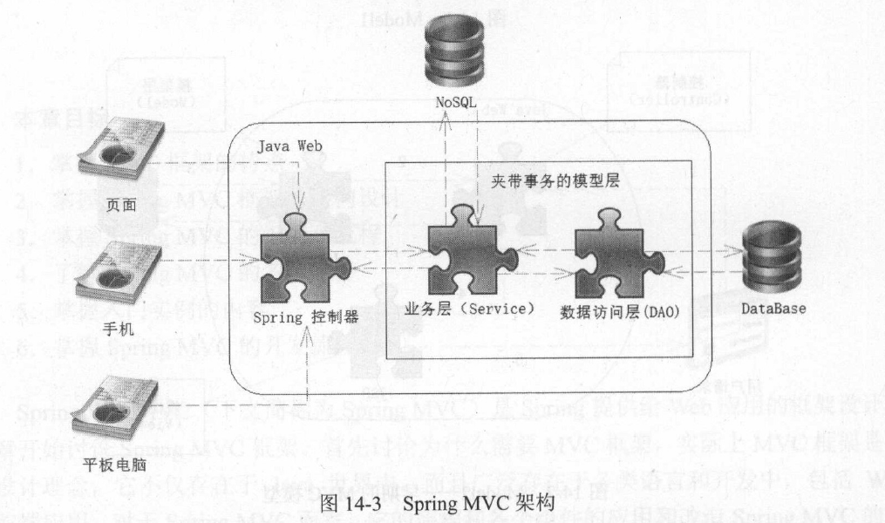
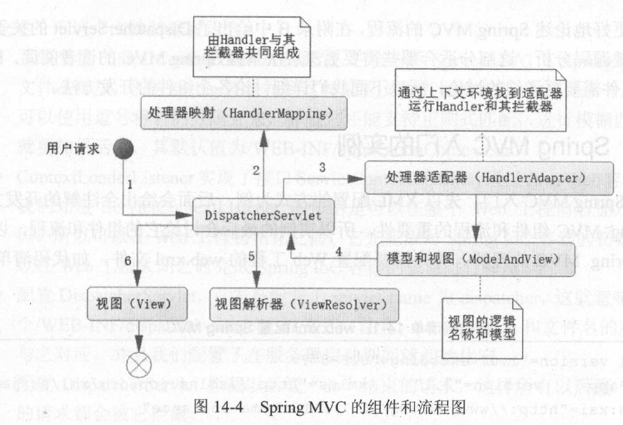
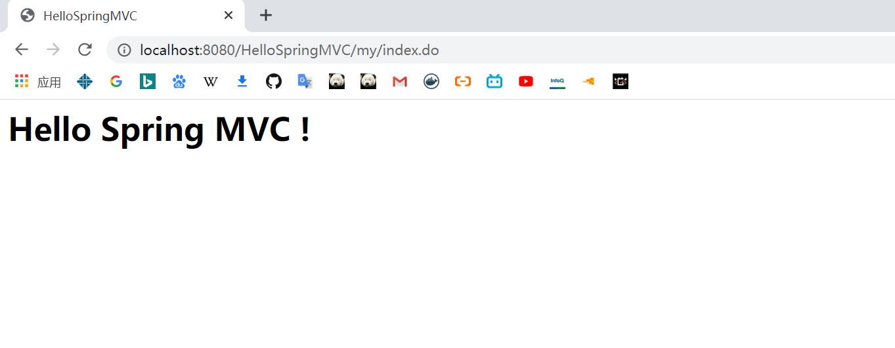
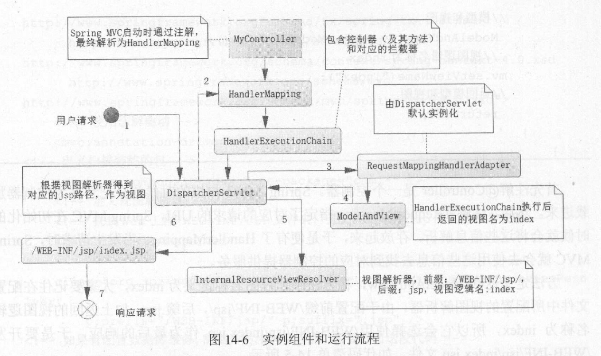
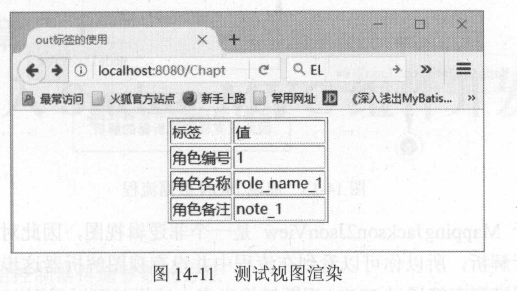
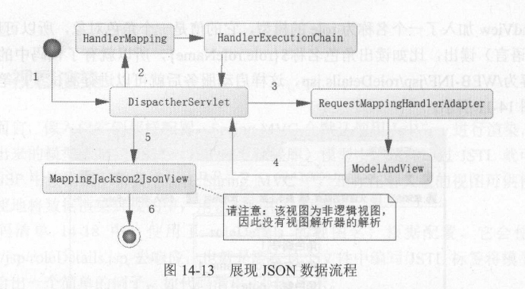

## 第 14 章 SpringMVC的初始化和流程

`SpringMVC`是`Spring`提供给`web`应用的框架设计，而流程和各个组件的应用和改造是`springMVC`的根本

### 14.1 `MVC`设计概述

`MVC`的设计根本目的在于解耦各个模块

在早期的`JavaWeb`开发中，主要是`JSP+JavaBean`模式，如下图。但是很快人们发现`JSP`和`JavaBean`之间出现了严重的耦合，`Java`和`HTML`也耦合在了一起。这样开发者不仅需要掌握`Java`，还需要有高超的前端技术，对开发者要求很高。更为严重的是，出现了页面前端和后端相互依赖的糟糕情况，前端需要等待后端完成，而后端也依赖于前端完成，才能进行有效测试。而且每一个场景操作几乎都难以复用，因为业务逻辑基本都是由`JSP`完成的，还混杂了很多页面逻辑功能。


正因为种种弊端，所以很快这种方式被`Servlet+JSP+JavaBean`给代替，如下图。这种模式多了一个`Servlet`组件，首先用户的请求到达`Servlet`，`Servlet`组件主要作为控制器，这样`Servlet`就接受了这个请求，可以通过它调度`JavaBean`，来读写数据库的数据，然后将结果放到`JSP`中，这样就可以获取数据并展示给用户
。使用了`MVC`后的一个根本好处是前台和后台得到了一定程度的分离，但是依旧存在一定的耦合。对于后端而言，由于控制器和模型层的分离使得大量的`Java`代码可以得到重用，而这时作为`MVC`框架的经典:`Struts1`、`Struts2`和`Hibernate`纷纷崛起。


它们都存在一些问题。在当今互联网的开发中，随着手机端的兴起，`Web`页面大部分采用`Ajax`请求，它们之间的交互只需要`JSON`数据而己，这样对于`JSP`的稿合度的依赖就大大降低了。但是无论是`Struts1`还是`Struts2`和前端`JSP`都有着比较紧密的关联，尤其是在`Struts1`中，更是有大量的关于`JSP`的`jar`包， 但是大部分的请求都来自于移动互联的手机端或者平板电脑，对于`JSP`的依赖己经大大减少，这注定了依赖于页面编程的`Struts`己经不适合时代的发展了。

#### 14.1.1 `SpringMVC`的架构

对于持久层而言，随着软件发展，迁移数据库的可能性很小，所以在大部分情况下都用不到`Hibernate`的`HQL`来满足移植数据库的要求。与此同时，性能对于互联网来说更为重要，不可优化`SQL`、不够灵活成了`Hibernate`难以治愈的伤痛，这样`MyBatis`就崛起了。无论是`Hibernate`还是`MyBatis`都没处理好数据库事务的编程，同时随着各种`NoSQL`的强势崛起，使得`JavaWeb`应用不仅能够在数据库中获取数据，也可以从`NoSQL`中获取数据，这些不是持久层框架可以处理的了，而`SpringMVC`给出了方案


传统的模型层被拆分为业务层(`Service`)和数据访问层(`DAO, DataAccessObject`)。在`Service`下可以通过`Spring`的声明式事务操作访问数据访问层，而在业务层上还允许我们访问`NoSQL`。对于`SpringMVC`来说，其最大的特点就是结构松散，比如几乎可以在`SpringMVC`中使用各类视图，包括`JSON、JSP、XML、PDF`等，所以它能够满足手机端、页面端和平板电脑端的各类请求。


#### 14.1.2 `SpringMVC`组件与流程

`SpringMVC`是一种基于`Servlet`的技术，它提供了核心控制器`DispatcherServlet`和相关的组件，并制定了松散的结构，以适合各种灵活的需要

`SpringMVC`的组件和流程图如下


`SpringMVC`的初始化过程
- `SpringMVC`框架是围绕着`DispatcherServlet`工作的，它是一个`Servlet`，可以拦截`HTTP`发送过来的请求
- 在`Servlet`初始化时，`SpringMVC`会根据配置，获取配置信息，从而得到统一资源标识符(`URI, Uniform Resource Identifier`)和处理器(`Handler`)之间的映射关系(`HandlerMapping`)
- 为了更加灵活和增强功能，`SpringMVC`还会给处理器加入拦截器，所以还可以在处理器执行前后加入自己的代码，这样就构成了一个处理器的执行链(`HandlerExecutionChain`)
- 并且还根据上下文初始化视图解析器等内容，当处理器返回的时候就可以通过视图解析器定位视图，然后将数据模型渲染到视图中以响应用户请求

当请求到来时，`SpringMVC`的处理流程
1. `DispatcherServlet`首先通过请求和事先解析好的`HandlerMapper`配置找到对应的`Handler`，这样就准备好了处理器和拦截器组成的执行链
2. 而运行处理器需要一个对应的运行环境，这个环境就是适配器(`HandlerAdapter`)，通过这个适配器就能运行对应的处理器及其拦截器
3. 在处理器返回模型和视图给`DispacherServlet`后，它会把对应的视图信息传递给视图解析器(`ViewResolver)`。注意，这一步取决于是否使用逻辑视图，如果是逻辑视图，那么视图解析器就会解析它，然后把模型渲染到视图中去，最后响应用户的请求：如果不是逻辑视图，则不会进行处理，而是直接通过视图渲染数据模型。

`SpringMVC`是一个松散的结构，所以可以满足各类请求的需要，为此它也实现了大部分请求所需的类库，拥有较为丰富的类库供我们使用，所以流程中的大部分组件并不需要我们实现

#### 14.1.3 `SpringMVC`入门的实例

第一步，首先需要配置`WEB`工程的`web.xml`文件
````xml
<?xml version="1.0" encoding="UTF-8"?>
<web-app xmlns="http://xmlns.jcp.org/xml/ns/javaee"
         xmlns:xsi="http://www.w3.org/2001/XMLSchema-instance"
         xsi:schemaLocation="http://xmlns.jcp.org/xml/ns/javaee http://xmlns.jcp.org/xml/ns/javaee/web-app_4_0.xsd"
         version="4.0">
    <context-param>
        <param-name>contextConfigLocation</param-name>
        <param-value>/WEB-INF/applicationContext.xml</param-value>
    </context-param>
    <listener>
        <listener-class>org.springframework.web.context.ContextLoaderListener</listener-class>
    </listener>
    <servlet>
        <servlet-name>dispatcher</servlet-name>
        <servlet-class>org.springframework.web.servlet.DispatcherServlet</servlet-class>
        <load-on-startup>1</load-on-startup>
    </servlet>
    <servlet-mapping>
        <servlet-name>dispatcher</servlet-name>
        <url-pattern>*.do</url-pattern>
    </servlet-mapping>
</web-app>
````
- 系统变量`contextConfigLocation`告诉`SpringMVC`其`SpringIoC`的配置文件在哪里，这样`Spring`就会找到这些配置文件并加载它们
- `ContextLoaderListener`实现了接口`ServletContextListener`，它的作用是可以在整个`web`工程前后加入自定义代码，所以可以在`web`工程初始化之前，它先完成对`SpringIoC`容器的初始化，也可以在`web`工程关闭之时完成`SpringIoC`的资源释放
- 配置`DispatcherServlet`拦截以后缀`do`结束的请求，这样所有以后缀`do`结尾的请求都会被它拦截

第二步，在`applicationContext.xml`中配置`SpringIoC`，这里先不配置任何`bean`
````xml
<?xml version="1.0" encoding="UTF-8"?>
<beans xmlns="http://www.springframework.org/schema/beans"
       xmlns:xsi="http://www.w3.org/2001/XMLSchema-instance"
       xsi:schemaLocation="http://www.springframework.org/schema/beans http://www.springframework.org/schema/beans/spring-beans.xsd">
</beans>
````

第三步，配置`dispatcher-servlet.xml`文件，它配置与`SpringMVC`相关的内容
````xml
<?xml version="1.0" encoding="UTF-8"?>
<beans xmlns="http://www.springframework.org/schema/beans"
       xmlns:xsi="http://www.w3.org/2001/XMLSchema-instance" xmlns:mvc="http://www.springframework.org/schema/tool"
       xmlns:context="http://www.springframework.org/schema/context" xmlns:p="http://www.springframework.org/schema/p"
       xsi:schemaLocation="http://www.springframework.org/schema/beans http://www.springframework.org/schema/beans/spring-beans.xsd http://www.springframework.org/schema/tool http://www.springframework.org/schema/tool/spring-tool.xsd http://www.springframework.org/schema/context https://www.springframework.org/schema/context/spring-context.xsd">
    <context:component-scan base-package="com.edu.neu.controller"/>
    <bean id="viewResolver" class="org.springframework.web.servlet.view.InternalResourceViewResolver" p:prefix="/WEB-INF/jsp/" p:suffix=".jsp">
    </bean>
</beans>
````
- 首先定义要扫描装载的包，用以加载对应的控制器和其他一些组件
- 定义视图解析器，解析器中定义了前缀和后缀，这样视图就知道去`web`工程的`/WEB-INF/JSP`文件夹中找到对应的`JSP`文件作为视图响应用户请求

第三步，开发一个简单的`Controller`
````java
package com.edu.neu.controller;

import org.springframework.stereotype.Controller;
import org.springframework.web.bind.annotation.RequestMapping;
import org.springframework.web.servlet.ModelAndView;

@Controller("myController")
@RequestMapping("/my")
public class MyController {
    @RequestMapping("/index")
    public ModelAndView index(){
        ModelAndView mv = new ModelAndView();
        mv.setViewName("index");
        return mv;
    }
}
````
- `@Controller`说明这个类是一个控制器。`SpringMVC`扫描的时候就会把它作为控制器加载进来。

- `@RequestMapping`指定了对应的请求的URI，`SpringMVC`在初始化的时候就会将这些信息解析，存放到`HandlerMapping`中。当发生请求时，`SpringMVC`就会使用这些信息去找到对应的控制器提供服务

- 方法返回`ModelAndView`，在方法中把视图名称定义为`index`，而在在配置文件中所配置的视图解析器，配置前缀为`WEB-INF/jsp／`，后缀是`.jsp`，再加上返回的视图逻辑名称为`index`，所以它会选择使用`/WEB-INF/jsp/index.jsp`作为最后的响应

第三步，开发一个简单的`jsp`
````jsp
<%@ page contentType="text/html;charset=UTF-8" language="java" %>
<html>
<head>
    <meta charset="UTF-8">
    <meta name="viewport"
          content="width=device-width, user-scalable=no, initial-scale=1.0, maximum-scale=1.0, minimum-scale=1.0">
    <meta http-equiv="X-UA-Compatible" content="ie=edge">
    <title>HelloSpringMVC</title>
</head>
<body>
    <h1>Hello Spring MVC !</h1>
</body>
</html>
````

第四步，启动一个服务器


下面是这个例子的完整流程图

1. 当`SpringMVC`启动时会去解析`MyController`的注解，然后生成对应`URI`和请求的映射关系，并注册对应的方法
2. 请求到来时，首先根据`URI`找到对应的`HandlerMapping`，然后组织一个执行链
3. 通过请求类型找到`RequestMappingHandlerAdapter`，它的实例是在`DispatcherServlet`初始化的时候进行创建的
4. 然后通过`RequestMappingHandlerAdapter`去执行`HandlerExecutionChain`的内容，最终在`MyController`方法中将`index`视图返回给`DispatcherServlet`
5. 最后视图解析器通过前后缀找到`/WEB-INF/jsp/index.jsp`文件作为视图，响应最终的请求

### 14.2 `SpringMVC`初始化

这一节我们将看到`SpringMVC`是如何初始化`SpringIoC`容器上下文和映射请求上下文。其中映射请求上下文是为了适应`JavaWeb`工程的需要，由`SpringIoC`上下文扩展而来的

#### 14.2.1 初始化`SpringIOC`上下文

`Java Web`容器提供`ServletContextListener`接口，这个接口可以在`Web`容器初始化和结束期中执行一定的逻辑，也就是说，通过实现它可以在`DispatcherServlet`初始化前就可以完成`Spring IoC`容器的初始化也可以在结束期完成对`Spring IoC`容器的销毁。

`SpringMVC`将这个工作交给了类`ContextLoaderListener`，源码如下
````java
package org.springframework.web.context;

import javax.servlet.ServletContextEvent;
import javax.servlet.ServletContextListener;

public class ContextLoaderListener extends ContextLoader implements ServletContextListener {
    public ContextLoaderListener() {
    }

    public ContextLoaderListener(WebApplicationContext context) {
        super(context);
    }

    public void contextInitialized(ServletContextEvent event) {
        //初始化SpringWebIoC容器
        this.initWebApplicationContext(event.getServletContext());
    }

    public void contextDestroyed(ServletContextEvent event) {
        //关闭SpringWebIoC容器
        this.closeWebApplicationContext(event.getServletContext());
        //清除相关参数
        ContextCleanupListener.cleanupAttributes(event.getServletContext());
    }
}
````

#### 14.2.2 初始化映射请求上下文

````java
protected final void initServletBean() throws ServletException {
        this.getServletContext().log("Initializing Spring " + this.getClass().getSimpleName() + " '" + this.getServletName() + "'");
        if (this.logger.isInfoEnabled()) {
            this.logger.info("Initializing Servlet '" + this.getServletName() + "'");
        }

        long startTime = System.currentTimeMillis();

        try {
            //初始化SpringIoC容器
            this.webApplicationContext = this.initWebApplicationContext();
            this.initFrameworkServlet();
        } catch (RuntimeException | ServletException var4) {
            this.logger.error("Context initialization failed", var4);
            throw var4;
        }

        if (this.logger.isDebugEnabled()) {
            String value = this.enableLoggingRequestDetails ? "shown which may lead to unsafe logging of potentially sensitive data" : "masked to prevent unsafe logging of potentially sensitive data";
            this.logger.debug("enableLoggingRequestDetails='" + this.enableLoggingRequestDetails + "': request parameters and headers will be " + value);
        }

        if (this.logger.isInfoEnabled()) {
            this.logger.info("Completed initialization in " + (System.currentTimeMillis() - startTime) + " ms");
        }

    }
protected WebApplicationContext initWebApplicationContext() {
    WebApplicationContext rootContext = WebApplicationContextUtils.getWebApplicationContext(this.getServletContext());
    WebApplicationContext wac = null;
    //判断是否已经被初始化
    if (this.webApplicationContext != null) {
        //如果被初始化了，就沿用它
        wac = this.webApplicationContext;
        if (wac instanceof ConfigurableWebApplicationContext){
            ConfigurableWebApplicationContext cwac =(ConfigurableWebApplicationContext)wac;
            if (!cwac.isActive()) {
                //如果SpringIoC容器还没有刷新，那么就进行刷新父容器上下文，设置id等操作
                //处理父容器为空的情况
                if (cwac.getParent() == null) {
                    cwac.setParent(rootContext);
                }

                this.configureAndRefreshWebApplicationContex(cwac);
            }
            
        }
        //没有被初始化，则查找是否有存在的SpringWebIoC容器
        if (wac == null) {
            wac = this.findWebApplicationContext();
        }
        //没有被初始化，也不存在的SpringWebIoC容器，则自己创建
        if (wac == null) {
            wac = this.createWebApplicationContext(rootContext);
        }
        //当onRefresh方法没有被调用时，执行onRefresh方法
        if (!this.refreshEventReceived) {
            synchronized(this.onRefreshMonitor) {
                this.onRefresh(wac);
            }
        }

        if (this.publishContext) {
            //作为Servlet的上下文属性发布IoC容器
            String attrName = this.getServletContextAttributeName();
            this.getServletContext().setAttribute(attrName, wac);
        }

    return wac;
}
````
- 上面这段代码主要是说明：当`IoC`容器没有对应的初始化的时候，`DispatcherServlet`会尝试去初始化它，最后调度`onRefresh`方法

下面了解一下`DispatcherServlet`的`onRefresh`方法
````java
protected void onRefresh(ApplicationContext context) {
    this.initStrategies(context);
}

protected void initStrategies(ApplicationContext context) {
    //初始化文件的解析
    this.initMultipartResolver(context);
    //本地解析化
    this.initLocaleResolver(context);
    //主题解析
    this.initThemeResolver(context);
    //处理器映射
    this.initHandlerMappings(context);
    //处理器的适配器
    this.initHandlerAdapters(context);
    //初始化Handler的异常处理解析器
    this.initHandlerExceptionResolvers(context);
    //略
    this.initRequestToViewNameTranslator(context);
    //初始化视图逻辑名称转换器，即允许返回逻辑视图名称，然后由它来找到真实的视图
    this.initViewResolvers(context);
    //初始化flash管理器
    this.initFlashMapManager(context);
}
````
上述代码进行初始化的组件都是`SpringMVC`的核心组件，下面来解释这些组件
- `MultipartResolver`:文件解析器，用以支持服务器的文件上传
- `LocaleResolver`: 国际化解析器，用以提供国际化的功能
- `ThemeResolver`: 主题解析器，类似于软件皮肤的转换功能
- `HandlerMapping`: 它用以组装用户提供的某个控制器的方法和这个方法对应的一些拦截器
- `HandlerAdapter`: 处理器适配器，因为处理器会在不同的上下文中运行，所以在不同的场景中要提供适应当前场景的适配器
- `HandlerExceptionResolver`: 处理器异常解析器，如果处理器产生异常，会通过这个解析器去处理这些异常
- `RequestToViewNameTranslator`: 视图逻辑名称转换器
- `ViewResolver`: 视图解析器，当控制器返回后，通过视图解析器会把逻辑视图名称进行解析，然后定位实际视图

而对于这些组件`DispatcherServlet`会根据其配置文件`DispatcherServlet.properties`进行初始化。因此我们并不需要很多的配置就可以使用`SpringMVC`

#### 14.2.3 使用注解配置方式初始化

由于在`Servlet3.0`之后的规则允许取消`web.xml`配置，只使用注解方式就可以，所以在`Spring3.1`之后的版本也提供了注解方式的配置，以`14.1.3`的例子来看，我们只需要实现两个`Java`类，就可以去掉这个例子中`XML`格式的配置文件


第一个类是`MyWebAppInitializer`类，它继承自`AbstractAnnotationConfigDispatcherServletInitializer`
````java
package com.edu.neu.config;

import org.springframework.web.servlet.support.AbstractAnnotationConfigDispatcherServletInitializer;

public class MyWebAppInitializer extends AbstractAnnotationConfigDispatcherServletInitializer {

    @Override
    protected Class<?>[] getRootConfigClasses() {
        return new Class[0];
    }

    @Override
    protected Class<?>[] getServletConfigClasses() {
        return new Class[] {WebConfig.class};
    }

    @Override
    protected String[] getServletMappings() {
        return new String[] {"*.do"};
    }
}
````
- `getRootConfigClasses`方法用来获取`SpringIoC`容器的Java配置类，用以加载各类`SpringBean`
- `getServletConfigClasses`方法获取各类`SpringMVC`的`URI`和控制器的配置关系类，用来生成`Web`请求的上下文，这里加载了我们下文定义的`WebConfig`类
- `getServletMappings`定义了`DispatcherServlet`拦截的请求


第二个类是WebConfig类，它用于配置`URI`和控制器的映射关系
````java
package com.edu.neu.config;

import org.springframework.context.annotation.Bean;
import org.springframework.context.annotation.ComponentScan;
import org.springframework.context.annotation.Configuration;
import org.springframework.web.servlet.ViewResolver;
import org.springframework.web.servlet.config.annotation.EnableWebMvc;
import org.springframework.web.servlet.view.InternalResourceViewResolver;

@Configuration
@ComponentScan("com.edu.neu.*")
@EnableWebMvc
public class WebConfig {
    @Bean(name="viewResolver")
    public ViewResolver initResolver(){
        InternalResourceViewResolver viewResolver = new InternalResourceViewResolver();
        viewResolver.setPrefix("/WEB-INF/jsp/");
        viewResolver.setSuffix(".jsp");
        return viewResolver;
    }
}
````
- 首先我们使用`@ComponentScan`来加载控制器
- 然后我们定义了一个视图解析器(`viewResolver`)，并设置了它的前后缀

### 14.3 `SpringMVC`开发流程详解

目前的开发过程中，大部分都会采用注解的开发方式。最常用的注解是`@Controller`和`@RequestMapping`。`@RequestMapping`可以配置在类或者方法上，它的作用是指定`URI`和哪个类作为一个请求的处理器。

为了更加灵活，`SpringMVC`还定义了处理器的拦截器，当启动`SpringMVC`时，`SpringMVC`就会去解析`@Controller`中的`@RequestMapping`的配置，再结合所配置的拦截器，组成多个拦截器和一个控制器的形式，存放到一个`HandlerMapping`中


#### 14.3.1 配置`@RequestMapping`
````java
@Target({ElementType.TYPE, ElementType.METHOD})
@Retention(RetentionPolicy.RUNTIME)
@Documented
@Mapping
public @interface RequestMapping {
    //请求路径
    String name() default "";

    //请求路径，可以是数组
    @AliasFor("path")
    String[] value() default {};

    //请求路径，数组
    @AliasFor("value")
    String[] path() default {};

    //请求类型，比如是`HTTP`的`GET`请求还是`POST`请求
    RequestMethod[] method() default {};

    //请求参数
    String[] params() default {};

    //请求头
    String[] headers() default {};

    //处理器类型
    String[] consumes() default {};

    //返回结果类型，比如`application/json; charset=UTF-8`、`text/plain`
    String[] produces() default {};
}
````

这里最常用的是请求路径和请求类型，下面是使用`@RequestMapping`的例子，这个方法对于`/my/index2.do`的`HTTP GET`请求提供了响应
````java
public ModelAndView index2{
    ModerAndView mv = new ModelAndView();
    mv.setViewName("index");
    return mv;
}
````

#### 14.3.2 控制器的开发

控制器的开发一般分为三个步骤
1. 获取请求参数
2. 处理业务逻辑
3. 绑定模型和视图

##### 14.3.2.1 获取请求参数

在`SpringMVC`中，接收参数的方式有很多种，例如可以通过传统`Servlet`的`API`接收参数，如下所示
````java
@RequestMapping(value="/index2", method=RequestMethod.GET)
public ModelAndView index2(HttpSession session, HttpServletRequest request){
    ModelAndView mv = new ModelAndView();
    mv.setViewName("index");
    return mv;
}
````
但是上文的这种方法并不是一个好的方法。这样会使得它与`Servlet`容器紧密耦合，不利于扩展和测试

我们通常采用`@RequestParam`注解的方式来获取参数
````java
@RequestMapping(value="/index2", method=RequestMethod.GET)
public ModelAndView index2(@RequestParam("id")Long id){
    //....
}
````

`@RequestParam`注解实际上实现了如下代码的类似功能
````java
String idStr = request.getParameter("id");
Long id = Long.parseLong(idStr);
````

此外，默认情况下`@RequestParam`标注的参数不能为空，若为空，会产生异常。但这个标签由两个有用的配置项来解决这个问题
- `request`是一个布尔值，若想允许参数为空，可将其设置为`false`
- `defaultValue`可以为参数提供默认值

`SpringMVC`还提供了`@SessionAttribute`去从`Session`中获取对应的数据
````java
@RequestMapping(value="/index2", method=RequestMethod.GET)
public ModelAndView index2(@SessionAttribute("userName") String userName){
    //....
}
````

##### 14.3.2.2 实现逻辑和绑定视图

例子如下
````java
@Controller
@RequestMapping("/role")
public class RoleController{

    //注入用来处理业务逻辑的roleService
    @Autowired
    private RoleService roleService = null;
    @RequestMapping(value="/getRole", method=RequestMethod.GET)
    public ModelAndView getRole(@RequestParam("id") Long id){
        Role role = roleService.getRole(id);
        ModelAndView mv = new ModelAndView();
        mv.setViewName("roleDetails");
        //给数据模型添加一个角色对象
        mv.addObject("role", role);
        return mv;
    }
}
````

#### 14.3.3 视图渲染

SpringMVC会默认使用JstlView进行渲染，也就是将查询出来的模型绑定到`JSTL`模型中，这样通过`JSTL`就可以在`JSP`中读出数据模型的数据了
````jsp
<%@ page contentType="text/html;charset=UTF-8" language="java" %>
<%@ taglib prefix="c" uri="http://java.sun.com/jsp/jstl/core"%>
<html>
<head>
    <meta charset="UTF-8">
    <meta name="viewport"
          content="width=device-width, user-scalable=no, initial-scale=1.0, maximum-scale=1.0, minimum-scale=1.0">
    <meta http-equiv="X-UA-Compatible" content="ie=edge">
    <title>HelloSpringMVC</title>
</head>
<body>
    <h1>Hello Spring MVC !</h1>
    <table>
        <tr>
            <th>标签</th>
            <th>值</th>
        </tr>
        <tr>
            <td>角色编号</tb>
            <td><c:out value="${role.id}"></c:out><td>
        </tr>
        <tr>
            <td>角色名称</tb>
            <td><c:out value="${role.name}"></c:out><td>
        </tr>
        <tr>
            <td>角色备注</tb>
            <td><c:out value="${role.note}"></c:out><td>
        </tr>
    </table>
</body>
</html>
````

通过数据渲染，我们会得到如下界面


但目前在前端技术中，普遍使用`Ajax`技术，这种情况下往往后台需要返回`JSON`数据给前端使用，如下所示
````java
@RequestMapping(value="/getRole", method=Request.GET)
public ModelAndView getRole(@RequestParam("id") Long id){
    Role role = roleService.getRole(id);
    ModelAndView mv = new ModelAndView();
    mv.addObject("role", role);
    //指定视图类型
    mv.setView(new MappingJackson2JsonView());
    return mv;
}
````

我们请求后会获得`JSON`数据，如下所示


上面请求的的流程图如下

由于`MappingJackson2JsonView`是一个非逻辑视图，因此不需要视图解析器进行解析，它会直接把`ModelAndView`中的数据通过`JSONView`转换出来，这样就可以得到`JSON`数据了。

### 14.4 小结

- `SpringMVC`框架核心内容是流程和组件
- `SpringMVC`需要初始化`IoC`容器和`DispatcherServlet`请求两个上下文，其中`DispatcherServlet`请求上下文是`SpringIoC`上下文的扩展，这样就能使得`Spring`各个`Bean`能够形成依赖注入
- `SpringMVC`而言，控制器是开发的核心内容，要知道如何获取请求参数，处理逻辑业务，然后将得到的数据通过视图解析器和视图渲染出来展现出来
