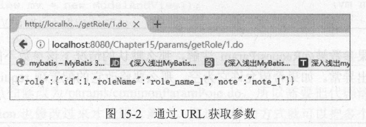
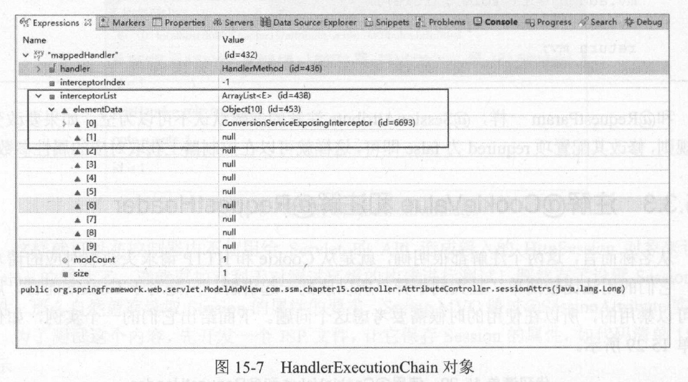
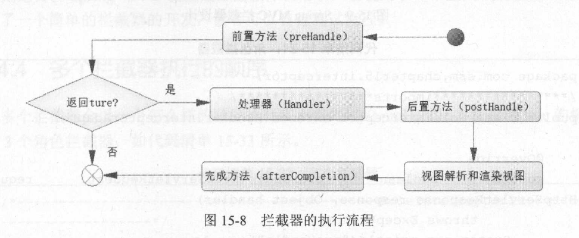
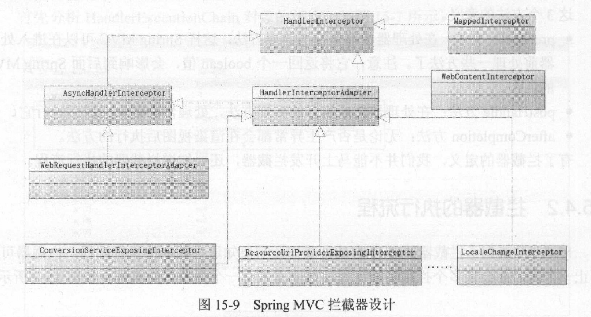
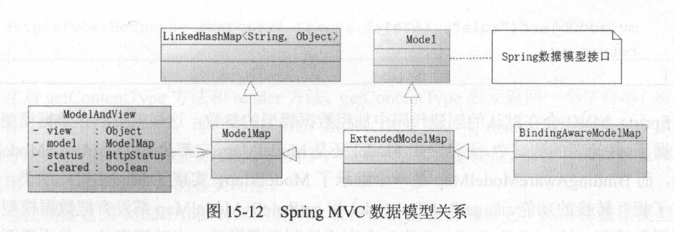
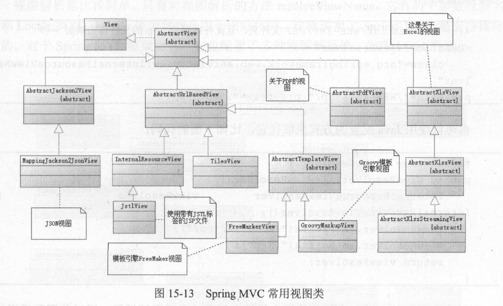
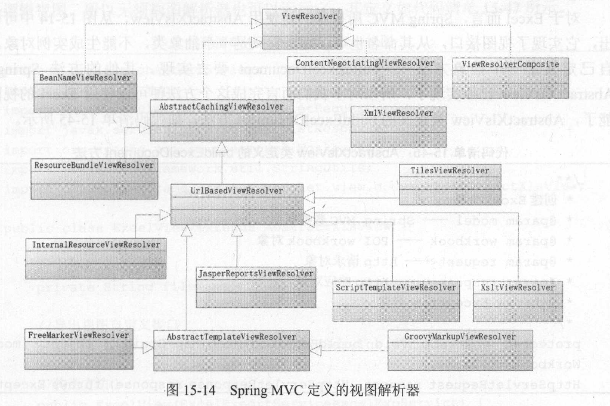

## 第 15 章 深入`SpringMVC`组件开发

本章将对工作和学习中常用的组件进行讨论

### 15.1 控制器接收各类请求参数

`SpringMVC`提供了诸多的注解来解析参数，其目的是把控制器从复杂的`ServletAPI`中剥离，这样就可以在非`Web`容器环境中重用控制器

#### 15.1.1 接收普通请求参数

`SpringMVC`目前比较智能化，如果传递过来的参数名称和`HTTP`的保存一致，那么无须任何注解也可以获取参数

下面举一个例子，前端发送来一个`form`，`form`里有参数`roleName`和参数`note`，下面的方法可以通过保持方法签名的参数名称和`HTTP`请求参数名称一致来获取参数，如果不一致时则会获得空，如下所示
````java
@RequestMapping("/commonParams")
public ModelAndView commonParams(String roleName, String note){
    //....
}
````

在参数很多的时候可以考虑使用一个`POJO`来管理这些参数，但是`POJO`的属性也要和`HTTP`请求参数名称保持一致。这样，即使没有注解也可以有效传递参数

````java
public class RoleParams{
    private String roleName;
    private String note;
}
````
````java
@RequestMapping("/commonParams")
public ModelAndView commonParams(RoleParams roleParams){
    String roleName = roleParams.getRoleName();
    //....
}
````

#### 15.1.2 使用`@RequestParam`注解获取参数

当`HTTP`参数名和控制器方法的参数名不同时，我们就无法使用上一节的方法了。例如: 前端发送的参数为`role_name`，而在`java`中采用驼峰写法一般会将参数名写为`roleName`，这种情况下，我们可以使用`@RequestParam`注解来进行转换
````java
@RequestMapping("/commonParams")
public ModelAndView requestParams(@RequestParam("role_name") String roleName, String note){
    //....
}
````

注意，第14章中提到，如果参数被`@RequestParam`注解，那么默认情况下该参数不能为空，如果为空则系统抛出异常。如果希望允许它为空，那么要修改它的配置项`required`为`false`
````java
@RequestMapping("/commonParams")
public ModelAndView requestParams(@RequestParam(value="role_name", required=false) String roleName, String note){
    //....
}
````

#### 15.1.3 使用`URL`传递参数

一些网站使用`URL`的形式传递参数，这符合`RESTful`风格，有时我们会将`URL`写作`/params/getRole/1`，其中`1`就是一个参数，它代表的是角色编号。而完成这种参数的读取，需要`@RequestMapping`和`@PathVariable`两个注解来共同完成
````java
@Autowired
RoleService roleService;

//{id}代表接收一个参数
@RequestMapping("/getRole/{id}")
//注解@PathVariable表示从URL的请求地址中获取参数
public ModelAndView pathVariable(@PathVariable("id") Long id){
    Role role = roleService.getRole(id);
    ModelAndView mv = new ModelAndView();
    //绑定数据模型
    mv.addObject(role);
    //设置为JSON视图
    mv.setView(new MappingJackson2JsonView());
    return mv;
}
````
- `{id}`代表处理器需要接受一个由`URL`组成的参数，且参数名称为`id`，那么在方法中`@PathVariable("id")`表示将获取这个在`@RequestMapping`中定义名称为`id`的参数
- 运行结果如图
    
- 注解`@PathVariable`允许对应的参数为空

#### 15.1.4 传递`JSON`参数

我们举个具体的例子来说明，假设`15.1.1`中的例子，除了传递`roleName`和`note`，还要传递一个`pageParams`对象来处理分页，具体的结构如下
````js
var data = {
    roleName: 'role',
    note: 'note',
    pageParams: {
        start: 1,
        limit: 20
    }
}
$.post({
    url: "./params/findRoles.do",
    contentType: "application/json",
    data: JSON.stringify(data),
    success: function(result){};
});
````

我们要想接受这种复杂的数据类型，首先要定义一个POJO，如下
````java
public class PageParams{
    private int start;
    private int limit;
    //setters and getters
}
````
````java
public class RoleParams{
    private String roleName;
    private String note;
    private PageParam pageParams = null;
    //setters and getters
}
````

然后我们可以用注解`@RequestBody`配合这个`POJO`来接受参数了，`SpringMVC`会完成将传递的参数转化为`POJO`的过程。
````java
@RequestMapping("/findRoles")
public ModelAndView findRoles(@RequestBody RoleParams roleParams){
    //....
}
````

#### 15.1.5 接收列表数据和表单序列化

在一些场景下，需要传递一个数组作为参数，而`SpringMVC`对这种场景也提供了支持

例如我们要传递一个`id`的数组，用以一次性删除多个角色，我们通过`JSON`的字符串化传递给后台
````js
var idList = [1, 2, 3];
$.post({
    url: "./params/deleteRoles.do",
    contentType: "application/json",
    data: JSON.stringify(idList),
    success: function(result){};
});
````
我可以像如下代码一样接收参数
````java
@RequestMapping("/deleteRoles")
public ModelAndView deleteRoles(@RequestBody List<Long>idList){
    ModelAndView mv = new ModelAndView();
    //删除角色
    int total = roleService.deleteRoles(idList);
    //绑定视图
    mv.addObject("total", total);
    mv.setView(new MappingJackson2JsonView());
    return mv;
}
````
- 这里注解`@RequestBody`表示要求`SpringMVC`将传递过来的`JSON`数组数据，转换为对应的`Java`集合类型
- 也可以不使用`List`而是使用简单的`Long[]`数组

有时可能要传递复杂数据类型的数组作为参数，如下所示
````js
var roleList = [
    {roleName: 'role_name_1', note: 'note_1'},
    {roleName: 'role_name_2', note: 'note_2'},
    {roleName: 'role_name_3', note: 'note_3'}
];
$.post({
    url: "./params/insertRoles.do",
    contentType: "application/json",
    data: JSON.stringify(roleList),
    success: function(result){};
});
````
通过如下的方式就可以轻松获取复杂数组了
````java
@RequestMapping("/insertRoles")
public ModelAndView deleteRoles(@RequestBody List<Role>roleList){
    ModelAndView mv = new ModelAndView();
    //新增角色
    int total = roleService.insertRoles(idList);
    //绑定视图
    mv.addObject("total", total);
    mv.setView(new MappingJackson2JsonView());
    return mv;
}
````

### 15.2 重定向

首先，我们实现过一个将角色信息转换为JSON视图的功能，只要传递角色信息给它，它就能将信息转化为视图
````java
@RequestMapping("/showRoleJsonInfo")
public ModelAndView showRoleJsonInfo(Long id, String roleName, String note){
    ModelAndView mv = new ModelAndView();
    mv.setView(new MappingJackson2JsonView());
    mv.addObject("id", id);
    mv.addObject("roleName", roleName);
    mv.addObject("note", note);
    return mv;
}
````

现在假设我们又有这样一个需求，每当新增一个角色信息时，需要其将数据以`JSON`视图的形式展示给请求者。在数据保存到数据库后，由数据库返回角色编号，再将角色信息传递给`showRoleJsonlnfo`方法，就可以展示`JSON`视图给请求者了
````java
@RequestMapping("/addRole")
//Model为重定向数据模型，SpringMVC会自动初始化它
public String addRole(Model model, String roleName, String note){
    Role role = new Role();
    role.setRoleName(roleName);
    role.setNote(note);
    //插入角色后，会回填角色编号
    roleService.insertRole(role);
    //绑定重定向数据模型
    model.addAttribute("roleName", roleName);
    model.addAttribute("note", note);
    model.addAttribute("id", role.getid());
    return "redirect:./showRoleJsonInfo.do";
}
````
- `Model`是个数据模型，用来绑定数据
- `SpringMVC`有一个约定，当返回的字符串带有`redirect`的时候，它会认为需要的是一个重定向

此外，我们也可以通过返回视图来实现重定向
````java
@RequestMapping("/addRole2")
//Model为重定向数据模型，SpringMVC会自动初始化它
public ModelAndView addRole2(ModelAndView mv, String roleName, String note){
    Role role = new Role();
    role.setRoleName(roleName);
    role.setNote(note);
    //插入角色后，会回填角色编号
    roleService.insertRole(role);
    //绑定重定向数据模型
    mv.addObject("roleName", roleName);
    mv.addObject("note", note);
    mv.addObject("id", role.getid());
    mv.setViewName("redirect:./showRoleJsonInfo.do");
    return mv;
}
````

但是有时需要传递一个`POJO`而不是简单的参数，比如
````java
@RequestMapping("/showRoleJsonInfo2")
public ModelAndView showRoleJsonInfo(Role role){
    ModelAndView mv = new ModelAndView();
    mv.setView(new MappingJackson2JsonView());
    mv.addObject("role", role);
    return mv;
}
````

那么问题来了，在`URL`重定向的过程中，并不能有效传递对象，因为`HTTP`的重定向参数是以字符串传递的。这个时候`SpringMVC`提供了一个方法: `flash`属性
````java
@RequestMapping("/addRole3")
public String addRole3(RedirectAttributes ra, Role role){
    roleService.insertRole(role);
    ra.addFlashAttribute("role", role);
    return "redirect:./showRoleJsonInfo2.do";
}
````
- 使用`addFlashAttribute`方法后，`SpringMVC`会将数据保存到`Session`中，重定向后`Session`会将其清楚并传递给重定向后的控制器。

上述流程如下


### 15.3 保存并获取属性参数

在开发控制器的时候，我们会暂存数据到`HTTP`的`request`对象或者`Session`对象中，或者从`HTTP`的`request`对象或者`Session`对象中获取数据。`SpringMVC`对此给予了支持
- `@RequestAttribute`: 获取`HTTP`的请求(`request`)对象属性值，用来传递给控制器的参数
- `@SessionAttribute`: 将`HTTP`会话(`Session`)对象属性值传递给控制器的参数
- `@SessionAttribute`: 可以通过它来设置模型中的哪些属性放入到`Session`中

#### 15.3.1 注解`@RequestAttribute`

假设现在请求对象中有一个`id`属性，我们可以通过这种方式将其取出，但是对于`@RequestAttribute`注解的参数，默认不能为空，否则系统会抛出异常
````java
@RequestMapping("/requestAttribute")
public ModelAndView reqAttr(@RequestAttribute("id") Long id){
    ModelAndView mv=new ModelAndView();
    Role role=roleService.getRole(id);
    mv.addObject("role", role);
    mv.setView(new MappingJackson2JsonView()) ;
    return mv;
}
````

#### 15.3.2 注解`@SessionAttribute`和注解`@SessionAttributes`

在浏览器和服务器保持联系的时候`HTTP`会创建一个会话对象，这样可以让我们在和服务器会话期间通过它读写会话对象的属性，缓存一定数据信息

`@SessionAttributes`这个注解可以设置会话属性，但只能对类进行注解。它的作用是当这个类被注解后，`SpringMVC`执行完控制器的逻辑后，将数据模型中对应的属性名称或属性类型保存到`HTTP`的`Session`对象中
````java
@Controller
@RequestMapping("/attribute"）
//可以配置数据模型的名称和类型，两者取或关系
@SessionAttributes(names={"id"}, types={ Role.class})
public class AttributeController{
    
    @Autowired
    private RoleService roleService = null;
    
    @RequestMapping("/sessionAttributes")
    public ModelAndViewsessionAttrs(Long id) {
        ModelAndView mv = new ModelAndView();
        Role role = roleService.getRole(id);
        //根据类型，Session将会保存角色信息
        mv.addObject("role", role);
        //根据名称，Session将会保存id
        mv.addObject("id", id);
        //视图名称，定义跳转到一个JSP 文件上
        mv.setViewName("sessionAttribute");
        return mv;
    }

}
````
- 这样就可以避免使用`ServletAPI`中的`HttpSession`对象来设置`Session`的属性

通过注解`@SessionAttribute`可以读取`Session`中保存的属性
````java
@RequestMapping("/sessionAttribute")
public ModelAndView sessionAttr(@SessionAttribute("id") Long id){
    //....
}
````
#### 15.3.3 注解`@CookieValue`和注解`@RequestHeader`

这两个注解分别可以从`Cookie`和`HTTP`请求头中获取对应的请求信息
````java
@RequestMapping("/getHeaderAndCookie")
public String testHeaderAndCookie(@RequestHeader(value="user-Agent", required=false, defaultValue="attribute") String userAgent, @CookieValue(value="JSESSIONID", required=true, defaultValue="MyJsessionId") String jsessionId){
    //....
}
````

### 15.4 拦截器

拦截器是`SpringMVC`中强大的控件，它可以在进入处理器之前做一些操作，或者在处理器完成后进行操作，甚至是在渲染视图后进行操作。`SpringMVC`会在启动期间就通过`@RequestMapping`的注解解析`URI`和处理器的对应关系，在运行的时候通过请求找到对应的`HandlerMapping`，然后构建`HandlerExecutionChain`对象，它是一个执行的责任链对象

责任链对象指向了控制器所对应的方法和拦截器。对于拦截器所需要关注的有两点，一个是它有哪些方法，方法的含义是什么；第二个是它各个方法在流程中执行的顺序是如何。

#### 15.4.1 拦截器的定义
`Spring`要求处理器的拦截器都要实现接口`org.springframework.web.servlet.HandlerInterceptor`，这个接口定义了3个方法
````java
package org.springframework.web.servlet;

import javax.servlet.http.HttpServletRequest;
import javax.servlet.http.HttpServletResponse;
import org.springframework.lang.Nullable;

public interface HandlerInterceptor {
    default boolean preHandle(HttpServletRequest request, HttpServletResponse response, Object handler) throws Exception {
        return true;
    }

    default void postHandle(HttpServletRequest request, HttpServletResponse response, Object handler, @Nullable ModelAndView modelAndView) throws Exception {
    }

    default void afterCompletion(HttpServletRequest request, HttpServletResponse response, Object handler, @Nullable Exception ex) throws Exception {
    }
}
````
- `preHandle`方法: 在处理器之前执行的前置方法，这样`SpringMVC`就可以在进入处理器前处理一些方法了
- `postHandle`方法: 在处理器之后执行的后置方法，处理器的逻辑完成后运行它
- `afterCompletion`方法: 无论是否产生异常都会在渲染视图后执行的方法

#### 15.4.2 拦截器的执行流程



#### 15.4.3 开发拦截器

拦截器必须实现`HandlerInterceptor`接口，而`Spring`也为增强功能开发了多个拦截器。首先当`XML`配置文件加入了元素`<mvc:annotation-driven>`或者使用`Java`配置使用注解`@EnableWebMvc`时，系统就会初始化拦截器`ConversionServiceExposinglnterceptor`，它是个一开始就被`SpringMVC`系统默认加载的拦截器，它的主要作用是根据配置在控制器上的注解来完成对应的功能。

`SpringMVC`提供的公共拦截器`HandlerInterceptorAdapter`，`Spring`之所以那么做，是为了提供适配器，就是当只想实现3个拦截器方法中的1到2个时，那么只要继承它，根据需要覆盖掉原有的方法就可以了。

拦截器部分的继承关系如下


下面来实现一个简单的拦截器的例子，第一步定义一个拦截器
````java
package com.edu.neu.interceptor;

import org.springframework.web.servlet.ModelAndView;
import org.springframework.web.servlet.handler.HandlerInterceptorAdapter;

import javax.servlet.http.HttpServletRequest;
import javax.servlet.http.HttpServletResponse;

public class RoleInterceptor extends HandlerInterceptorAdapter {
    @Override
    public boolean preHandle(HttpServletRequest request, HttpServletResponse response, Object handler) throws Exception {
        System.out.println("preHandle");
        return true;
    }

    @Override
    public void postHandle(HttpServletRequest request, HttpServletResponse response, Object handler, ModelAndView modelAndView) throws Exception {
        System.out.println("postHandle");
    }

    @Override
    public void afterCompletion(HttpServletRequest request, HttpServletResponse response, Object handler, Exception ex) throws Exception {
        System.out.println("afterCompletion");
    }
}
````

第二步，将这个拦截器配置到`SpringMVC`中
````java
package com.edu.neu.config;

import com.edu.neu.Interceptor.RoleInterceptor;
import org.springframework.context.annotation.Configuration;
import org.springframework.web.servlet.config.annotation.InterceptorRegistration;
import org.springframework.web.servlet.config.annotation.InterceptorRegistry;
import org.springframework.web.servlet.config.annotation.WebMvcConfigurer;


@Configuration
public class WebMvcConfig implements WebMvcConfigurer {
    @Override
    public void addInterceptors(InterceptorRegistry registry) {
        InterceptorRegistration ir = registry.addInterceptor(new RoleInterceptor());
        ir.addPathPatterns("/my/*");
    }

}
````
- `addPathPatterns`匹配的是一个正则式，用来告诉`SpringMVC`要拦截什么请求

#### 15.4.4 多个拦截器的执行顺序

和责任链的顺序类似，略

### 15.5 验证表单

在实际工作中，得到数据后的第一步就是检验数据的正确性，如果存在录入上的问题，一般会通过注解校验，发现错误后返回给用户，但是对于一些逻辑上的错误，比如购买金额＝购买数量×单价，这样的规则就很难使用注解方式进行验证了，这个时候可以使用`Spring`所提供的验证器`Validator`规则去验证。

#### 15.5.1 使用`JSR300`注解验证输入内容

````java
public class TradeParams {
    
    @NotNull
    private Long productId;

    @Future
    @DateTimeFormat(pattern="yyyy-MM-dd")    
    @NotNull
    private Date date;
}
````

````java
@Controller
@RequestMapping("/validate")
public class ValidateController {

	@RequestMapping("/annotation")
	public ModelAndView annotationValidate(@Valid TradeParams tradeParams, Errors errors) {
		// 是否存在错误
		if (errors.hasErrors()) {
			// 获取错误信息
			List<FieldError> errorList = errors.getFieldErrors();
			for (FieldError error : errorList) {
				// 打印字段错误信息
				System.err.println("fied :" + error.getField() + "\t" + "msg:" + error.getDefaultMessage());
			}
		}
		ModelAndView mv = new ModelAndView();
		mv.setViewName("index");
		return mv;
	}
}
````

#### 15.5.2 使用验证器

有时候除了简单的输入格式、非空性等校验，也需要一定的业务校验，Spring 提供了`Validator`接口来实现检验，它将在进入控制器逻辑之前对参数的合法性进行检验。

### 15.6 数据模型

我们一直使用`ModelAndView`，它既可以定义视图类型，也可以加载数据模型。ModelAndView有一个类型为`ModelMap`的属性`model`，它通过键值对的方式来存取数据。相关类图如下

- `ModelMap`的一个实例是`ModelAndView`中的属性，并且它继承自`LinkedHashMap<String, Object>`
- 而`ExtendedModelMap`继承自`ModelMap`并实现了`Model`接口，它还有个子类`BindingAwareModelMap`平时我们实际上使用的是这个类的实例

在实际中我们既可以使用`Model`、`ModelMap`，也可以使用`ModelAndView`来存取数据，如下所示
````java
@RequestMapping(value = "/getRoleByModelMap", method = RequestMethod.GET)
	public ModelAndView getRoleByModelMap(@RequestParam("id") Long id, ModelMap modelMap) {
	    Role role = roleService.getRole(id);
	    ModelAndView mv = new ModelAndView();
	    mv.setViewName("roleDetails");
	    modelMap.addAttribute("role", role);
	    return mv;
	}

	@RequestMapping(value = "/getRoleByModel", method = RequestMethod.GET)
	public ModelAndView getRoleByModel(@RequestParam("id") Long id, Model model) {
	    Role role = roleService.getRole(id);
	    ModelAndView mv = new ModelAndView();
	    mv.setViewName("roleDetails");
	    model.addAttribute("role", role);
	    return mv;
	}

	@RequestMapping(value = "/getRoleByMv", method = RequestMethod.GET)
	public ModelAndView getRoleByMv(@RequestParam("id") Long id, ModelAndView mv) {
	    Role role = roleService.getRole(id);
	    mv.setViewName("roleDetails");
	    mv.addObject("role", role);
	    return mv;
	}
````
- 无论是使用`Model`还是`ModelMap`，它都是`BindAwareModelMap`的实例，这个类实现了`Model`接口，并且继承了`ModelMap`类，因此有了相互转化的功能
- 而上面代码的`getRoleByModel`和`getRoleByModelMap`都没有显式地把数据模型绑定给`ModelAndView`。这一步其实是`SpringMVC`在完成控制器逻辑后，自动帮我们完成的。

### 15.7 视图和视图解析器

#### 15.7.1 视图

````java
package org.springframework.web.servlet;

import java.util.Map;
import javax.servlet.http.HttpServletRequest;
import javax.servlet.http.HttpServletResponse;
import org.springframework.lang.Nullable;

public interface View {
    String RESPONSE_STATUS_ATTRIBUTE = View.class.getName() + ".responseStatus";
    String PATH_VARIABLES = View.class.getName() + ".pathVariables";
    String SELECTED_CONTENT_TYPE = View.class.getName() + ".selectedContentType";

    String getContentType();

    void render(@Nullable Map<String, ?> Model, HttpServletRequest request, HttpServletResponse response) throws Exception;
}
````
- `getContentType`表示返回一个字符串，标明给用户什么类型的文件响应，可以是`HTML`、`JSON`、`PDF` 等
- `render`方法则是一个渲染视图的方法，通过它就可以渲染视图了
    - 其中，`Model`是其数据模型
    - `HTTP` 请求对象和响应对象用于处理`HTTP`请求的各类问题

在`SpringMVC`中实现`View`的类很多，比如`JSTL`视图`JstlView`, `JSON`视图`MappingJackson2JsonView`等，通过这些`View`的`render`方法，`SpringMVC`就可以将数据模型渲染成为各类视图

下图是各种视图类和它们间的关系


视图又可分为逻辑视图和非逻辑视图。
- 例如，`MappingJackson2JsonView`是个非逻辑视图，它的目的是将数据模型转换为一个`JSON`视图，展现给用户，无须对视图名称再进一步的解析
- 而InternalResourceView是一个逻辑视图，对逻辑视图而言它需要一个视图解析器，通过视图名称找到对应的真实视图。

#### 15.7.2 视图解析器

对于逻辑视图而言把视图名称转换为真实视图是一个必备过程，比如`IntenalResourceView`就是这样的一个视图，当配置了这个视图对应的解析器`InternalResourceViewResolver`之后，它会被加载到`SpringMVC`的视图解析器列表中去，当返回`ModelAndView`的时候，`SpringMVC`就会在视图解析器列表中遍历，找到对应的视图解析器去解析视图。

对`SpringMVC`，它配置了多种视图解析器


### 15.8 上传文件

略

