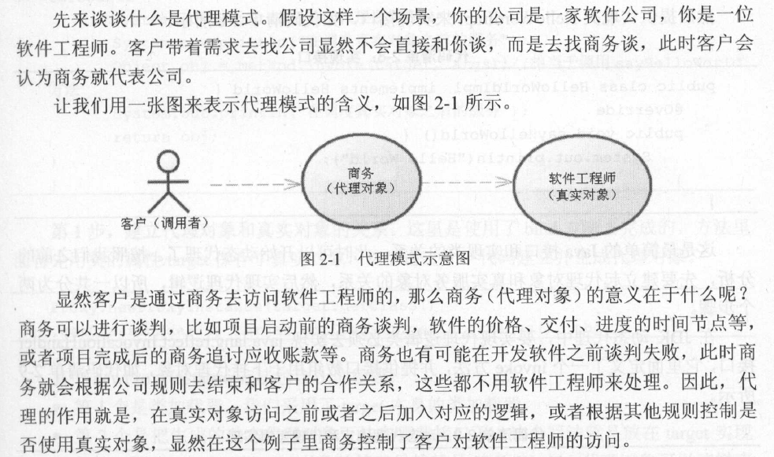
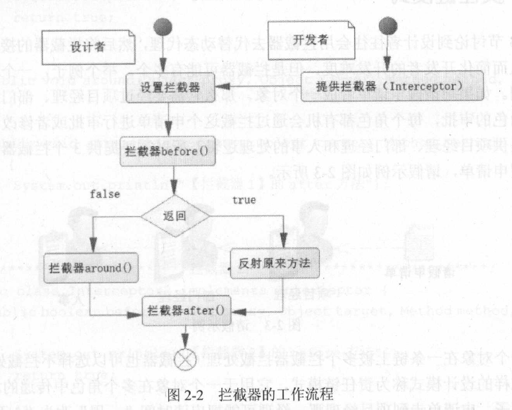
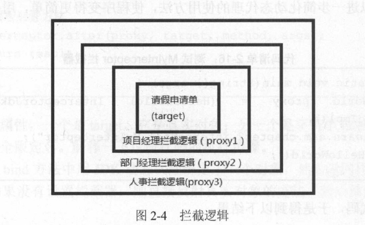

## 第 2 章 JAVA设计模式

### 2.1 JAVA反射技术

- Java反射技术应用广泛，它能够配置：类的全限定名、方法和参数，完成对象的初始化，甚至是反射某些方法

- 在Java中，反射是通过包`java.lang.reflect.*`来实现的

#### 2.1.1 通过反射构建对象

- Java中允许通过反射配置信息构建对象

- 示例一: 通过反射构建无参数的实例
    - ReflectServiceImpl: 我们要构建的类
        ````java
        public class ReflectServiceImpl{
            public void sayHello(String name){
                System.out.println("Hello, " + name);
            }
        }
        ````
    - 反射生成对象的方式
        ````java
        public ReflectServiceImpl getInstance(){
            ReflectServiceImpl object = null;
            try{
                //给类加载器注册了一个类ReflectServiceImpl的全限定名，然后通过newInstance方法初始化一个对象
                object = (ReflectServiceImpl)Class.forName("com.edu.neu.ReflectServiceImpl").newInstance();
            }catch(ClassNotFoundException | InstantiationException | IllegalAccessException ex){
                ex.printStackTrace();
            }
            return object;
        }
        ````

- 示例二: 通过反射构建有参数的实例
  - ReflectServiceImpl2: 构造方法含有参数的类
    ````java
    public class ReflectServiceImpl2{
        private String name;
        public ReflectServiceImpl2(String name){
            this.name = name;
        }
        public void sayHello(){
            System.out.println("hello " + name);
        }
    }
    ````
  - 通过反射生成带有参数的构造方法
    ````java
    public ReflectServiceImpl2 getInstance(){
        ReflectServiceImpl2 object = null;
        try{
            //先通过forName加载到类的加载器。然后通过getConstructor方法，它的参数可以是多个，这里定义为String.class,意为有且只有一个参数类型为String的构造方法
            object = (ReflectServiceImpl2)Class.forName("com.edu.neu.ReflectServiceImpl2").getConstructor(String,class).newInstance("张三");
        }catch(ClassNotFoundException | InstantiationException | IllegalAccessException | NoSuchMethodException | SecurityException | IllegalArgumentException | InvocationTargetException ex){
            ex.printStackTrace();
        }
        return object;
    }
    ````

- 反射的优点: 只要配置就可以生成对象，可以解除程序的耦合度，比较灵活

- 反射的缺点: 运行比较慢

#### 2.1.2 反射方法

- 下面讲解如何使用反射机制调用方法

- 示例: 获取和反射方法
    ````java
    public Object reflectMethod(){
        Object returnObj = null;
        ReflectServiceImpl tatget = new ReflectServiceImpl();
        try{
            Method method = ReflectServiceImpl.class.getMethod("sayHello", String.class);
            returnObj = method.invoke(target, "张三");
        }catch(ClassNotFoundException | InstantiationException | IllegalAccessException | NoSuchMethodException | SecurityException | IllegalArgumentException | InvocationTargetException ex){
            ex.printStackTrace();
        }
        return returnObj;
    }
    ````

#### 2.1.3 实例

- 示例: 如何通过反射生成对象和反射调用方法
    ````java
    public Object reflect(){
        ReflectServiceImpl object = null;
        try{
            object = (ReflectServiceImpl)Class.forName("com.edu.neu.ReflectServiceImpl").newInstance();
            Method method = object.getClass().getMethod("sayHello", String,class);
            method.invoke(object, "张三");
        }catch(ClassNotFoundException | InstantiationException | IllegalAccessException | NoSuchMethodException | SecurityException | IllegalArgumentException | InvocationTargetException ex){
            ex.printStackTrace();
        }
        return object;
    }
    ````

- 对象在反射机制下生成后，反射了方法，这样我们完全可以通过配置来完成对象和方法的反射，大大增加了Java的可配置性和可扩展性，其中`Spring IoC`就是一个典型的例子

### 2.2 动态代理模式和责任链模式

- 动态代理的意义在于生成一个占位(又称代理对象)，来代理真实对象，从而控制对真实对象的访问

- 代理的作用就是，在真实对象访问之前或之后加入对应的逻辑，或者根据其他规则控制是否使用真实对象，显然在这个例子中商务控制了客户对软件工程师的访问

- 示例
    

- 我们需要在调用调用对象之前产生一个代理对象，而这个代理对象需要和真实对象建立起代理关系，所以代理对象分为两步
  - 代理对象和真实对象建立代理关系
  - 实现代理对象的代理逻辑技术

- 常见的动态代理技术
    1. JDK
    2. CGLIB
    3. Javassist
    4. ASM

#### 2.2.1 JDK动态代理

- 简介: JDK动态代理是`java.lang.reflect.*`包提供的方式，它**必须借助一个接口**才能产生代理对象

- 示例代码:使用JDK动态代理
  - 定义`HelloWorld`接口
    ````java
    public interface HelloWorld {
        void sayHelloWorld();
    }
    ````
  - 定义`HelloWorldImpl`类实现`HelloWorld`接口，这个类充当真实对象的角色
    ````java
    public class HelloWorldImpl implements HelloWorld{

        @Override
        public void sayHelloWorld() {
            System.out.println("Hello World");
        }
    }
    ````
  - 定义`JdkProxyExample`类来实现`java.lang.reflect.InvocationHandler`接口，这个类用来动态绑定代理和实现代理逻辑
    ````java
    import java.lang.reflect.InvocationHandler;
    import java.lang.reflect.Method;
    import java.lang.reflect.Proxy;

    public class JdkProxyExample implements InvocationHandler {
        private Object target = null;

        /**
        * 建立代理对象和真实对象的代理关系，并返回代理对象
        * @param target 真实对象
        * @return 代理对象
        * */
        public Object bind(Object target) {
            this.target = target;
            return Proxy.newProxyInstance(target.getClass().getClassLoader(), target.getClass().getInterfaces(), this);
        }
        /**
        * 代理方法逻辑
        * @param proxy	代理对象
        * @param method 当前调用方法
        * @param args 当前方法参数
        * @return java.lang.Object 代理结果返回
        * @author t0ugh
        * @date 2019/4/23 16:26
        */
        @Override
        public Object invoke(Object proxy, Method method, Object[] args) throws Throwable {
            System.out.println("进入代理逻辑方法");
            System.out.println("在调度真实对象之前的服务");
            Object obj = method.invoke(target, args);
            System.out.println("在调度真实对象之后的服务");
            return obj;
        }
    }
    ````
    - 程序主入口，测试JDK动态代理
    ````java
    public class Main {
        public static void main(String[] args) {
            JdkProxyExample jdk = new JdkProxyExample();
            HelloWorld proxy = (HelloWorld)jdk.bind(new HelloWorldImpl());
            proxy.sayHelloWorld();
        }
    }
    ````

- 代码解读(`JdkProxyExample`类)
    1. 建立代理对象和真实对象的关系
        - 这里使用`bind`方法完成，方法里首先用类的属性`target`保存了真实对象，并且调用`Proxy.newProxyInstace`建立并生成了代理对象
        - `newProxyInstance`方法包含3个参数
            - 第1个是类加载器，我们采用了`target`本身的类加载器。
            - 第2个是把生成的动态代理对象下挂在哪些接口下，这个写法就是放在`target`实现的接口下。`HelloWorldlmpl`对象的接口显然就是`HelloWorld`
            - 第3个是定义实现方法逻辑的代理类，`this`表示当前对象，它必须实现`InvocationHandler`接口的`invoke`方法，它就是代理逻辑方法的现实方法。
    2. 实现代理逻辑方法
        - `invoke`方法可以实现代理逻辑
        - `invoke`方法的三个参数如下
            - `proxy`, 代理对象，也就是通过`bind`方法生成的对象
            - `method`, 当前调度的方法
            - `args`，调度方法的参数

- 类比前面的例子
    - proxy 相当于商务
    - target 相当于软件工程师
    - bind 方法就是建立商务和软件工程师代理关系的方法
    - invoke，相当于商务逻辑，它控制对软件工程师的访问

#### 2.2.2 CGLIB动态代理

- CGLIB动态代理的优势在于它不需要提供接口，只要一个非抽象类就可以实现动态代理

- 示例代码: CGLIB动态代理
    ````java
    public class CglibProxyExample implements MethodInterceptor{
        /**
         * 生成CGLIB代理对象
         * @param cls Class类
         * @return Class类的CGLIB代理对象
         */
        public Object getProxy(Class cls){
            //CGLIB enhancer增强类对象
            Enhancer enhancer = new Enhancer();
            //设置增强类型
            enhancer.setSuperclass(cls);
            //定义代理逻辑对象为当前对象，要求当前对象实现MethodInterceptor接口
            enhancer.setCallback(this);
            //生成并返回代理对象
            return enhancer.create();
        }
        /**
         * 代理逻辑方法
         * @param proxy 代理对象
         * @param method 方法
         * @param args 方法参数
         * @param methodProxy 方法代理
         */
        public Object intercept(Object proxy, Method method, Object[] args, MethodProxy methodProxy) throws Throwable{
            System.out.println("调用真实对象前");
            //CGLIB反射调用真实对象
            Object result = methodProxy.invokeSuper(proxy, args);
            System.out.println("调用真实对象后");
            return result;
        }
    }

    public class Main {
        public static void main(String[] args) {
            CglibProxyExample cpe = new CglibProxyExample();
            ReflectServiceImpl obj = (ReflectServiceImpl)cpe.getProxy(ReflectServiceImpl.class);
            obj.sayHello("张三");
        }
    }
    ````

- 概括: JDK动态代理和CGLIB动态代理都是通过`getProxy`方法生成代理对象，制定代理的逻辑类。而代理的逻辑类要实现一个接口的一个方法，这个方法就是代理对象的逻辑方法，它可以控制真实对象的方法

#### 2.2.3 拦截器

- 拦截器可以进一步简化动态代理的使用方法，使程序变得更简单
    - 开发者只要知道拦截器的作用就可以编写拦截器，编写完后可以设置拦截器，这样就完成了任务，所以对于开发者来说相对简单了
    - 设计者可能是精通java的开发人员，他来完成动态代理的逻辑
    - 设计者只会把拦截器接口暴露给开发者使用，让动态代理的逻辑在开发者的视野中“消失”

- 示例：使用JDK实现一个拦截器
    1. 定义拦截器接口`Interceptor`,通常存在于类库中，由类库的设计人员实现
        ````java
        import java.lang.reflect.Method;

        /**
        * @author t0ugh
        * @version 1.0
        * @date 2019/4/24 20:11
        */
        public interface Interceptor {
            public boolean before(Object proxy, Object target, Method method, Object[] args);

            public void around(Object proxy, Object target, Method method, Object[] args);

            public void after(Object proxy, Object target, Method method, Object[] args);
        }
        ````
        - `before`方法: 返回`boolean`值，它在真实对象前调用。当返回`true`时，则反射真实对象的方法；当返回为`false`时，则调用`around`方法
        - `around`方法: 当`before`方法返回为`false`时，执行`around`方法
        - 在反射真实对象方法或者`around`方法执行之后，调用`after`方法
    2. 定义一个`Interceptor`接口的实现类，由开发人员实现，来控制对真实对象的访问，这里只是随便实现一个比较简单的没有任何功能的`Interceptor`
        ````java
        import java.lang.reflect.Method;

        /**
        * @author t0ugh
        * @version 1.0
        * @date 2019/4/24 20:14
        */
        public class MyInterceptor implements Interceptor{

            @Override
            public boolean before(Object proxy, Object target, Method method, Object[] args) {
                System.out.println("反射方法前逻辑");
                return false;
            }

            @Override
            public void around(Object proxy, Object target, Method method, Object[] args) {
                System.out.println("取代了被代理对象的方法");
            }

            @Override
            public void after(Object proxy, Object target, Method method, Object[] args) {
                System.out.println("反射方法后逻辑");
            }
        }

        ````
    3. 在JDK动态代理中使用拦截器，由类库的设计者实现，对程序开发人员透明
        ````java
        import java.lang.reflect.InvocationHandler;
        import java.lang.reflect.Method;
        import java.lang.reflect.Proxy;

        /**
        * @author t0ugh
        * @version 1.0
        * @date 2019/4/24 20:16
        */
        public class InterceptorJdkProxy implements InvocationHandler {
            private Object target;//真实对象
            private String interceptorClass = null;//拦截器全限定名

            public InterceptorJdkProxy(Object target, String interceptorClass) {
                this.target = target;
                this.interceptorClass = interceptorClass;
            }

            /**
            * 绑定委托对象并返回一个[代理占位]
            * @param target 真实对象
            * @param interceptorClass 实现了InvocationHandler的类
            * @return 代理对象[占位]
            */
            public static Object bind(Object target, String interceptorClass){
                return Proxy.newProxyInstance(target.getClass().getClassLoader(), target.getClass().getInterfaces(), new InterceptorJdkProxy(target, interceptorClass));
            }

            /***
            * 通过代理对象调用方法， 首先进入这个方法
            * @param proxy 代理对象
            * @param method 方法，被调用的方法
            * @param args 方法的参数
            * @return
            * @throws Throwable
            */
            @Override
            public Object invoke(Object proxy, Method method, Object[] args) throws Throwable {
                if(interceptorClass == null){
                    //没有设置拦截器则直接反射原有的方法
                    return method.invoke(target, args);
                }
                Object result = null;
                //通过反射生成拦截器
                Interceptor interceptor = (Interceptor) Class.forName(interceptorClass).newInstance();
                //调用前置方法
                if(interceptor.before(proxy, target, method, args)){
                    //反射原有的方法
                    result = method.invoke(target, args);
                }else{//假如返回false执行around方法
                    interceptor.around(proxy, target, method, args);
                }
                //调用后置方法
                interceptor.after(proxy, target, method, args);
                return result;
            }
        }
        ````
        - 执行步骤(针对上文`InterceptorProxy`类)
            1. 在bind 方法中用JDK 动态代理绑定了一个对象，然后返回代理对象。
            2. 如果没有设置拦截器， 则直接反射真实对象的方法，然后结束，否则进行第 3 步。
            3. 通过反射生成拦截器，并准备使用它。
            4. 调用拦截器的before 方法，如果返回为true ，反射原来的方法；否则运行拦截器的around 方法。
            5. 调用拦截器的after 方法。
            6. 返回结果。
    4. 测试拦截器：可以看出，比手动实现Proxy的方式更加简单了
        ````java
        import ReflectDemo.JDKProxy.HelloWorld;
        import ReflectDemo.JDKProxy.HelloWorldImpl;

        /**
        * @author t0ugh
        * @version 1.0
        * @date 2019/4/24 20:32
        */
        public class Main {
            public static void main(String[] args) {
                HelloWorld proxy = (HelloWorld) InterceptorJdkProxy.bind(new HelloWorldImpl(), "InterceptorDemo.MyInterceptor");
                proxy.sayHelloWorld();
            }
        }
        ````

- 拦截器的工作流程图
    


#### 2.2.4 责任链模式

- 责任链模式
    - 当一个对象在一个链上被多个拦截器拦截处理（拦截器也可以选择不拦截处理它）时，我们把这种设计模式称为责任链模式
    - 可以考虑用层层代理的方式来实现这种模式
    - 拦截逻辑如下图
        

- 示例：使用层层代理的方式实现责任链模式
    1. 定义3个拦截器
        ````java
            public class Interceptor1 implements Interceptor{
                public boolean before (Object proxy, Object target , Method method , Object [] args){
                    System.out.println("拦截器1的before方法");
                    return true;
                }
                public void around(Object proxy, Object target, Method method, Object [] args){}
                public void after (Object proxy, Object target, Method method, Object [] args){
                    System.out.println("拦截器1的after方法");
                }
            }

            public class Interceptor2 implements Interceptor{
                public boolean before (Object proxy, Object target , Method method , Object [] args){
                    System.out.println("拦截器2的before方法");
                    return true;
                }
                public void around(Object proxy, Object target, Method method, Object [] args){}
                public void after (Object proxy, Object target, Method method, Object [] args){
                    System.out.println("拦截器2的after方法");
                }
            }

            public class Interceptor3 implements Interceptor{
                public boolean before (Object proxy, Object target , Method method , Object [] args){
                    System.out.println("拦截器3的before方法");
                    return true;
                }
                public void around(Object proxy, Object target, Method method, Object [] args){}
                public void after (Object proxy, Object target, Method method, Object [] args){ 
                    System.out.println("拦截器3的after方法");
                }
            }
        ````
    2. 测试责任链模式上的多拦截器
        ````java
        public static void main(String[] args) {
            HelloWorld proxy1 = (HelloWorld)InterceptorJdkProxy.bind(new HelloWorldimpl(), "interceptor.Interceptorl");
            HelloWorld proxy2 = (HelloWorld)InterceptorJdkProxy.bind(proxy1, "interceptor.Interceptor2");
            HelloWorld proxy3 = (HelloWorld)InterceptorJdkProxy.bind(proxy2, "interceptor.Interceptor3");           
            proxy3.sayHelloWorld() ;
        }
        ````
        - `before`方法按照从最后一个拦截器都第一个拦截器的加载顺序运行
        - `after`方法按照从第一个拦截器到最后一个拦截器的加载顺序运行


- 责任链模式的优缺点
    - 优点：可以在传递链上加入新的拦截器，增加拦截逻辑
    - 缺点：会增加代理和反射，而代理和反射的性能不高

### 2.3 观察者模式

- 观察者模式
    - 又称为发布订阅模式，是对象的行为模式
    - 观察者模式定义了一种一对多的依赖关系，让多个观察者对象同时监视着被观察者的状态，当被观察者的状态发生变化时，会通知所有观察者，并让其自动更新自己
    - 被观察者是自变量而观察者是因变量

- 示例：如何使用JDK中的观察者模式
    1. 继承类库中的Observable类，定义一个被观察者
        ````java
        import java.util.ArrayList;
        import java.util.List;
        import java.util.Observable;

        /**
        * @author t0ugh
        * @version 1.0
        * @date 2019/4/24 21:22
        */
        public class ProductList extends Observable {
            private List<String> productList = null;
            private static ProductList instance;

            private ProductList() {

            }

            public static ProductList getInstance(){
                if(instance == null){
                    instance = new ProductList();
                    instance.productList = new ArrayList<>();
                }
                return instance;
            }

            public void addProduct(String newProduct){
                productList.add(newProduct);
                System.out.println("产品列表增加了: " + newProduct);
                this.setChanged();
                this.notifyObservers(newProduct);
            }
        }
        ````
    2. 实现类库中的Observer接口，定义两个被观察者
        ````java
        import java.util.Observable;
        import java.util.Observer;

        /**
        * @author t0ugh
        * @version 1.0
        * @date 2019/4/24 21:27
        */
        public class JingDongObserver implements Observer {
            @Override
            public void update(Observable o, Object product) {
                String newProduct = (String) product;
                System.out.println("发布了新产品: " + newProduct + "，已加入京东");
            }
        }

        ````
        ````java
        import java.util.Observable;
        import java.util.Observer;

        /**
        * @author t0ugh
        * @version 1.0
        * @date 2019/4/24 21:28
        */
        public class TaoBaoObserver implements Observer {
            @Override
            public void update(Observable o, Object product) {
                String newProduct = (String) product;
                System.out.println("发布了新产品: " + newProduct + "，已加入淘宝");
            }
        }

        ````
    3. 测试观察者模式
        ````java
        /**
        * @author t0ugh
        * @version 1.0
        * @date 2019/4/24 21:30
        */
        public class Main {
            public static void main(String[] args) {
                ProductList productList =ProductList.getInstance();
                productList.addObserver(new JingDongObserver());
                productList.addObserver(new TaoBaoObserver());
                productList.addProduct("呆滞牌夹心饼干");
            }
        }
        ````### 2.3 观察者模式

- 观察者模式
    - 又称为发布订阅模式，是对象的行为模式
    - 观察者模式定义了一种一对多的依赖关系，让多个观察者对象同时监视着被观察者的状态，当被观察者的状态发生变化时，会通知所有观察者，并让其自动更新自己
    - 被观察者是自变量而观察者是因变量

- 示例：如何使用JDK中的观察者模式
    1. 继承类库中的Observable类，定义一个被观察者
        ````java
        import java.util.ArrayList;
        import java.util.List;
        import java.util.Observable;

        /**
        * @author t0ugh
        * @version 1.0
        * @date 2019/4/24 21:22
        */
        public class ProductList extends Observable {
            private List<String> productList = null;
            private static ProductList instance;

            private ProductList() {

            }

            public static ProductList getInstance(){
                if(instance == null){
                    instance = new ProductList();
                    instance.productList = new ArrayList<>();
                }
                return instance;
            }

            public void addProduct(String newProduct){
                productList.add(newProduct);
                System.out.println("产品列表增加了: " + newProduct);
                this.setChanged();
                this.notifyObservers(newProduct);
            }
        }
        ````
    2. 实现类库中的Observer接口，定义两个被观察者
        ````java
        import java.util.Observable;
        import java.util.Observer;

        /**
        * @author t0ugh
        * @version 1.0
        * @date 2019/4/24 21:27
        */
        public class JingDongObserver implements Observer {
            @Override
            public void update(Observable o, Object product) {
                String newProduct = (String) product;
                System.out.println("发布了新产品: " + newProduct + "，已加入京东");
            }
        }

        ````
        ````java
        import java.util.Observable;
        import java.util.Observer;

        /**
        * @author t0ugh
        * @version 1.0
        * @date 2019/4/24 21:28
        */
        public class TaoBaoObserver implements Observer {
            @Override
            public void update(Observable o, Object product) {
                String newProduct = (String) product;
                System.out.println("发布了新产品: " + newProduct + "，已加入淘宝");
            }
        }

        ````
    3. 测试观察者模式
        ````java
        /**
        * @author t0ugh
        * @version 1.0
        * @date 2019/4/24 21:30
        */
        public class Main {
            public static void main(String[] args) {
                ProductList productList =ProductList.getInstance();
                productList.addObserver(new JingDongObserver());
                productList.addObserver(new TaoBaoObserver());
                productList.addProduct("呆滞牌夹心饼干");
            }
        }
        ````

### 2.4 工厂模式和抽象工厂模式

#### 2.4.1 普通工厂(Simple Factory)模式

- 简介
    - 在简单工厂模式中，可以根据参数的不同返回不同类的实例
    - 简单工厂模式专门定义一个类来负责创建其他类的实例，被创建的实例通常都具有共同的父类。

- 模式结构
    - `Factory`(工厂角色): 工厂角色负责实现创建所有实例的内部逻辑
    - `Product`(抽象产品角色): 抽象产品角色是创建的所有产品的父类，负责描述所有实例所共有的公共接口
    - `ConcreteProduct`(具体产品角色): 具体产品角色是创建目标，所有创建的对象都充当了这个角色的某个具体类的实例

- 类图
    

- 时序图
    

#### 2.4.2 抽象工厂(Abstract Factory)模式

- 简介: 
    - 提供一个创建一系列相关或相互依赖对象的接口，而无须指定它们具体的类。
    - 抽象工厂模式又称为Kit模式，属于对象创建型模式。
    - 用于生产一个产品族的产品

- 模式结构
    - AbstractFactory：抽象工厂
    - ConcreteFactory：具体工厂
    - AbstractProduct：抽象产品
    - Product：具体产品

- 类图
    

- 时序图
    


### 2.5 建造者模式

- 简介
    - 建造者模式可以将部件和其组装过程分开，一步一步创建一个复杂的对象。用户只需要指定复杂对象的类型就可以得到该对象，而无须知道其内部的具体构造细节。
    - 建造者模式是一步一步创建一个复杂的对象，它允许用户只通过指定复杂对象的类型和内容就可以构建它们，用户不需要知道内部的具体构建细节。建造者模式属于对象创建型模式。根据中文翻译的不同，建造者模式又可以称为生成器模式。

- 模式结构
    - Builder：抽象建造者
    - ConcreteBuilder：具体建造者
    - Director：指挥者
    - Product：产品角色

- 类图
    

- 时序图
    

