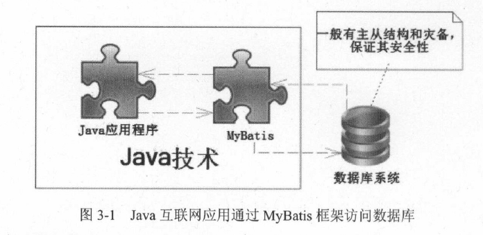
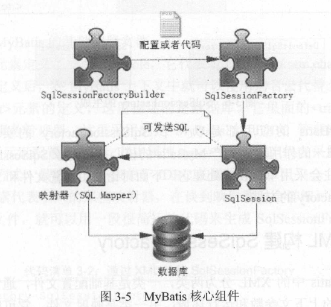
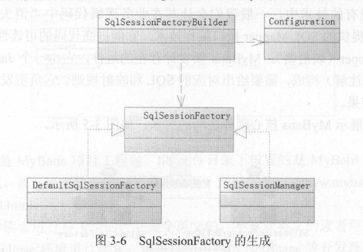
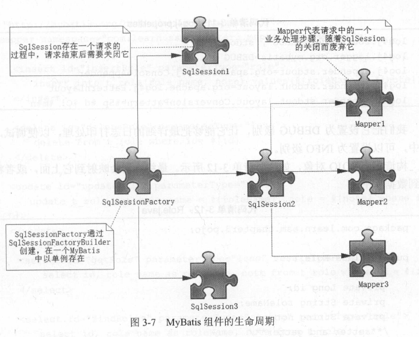

## 第 3 章 认识MyBatis核心组件

### 3.1 持久层的概念和MyBatis的特点

- 持久层概念
    - 持久层可以将业务数据存储到磁盘，具备长期存储能力
    - 一般执行持久任务的都是数据库系统，持久层可以使用巨大的磁盘空间，也比较廉价，缺点是比较慢

- Java互联网应用可以通过MyBatis框架访问数据库
    

- MyBatis最大的成功有三点
    - 不屏蔽SQL
        - 意味着可以更为精确的定位SQL语句，可以对其进行优化和改造
        - 这有利于互联网系统性能的提高，符合互联网需要性能优化的特点
    - 提供强大、灵活的映射机制，方便Java开发者的使用
        - 提供动态SQL的功能，允许我们根据不同条件组装SQL，这个功能远比其他工具或者Java编码的可读性和可维护性高得多，满足各种应用系统的同时也满足了需求经常需要变化的互联网应用的要求 
    - 在MyBatis中，提供了使用Mapper的接口编程，只要一个接口和一个XML就能创建映射器

### 3.2 准备MyBatis环境

- 我们只要在工程中加入MyBatis包即可，它包含MyBatis工程包和其依赖包

### 3.3 MyBatis的核心组件

- `MyBatis`的核心组件分为4个部分
  - `SqlSessionFactoryBuilder`(构造器)：它根据配置或者代码来生成`SqlSessionFactory`，采用的是分布构建的`Builder`模式
  - `SqlSessionFactory`(工厂接口)：依靠它来生成`SqlSession`，使用的是工厂模式
  - `SqlSession`(会话)：一个既可以发送`SQL`执行返回结果，也可以获取`Mapper`的接口。在现有的技术中，一般我们会让其在业务逻辑代码中消失，而使用的是`MyBatis`提供的`SQL Mapper`接口编程技术，它能提高代码的可读性和可维护性
  - `SQL Mapper`(映射器)：`MyBatis`新设计存在的组件，它由一个`Java`接口和`XML`文件构成，需要给出对应的`SQL`和映射规则。它负责发送`SQL`去执行，并返回结果

- `MyBatis`核心组件之间的关系
    

- 注意: 无论是映射器还是`SQLSession`都可以发送`SQL`到数据库执行

### 3.4 SqlSessionFactory(工厂接口)

- 概述
  - 使用MyBatis首先是使用配置或者代码去生产SqlSessionFactory
  - 每个基于MyBatis的应用都是以一个SqlSessionFactory的实例为中心的，而SqlSessionFactory的唯一作用是生产MyBatis的核心接口对象SqlSession，所以它是职责单一的


- 如何生成`SqlSessionFactory`
  - 而MyBatis提供了构造器SqlSessionFactoryBuilder。它提供了一个类`org.apache.ibatis.session.Configuration`作为引导，采用的是Builder模式
  - 在MyBatis中，既可以通过读取`XML`配置文件的方式生成`SqlSessionFactory`，也可以通过Java代码的形式生成`SqlSessionFactory`
  - 当配置了XML或者提供了代码后，MyBatis会读取配置文件，通过`Configuration`类对象构建整个`MyBatis`的上下文

- SqlSessionFactory接口的结构
    


#### 3.4.1 使用XML构建SqlSessionFactory

- MyBatis中的XML分为两类
    1. 基础配置文件: 通常只有一个，主要是配置一些最基本的上下文参数和运行环境
    2. 映射文件: 它可以配置映射关系、SQL、参数等信息

- 示例: 一份基础配置文件
    ````xml
    <?xml version="1.0" encoding="utf-8" ?>
    <!DOCTYPE configuration PUBLIC "-//mybatis.org//DTD Config 3.0//EN" "http://mybatis.org/dtd/mybatis-3-config.dtd">
    <configuration>
        <typeAliases>
            <typeAlias type="MyBatisDemo.Role" alias="role"/>
        </typeAliases>
        <environments default="development">
            <environment id="development">
                <transactionManager type="JDBC"></transactionManager>
                <dataSource type="POOLED">
                    <property name="driver" value="com.mysql.jdbc.Driver"/>
                    <property name="url" value="jdbc:mysql://localhost:3306/ssm"/>
                    <property name="username" value="root"/>
                    <property name="password" value="123456"/>
                </dataSource>
            </environment>
        </environments>
        <mappers>
            <mapper resource="MybatisDemo/RoleMapper.xml"/>
        </mappers>
    </configuration>
    ````

- MyBatis基础配置文件的结构
    - `<typeAlias>`:用于定义别名，定义之后，在MyBatis上下文中就可以使用别名代替全限定名
    - `<environment>`:这里描述的是数据库。其中`<transactionManager>`元素是配置事务管理器。然后采用`<dataSource>`元素配置数据库
    - `<mapper>`: 代表引入的那些映射器，在谈到映射器时会详细讨论它

- 有了这些配置文件，就可以用一段简短的代码来生成`SqlSessionFactory`
    ````java
    SqlSessionFactory sqlSessionFactory = null;
    String resource = "mybatis-config.xml";
    InputStream inputStream;
    try{
        inputStream = Resources.getResourceAsStream(resource);
        sqlSessionFactory = new SqlSessionFactoryBuilder().build(inputStream);
    }catch(IOException e){
        e.printStackTrace();
    }
    ````

#### 3.4.2 使用代码构建SqlSessionFactory

-  示例: 使用代码构建SqlSessionFactory
    ````java
    //数据库连接池信息
    PooledDataSource dataSource = new PooledDataSource();
    dataSource.setDriver("com.mysql.jdbc.Driver");
    dataSource.setUsername("root");
    dataSource.setPassword("123456");
    dataSource.setUrl("jdbc://localhost:3306/ssm");
    dataSource.setDefaultAutoCommit(false);
    //采用MyBatis的JDBC事务方式
    TransactionFactory transactionFactory = new JdbcTransactionFactory();
    Environment environment = new Environment("development", transactionFactory, dataSource);
    Configuration configuration = new Configuration(environment);
    configuration.getTypeAliasRegistry().registerAlias("role", Role,class);
    configuration.addMapper(RoleMapper.class);
    SqlSessionFactory sqlSessionFactory = new SqlSessionFactoryBuilder().build(configuration);
    ````

- 注意: 但是代码冗长，如果系统发生修改，那么有可能重新编译代码才能继续，所以这不是一个很好的方式。

### 2.5 SqlSession

- 简介
  - 在`MyBatis`中，`SqlSession`是其核心接口
  - 在`MyBatis`中有两个实现类，`DefaultSqlSession`和`SqlSessionManager`，`DefaultSqlSession`是单线程使用的，`SqlSessionManager`在多线程环境下使用
  - `SqlSession`的作用类似于一个`JDBC`中的`Connection`对象，代表着一个连续资源的启用

- `SqlSession`的主要作用
  - 获取`Mapper`接口
  - 发送`Sql`给数据库
  - 控制数据库事务


- `SqlSession`只是一个门面(`Facade`)接口，它有很多方法，可以直接发送`SQL`
  - 它就好像一家软件公司的商务人员，是一个门面，而实际干活的是软件工程师
  - 在`MyBatis`中，真正干活的是`Executor`

- 示例: `SqlSession`控制事务的伪代码
    ````java
    SqlSession sqlSession = null;
    try{
        sqlSession = SqlSessionFactory.openSession();
        sqlSession.commit();
    }catch(Exception ex){
        sqlSession.rollback();
    }finally{
        if(sqlSession != null){
            sqlSession.close();
        }
    }
    ````
### 3.6 映射器(Mapper)

- 简介
    - 映射器是`MyBatis`中最重要、最复杂的组件
    - 它由一个接口和对应的`XML`文件组成

- 映射器可以配置以下内容
    - 描述映射规则
    - 提供`SQL`语句，并可以配置`SQL`参数类型、返回类型、缓存刷新等信息
    - 配置缓存
    - 提供动态`SQL`

- 映射器的主要功能
    - 将`SQL`查询到的结果映射为一个`POJO`
    - 将`POJO`的数据插入到数据库
    - 定义一些关于缓存等的重要内容

#### 3.6.1 用XML实现映射器

- 步骤
    1. 先定义一个映射器接口
        ````java
        public interface RoleMapper{
            public Role getRole(Long id);
        }
        ````
    2. 用XML的方式创建映射器
        ````xml
        <?xml version="1.0" encoding="utf-8" ?>
        <!DOCTYPE mapper PUBLIC "-//mybatis.org//DTD Mapper 3.0//EN" "http://mybatis.org/dtd/mybatis-3-mapper.dtd">
        <mapper namespace="myBatisDemo.RoleMapper">
            <select id="getRole" parameterType="long" resultType="role">
                select id, role_name as roleName, note from t_role where id = #{id}
            </select>
        </mapper>
        ````

- 上面XML文件的解读
    - `<mapper>`元素中的属性`namespace`所对应的是一个接口的全限定名，于是`MyBatis`上下文就可以通过它找到对应的接口
    - `<select>`元素表明这是一条查询语句，而属性`id`标识了这条`SQL`，属性`parameterType="long"`说明传递给`SQL`的是一个`long`型参数，而`resultType="role"`表示返回的是一个`role`类型的返回值
    - 这条`SQL`中的`#{id}`表示传递进去的参数

#### 3.6.2 注解实现映射器

- 还可以采用注解的方式定义映射器，它只需要一个接口就可以通过`MyBatis`的注解来注入SQL

- 示例: 通过注解实现映射器
    ````java
    public interface RoleMapper2{
        @Select("select id, role name as roleName, note from t_role where id=#{id}")
        public Role getRole(Long id);
    }
    ````

- 注意: 如果它和XML方式同时定义时，XML方式将覆盖掉注解方式，所以`MyBatis`官方推荐使用的是`XML`的方式

- 注解方式的缺点
    - 如果把大量的SQL放入到java代码中，显然代码的可读性会降低
    - 如果同时还要考虑使用动态SQL，会使得注解更加复杂，不利于日后的维护和修改
    - XML可以相互引入，而注解则不可以

#### 3.6.3 SqlSession发送SQL

- 有了映射器就可以通过SqlSession发送SQL

- 示例: 使用SqlSession发送SQL
    ````java
    Role role = (Role)sqlSession.selectOne("mapper.RoleMapper.getRole", 1l);
    ````

- 代码解释
    - `selectOne`方法表示使用查询并且只返回一个对象，而参数则是一个`String`对象和一个`Object`对象
    - `String`对象是由一个命名空间加上`SQL id`组合而成的，它完全定位了一条`SQL`，这样`MyBatis`就会找到对应的`SQL`

#### 3.6.4 用Mapper接口发送SQL

- `SqlSession`还可以获得`Mapper`接口，通过`Mapper`接口发送`SQL`

- 示例:通过`Mapper`接口发送`SQL`
    ````java
    RoleMapper roleMapper = sqlSession.getMapper(RoleMapper.class);
    Role role = roleMapper.getRole(1L);
    ````

#### 3.6.5 对比两种发送SQL的方式

- 笔者建议使用`SqlSession`获取`Mapper`的方式来发送`SQL`
    - 使用`Mapper`接口编程可以消除`SqlSession`带来的功能性代码，提高可读性，类似`roleMapper.getRole(1L)`是完全面向对象的语言，更能体现业务逻辑
    - 使用`mapper.getRole(1L)`的方式，IDE会提示错误和校验

### 3.7 生命周期

- 生命周期: 生命周期就是每个对象应该存活的时间，比如一些对象一次用完后就要关闭，使它们被JVM销毁

#### 3.7.1 SqlSessionFactoryBuilder

- `SqlSessionFactoryBuilder` 的作用在于创建`SqlSessionFactory`，创建成功后，`SqlSessionFactoryBuilder` 就失去了作用

- 所以它只能存在于创建`SqlSessionFactory` 的方法中，而不要让其长期存在。

#### 3.7.2 SqlSessionFactory

- `SqlSessionFactory` 可以被认为是一个数据库连接池，它的作用是创建 `SqlSession` 接口对象。

- 因为 `MyBatis` 的本质就是 `Java` 对数据库的操作，所以 `SqlSessionFactory` 的生命周期存在于整个 `MyBatis` 的应用之中，所以一旦创建了`SqlSessionFactory`，就要长期保存它，直至不再使用`MyBatis`应用

- 在一般的应用中我们往往希望 `SqlSessionFactory` 作为一个单例，让它在应用中被共享。

#### 3.7.3 SqlSession

- `SqlSession` 就相当于一个数据库连接(`Connection` 对象)

- 它应该存活在一个业务请求中，处理完整个请求后，应该关闭这条连接，让它归还给`SqlSessionFactory` ， 否则数据库资源就很快被耗费精光，系统就会瘫痪，所以用`try... catch ... finally ...`语句来保证其正确关闭。

#### 3.7.4 Mapper

- `Mapper` 是一个接口，它由 `SqlSession` 所创建，所以它的最大生命周期至多和 `SqlSession` 保持一致

- `Mapper` 代表的是一个请求中的业务处理，所以它应该在一个请求中，一旦处理完了相关的业务，就应该废弃它。

#### 3.7.5 总结

- `MyBatis`组件的生命周期
    

