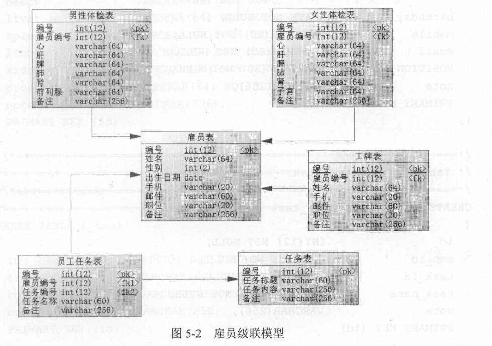

## 第5章 映射器

映射器由一个接口加上 `XML` 文件(或者注解)组成。在映射器中可以配置参数、各类的`SQL`语句、存储过程、缓存、级联等复杂的内容，并且通过简易的映射规则映射到指定的`POJO`或者其他对象上，映射器能有效消除`JDBC`底层的代码。

`MyBatis`的映射器也可以使用注解完成，但是应用不广，原因主要来自3个方面
1. 面对复杂性，`SQL`会显得无力，尤其是长`SQL`
2. 注解的可读性较差
3. 在功能上，注解丢失了XML 上下文相互引用的功能

### 5.1 概述

映射器的配备元素如下
|元素名称|描述|备注|
|--|--|--|
|select|查询语句|可以自定义参数，返回结果集等|
|insert|插入语句|执行后返回一个整数，代表插入的条数|
|update|更新语句|执行后返回一个整数，代表删除的条数|
|sql|允许定义一部分SQL，然后在其他地方引用它|例如，一张表列名，一次定义，可以在多个SQL语句中使用|
|resultMap|用来描述从数据库结果集中来加载对象|它将提供映射规则|
|cache|给定命名空间的缓存配置||
|cache-ref|其他命名空间缓存配置的引用||

### 5.2 select元素(查询语句)

#### 5.2.1 简单的select元素的应用

先学习一个简单的例子: 统计用户表中同一个姓氏的用户数量
````xml
<select id="countUserByFirstName" parameterType="string" resultType="int">
    select count(*) total from t_user
    where user_name like concat(#{firstName}, '%')
</select>
````
然后解释这个例子
- `id`配合`Mapper`的全限定名，联合成为一个唯一的标识符，标识这条`SQL`
- `parameterType`表示这条`SQL`接受的参数类型，可以是`MyBatis`系统定义或自定义的别名，也可以是类的全限定名
- `resultType`表示这条`SQL`返回的结果类型
- `#{firstName}`是被传递进去的参数

#### 5.2.2 自动映射和驼峰映射

`MyBatis`提供了自动映射功能，在默认情况下自动映射功能是开启的，使用它的好处是能有效减少大量的映射配置，从而减少工作量

在`setting`元素中有两个可以配置的选项`autoMappingBehavior`和`mapUnderscoreToCamelCase`，它们是控制自动映射和驼峰映射的开关

举个简单的例子来说明自动映射和驼峰映射

首先给出一个简单的`POJO`，`Role`
````java
public class Role{
    private Long id;
    private String roleName;
    private String note;
    /**setter and getter**/
}
````

下面通过自动映射完成需求: 通过角色编号获取角色的信息
````xml
<select id="getRole" parameterType="long" resultType="com.edu.neu.pojo.Role">
    select id, role_name as roleName, note from t_role where id = #{id}
</select>
````
- 这里原来的列名`role_name`被别名`roleName`代替，这样就和`POJO`上的属性名称保持一致了

如果系统都严格按照驼峰命名法，(例如，数据库字段`role_name`，对应`POJO`属性名为`roleName`)，此时可以改写为
````
select id, role_name, note from t_role where id = #{id}
````

自动映射和驼峰映射都建立在SQL列名和POJO属性名的映射关系上，而现实中会更加复杂，此时`resultType`元素是无法满足这些需求的。如果需要更为强大的映射规则，则需要考虑使用`resultMap`

#### 5.2.3 传递多个参数

在现实需求中，经常需要传递多个参数。传参方法有4种

##### 5.2.3.1 使用map接口传递多个参数

可以使用`Map`接口通过键值对传递多个参数，把接口方法定义为
````java
public List<Role> findRolesByMap(Map<String, Object> parameterMap);
````

此时传递给映射器的是一个`map`对象，使用它在SQL中设置对应的参数
````xml
<select id="findRolesByMap" parameterType="map" resultYpe="role">
    select id, role_name as roleName, note from t_role
    where role_name like concat('%', #{roleName}, '%') and note like concat('%', #{note}, '%')
</select>
````

##### 5.2.3.2 使用注解传递多个参数

使用`map`传递参数的弊病是可读性差，为此`MyBatis`为开发者提供了一个注解`＠Param`，可以通过它去定义映射器的参数名称，使用它可以得到更好的可读性，把接口方法定义为：
````java
public List<Role> findRolesByAnnotation (@Param ("roleName") String rolename, @Param ("note ") String note);
````

此时映射文件可以定义为，此时并不需要给出`parameterType`属性，让`MyBatis`自动探索即可
````xml
<select id="findRolesByAnnotation" resultType="role">
    select id, role_name as roleName, note from t_role
    where role_name like concat ('%', #{roleName}, '%')
    and note like concat ('%', #{note}, '%')
</select>
````
但是这会带来一个麻烦。如果`SQL`很复杂，拥有大于10个参数，那么接口方法的参数个数就多了，使用起来就很不容易

##### 5.2.3.3 通过JavaBean传递多个参数

可以通过传递`Java Bean`的方式来处理参数过多的问题

先定义一个参数的`POJO`:`RoleParams`
````java
public class RoleParams{
    private String roleName;
    private String note;
    /**set ter and getter**/
}
````

把接口方法定义为
````java
public List<Role> findRolesByBean(RoleParams roleParam);
````

此时映射文件定义为：其中`parameterType`设置为上文定义的POJO的路径
<select id="findRolesByBean" parameterType= "com.learn.ssm.chapterS.param.RoleParams"
resultType="role">
    select id, role name as roleName, note from t role
    where role name like concat ('%', #{roleName}, '%')
    and note like concat ('%', #{note}, '%')
</select>

引用`JavaBean`定义的属性作为参数，然后查询
````java
RoleMapper roleMapper = sqlSession.getMapper(RoleMapper.class);
RoleParams roleParams = new RoleParams();
roleParams.setRoleName("1");
roleParams.setNote("1");
List<Role> roles = roleMapper.findRolesByBean(roleParams);
````

##### 5.2.3.4 混合使用

略

##### 5.2.3.5 总结

- 使用`map`传递参数导致了业务可读性的丧失，导致后续扩展和维护的困难，在实际的应用中要果断废弃这种方式。
- 使用`@Param`注解传递多个参数，受到参数个数(n)的影响。当`n<=5`时，这是最佳的传参方式，它比用`Java Bean`更好，因为它更加直观；当`n>5`时，多个参数将给调用带来困难，此时不推荐使用它。
- 当参数个数多于5个时，建议使用`Java Bean`方式。
- 对于使用混合参数的，要明确参数的合理性。

#### 5.2.4 使用resultMap映射结果集

为了支持复杂的映射，`select`元素提供了`resultMap`属性，例子如下
````xml
<mapper namespace="com.xxx.RoleMapper">
    <resultMap id="roleMap" type="role">
        <id property="id" column="id"/>
        <result property="roleName" column="role_name"/>
        <result property="note" column="note"/>
    </resultMap>
    <select id="getRoleUseResultMap" parameterType="long" resultMap="roleMap">
        select id, role_name, note from t_role where id = #{id}
    </select>
</mapper>
````
- `resultMap`元素定义了一个`roleMap`，它的属性`id`代表它的标识，`type`代表使用哪个类作为其映射的类
- 子元素`id`代表`resultMap`的主键，而`result`代表其属性，`id`和`result`元素的属性`property`代表`POJO`的属性名称，而`column`代表`SQL`的列名
- 在`select`元素中的属性`resultMap`制定了采用哪个`resultMap`作为其映射规则

#### 5.2.5 分页参数RowBounds

`MyBatis`支持分页，它还内置了一个专门处理分页的类`RowBounds`，使用它十分的简单，只要给接口增加一个`RowBounds`参数即可。

````java
public List<Role> findByRowBounds(@Param("roleName") String rolename, @Param("note") String note, RowBounds rowBounds);
````

````xml
<select id="findByRowBounds" resultType="role">
    select id, role_name as roleName, note from t_role
    where role_name like concat('%', #{roleName}, '%')
    and note like concat('%', #{note}, '%')
</select>
````
注意上面代码并没有任何关于`RowBounds`参数的消息，它是`MyBatis`的一个附加参数，`MyBatis`会自动识别它，据此进行分页，测试程序如下

````java
RoleMapper roleMapper = sqlSession.getMapper(RoleMapper.class);
RowBounds rowBounds = new RowBounds(0, 20);
List<Role> roleList = roleMapper.findByRowBounds("role_name", "note", rowBounds);
````

但是要注意`RowBounds`分页运用的场景，它只适用于一些小数据量的查询。`RowBounds`分页的原理是执行`SQL`的查询后，按照偏移量和限制条数返回查询结果，所以对于大量的数据查询，它的性能并不佳，此时可以通过分页插件去处理，详情可参考本书第8章的内容。

### 5.3 insert元素(插入语句)

#### 5.3.1 概述

插入数据依赖于`insert`语句

#### 5.3.2 简单的insert语句的应用

````xml
<insert id="insertRole" parameterType="role">
    insert into t_role(role_name, note) values (#{roleName}, #{note})
</insert>
````
- `id`标识出这条`SQL`
- `parameterType`代表传入参数类型

#### 5.3.3 主键回填

大多数场景下，我们会为`MySQL`中的表配置自增主键。而有时候我们需要取出新插入元素的自增主键。

`JDBC`中的`Statement`对象在执行插入的`SQL`后，可以通过`getGeneratedKeys`方法获得数据库生成的主键(需要数据库驱动支持)，这样便能达到获取主键的功能。在`insert`语句中有一个开关属性`useGeneratedKeys`，用来控制是否打开这个功能，它的默认值为`false`。当打开了这个开关，还要配置其属性`keyProperty`或`keyColumn`，告诉系统把生成的主键放入哪个属性中，

````xml
<insert id="insertRole" parameterType="role" useGeneratedKeys="true" keyProperty="id">
    insert into t_role(role_name, note) values(#{roleName}, #{note})
</insert>
````

#### 5.3.4 自定义主键

有时候主键可能依赖于某些规则，比如取消角色表(t_role)的`id`的递增规则，而将其规则修改为:
- 当角色表记录为空时，`id`设置为`1`。
- 当角色表记录不为空时，`id`设置为当前`id`加3
`MyBatis`对这样的场景也提供了支持，它主要依赖于`selectKey`元素进行支持，它允许自定义键值的生成规则。

````xml
<insert id="insertRole" parameterType="role">
    <selectKey keyProperty="id" resultType="long" order="BEFORE">
        select if(max(id) = null, 1, max(id) + 3) from t_role
    </selectKey>
    insert into t_role(id, role_name, note) values(#{id}, #{roleName}, #{note})
</insert>
````
- 它定义了`selectKey`元素，它的`keyProperty`指定了采用哪个属性作为`POJO`的主键。
- `resultType`告诉`MyBatis`将返回一个`long`型的结果集，而`order`设置为`BEFORE`，说明它将于当前定义的`SQL`前执行。
- 这里的`order`配置为`BEFORE`，说明它会在插入之前会先执行生成主键的`SQL`，然后插入数据。

### 5.4 update元素和delete元素

`update`和`delete`执行完会返回一个整数，用以标识该SQL语句影响数据库的记录行数
````xml
<update id="updateRole" parameterType="role">
    update t_role set role_name= #{roleName}, note = #{note}
    where id = #{id}
</update>
<delete id="deleteRole" parameterType="long">
    delete from t_role where id = #{id}
</delete>
````

### 5.5 sql元素

sql元素的作用在于可以定义一条`SQL`的一部分，方便后面的SQL引用它，比如最典型的列名。通常情况下要在`select`、`insert`等语句中反复编写它们，特别是那些字段较多的表更是如此。
````xml
<mapper namespace= "com.RoleMapper">
    <resultMap id= "roleMap" type= "role">
        <id property="id" column="id" />
        <result property="roleName" column= "role_name"/>
        <result property="note" column="note"/>
    </resultMap>
    <sql id="rolesCols">
        id, role_name, note
    </sql>
    <select id="getRole" parameterType="long" resultMap="roleMap">
        select <include refid="rolesCols"/> 
        from t_role where id=#{id}
    </select>
</mapper>
````
sql元素还支持变量传递
````xml
<sql id="roleCols">
    ${alias}.id, ${alias}.role_name, ${alias}.note
</sql>
<select id="getRole" parameterType="long" resultMap="roleMap">
    select <include refid="roleCols"><property name="alias" value="r"/></include>
    from t_role r where id = #{id}
</select>
````

### 5.6 参数

#### 5.6.1 概述

一些数据库字段返回为`null`，而`MyBatis`系统又检测不到使用何种`jdbcType`进行处理时，会发生异常的情况，这个时候执行对应的`typeHandler`进行处理，`MyBatis`就知道采取哪个`typeHandler`进行处理了
````
insert into t_role(id, role_name, note) values(#{id} , #{roleName, typeHandler=StringTypeHandler}, #{note})
````

而事实是，大部分情况下都不需要这样编写，因为`MyBatis`会根据`javaType`和`jdbcType`去检测使用哪个`typeHandler`
````
#{age, javaType=int, jdbcType=NUMERIC, typeHandler=MyTypeHandler}
````


#### 5.6.2 存储过程参数支持
MyBatis对存储过程也进行了支持，在存储过程中存在：输入(IN)参数、输出(OUT)参数和输入输出(INOUT)参数3种类型。

#### 5.6.3 特殊字符串的替换和处理

在现实中，由于一些因素会造成构成`SQL`查询的列名发生变化，比如产品类型为大米，查询的列名是重量，而产品类型为灯具，查询的列名是数量，这时候需要构建动态列名。有些企业会将一张很大的数据库表按年份拆分，比如购买记录表(`t_purchase records`) 。现实中由于记录比较多，可能为了方便按年份拆分为`t_purchase_records_ 2016` 、`t_purchase_records_ 2017` 、`t_purchase_records_2018`等，这时往往需要构建动态表名。

在`MyBatis`中，构建动态列名常常要传递类似于字符串的`columns＝"coll, col2, col3 ..."`给`SQL`，让其组装成为`SQL`语句。如果不想被`MyBatis`像处理普通参数一样把它设为`"coll, col2, col3 ..."`，那么可以写成`select ${columns} from t_tablename`，这样`MyBatis`就不会转译`columns`，而不是作为`SQL` 的参数进行设置了，这句`SQL`就会变为`select col1, col2, col3 ... from t_tablename`。

### 5.7 resultMap元素

`resultMap`的作用是定义映射规则、级联的更新、定制类型转化器等。`resultMap`定义的主要是一个结果集的映射关系，也就是`SQL`到`Java Bean`的映射关系定义，它也支持级联等特性。只是`MyBatis`现有的版本只支持`resultMap`查询，不支持更新或者保存，

#### 5.7.1 resultMap元素的构成

`resultMap`元素的子元素
````xml
<resultMap>
    <constructor>
        <idArg/>
        <arg/>
    </constructor>
    <id/>
    <result/>
    <association/>
    <collection/>
    <discriminator>
        <case/>
    </discriminator>
</resultMap>
````

#### 5.7.2 使用map存储结果集

一般而言，任何`select`语句都可以使用`map`存储
````xml
<select id="findColorByNote" parameterType="string" resultType="map">
    select id, color, note from t_color where note like concat('%', #{note}, '%')
</select>
````
使用map原则上是可以匹配所有的结果集的，但是使用map接口就意味着可读性的下降


#### 5.7.3 使用POJO存储结果集

使用`map`方式就意味着可读性的丢失，`POJO`是最常用的方式。有时候需要更为复杂的映射或者级联，这个时候还可以使用`select`语句的`resultMap`属性配置映射集合
````xml
<resultMap id="roleResultMap" type="com.learn.Role">
    <id property="id" column="id" ／>
    <result property="roleName" column="role_name"/>
    <result property="note" column="note"/>
</resultMap>
````

`resultMap`元素的属性`id`代表这个`resultMap`的标识，`type`代表着需要映射的`POJO`，这里可以使用`MyBatis`定义好的类的别名，也可以使用自定义的类的全限定名。在映射关系中，`id`元素表示这个对象的主键，`property`代表着`POJO`的属性名称，`column`表示数据库`SQL`的列名，于是`POJO`就和数据库`SQL`的结果一一对应起来了

### 5.8 级联

级联是一个数据库实体的概念。比如角色就需要存在用户与之对应，这样就有角色用户表，一个角色可能有多个用户，这就是一对多的级联；除此之外，还有一对一的级联，比如身份证和公民是一对一的关系。在MyBatis中还有一种被成为鉴定器的级联，它是一种可以选择具体实现类的级联

级联不是必须的，级联的好处是获取关联数据十分便捷，但是级联过多会增加系统的复杂度，同时降低系统的性能

#### 5.8.1 MyBatis中的级联

`MyBatis`的级联分为3种。
- 鉴别器(`discriminator`)：它是一个根据某些条件决定采用具体实现类级联的方案，比如体检表要根据性别去区分。
- 一对一(`association`)：比如学生证和学生就是一种一对一的级联，雇员和工牌表也是一种一对一的级联。
- 一对多(`collection`)：比如班主任和学生就是一种一对多的级联。

为了更好地阐述级联，先给出一个雇员级联模型


#### 5.8.2 N+1问题

通过级联，我们可以拿出所有关联数据，但这样会引发性能问题。因为有些性能并不常用，加载它们会多执行几条毫无用处的`SQL`，导致数据库资源的损耗和系统性能的下降，这就是N+1问题

为了应对N+1问题，MyBatis提供了延迟加载功能

#### 5.8.3 延迟加载

在`MyBatis`的`setting`配置中存在两个元素可以配置级联

`lazyLoadingEnabled`是一个开关，决定开不开启延迟加载，默认值为`false`，则不开启延迟加载

`aggressiveLazyLoading`配置项是一个层级开关，当设置为`true`时，它是一个开启了层级开关的延迟加载

此外，在`MyBatis`中使用`fetchType`属性，可以处理全局定义无法处理的问题，`fetchType`出现在级联元素(`association`、`collection`)，它存在两个值
- `eager`，获取当前`POJO`后立即加载对应数据
- `lazy`，获取当前`POJO`后延迟加载对应的数据

### 5.9 缓存

在`MyBatis`中允许使用缓存， 缓存一般都放置在可高速读／写的存储器上，比如服务器的内存，它能够有效提高系统的性能。一般只会把那些常用且命中率高的数据缓存起来，以便将来使用，而不缓存那些不常用且命中率低的数据缓存。

#### 5.9.1 一级续存和二级缓存

一级缓存是在`SqlSession`上的缓存，二级缓存是在`SqlSessionFactory`上的缓存。默认情况下，也就是没有任何配置的情况下，`MyBatis`系统会开启一级缓存，也就是对于`SqlSession` 层面的缓存，这个缓存不需要`POJO`对象可序列化。

为了使`SqlSession`对象之间共享相同的缓存，有时候需要开启二级缓存，开启二级缓存很简单，只要在映射文件(`RoleMapper.xml`)上加入代码： 
````xml
<cache/>
````
这个时候`MyBatis`会序列化和反序列化对应的`POJO`，也就要求`POJO`是一个可序列化的对象，那么它就必须实现`java.io.Serializable` 接口。

#### 5.9.2 自定义缓存

`MyBatis`可以使用自定义的缓存，只是实现类需要实现`MyBatis`的接口`org.apache.ibatis.cache.Cache`，让我们看看`Cache`接口

````java
package org.apache.ibatis.cache;
public interface Cache {
//获取缓存ID
String getld();
//保存对象， key 为键， value 为值
void putObject(Object key , Object value);
//获取缓存数据， key 为键
Object getObject(Object key);
//删除缓存key 为键
Object removeObject(Object key);
//清除缓存
void clear() ;
//获得缓存大小
int getSize() ;
//获取读／写锁，需要考虑多线程的场景
ReadWriteLock getReadWriteLock() ;
````
在现实中，我们可以使用`Redis`,`MongoDB`或者其他常用的缓存，假设存在一个`Redis`的缓存实现类`com.ssm.chapter5.cache.RedisCache` ，那么可以这样配置它：
````xml
<cache type ="com.ssm.chapterS.cache.RedisCache">
    <property name="host" value="localhost"/>
</cache>
````

### 5.10 存储过程

略

