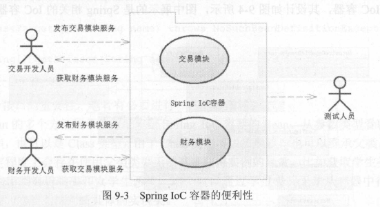
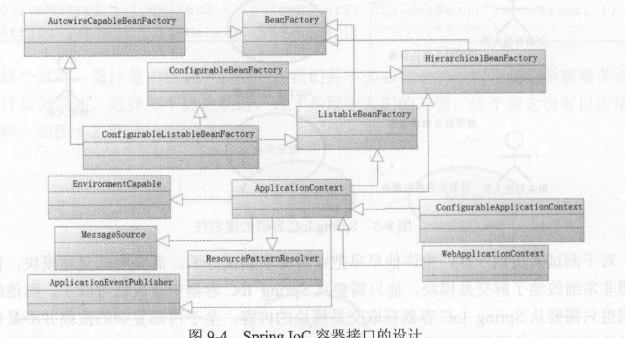
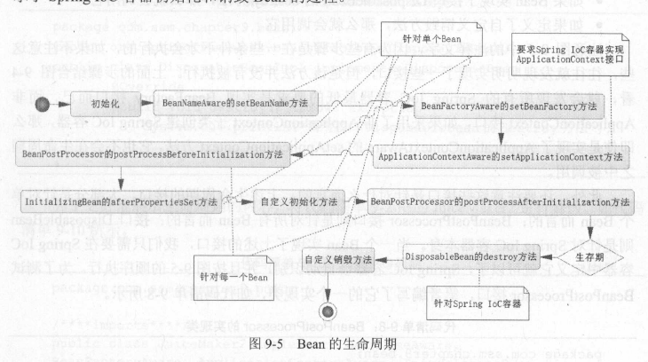

## 第九章 SpringIOC的概念

### 9.1 Spring的概括

- `Spring`简介
  - 它的成功来自于理念，而不是技术，它最为核心的理念是`IoC`(控制反转)和`AOP`(面向切面编程)
  - 其中`IoC`是Spring的基础，而`AOP`则是其重要的功能，最为典型的当属数据库事务的使用
  - 在`Spring`中，它会认为一切`Java`类都是资源，而资源都是`Bean`，容纳这些`Bean`的是`Spring`所提供的`IoC`容器，所以`Spring`是一种基于`Bean`的编程

- `Spring`的理念
  - 基于接口的编程是一种理念，强调`OOD`的设计理念，比技术实现更为重要
  - `Java`开发的一大通病是大量使用`try...catch...finally...`，`Spring`尝试改善它们
  - 在当时的`Java`技术中，很多框架都是侵略性的，也就是必须使用当前框架所提供的类库，才能实现功能，这样会造成应用对框架的依赖
  - `Spring`技术不是为了取代现有的技术，而是提供更好的整合模板使它们能够整合到`Spring`技术上来

- `Spring`的策略
  - 对于`POJO`的潜力开发，提供轻量级和低侵入的编程，可以通过配置（ `XML` 、注解等）来扩展`POJO`的功能，通过依赖注入的理念去扩展功能，建议通过接口编程，强调`OOD` 的开发模式理念，降低系统稿合度，提高系统可读性和可扩展性。
  - 提供切面编程，尤其是把企业的核心应用一一数据库应用，通过切面消除了以前复杂的`try... catch ... finally ...`代码结构，使得开发人员能够把精力更加集中于业务开发而不是技术本身
  - 为了整合各个框架和技术的应用，`Spring`提供了模板类，通过模板可以整合各个框架和技术，比如支持`Hibernate` 开发的`Hibernate Template`、支持`MyBatis`开发的`SqlSessionTemplate`、支持`Redis`开发的`RedisTemplate` 等，这样就把各种企业用到的技术框架整合到`Spring`中，提供了统一的模板，从而使得各种技术用起来更简单。

  ### 2 SpringIoC 阐述

- 控制反转:控制反转是一种通过描述(在`Java`中可以是`XML`或者`注解`)并通过第三方去产生或获取特定对象的方式

- IoC 容器
  - 在`Spring`中实现控制反转的是`IoC`容器，其实现的方式是依赖注入(Dependency Injection, DI)
  - `Spring`会提供`IoC`容器来管理对应的资源，正如上面例子中的饮品店和订单资源，由它们产生依赖注入的关系

- 示例
    

- 对于交易开发人员:
  - 当熟悉财务的同事完成对财务接口模块的开发，就可以将其服务发布到`Spring IoC`的容器里，
  - 这个时候你只需要过程描述得到对应的财务接口，就可以完成对应的财务操作了，
  - 而财务模块是如何工作的，它又需要依赖哪些对象，都是由熟悉财务模块的同事完成的，这些并不需要你去理解，你只需要知道它能完成对应的财务操作即可

- 对于测试人员
  - 对于测试人员也一样，也许他早早把财务模块测试好了，需要测试交易模块
  - 他并不希望非常细致地了解交易模块，他只需要从`Spring IoC`容器中获取就可以了。而他的测试代码也只需要从`Spring IoC`容器获取交易模块的内容,至于内部复杂的依赖并不是他所需要关注的内容
  - 这样就有利于测试人员对模块的测试，降低测试人员测试的复杂度

- 总结: 降低开发难度，对模块解耦，同时更利于测试

### 9.3 Spring IoC 容器

- Spring IoC容器的作用是容纳我们所开发的各种Bean，并且我们可以从中获取各种发布在Spring IoC容器里的Bean，并且通过描述可以得到它

#### 9.3.1 Spring IoC 容器的设计

- Spring IoC 接口设计
    - Spring IoC 容器的设计主要基于`BeanFactory`和`ApplicationContext`两个接口
    - `BeanFactory`是Spring IoC容器所定义的最底层的接口
    - `ApplicationContext`是高级接口之一，并且对`BeanFactory`的功能做了许多有用的扩展
    - Spring IoC 容器接口类图
        

- `BeanFactory`接口解读
    - `getBean`的多个方法用来获取配置给Spring IoC容器的`Bean`
    - `isSingleton`用来判断是否单例，如果判断为真，其意思是该`Bean`在容器中是作为唯一单例存在的
    - `isPrototype`如果判断为真，意思是当你从容器中获取`Bean`，容器就为你生成一个新的实例
    - `type`是一个按照`java`类型匹配的方法
    - `getAliases`方法是获取别名的方法

#### 9.3.2 Spring IoC容器的初始化和依赖注入

- `Bean`的定义步骤
    1. `Resource`定位
    2. `BeanDefinition`的载入
    3. `BeanDefinition`的注册

- 依赖注入: 
    - 依赖注入的观念就是将所有东西先在"外面"准备好，然后再带入“内部”的程式中，如此一来你就能够在检视程式码的时候，一目了然地知道这个程式依赖著哪些类别。
    - 通过控制反转，对象在被创建的时候，由一个调控系统内所有对象的外界实体，将其所依赖的对象的引用传递给它。也可以说，依赖被注入到对象中。
    - 技术描述:`Class A`中用到了`Class B`的对象`b`，一般情况下，需要在`A`的代码中显式的`new`一个`B`的对象。采用依赖注入技术之后，`A`的代码只需要定义一个私有的`B`对象，不需要直接`new`来获得这个对象，而是通过相关的容器控制程序来将`B`对象在外部`new`出来并注入到`A`类里的引用中。而具体获取的方法、对象被获取时的状态由配置文件（如XML）来指定。

#### 9.3.3 Spring Bean 的生命周期

- `Bean`在容器中存在其生命周期，它的初始化和销毁也需要一个过程，在一些需要自定义的过程中，我们可以插入代码来改变它们的一些行为

- `Bean`的生命周期
    