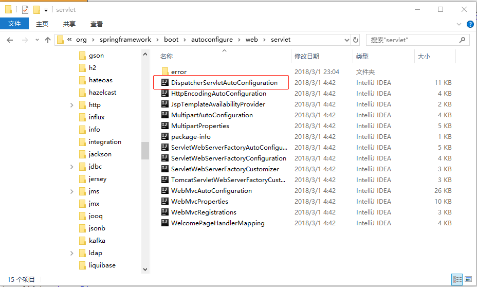

## 第 2 章 SpringBoot开发环境搭建和基本开发

### 2.1 搭建SpringBoot开发环境

[点此链接](https://blog.csdn.net/lom9357bye/article/details/69677120)

### 2.2 SpringBoot的依赖和自动配置

下面需要讨论为什么`SpringBoot`项目可以在很少配置下运行

首先我们查看`spring-boot-starter-web`的`pom.xml`文件
````xml
<?xml version="1.0" encoding="UTF-8"?>
<project xsi:schemaLocation="http://maven.apache.org/POM/4.0.0 http://maven.apache.org/xsd/maven-4.0.0.xsd" xmlns="http://maven.apache.org/POM/4.0.0"
    xmlns:xsi="http://www.w3.org/2001/XMLSchema-instance">
  <modelVersion>4.0.0</modelVersion>
  <parent>
    <groupId>org.springframework.boot</groupId>
    <artifactId>spring-boot-starters</artifactId>
    <version>2.2.4.RELEASE</version>
  </parent>
  <groupId>org.springframework.boot</groupId>
  <artifactId>spring-boot-starter-web</artifactId>
  <version>2.2.4.RELEASE</version>
  <name>Spring Boot Web Starter</name>
  <description>Starter for building web, including RESTful, applications using Spring
		MVC. Uses Tomcat as the default embedded container</description>
  <url>https://projects.spring.io/spring-boot/#/spring-boot-parent/spring-boot-starters/spring-boot-starter-web</url>
  <organization>
    <name>Pivotal Software, Inc.</name>
    <url>https://spring.io</url>
  </organization>
  <licenses>
    <license>
      <name>Apache License, Version 2.0</name>
      <url>https://www.apache.org/licenses/LICENSE-2.0</url>
    </license>
  </licenses>
  <developers>
    <developer>
      <name>Pivotal</name>
      <email>info@pivotal.io</email>
      <organization>Pivotal Software, Inc.</organization>
      <organizationUrl>https://www.spring.io</organizationUrl>
    </developer>
  </developers>
  <scm>
    <connection>scm:git:git://github.com/spring-projects/spring-boot.git</connection>
    <developerConnection>scm:git:ssh://git@github.com/spring-projects/spring-boot.git</developerConnection>
    <url>https://github.com/spring-projects/spring-boot</url>
  </scm>
  <issueManagement>
    <system>Github</system>
    <url>https://github.com/spring-projects/spring-boot/issues</url>
  </issueManagement>
  <dependencies>
    <!--SpringBoot的依赖-->
    <dependency>
      <groupId>org.springframework.boot</groupId>
      <artifactId>spring-boot-starter</artifactId>
      <version>2.2.4.RELEASE</version>
      <scope>compile</scope>
    </dependency>
    <!--JSON的依赖-->
    <dependency>
      <groupId>org.springframework.boot</groupId>
      <artifactId>spring-boot-starter-json</artifactId>
      <version>2.2.4.RELEASE</version>
      <scope>compile</scope>
    </dependency>
    <!--Tomcat的依赖-->
    <dependency>
      <groupId>org.springframework.boot</groupId>
      <artifactId>spring-boot-starter-tomcat</artifactId>
      <version>2.2.4.RELEASE</version>
      <scope>compile</scope>
    </dependency>
    <!--Hibernate Validator的依赖-->
    <dependency>
      <groupId>org.springframework.boot</groupId>
      <artifactId>spring-boot-starter-validation</artifactId>
      <version>2.2.4.RELEASE</version>
      <scope>compile</scope>
      <exclusions>
        <exclusion>
          <artifactId>tomcat-embed-el</artifactId>
          <groupId>org.apache.tomcat.embed</groupId>
        </exclusion>
      </exclusions>
    </dependency>
    <!--Spring Web的依赖-->
    <dependency>
      <groupId>org.springframework</groupId>
      <artifactId>spring-web</artifactId>
      <version>5.2.3.RELEASE</version>
      <scope>compile</scope>
    </dependency>
    <!--Spring Web MVC的依赖-->
    <dependency>
      <groupId>org.springframework</groupId>
      <artifactId>spring-webmvc</artifactId>
      <version>5.2.3.RELEASE</version>
      <scope>compile</scope>
    </dependency>
  </dependencies>
</project>
````
- 从这里可以看出，当加入`spring-boot-starter-web`后，它会通过`Maven`将对应的资源加载到我们的工程中，这样就可以形成依赖
- 于此同时在`spring-boot-autoconfigure`包中，`SpringBoot`帮我们做了很多自动的配置，由下图所示
  
- 上面两条就是为什么在没有任何配置下`Springboot`可以启动`SpringMVC`项目

### 2.3 使用自定义配置

有的时候，我们需要对`Springboot`提供的默认配置进行修改来适应个性化的要求，再写可以通过`application.properties`来实现。

比如我们可以这样定义这个文件
````
server.port=8090
spring.mvc.view.prefix=/WEB-INF/jsp/
spring.mvc.view.suffix=.jsp

spring.datasource.url=jdbc:mysql://127.0.0.1:3306/cosmetic_store?useUnicode=true&characterEncoding=UTF-8&serverTimezone=Asia/Shanghai&useSSL=false
spring.datasource.username=root
spring.datasource.password=123456
spring.datasource.driver-class-name=com.mysql.cj.jdbc.Driver
````
- 这个文件主要用于我们进行自定义配置
- 这个配置文件，定义了服务器的端口，`springmvc`的视图解析器，以及数据库连接等相关内容

### 2.4 开发自己的SpringBoot项目

具体可见此项目[hellospringboot](https://github.com/T0UGH/hellospringboot)
