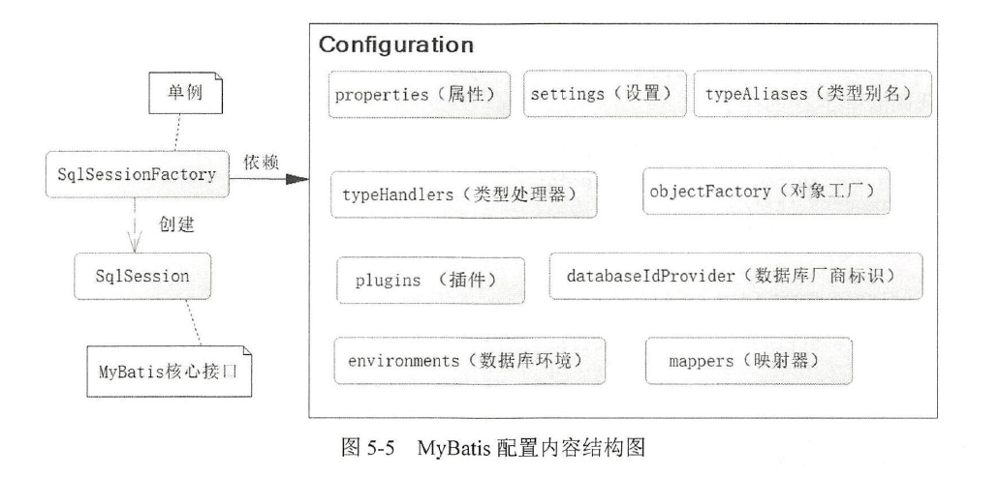

## 第 5 章 SpringBoot与数据库编程

对于数据库开发，一直以来都是Java 开发的核心内容之一。在`Java`的发展历史中，数据库持久层的主流技术随着时代的变化也发生了变化。

在`Java`中访问数据库是`SUN`公司提出的`JDBC`规范，但是因为它需要的冗余代码比较多，加上流程和资源比较难以控制，如烦琐的`try...catch...finally...`语句，使得当时的`Java EE`的开发受到了很大的质疑， 所以使用`JDBC`开发的模式很快就走到了尽头。`SUN`公司早年推出的`EJB`，虽然能够支持持久化，但是因为配置极为烦琐，所以很快就被新兴的`Hibernate`框架取代。再后来`Sun`公司为了简化持久层，吸收了很多`Hibernate`的成果，制定了`JPA`规范，并且`JPA`规范在`EJB 3.0`得以支持。但`EJB 3.0`并没有能兴旺起来，而`Hibernate 3.2`则对`JPA`实现了完全支持。`EJB`同样是一个失败的产品，被埋没在历史的长河之中。

对于全映射框架`Hibernate`，在以管理系统为主的时代，它的模型化十分有利于公司业务的分析和理解，但是在近年兴起的移动互联网时代，这样的模式却走到了尽头。`Hibernate`的模式重模型和业务分析，移动互联网虽然业务相对简单，但却更关注大数据和大并发下的性能问题。全表映射规则下的`Hibernate`巳无法满足`SQL`优化和互联网灵活多变的业务，于是`Hibernate`近年来受到新兴的持久框架`MyBatis`的严重冲击，现今`MyBatis` 己经成为移动互联网时代的主流持久层框架，在移动互联网和一些新兴项目中`MyBatis`的占有率不断提升， `Hibernate`则是不断萎缩。`MyBatis`是一个不屏蔽`SQL`且提供动态`SQL`、接口式编程和简易`SQL`绑定`POJO`的半自动化框架，它的使用十分简单，而且能非常容易定制`SQL`，以提高网站性能，因此在移动互联网兴起的时代，它占据了强势的地位。

`Spring`支持`JdbcTemplate`的数据库访问模式，但这个用法一直未被很多企业采用。不过正如`Spring`所倡导的理念，它并不排斥其他优秀的框架，而是通过提供各种各样的模板，使得这些框架能够整合到`Spring`中来，并且更加方便开发者的使用。

### 5.1 配置数据源

不过一切开始之前，都要先完成数据源的配置。在`SpringBoot`中，己经自动默认数据源的配置，下面我们来了解这方面的细节。

#### 5.1.1 启动默认数据源

在依赖于`SpringBoot`的`spring-boot-starter-data-jpa`后，它就会默认为你配置数据源，这些默认
的数据源主要是内存数据库，如`h2`、`hqldb`和`Derby`等内存数据

````xml
<dependency>
    <groupId>org.springframework.boot</groupId>
    <artifactId>spring-boot-starter-data-jpa</artifactId>
</dependency>
<dependency>
    <groupId>com.h2database</groupId>
    <artifactId>h2</artifactId>
    <scope>runtime</scope>
</dependency>
````
- 这样我们就可以在不使用任何配置数据库的情况下运行`SpringBoot`工程了，因为`h2`是内嵌式数据库，当然我们也可以将数据源配置为`hqldb`或者`Derby`，它会随着`SpringBoot`项目的启动而启动，并不需要任何的配置，但这显然不是我们期待的。因为这样的内存数据库在应用上并不广泛


#### 5.1.2 配置自定义数据源

下面以`MySQL`为例配置自定义数据源。

首先添加`Mysql`的依赖和`JDBC`的依赖
````xml
<dependency>
    <groupId>mysql</groupId>
    <artifactId>mysql-connector-java</artifactId>
</dependency>
<dependency>
    <groupId>org.springframework.boot</groupId>
    <artifactId>spring-boot-starter-jdbc</artifactId>
</dependency>
<dependency>
    <groupId>org.apache.commons</groupId>
    <artifactId>commons.dbcp2</artifactId>
</dependency>
````

然后配置`application.properties`文件以配置数据源
````
spring.datasource.url=jdbc:mysql://127.0.0.1:3306/cosmetic_store?useUnicode=true&characterEncoding=UTF-8&serverTimezone=Asia/Shanghai&useSSL=false
spring.datasource.username=root
spring.datasource.password=123456
#spring.datasource.driver-class-name=com.mysql.cj.jdbc.Driver
````
- 这里注释掉了驱动器的配置，但它仍可以连接数据源，`SpringBoot`会尽可能地去判断数据源是什么类型，然后根据其默认地情况匹配驱动类

接下来我们配置`application.properties`文件以配置DBCP连接池
````
#指定连接池的类型
spring.datasource.type=org.apache.commons.dbcp2.BasicDataSource
#最大等待连接中的数量，设 0 为没有限制
spring.datasource.dbcp2.max-idle=10
#最大连接活动数
spring.datasource.dbcp2.max-total=50
#最大等待毫秒数，单位为ms，超过时间会出错误信息
spring.datasource.dbcp2.max-wait-millis=10000
#数据库连接池初始化连接数
spring.datasource.dbcp2.initial-size=5
````

### 5.2 使用JdbcTemplate操作数据库

在配置数据源后，`SpringBoot`通过其自动配置机制配置好了`JdbcTemplate`, `JdbcTemplate`模板是`Spring`框架提供的。准确来说，`JdbcTemplate`这种方式也不算成功，

下面先创建一个Service接口和它对应的实现类
````java
package com.springboot.chapter5.service;

import java.util.List;

import com.springboot.chapter5.pojo.User;

public interface JdbcTmplUserService {
	
	public User getUser(Long id);

	public List<User> findUsers(String userName, String note);

	public int insertUser(User user);

	public int updateUser(User user);

	public int deleteUser(Long id);
	
	public User getUser2(Long id);
	
	public User getUser3(Long id);
}
````
````java
package com.springboot.chapter5.service.impl;

import java.sql.Connection;
import java.sql.PreparedStatement;
import java.sql.ResultSet;
import java.sql.Statement;
import java.util.List;

import org.springframework.beans.factory.annotation.Autowired;
import org.springframework.jdbc.core.JdbcTemplate;
import org.springframework.jdbc.core.RowMapper;
import org.springframework.stereotype.Service;

import com.springboot.chapter5.enumeration.SexEnum;
import com.springboot.chapter5.pojo.User;
import com.springboot.chapter5.service.JdbcTmplUserService;

/**** imports ****/
@Service
public class JdbcTmplUserServiceImpl implements JdbcTmplUserService {

	@Autowired
	private JdbcTemplate jdbcTemplate = null;

	// 获取映射关系
	private RowMapper<User> getUserMapper() {
		// 使用Lambda表达式创建用户映射关系
		RowMapper<User> userRowMapper = (ResultSet rs, int rownum) -> {
			User user = new User();
			user.setId(rs.getLong("id"));
			user.setUserName(rs.getString("user_name"));
			int sexId = rs.getInt("sex");
			SexEnum sex = SexEnum.getEnumById(sexId);
			user.setSex(sex);
			user.setNote(rs.getString("note"));
			return user;
		};
		return userRowMapper;
	}

	// 获取对象
	@Override
	public User getUser(Long id) {
		// 执行的SQL
		String sql = " select id, user_name, sex, note from t_user where id = ?";
		// 参数
		Object[] params = new Object[] { id };
		User user = jdbcTemplate.queryForObject(sql, params, getUserMapper());
		return user;
	}

	// 查询用户列表
	@Override
	public List<User> findUsers(String userName, String note) {
		// 执行的SQL
		String sql = " select id, user_name, sex, note from t_user " + "where user_name like concat('%', ?, '%') "
				+ "and note like concat('%', ?, '%')";
		// 参数
		Object[] params = new Object[] { userName, note };
		// 使用匿名类实现
		List<User> userList = jdbcTemplate.query(sql, params, getUserMapper());
		return userList;
	}

	// 插入数据库
	@Override
	public int insertUser(User user) {
		String sql = " insert into t_user (user_name, sex, note) values( ? , ?, ?)";
		return jdbcTemplate.update(sql, user.getUserName(), user.getSex().getId(), user.getNote());
	}

	// 更新数据库
	@Override
	public int updateUser(User user) {
		// 执行的SQL
		String sql = " update t_user set user_name = ?, sex = ?, note = ?  " + " where id = ?";
		return jdbcTemplate.update(sql, user.getUserName(), user.getSex().getId(), user.getNote(), user.getId());
	}

	// 删除数据
	@Override
	public int deleteUser(Long id) {
		// 执行的SQL
		String sql = " delete from t_user where id = ?";
		return jdbcTemplate.update(sql, id);
	}
	
	public User getUser2(Long id) {
	    // 通过Lambda表达式使用StatementCallback
	    User result = this.jdbcTemplate.execute((Statement stmt) -> {
	        String sql1 = "select count(*) total from t_user where id= " + id;
	        ResultSet rs1 = stmt.executeQuery(sql1);
	        while (rs1.next()) {
	            int total = rs1.getInt("total");
	            System.out.println(total);
	        }
	        // 执行的SQL
	        String sql2 = " select id, user_name, sex, note from t_user"
	                + " where id = " + id;
	        ResultSet rs2 = stmt.executeQuery(sql2);
	        User user = null;
	        while (rs2.next()) {
	            int rowNum = rs2.getRow();
	            user= getUserMapper().mapRow(rs2, rowNum);
	        }
	        return user;
	    });
	    return result;
	}

	public User getUser3(Long id) {
	    // 通过Lambda表达式使用ConnectionCallback接口
	    return this.jdbcTemplate.execute((Connection conn) -> {
	        String sql1 = " select count(*) as total from t_user"
	                + " where id = ?";
	        PreparedStatement ps1 = conn.prepareStatement(sql1);
	        ps1.setLong(1, id);
	        ResultSet rs1 = ps1.executeQuery();
	        while (rs1.next()) {
	            System.out.println(rs1.getInt("total"));
	        }
	        String sql2 = " select id, user_name, sex, note from t_user "
	                + "where id = ?";
	        PreparedStatement ps2 = conn.prepareStatement(sql2);
	        ps2.setLong(1, id);
	        ResultSet rs2 = ps2.executeQuery();
	        User user = null;
	        while (rs2.next()) {
	            int rowNum = rs2.getRow();
	            user= getUserMapper().mapRow(rs2, rowNum);
	        }
	        return user;
	    });
	}
}
````
- 对`JdbcTemplate`的映射关系需要开发者自己实现`RowMapper`接口，以完成数据库数据到`POJO`对象的映射
- 而且`JdbcTemplate`没调用一次就会产生一次数据库连接
- 也可以通过使用`StatementCallback`或`ConnectionCallback`接口来实现在一个连接中执行多条`SQL`

### 5.3 使用JPA(Hibernate)操作数据

#### 5.3.1 概述

`JPA`所维护的核心是实体(`EntityBean`)，而它是通过一个持久化上下文(Persistence Context)来使用的，持久化上下文包括以下3个部分
- 对象关系映射(Object Relational Mapping, ORM)描述，也就是在数据库表和`POJO`间建立关系
- 实体操作`API`，可以实现对实体对象的`CRUD`操作，来完成对象的持久化和查询
- 查询语言`JPQL`(Java Persistence Query Language)来实现更灵活的查询

#### 5.3.2 开发JPA

此处略

### 5.4 整合MyBatis框架

目前`Java`持久层最为主流的技术己经是`MyBatis`，它比`JPA`和`Hibernate`更为简单易用，也更加灵活。移动互联网的时代面对的问题主要是大数据、高并发和性能问题。这正是`MyBatis`相较于`Hibernate`的优势

#### 5.4.1 MyBatis简介

`MyBatis`是基于一种`SQL`到`POJO`的模型，它需要我们提供`SQL`、映射关系和POJO 。但是对于`SQL`和`POJO`的映射关系，它提供了自动映射和驼峰映射等，使开发者的开发工作大大减少

由于没有屏蔽SQL，这对于追求高响应和性能的互联网系统是十分重要的， 因此我们可以尽可能地通过`SQL`去优化性能，也可以做少量的改变以适应灵活多变的互联网应用。

与此同时，它还能支持动态`SQL`以适应需求的变化。

#### 5.4.2 SpringBoot整合MyBatis

`MyBatis`是一个基于`SqlSessionFactory`构建的框架。对于`SqlSessionFactory`而言，它的作用是生
成`SqlSession`接口对象，这个接口对象是`MyBatis`操作的核心，而在`MyBatis-Spring`的结合中甚至可
以"擦除"这个对象，使其在代码中"消失"，这样做的意义是重大的，因为`SqlSession`是一个功能性的代码，"擦除"它之后，就剩下了业务代码，这样就可以使得代码更具可读性。

`MyBatis`的架构图如下所示


首先我们先定义一个`Mapper`接口来完成对数据库中`Product`表的`CRUD`
````java
package com.edu.neu.hellospringboot.dao;

import com.edu.neu.hellospringboot.pojo.Product;
import org.apache.ibatis.annotations.Mapper;
import org.apache.ibatis.annotations.Select;

@Mapper
public interface ProductDao {

    @Select("select * from product where product_id = #{productId}")
    Product getProduct(int productId);
}
````

但是在上面我们可以看到`Mapper`是一个接口，是不可以使用`new`为其生成对象实例的。为了方便我们使用， `MyBatis`社区在与`Spring`整合的包中提供了两个类和一个注解，它们是`MapperFactoryBean`和`MapperScannerConfigurerMyBatis`和注解`@MapperScan`。它们能够将`MyBatis`所需的对应接口扫描装配到`SpringIoC`容器中。

这里我们以`@MapperScan`接口为例，它是这三种中最常用的。我们在`SpringBoot`的启动类上加入如下注解
````java
package com.edu.neu.hellospringboot;

import org.apache.ibatis.annotations.Mapper;
import org.mybatis.spring.annotation.MapperScan;
import org.springframework.boot.SpringApplication;
import org.springframework.boot.autoconfigure.SpringBootApplication;

@SpringBootApplication
@MapperScan(basePackages = "com.edu.neu.hellospringboot.dao", annotationClass = Mapper.class)
public class HellospringbootApplication {

    public static void main(String[] args) {
        SpringApplication.run(HellospringbootApplication.class, args);
    }

}
````
- `basePackage`定义了要扫描的包
- `annotationClass`进行了注解限定，只有要扫描的包中被这个注解标注的接口才会被装载进容器。可以看到我们上面的代码使用了注解`@Mapper`来修饰`ProductDao`，所以这里把`annotationClass`设置为`Mapper`
- 事实上我们亦可以使用`@Repository`这个注解

#### 5.4.3 MyBatis的其他配置

````
#假如我们使用xml来定义mapper可以用它来定义xml的地址
mybatis.mapper-locations=classpath:com/springboot/chapter5/mapper/*.xml
#定义类型转换器
mybatis.type-handlers-package=com.springboot.chapter5.typehandler
#MyBatis配置文件，当你的配置比较复杂的时候，可以使用去指定MyBatis本身的配置文件
mybatis.config-location=xxx
#配置MyBaits 插件
mybatis.configuration.interceptors=xxx
#级联延迟加载属性配置
mybatis.configuration.aggressive-lazyloading=xxx
#属性映射中开启驼峰命名
mybatis.configuration.map-underscore-to-camel-case=true
````

