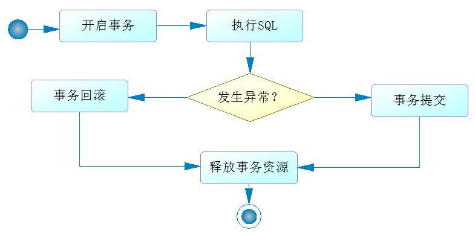
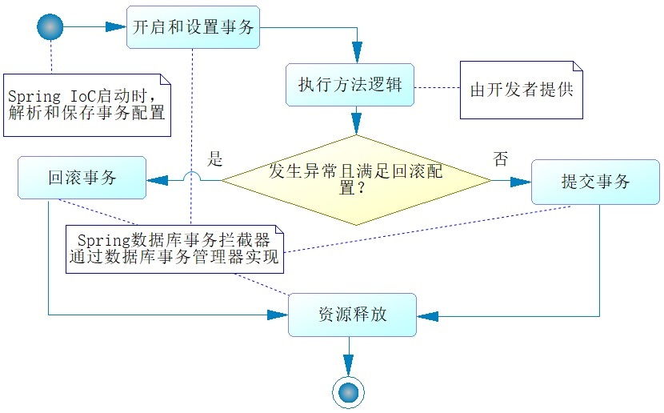
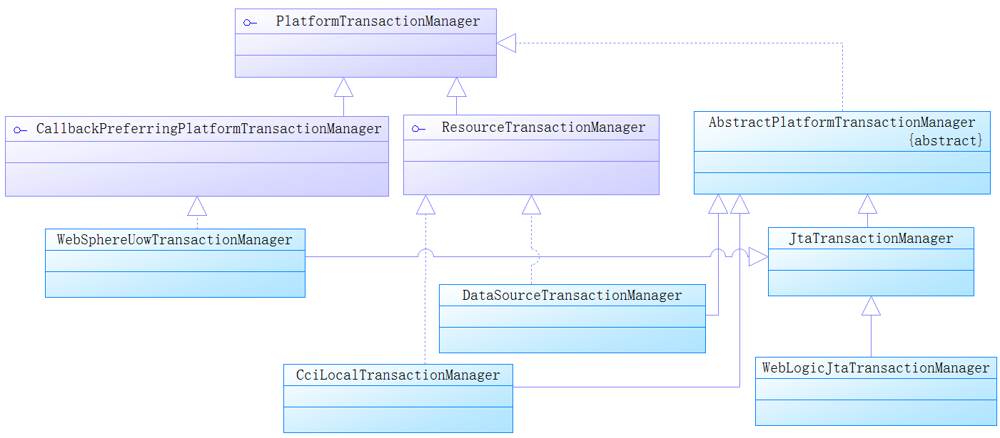
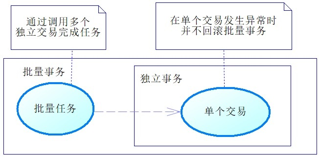

## 第 6 章 SpringBoot整合数据库事务

在互联网数据库的使用中，对于那些电商和金融网站，最关注的内容毫无疑问就是数据库事务。它们的业务存在高并发，数据库的数据一般在一个多事务的场景下运行，如果不采取一定手段就会造成数据的不一致。面对这样的高井发场景，掌握数据库事务机制是至关重要的，它能够帮助我们在一定程度上保证数据的一致性，并且有效提高系
统性能，避免系统产生宕机。

在`Spring`中，数据库事务是通过`AOP`技术来提供服务的。它擦除了`JDBC`中的大量冗余代码。

在`Spring`数据库事务中可以使用编程式事务，也可以使用声明式事务(`@Transactional`)。大部分的情况下，会使用更加简单的声明式事务。

### 6.1 JDBC的数据库事务

首先看看如何以`JDBC`的方式完成插入用户的功能
````java
@Service
public class JdbcServiceimpl implements JdbcService{
    @Autowired
    private DataSource dataSource = null;
    @Override
    public int insertUser(String userName , String note){
        Connection conn = null;
        int result = 0;
        try{
            //获取连接
            conn = dataSource.getConnection();
            //开启事务
            conn.setAutoCornrnit(false);
            //设置隔离级别
            conn.setTransactionIsolation(TransactionIsolationLevel.READ_COMMITTED.getLevel());
            //执行SQL
            PreparedStatement ps = conn.prepareStatement("insert into t_user(user name, note) values(?, ?)");
            ps.setString(1, userName);
            ps.setString(2, note);
            result=ps.executeUpdate();
            //提交事务
            conn.commit();
        }catch (Exception e){
            //回滚事务
            if(conn != null){
                try{
                    conn.rollback();
                }catch(SQLException el){
                    el.printStackTrace();
                    e.printStackTrace();
                }finally{
                    //关闭数据库连接
                    try{
                        if(conn !=null && !conn.isClosed()){
                            conn.close() ;
                        }
                    }catch (SQLException e){
                        e.printStackTrace ();
                    }
                } 
            }
        }
        return result;
    }
}
````

我们看到了数据库连接的获取和关闭以及事务的提交和回滚、大量的`try...catch ...finally...`语句。于是人们就开始不断地优化，使用`Hibernate`、`MyBatis`都可以减少这些代码，但是依旧不能完全去除开闭数据库连接和事务控制的代码，而`AOP`允许我们把那些公共的代码抽取出来，单独实现，如下面流程图所示


这个流程与我们`AOP`约定流程十分接近，而在图中，有业务逻辑的部分也只是执行`SQL`那一步骤，其他的步骤都是比较固定的，按照`AOP`的设计思想，就可以把除执行`SQL`这步之外的步骤抽取出来单独实现，这便是`Spring`数据库事务编程的思想。

### 6.2 Spring声明式事务的使用

#### 6.2.1 Spring声明式数据库事务约定

对于声明式事务，需要通过`@Transactional`进行标注的，告诉`Spring`在什么地方启用数据库事务功能。这个注解可以标注在类或者方法上，当它标注在类上时，代表这个类所有公共(`public`)非静态的方法都将启用事务功能。

在`@Transactional`中，还允许配置许多的属性，如事务的隔离级别、异常类型和传播行为等。这些配置内容，是`Spring IoC`容器在加载时就会将这些配置信息解析出来，然后它把这些信息存到`TransactionDefinition`里，并且记录哪些类或者方法需要启动事务功能，采取什么策略去执行事务等。

`Spring`数据库事务约定如下


当`Spring`的上下文开始调用被`@Transactional`标注的类或者方法时，`Spring`就会产生`AOP`的功能。那么当它启动事务时，就会根据事务定义器内的配置去设置事务，首先是根据传播行为去确定事务的策略然后是隔离级别、超时时间、只读等内容的设置，设置事务并不需要开发者完成，而是Spring事务拦截器(`Interpretor`)根据`@Transactional`配置的内容来完成的。`Spring`就会开始调用开发者编写的业务代码。执行开发者的业务代码。如果都没有发生异常，`Spring`拦截器就会帮助我们提交事务，如果发生异常，就要判断一次事务定义器内的配置，如果事务定义器己经约定了该类型的异常不回滚事务就提交事务，如果没有任何配置，则会回滚事务，并且将异常抛出。无论发生异常与否，`Spring`都会释放事务资源，以保证数据库连接池正常可用。

一个使用`@Transaction`的例子。仅仅是使用一个`@Transactional`注解，标识`insertUser`方法需要启动事务机制，那么`Spring`就会按照上图那样，把`insertUser`方法织入约定的流程中，这样对于数据库连接的闭合、事务提交与回滚都不再需要我们编写任何代码了
````java
/**** imports ****/
@Service
public class UserServiceImpl implements UserService {

	@Autowired
	private UserDao userDao = null;

	@Transactional
	public int insertUser(User user) {
		return userDao.insertUser(user);
	}
}
````

#### 6.2.2 @Transcational的配置项

下面我们之前通过源码，查看`@Transcational`标签的配置项

````java
package org.springframework.transaction.annotation;

import java.lang.annotation.Documented;
import java.lang.annotation.ElementType;
import java.lang.annotation.Inherited;
import java.lang.annotation.Retention;
import java.lang.annotation.RetentionPolicy;
import java.lang.annotation.Target;
import org.springframework.core.annotation.AliasFor;

@Target({ElementType.TYPE, ElementType.METHOD})
@Retention(RetentionPolicy.RUNTIME)
@Inherited
@Documented
public @interface Transactional {
    //通过bean name指定事务管理器
    @AliasFor("transactionManager")
    String value() default "";

    //同上
    @AliasFor("value")
    String transactionManager() default "";

    //指定传播行为
    Propagation propagation() default Propagation.REQUIRED;

    //指定隔离级别
    Isolation isolation() default Isolation.DEFAULT;

    //指定超时时间
    int timeout() default -1;

    //是否只读事务
    boolean readOnly() default false;

    //规定发生哪些异常时回滚
    Class<? extends Throwable>[] rollbackFor() default {};

    //规定发生哪些异常时回滚
    String[] rollbackForClassName() default {};

    //规定发生哪些异常时不回滚
    Class<? extends Throwable>[] noRollbackFor() default {};

    //规定发生哪些异常时不回滚
    String[] noRollbackForClassName() default {};
}
````

#### 6.2.3 Spring事务管理器

在`Spring`事务流程中，事务的打开、回滚和提交是由事务管理器来完成的。事务管理器相关类图如下，其顶层接口为`PlatformTransactionManager`，最常用到的事务管理器是`DataSourceTransactionManager`。类图如下



````java
package org.springframework.transaction;

import org.springframework.lang.Nullable;

public interface PlatformTransactionManager extends TransactionManager{
    //获取事务
    TransactionStatus getTransaction(@Nullable TransactionDefinition var1) throws TransactionException;
    //提交事务
    void commit(TransactionStatus var1) throws TransactionException;
    //回滚事务
    void rollback(TransactionStatus var1) throws TransactionException;
}
````

`Spring`在事务管理时，就是将这些方法按照约定织入对应的流程中的，在`SpringBoot`中，当你依赖于`mybatis-spring-boot-starter`之后，它会自动创建一个`DataSourceTransactionManager`对象作为事务管理器。如果依赖于`spring-boot-starter-data-jpa`，则它会自动创建`JpaTransactionManager`对象作为事务管理器，所以我们一般不需要自己创建事务管理器而直接使用它们即可。

### 6.3 隔离级别

#### 6.3.1 丢失更新

在多个事务同时操作数据的情况下，会引发丢失更新的场景。

第一类丢失更新是指一个事务回滚另外一个事务提交而引发的数据不一致的情况。例子如下表所示，`T5`时刻事务l回滚，导致原本库存为`99`的变为了`100`，显然事务2的结果就丢失了，这就是一个错误的值。然而目前大部分数据库已经克服了第一类丢失更新的问题。

|时刻|事务1|事务2|
|--|--|--|
|T1|初始库存100|初始库存100|
|T2|扣减库存，余99||
|T3||扣减库存，余99|
|T4||提交事务，库存变为99|
|T5|回滚事务，库存100||

第二类丢失更新是指多个事务都提交引发的丢失更新，这是我们互联网系统需要关注的重点内容。例子如下表所示，`T5`时刻提交的事务。因为在事务l中，无法感知事务2的操作，这样它就不知道事务2己经修改过了数据，因此它依旧认为只是发生了一笔业务，所以库存变为了99 ，而这个结果又是一个错误的结果。

|时刻|事务1|事务2|
|--|--|--|
|T1|初始库存100|初始库存100|
|T2|扣减库存，余99||
|T3||扣减库存，余99|
|T4||提交事务，库存变为99|
|T5|提交事务，库存变为99||

#### 6.3.2 详解隔离级别

为了压制丢失更新，数据库标准提出了4类隔离级别，在不同的程度上压制丢失更新，这4类隔离级别是未提交读、读写提交、可重复读和串行化

##### 6.3.2.1 未提交读

未提交读(`read uncommitted`)是最低的隔离级别，其含义是允许一个事务读取另外一个事务没有提交的数据。
它的最大坏处是出现脏读。让我们看看可能发生的脏读场景，如下表所示。

|时刻|事务1|事务2|备注|
|--|--|--|--|
|T1|||商品库存初始化为2|
|T2|读取库存为2|||
|T3||扣减库存|库存为1|
|T4||读取库存为1|因为开启了未提交读，可以读取事务1中的库存为1|
|T5||扣减库存|事务2库存为0|
|T6||提交事务|数据库更新为0|
|T7|回滚事务||由于第一类丢失更新已经克服，此时不会回滚为2，库存为0，结束|

因为采用未提交读，所以事务2可以读取事务l未提交的库存数据为1,这里当它扣减库存后则数据为0，然后它提交了事务，库存就变为了0，而事务l在T7时刻回滚事务，因为第一类丢失更新已经被克服，所以它不会将库存回滚到2，那么最后的结果就变为了0，这样就出现了错误。

##### 6.3.2.2 读写提交

读写提交(`read committed`)隔离级别，是指一个事务只能读取另外一个事务已经提交的数据，不能读取未提交的数据。它可以克服脏读，如下表所示

|时刻|事务1|事务2|备注|
|--|--|--|--|
|T1|||商品库存初始化为2|
|T2|读取库存为2|||
|T3||扣减库存|库存为1|
|T4||读取库存为2|因为开启了读写提交，读取数据库中的库存为2|
|T5||扣减库存|事务2库存为1|
|T6||提交事务|数据库更新为1|
|T7|回滚事务||由于第一类丢失更新已经克服，此时不会回滚为2，库存为1，结束|

在T4时刻，由于采用了读写提交的隔离级别，因此事务2不能读取到事务l中未提交的库存1,所以扣减库存的结果依旧为1，然后它提交事务，则库存在T6时刻就变为了l。T7时刻，事务l回滚，因为第一类丢失更新己经克服，所以最后结果库存为1，这是一个正确的结果。

但是读写提交可能会发生不可重复读的问题

|时刻|事务1|事务2|备注|
|--|--|--|--|
|T1|||商品库存初始化为1|
|T2|读取库存为1|||
|T3||扣减库存|此时不提交事务|
|T4||读取库存为1|认为可扣除|
|T5|提交事务||数据库库存为0|
|T6||扣除库存|失败，不可扣除，也因为此时库存已经是0|

这里的问题在于事务2之前认为可以扣减，而到扣减那一步却发现已经不可以扣减

##### 6.3.2.3 可重复读

可重复读的目标是克服读写提交中出现的不可重复读的现象，当尝试读取其他事务正在操作但未提交的数据时，数据库会阻塞这次读取，如下表所示

|时刻|事务1|事务2|备注|
|--|--|--|--|
|T1|||商品库存初始化为1|
|T2|读取库存为1|||
|T3||扣减库存|此时不提交事务|
|T4||尝试读取库存|不允许读取，等待事务1提交，阻塞事务2|
|T5|提交事务||库存为0|
|T6||读取库存|库存为0|

但是可重复读无法克服最后一个问题——幻读，下面举一个例子，假设现在商品交易正在进行中，而后台有人也在
进行查询分析和打印的业务，如下表

|时刻|事务1|事务2|备注|
|--|--|--|--|
|T1|读取库存50件||商品库存初始化为100，现在已经销售50笔，库存50件|
|T2||查询(`count`)销售记录50笔||
|T3|扣减库存|||
|T4|插入1笔提交记录|||
|T5|提交事务||库存为49件，销售记录51笔|
|T6||打印销售记录51笔|这里与查询的不一致，在事务2看来有1笔是虚幻的，与之前查询的不一致|

因为`销售记录`的笔数是通过`count`统计销售记录表得到的，而商品库存则是存储在商品表中的字段。所以可重复读并不能进行阻塞，这就导致了幻读的问题

##### 6.3.2.4 串行化

串行化(`Serializable`)是数据库最高的隔离级别，它会要求所有的`SQL`都会按照顺序执行，这样就可以克服上述隔离级别出现的各种问题，所以它能够完全保证数据的一致性。

##### 6.3.2.5 使用合理的隔离等级

上述内容可总结为下表

|项目类型|脏读|不可重复读|幻读|
|--|--|--|--|
|未提交读|yes|yes|yes|
|读写提交|no|yes|yes|
|可重复读|no|no|yes|
|串行化|no|no|no|

追求更高的隔离级别，它能更好地保证了数据的一致性，但是也要付出锁的代价。有了锁，就意味着性能的丢失，
而且隔离级别越高，性能就越是直线地下降。在现实中一般而言，选择隔离级别会以读写提交为主，它能够防止脏读，而不能避免不可重复读和幻读。为了克服数据不一致和性能问题，程序开发者还设计了乐观锁，甚至不再使用数据库而使用其他的手段。例如，使用`Redis`作为数据载体。

使用隔离级别很简单，只需要在`@Transactional`配置对应即可
````java
/**** imports ****/
@Service
public class UserServiceImpl implements UserService {

	@Autowired
	private UserDao userDao = null;

	@Transactional(isolation=Isolation.SERIALIZABLE)
	public int insertUser(User user) {
		return userDao.insertUser(user);
	}
}
````

有时候一个个地指定隔离级别会很不方便，也可以通过`SpringBoot`配置文件指定默认的隔离级别。
````
# 隔离级别数字配置的含义
# -1 数据库默认隔离级别
# 1 未提交读
# 2 读写提交
# 4 可重复读
# 8 串行化
#tomcat 数据源默认隔离级别
spring.datasource.tomcat.default-traηsaction-isolation=2
#dbcp2 数据库连接池默认隔离级别
#spring.datasource dbcp2.default-traηsaction-isolation=2
````

### 6.4 传播行为

传播行为是方法之间调用事务采取的策略问题。在绝大部分的情况下，我们会认为数据库事务要么全部成功， 要么全部失败。但现实中也许会有特殊的情况。例如，执行一个批量程序，它会处理很多的交易，绝大部分交易是可以顺利完成的，但是也有极少数的交易不能完成而发生异常，这时我们不应该因为极少数的交易不能完成而回滚批量任务调用的其他交易，应该只是回滚那些出现异常的交易，而不是整个批量任务，如下图所示



在`Spring`中，当一个方法调用另外一个方法时，可以让事务采取不同的策略工作，批量任务我们称之为当前方法，那么批量事务就称为当前事务，当它调用单个交易时，称单个交易为子方法，当前方法调用子方法的时候，让每一个子方法不在当前事务中执行，而是创建一个新的事务去执行子方法，我们就说当前方法调用子方法的传播行为为新建事务。此外， 还可能让子方法在无事务、独立事务中执行，这些完全取决于你的业务需求。

#### 6.4.1 传播行为的定义

在`Spring`事务机制中队数据库存在7种传播机制

````java
package org.springframework.transaction.annotation;

public enum Propagation{
    //需要事务，它是默认传播行为，如果当前存在事务，就沿用当前事务，否则新建一个事务来运行子方法
    REQUIRED(0),
    //支持事务，如果当前存在事务，就沿用当前事务，否则继续采用无事务的方式运行子方法
    SUPPORTS(1),
    //必须使用事务，如果当前存在事务，就沿用当前事务，否则抛出异常
    MANDATORY(2),
    //无论当前事务是否存在，都会创建新事物运行方法，与当前事务相互独立
    REQUIRES_NEW(3),
    //不支持事务，当前存在事务时，会挂起事务，运行方法
    NOT_SUPPORTED(4),
    //不支持事务，如果当前方法存在事务，则抛出异常，否则继续使用无事务机制运行
    NEVER(5),
    //在当前方法调用子方法时，如果子方法发生异常，只回滚子方法执行过的SQL，而不回滚当前方法的事务
    NESTED(6);

    private final int value;

    private Propagation(int value){
        this.value = value;
    }

    public int value(){
        return this.value;
    }
}
````

#### 6.4.2 测试传播行为

上述传播行为中，只有`REQUIRED`，`REQUIRES_NEW`和`NESTED`比较常用

下面我们用批量插入用户为例，演示传播行为的用法

````java
public interface UserBatchService{
    public int insertUsers(List<User> userList);
}
````
````java
@Service
public class UserBatchServiceImpl implements UserBatchService{
    @Autowired
    private UserService userService = null;
    @Override
    @Transactional(isolation=Isolation.READ_COMMITTED, propagation=Propagation.REQUIRED)
    public int insertUsers(List<User> userList){
        int count = 0;
        for(User user : userList){
            count += userService.insertUser(user);
        }
        return count;
    }
}
````
````java
@Service
public class UserServiceImpl{
    @Transactional(isolation=Isolation.READ_COMMITTED, propagation=Propagation.Nested)
    public int insertUser(User user){
        return userDao.insertUser(user);
    }
}
````

这里我们使用`UserBatchService`调用`UserService`，会使用`UserService`的传播行为:`NESTED`

### 6.5 @Transcational自调用失效问题

`@Transcatoinal`在某些场景下会失效，类之间自己方法的调用称为自调用，自调用不会启动`AOP`，从而导致事务失效
````java
@Service
public class UserServiceImpl{
    @Transactional(isolation=Isolation.READ_COMMITTED, propagation=Propagation.Nested)
    public int insertUser(User user){
        return userDao.insertUser(user);
    }
    @Transactional(isolation=Isolation.READ_COMMITTED, propagation=Propagation.REQUIRED)
    public int insertUsers(List<User> userList){
        int count = 0;
        for(User user : userList){
            // 调用自己类的方法，产生自调用问题
            count += insertUser(user);
        }
        return count;
    }
}
````

为了克服自调用问题，最好像6.4中那样，用一个`Service`去调用另一个`Service`，这样可以正常启用`AOP`


