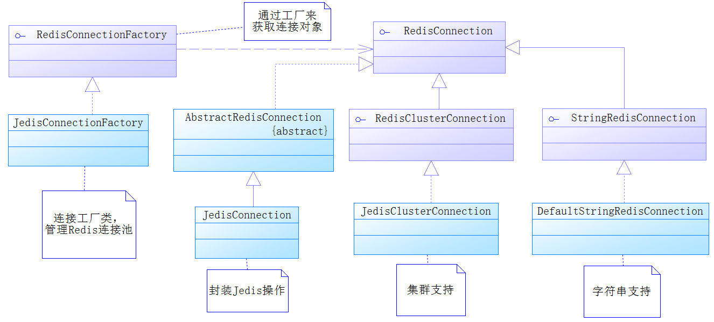
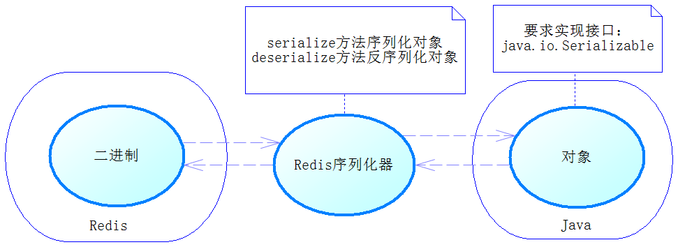
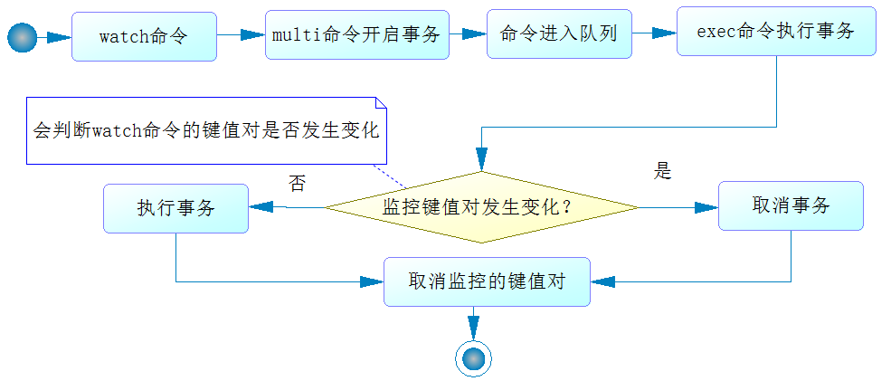
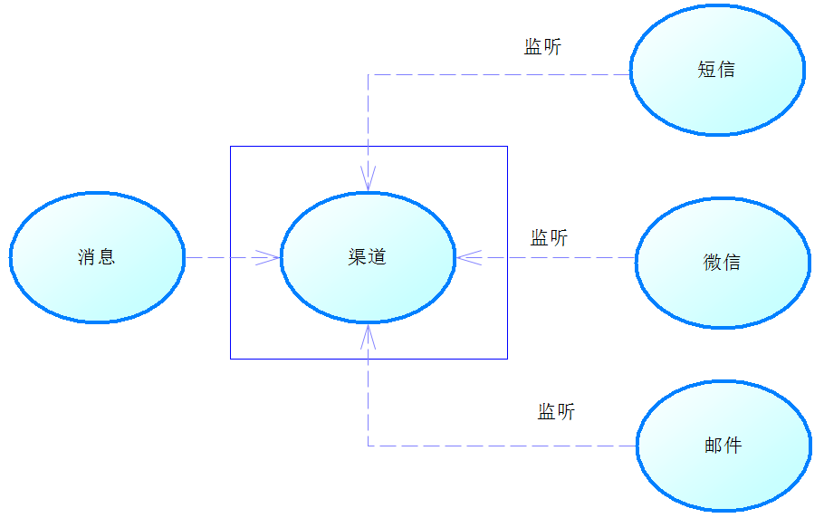
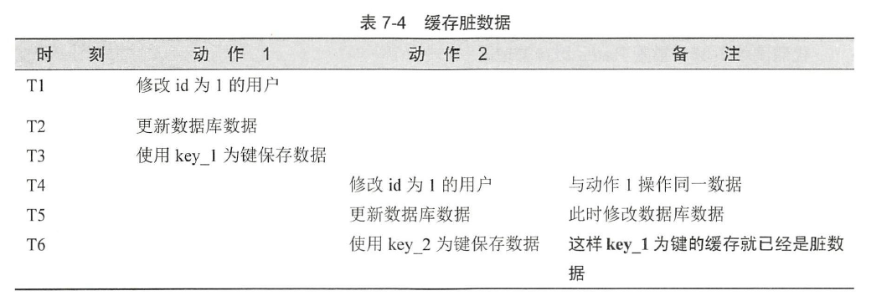

## 第 7 章 使用性能利器Redis

在现今互联网应用中，`NoSQL`已经广为应用，在互联网中起到加速系统的作用。有两种`NoSQL`使用最为广泛，那就是`Redis`和`MongoDB`

`Redis`是一种运行在内存的数据库，支持7种数据类型的存储。`Redis`是一个开源、使用`ANSI C`编写、遵循`BSD`协议、支持网络、可基于内存亦可持久化的日志型、键值数据库，并提供了多种语言的`API`。`Redis`是基于内存的、所以运行速度很快，大约是关系数据库几倍到几十倍的速度。如果我们将常用的数据存储在`Redis`中，用来代替关系数据库的查询访问，网站性能将得到大幅度提高

在现实中，查询数据要远远多于更新数据，一般一个网站的更新和查询比例是`1:9`到`3:7`，在查询比例比较大的网站使用`Redis`可以数倍地提高网站的性能。

除此之外，`Redis`还提供了简单的事务机制，通过事务机制可以有效保证在高并发的场景下数据的一致性。`Redis`本身数据类型比较少，命令功能也比较有限，运算能力一直不强，所以`Redis`在2.6版本之后增加了`Lua`语言的支持，这样`Redis`的运算能力就大大提高了，而且在`Redis`中`Lua`语言的执行是原子性的，也就是在`Redis`执行`Lua`时，不会被其他命令所打断，这样就保证了在高并发场景下的一致性

要使用`Redis`，需要先加入关于`Redis`的依赖，同样，`SpringBoot`也会为其提供`starter` ，然后允许我们通过配置文件`application.properties`进行配置
````xml
<dependency>
    <groupId>org.springframework.boot</groupId>
    <artifactId>springboot-starter-data-redis</artifactId>
    <exclusions>
        <exclusion>
            <groupId>io.lettuce</groupId>
            <artifactId>lettuce-core</artifactId>
        </exclusion>
    </exclusions>
</dependency>
<!--引入Redis的客户端驱动jedis-->
<dependency>
    <groupId>redis.clients</groupId>
    <artifactId>jedis</artifactId>
</dependency>
````

### 7.1 spring-data-redis项目简介

先探讨在一个普通的`Spring`工程中如何使用`Redis`。这对于讨论`SpringBoot`中如何集成`Redis`很有帮助

#### 7.1.1 spring-data-redis项目的设计

在`Java`中与`Redis`连接的驱动存在很多种，目前比较广泛使用的是`Jedis`，其他的还有`Lettuce`、`Jredis`和`Srp`

`Spring`提供了一个`RedisConnectionFactory`接口，通过它可以生成一个`RedisConnection`接口对象，
而`RedisConnection`接口对象是对`Redis`底层接口的封装。例如，本章使用的`Jedis`驱动，那么`Spring`
就会提供`RedisConnection`接口的实现类`JedisConnection`去封装原有的`Jedis`。类图如下



从上图看出
- 在`Spring`中是通过`RedisConnection`接口操作`Redis`的，而`RedisConnection`则对原生的`Jedis`进行封装。要获取`RedisConnection`接口对象，是通过`RedisConnectionFactory`接口去生成的，所以第一步要配置的便是这个工厂了，而配置这个工厂主要是配置`Redis`的连接池，对于连接池可以限定其最大连接数、超时时间等属性。

````java
@Configuration
public class RedisConfig{
    private RedisConnnectionFactory connectionFactory = null;

    @Bean(name="RedisConnectionFactory")
    public RedisConnectionFactory initRedisConnectionFactory(){
        if(this.connectionFactory != null){
            return this.connectionFactory;
        }
        JedisPoolConfig poolConfig = new JedisPoolConfig();
        //最大空闲数
        poolConfig.setMaxIdle(30);
        //最大连接数
        poolConfig.setMaxTatal(50);
        //最大等待毫秒数
        poolConfig.setMaxWaitMillis(2000);
        //创建Jedis连接工厂
        JedisConnectoionFactory connectionFactory = new JedisConnectionFactory(poolConfig);
    }
}
````

#### 7.1.2 RedisTemplate

`RedisTemplate`是个强大的类，首先它会自动从`RedisConnectionFactory`工厂获取连接，然后执行对应的`Redis`命令，在最后还会关闭`Redis`的连接，这些都被`RedisTemplate`封装了，所以开发者不用考虑`Redis`的闭合问题

````java
public class Main{
    public static void main(String[] args){
        ApplicationContext ctx = new AnnotationConfigApplicationContext(RedisConfig.class);
        RedisTemplate redisTemplate = ctx.getBean(RedisTemplate.class);
        redisTemplate.opsForValue().set("key1", "value1");
        redisTemplate.opsForHash().put("hash", "field", "hvalue");
    }
}
````

`Redis`是一种基于字符串存储的`NoSQL`，而`Java`是基于对象的语言，对象是无法存储到`Redis`中的，不过`Java`提供了序列化机制，只要类实现了`java.io.Serializable`接口，就代表类的对象能够进行序列化，通过
将类对象进行序列化就能够得到二进制字符串，这样`Redis`就可以将这些类对象以字符串进行存储。`Java`也可以将那些二进制字符串通过反序列化转为对象，通过这个原理，`Spring`提供了序列化器的机制，并且实现了几个序列化器，其设计如下图所示。


对于序列化器，`Spring`提供了`RedisSerializer`，它有两个方法。一个是`serialize`，它能把那些可以序列化的对象转化为二进制字符串；另一个是`derializer`，它能够通过反序列化把二进制字符串转换为`Java`对象，具体原理如下图所示



`RedisTemplate`提供了很多配置项，可以配置不同情况下的`Serializer`，例如`redisTemplate.setKeySerializer(stringRedisSerializer);`可以设置`Redis`的键序列化器

#### 7.1.3 Spring对Redis数据类型的封装

`Redis`能够支持7种类型的数据结构，这7种类型是字符串、散列、列表、集合、有序集合、基数和地理位置。为此`Spring`针对每种数据结构都提供了对应的操作接口
````java
//获取列表操作接口
redisTemplate.opsForList();
//获取字符串操作接口
redisTemplate.opsForValue();
//获取集合操作接口
redisTemplate.opsForSet();
````

如果需要连续操作一个散列数据类型或列表多次，这时`Spring`也提供支持，它提供了对应的`boundListOps`接口，获得对应的操作接口后，就可以对某个键的数据进行多次操作
````java
//获取散列绑定键操作接口
redisTemplate.boundHashOps("hash");
//获取列表绑定键操作接口
redisTemplate.boundListOps("list");
````

#### 7.1.4 SessionCallback和RedisCallback接口

`SessionCallback`和`RedisCallback`接口的作用是让`RedisTemplate`进行回调，通过它们可以在同一条连接下执行多个`Redis`命令。其中，`SessionCallback`提供了良好的封装，对开发者比较友好
````java
public void useSessionCallback(RedisTemplate redisTemplate){
    redisTemplate.execute(new SessionCallback(){
        @Override
        public Object exectute(RedisOprations ro) throws DataAccessException{
            ro.opsForValue().set("key1", "value1");
            ro.opsForHash().put("hash", "field", "hvalue");
        }
    })
}
````
### 7.2 在SpringBoot中配置和使用Redis

#### 7.2.1 在SpringBoot中配置Redis

同样的，`Springboot`将`Redis`的配置集成到了`application.properties`文件中
````
spring.redis.jedis.pool.min-idle=5
spring.redis.jedis.pool.max-active=5
spring.redis.jedis.pool.max-idle=10
spring.redis.jedis.pool.max-wait=2000

spring.redis.port=6379
spring.redis.host=192.168.11.128
spring.redis.password=123456
````
- 这样`SpringBoot`的自动装配机制就会读取这些配置来生成有关`Redis`的操作对象，
- 它会自动生成`RedisConnectionFactory`、`RedisTemplate`、`StringRedisTemplate`等常用的`Redis`对象

但是默认情况下，`Redis`会将一个经过序列化处理的特殊字符串存入服务器，这对我们跟踪并不友好，这时我们可以通过设置`RedisTemplate`的序列化器来解决
````java
@SpringBootApplication(scanBasePackages = "com.springboot.chapter7")
//指定扫描的MyBatis Mapper
@MapperScan(basePackages = "com.springboot.chapter7", annotationClass = Repository.class)
//使用注解驱动缓存机制
@EnableCaching
public class Chapter7Application {
	@PostConstruct
	public void init() {
	    initRedisTemplate();
	}
	// 设置RedisTemplate的序列化器
	private void initRedisTemplate() {
		RedisSerializer stringSerializer = redisTemplate.getStringSerializer();
		redisTemplate.setKeySerializer(stringSerializer);
		redisTemplate.setHashKeySerializer(stringSerializer);
	}
    ....
}
````
- 这里利用`SpringBean`生命周期注解`@PostConstruct`自定义后初始化方法。将`RedisTemplate`中的键序列化器改为了`StringRedisSerializer`，这样`Redis`服务器上得到的键和散列的`field`就都以字符串存储了

#### 7.2.2 操作Redis数据类型

下面直接用代码来演示如何操作`Redis`数据类型(如字符串、散列、列表、集合和有序集合)

首先是操作字符串和散列
````java
@RequestMapping("/stringAndHash")
@ResponseBody
public Map<String, Object> testStringAndHash() {
    redisTemplate.opsForValue().set("key1", "value1");
    // 注意这里使用了JDK的序列化器，所以Redis保存的时候不是整数，不能运算
    redisTemplate.opsForValue().set("int_key", "1");
    stringRedisTemplate.opsForValue().set("int", "1");
    // 使用运算
    stringRedisTemplate.opsForValue().increment("int", 1);
    // 获取底层Jedis连接
    Jedis jedis = (Jedis) stringRedisTemplate.getConnectionFactory().getConnection().getNativeConnection();
    // 减一操作,这个命令RedisTemplate不支持，所以笔者先获取底层的连接再操作
    jedis.decr("int");
    Map<String, String> hash = new HashMap<String, String>();
    hash.put("field1", "value1");
    hash.put("field2", "value2");
    // 存入一个散列数据类型
    stringRedisTemplate.opsForHash().putAll("hash", hash);
    // 新增一个字段
    stringRedisTemplate.opsForHash().put("hash", "field3", "value3");
    // 绑定散列操作的key，这样可以连续对同一个散列数据类型进行操作
    BoundHashOperations hashOps = stringRedisTemplate.boundHashOps("hash");
    // 删除两个个字段
    hashOps.delete("field1", "field2");
    // 新增一个字段
    hashOps.put("filed4", "value5");
    Map<String, Object> map = new HashMap<String, Object>();
    map.put("success", true);
    return map;
}
````

然后是操作列表，在`Redis`中，列表是一种链表结构，这就意味着查询性能不高，但增删节点的性能高
````java
@RequestMapping("/list")
@ResponseBody
public Map<String, Object> testList() {
    // 插入两个列表,注意它们再链表的顺序
    // 链表从左到右顺序为v10,v8,v6,v4,v2
    stringRedisTemplate.opsForList().leftPushAll("list1", "v2", "v4", "v6", "v8", "v10");
    // 链表从左到右顺序为v1,v2,v3,v4,v5,v6
    stringRedisTemplate.opsForList().rightPushAll("list2", "v1", "v2", "v3", "v4", "v5", "v6");
    // 绑定list2链表操作
    BoundListOperations listOps = stringRedisTemplate.boundListOps("list2");
    // 从右边弹出一个成员
    Object result1 = listOps.rightPop();
    // 获取定位元素，Redis从0开始计算,这里值为v2
    Object result2 = listOps.index(1);
    // 从左边插入链表
    listOps.leftPush("v0");
    // 求链表长度
    Long size = listOps.size();
    // 求链表下标区间成员，整个链表下标范围为0到size-1，这里不取最后一个元素
    List elements = listOps.range(0, size - 2);
    Map<String, Object> map = new HashMap<String, Object>();
    map.put("success", true);
    return map;
}
````

然后是集合，对于集合，在`Redis`中不允许成员重复，它在数据结构上是一个散列表的结构，所以对于它而言是无序的

````java
@RequestMapping("/set")
@ResponseBody
public Map<String, Object> testSet() {
    // 请注意：这里v1重复2次，由于集合不允许重复，所以只是插入5个成员到集合中
    stringRedisTemplate.opsForSet().add("set1", "v1", "v1", "v2", "v3", "v4", "v5");
    stringRedisTemplate.opsForSet().add("set2", "v2", "v4", "v6", "v8");
    // 绑定set1集合操作
    BoundSetOperations setOps = stringRedisTemplate.boundSetOps("set1");
    // 增加两个元素
    setOps.add("v6", "v7");
    // 删除两个元素
    setOps.remove("v1", "v7");
    // 返回所有元素
    Set set1 = setOps.members();
    // 求成员数
    Long size = setOps.size();
    // 求交集
    Set inter = setOps.intersect("set2");
    // 求交集，并且用新集合inter保存
    setOps.intersectAndStore("set2", "inter");
    // 求差集
    Set diff = setOps.diff("set2");
    // 求差集，并且用新集合diff保存
    setOps.diffAndStore("set2", "diff");
    // 求并集
    Set union = setOps.union("set2");
    // 求并集，并且用新集合union保存
    setOps.unionAndStore("set2", "union");
    Map<String, Object> map = new HashMap<String, Object>();
    map.put("success", true);
    return map;
}
````

### 7.3 Redis的一些特殊用法

`Redis`除了操作那些数据类型的功能外，还能支持事务、流水线、发布订阅和`Lua`脚本等功能，这些也是`Red is`常用的功能。在高并发的场景中， 往往我们需要保证数据的一致性， 这时考虑使用`Redis`事务或者利用`Redis`执行`Lua`的原子性来达到数据一致性的目的，所以这里让我们对它们展开讨论。在需要大批量执行`Redis`命令的时候，我们可以使用流水线来执行命令，这样可以极大地提升`Redis`执行的速度。

#### 7.3.1 使用Redis事务

`Redis`是支持一定事务能力的`NoSQL`，在`Redis`中使用事务，常见的命令组合是`watch...multi...exec`，也就是要在一个`Redis`连接中执行多个命令
- 这时我们可以考虑使用`SessionCallback`接口来达到这个目的
- 其中，`watch`命令是可以监控`Redis`的一些键
- `multi`命令是开始事务，开始事务后，该客户端的命令不会马上被执行，而是存放在一个队列里，在这时我们执行一些数据获取的命令，`Redis`也是不会马上执行的，而是把命令放到一个队列里，结果都是返回null
- `exec`命令的意义在于执行事务，只是它在队列命令执行前会判断被`watc` 监控的`Redis`的键的数据是否发生过变化，如果它认为发生了变化，那么`Redis`就会取消事务，否则就会执行事务
- `Redis`在执行事务时，要么全部执行，要么全部不执行，而且不会被其他客户端打断，这样就保证了`Redis`事务下数据的一致性。
- 事务执行的过程如下
    

````java
@RequestMapping("/multi")
@ResponseBody
public Map<String, Object> testMulti() {
    redisTemplate.opsForValue().set("key1", "value1");
    List list = (List) redisTemplate.execute((RedisOperations operations) -> {
        // 设置要监控key1
        operations.watch("key1");
        // 开启事务，在exec命令执行前，全部都只是进入队列
        operations.multi();
        operations.opsForValue().set("key2", "value2");
        operations.opsForValue().increment("key1", 1);
        // 获取值将为null，因为redis只是把命令放入队列，
        Object value2 = operations.opsForValue().get("key2");
        System.out.println("命令在队列，所以value为null【" + value2 + "】");
        // 执行exec命令，将先判别key1是否在监控后被修改过，如果是不执行事务，否则执行事务
        return operations.exec();
    });
    System.out.println(list);
    Map<String, Object> map = new HashMap<String, Object>();
    map.put("success", true);
    return map;
}
````

注意：对于`Redis`事务是先让命令进入队列，一开始它并没有检测这些命令是否能够成功，只有在`exec`命令执行的时候，才能发现错误，对于错误的命令`Redis`只是报出错误，而错误后面的命令依然被执行

#### 7.3.2 使用Redis流水线

使用流水线后可以大幅度地在需要执行很多命令时提升`Redis`的性能。下面我们使用`Redis`流水线技术测试10 万次读写的功能

````java
@RequestMapping("/pipeline")
@ResponseBody
public Map<String, Object> testPipeline() {
    Long start = System.currentTimeMillis();
    List list = (List) redisTemplate.executePipelined((RedisOperations operations) -> {
        for (int i = 1; i <= 100000; i++) {
            operations.opsForValue().set("pipeline_" + i, "value_" + i);
            String value = (String) operations.opsForValue().get("pipeline_" + i);
        }
        return null;
    });
    Long end = System.currentTimeMillis();
    System.out.println("耗时：" + (end - start) + "毫秒。");
    Map<String, Object> map = new HashMap<String, Object>();
    map.put("success", true);
    return map;
}
````
- 10万次的读写基本在300-600ms
- 对于程序而言，这个`executePipelined`最终将返回一个`list`，如果过多的命令执行返回的结果保存在这个`List`中，显然会造成内存消耗过大
- 与事务一样，使用流水线的过程中，所有的命令也只是进入队列而没有执行，所以执行的命令返回值也为空

#### 7.3.3 使用Redis发布订阅

首先是`Redis`提供一个渠道，让消息能够发送到这个渠道上，而多个系统可以监听这个渠道，当一条消息发送到渠道，渠道就会通知它的监昕者，这些监听者会根据自己的需要去处理这个消息，于是我们就可以得到各种各样
的通知了。如下图所示



下面我们举个简单的例子，先定义一个消息监听器，然后在`SpringBoot`启动文件中配置其他信息，让系统可以监控`Redis`的消息
````java
@Component
public class RedisMessageListener implements MessageListener {
    @Override
    public void onMessage(Message message, byte[] pattern) {
        // 消息体
        String body = new String(message.getBody());
        // 渠道名称
        String topic = new String(pattern); 
        System.out.println(body);
        System.out.println(topic);
    }
}
````
````java
/**
* 创建任务池，运行线程等待处理Redis的消息
* 
* @return
*/
@Bean
public ThreadPoolTaskScheduler initTaskScheduler() {
    if (taskScheduler != null) {
        return taskScheduler;
    }
    taskScheduler = new ThreadPoolTaskScheduler();
    taskScheduler.setPoolSize(20);
    return taskScheduler;
}
/**
* 定义Redis的监听容器
* 
* @return 监听容器
*/
@Bean
public RedisMessageListenerContainer initRedisContainer() {
    RedisMessageListenerContainer container = new RedisMessageListenerContainer();
    // Redis连接工厂
    container.setConnectionFactory(connectionFactory);
    // 设置运行任务池
    container.setTaskExecutor(initTaskScheduler());
    // 定义监听渠道，名称为topic1
    Topic topic = new ChannelTopic("topic1");
    // 使用监听器监听Redis的消息
    container.addMessageListener(redisMsgListener, topic);
    return container;
}
````
- 这里我们定义了一个`Redis`消息监听的容器`RedisMessageListenerContainer`
- 然年后在容器中设置了连接工厂、任务池
- 定义了接收`topic1`渠道的消息，这样就可以监听`Redis`关于`topic1`渠道的消息

#### 7.3.4 使用Lua脚本

略

### 7.4 使用Spring缓存注解操作Redis

为了进一步简化`Redis`的使用，`Spring`还提供了缓存注解，使用这些注解可以有效简化编程过程

#### 7.4.1 缓存管理器和缓存的启用

`spring`在使用缓存注解前，需要配置缓存管理器，缓存管理器将提供一些重要的信息，如缓存类型、超时时间等。`Spring`可以支持多种缓存的使用，而使用`Redis`，主要就是以使用类`RedisCacheManager`为主。
````
spring.cache.type=REDIS #定义缓存类型
spring.cache.cache-names=redisCache #定义缓存名称
spring.cache.redis.cache-null-values=true #是否允许Redis缓存空值
spring.cache.redis.key-prefix=xxx #Redis的键前缀
spring.cache.redis.time-to-live=0ms #缓存超时时间戳，配置为0则不设置超时时间
spring.cache.redis.use-key-prefix=true #是否启用Redis的键前缀
````

此外，我们还需要在`SpringBoot`启动类上加入驱动缓存注解`@EnableCaching`这样就可以驱动`Spring`缓存机制工作了
````java
@SpringBootApplication(scanBasePackages = "com.springboot.chapter7")
//指定扫描的MyBatis Mapper
@MapperScan(basePackages = "com.springboot.chapter7", annotationClass = Repository.class)
//使用注解驱动缓存机制
@EnableCaching
public class Chapter7Application {
    //....
}
````

#### 7.4.2 开发缓存注解

下面举一个处理用户的`Service`的例子，来说明如何以注解的方式使用`Redis`
````java
/**** imports ****/
@Service
public class UserServiceImpl implements UserService {

	@Autowired
	private UserDao userDao = null;

	// 插入用户，最后MyBatis会回填id，取结果id缓存用户
	@Override
	@Transactional
	@CachePut(value = "redisCache", key = "'redis_user_'+#result.id")
	public User insertUser(User user) {
		userDao.insertUser(user);
		return user;
	}

	// 获取id，取参数id缓存用户
	@Override
	@Transactional
	@Cacheable(value = "redisCache", key = "'redis_user_'+#id")
	public User getUser(Long id) {
		return userDao.getUser(id);
	}

	// 更新数据后，充值缓存，使用condition配置项使得结果返回为null，不缓存
	@Override
	@Transactional
	@CachePut(value = "redisCache", condition = "#result != 'null'", key = "'redis_user_'+#id")
	public User updateUserName(Long id, String userName) {
		// 此处调用getUser方法，该方法缓存注解失效，
		// 所以这里还会执行SQL，将查询到数据库最新数据
		User user = this.getUser(id);
		if (user == null) {
			return null;
		}
		user.setUserName(userName);
		userDao.updateUser(user);
		return user;

	}

	// 命中率低，所以不采用缓存机制
	@Override
	@Transactional
	public List<User> findUsers(String userName, String note) {
		return userDao.findUsers(userName, note);
	}

	// 移除缓存
	@Override
	@Transactional
	@CacheEvict(value = "redisCache", key = "'redis_user_'+#id", beforeInvocation = false)
	public int deleteUser(Long id) {
		return userDao.deleteUser(id);
	}
}
````
- `@CachePut`表示将方法结果返回存放到缓存中
- `@Cacheable`表示先从缓存中通过定义的键查询，如果可以查询到数据，则返回，否则执行该方法，返回数据，并将返回结果保存到缓存中
- `@CacheEvict`通过定义的键移除缓存

#### 7.4.3 测试缓存注解

略

#### 7.4.4 缓存注解自调用失效问题

如7.4.2中的例子，因为`Spring`的缓存机制也是基于`SpringAOP`的原理，而在`Spring`中`AOP`是通过动态代理技术来实现的，这里的`updateUserName`方法调用`getUser`方法是类内部的自调用，并不存在代理对象的调用，这样便不会出现`AOP`，也就不会使用到标注在`getUser`上的缓存注解去获取缓存的值了

#### 7.4.5 缓存脏数据说明

使用缓存很可能出现脏数据问题，如下所示



`T6`时刻，因为使用了`key_2`为键缓存数据，所以会致使动作l以`key_ 1`为键的缓存数据为脏数据。这样使用`key_l`为键读取时，就只能获取脏数据了，这只是存在脏数据的可能性之一，还可能存在别的可能对于数据的读和写采取的策略是不一样的。

对于数据的读操作，一般而言是允许不是实时数据，如一些电商网站还存在一些排名榜单，它会存在延迟，存在脏数据是允许的。但是如果一个脏数据始终存在就说不通了，这样会造成数据失真比较严重。一般对于查询而言，我们可以规定一个时间，让缓存失效，对于那些要求实时性比较高的数据，我们可以把缓存时间设置得更少一些，这样就会更加频繁地刷新缓存

对于数据的写操作，往往采取的策略就完全不一样，需要我们谨慎一些，一般会认为缓存不可信， 所以会考虑从数据库中先读取最新数据，然后再更新数据，以避免将缓存的脏数据写入数据库中，导致出现业务问题。
