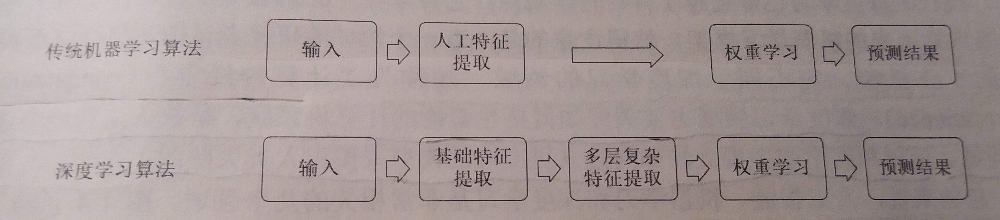
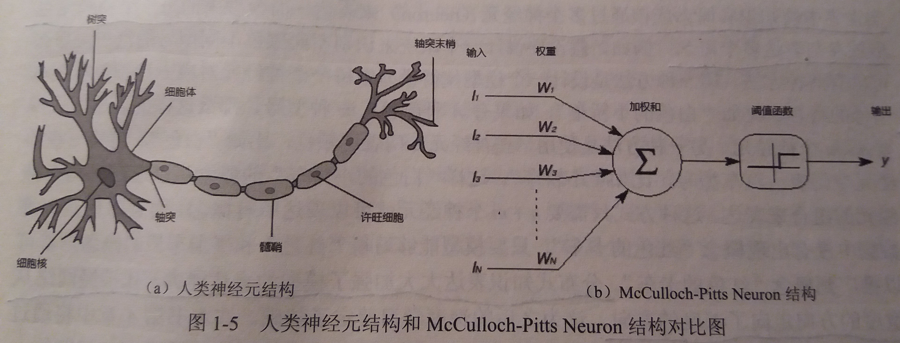

## [Tensorflow][1]深度学习简介

### 1.1 人工智能、机器学习与深度学习

#### 1.1.1 人工智能

- 背景：一些人类通过直觉可以很快解决的问题，目前却很难通过计算机解决。这些问题包括自然语言处理、图像识别、语音识别等。

- 人工智能：一类非常广泛的问题，它旨在通过计算机实现类似人类的智能

- 特定环境：很多早期的人工智能系统只能成功应用于相对 **特定的环境(specific domain)**，在这些特定环境下，计算机需要了解的知识很容易被严格和完整地定义

- 知识图库(Ontology)
    - 定义：将单词整理为**近义词集(synsets)**，并定义近义词集之间的关系
    - 缺点
        - 花费大量人力物力
        - 可以通过知识图库方式明确定义的知识有限，很大部分无法明确定义的知识，就是人类的经验

#### 1.1.2 机器学习
- 背景：如何让计算机可以和人类一样从历史的经验中获取新的知识？这就是机器学习需要解决的问题

- 机器学习：
    - 定义：如果 **一个程序** 可以在 **任务T** 上，随着 **经验E** 的增加，**效果P** 也可以随之增加，则称这个程序可以从经验中学习
    - 以垃圾邮件分类的方法来解释机器学习
        - 一个程序：需要用到的机器学习算法，比如逻辑回归算法
        - 任务T：区分垃圾邮件的任务
        - 经验E：已经区分过是否为垃圾邮件的历史邮件
        - 效果P：机器学习算法在区分是否为垃圾邮件任务上的正确率
- 特征(feature)：例如进行垃圾邮件分类时，会从每封邮件中提取对分类结果可能有影响的因素，每个因素称为一个特征(feature)

- 逻辑回归算法可以从训练数据中计算出每个特征和预测结果的相关度

- 在训练数据达到一定数量之前，越多的训练数据可以使逻辑回归算法对未知邮件做出的判断越精确

- 逻辑回归算法可以根据训练数据(经验E)提高在垃圾邮件分类问题(任务T)上的正确率(效果P)

- 逻辑回归算法的效果也依赖于从数据中提取的特征

- 如何从实体中提取特征，对于很多传统机器学习算法的性能有巨大影响

#### 1.1.3 深度学习
- 背景：对许多机器学习问题来说，特征提取不是一件简单的事情，在一些复杂问题上，要通过手动的方式设计有效的特征集合，需要很多的时间和精力

- 深度学习
    - 定义：深度学习是机器学习的一个分支，它除了可以学习特征和任务之间的关联，还能自动从简单特征中提取更加复杂的特征
    - 深度学习解决的核心问题之一就是自动地将简单的特征组合成更加复杂的特征，并使用这些组合特征解决问题
    - 深度学习算法可以从数据中学习更加复杂的特征表达，使得最后一步权重学习变得更加简单且高效

- 深度学习与传统机器学习流程的对比

#### 1.1.4 深度学习与传统神经科学

- 早期深度学习受到神经科学的启发

- 例如
    - 神经科学的研究：虽然哺乳动物大脑分为了很多区域，但这些区域的学习机制却是相似的
    - 深度学习的运用：深度学习算法具有通用性，深度学习研究者往往可以跨越多个研究方向甚至同时活跃于所有的研究方向

- 现代深度学习的发展并不拘泥于模拟人脑神经元和人脑的工作机理，模拟人类大脑也不再是深度学习研究的主导方向

- 计算神经学：试图从算法层理解大脑的工作机制

---

### 1.2 深度学习的发展历程

神经网络的发展史大致可以分为三个阶段

#### 1.2.1 第一个阶段---仿生

- 早期的神经网络模型类似于仿生机器学习，它试图模拟大脑的学习机理

- McCulloch-Pitts Neuron结构
    - 简介：McCulloch-Pitts Neuron结构大致模拟了人类神经元的工作原理，它们都有一些输入，然后将输入进行一些变换后得到输出结果
    - 如图
    
    - 理解：McCulloch-Pitts Neuron结构使用简单的线性加权和的方式来模拟这个变换，将n个输入值提供给McCulloch-Pitts Neuron结构后，McCulloch-Pitts Neuron结构会通过n个权重w1,w2,...,wn来计算这n个输入的加权和，然后用这个加权和经过一个阈值函数得到一个0或1的输出

- 感知机( perceptron )
    - 首个可以根据样例数据学习特征权重的模型
    - 感知机模型只能解决线性不可分问题

#### 1.2.2 第二个阶段---分布式知识表达和反向传播算法
- 分布式知识表达
    - 核心思想：现代世界中的知识和概念应该由多个神经元(neuron)来表达，而模型中的每个神经元也应该参与表达多个概念
    - 意义：大大加强了模型的表达能力，让神经网络从宽度的方向走向了深度的方向
    - 深层神经网络解决了线性不可分问题

- 反向传播算法
    - 大幅降低了训练神经网络所需要的时间

- 此阶段的两大阻碍
    1. 在当时的计算资源下，要训练深层的神经网络仍然是非常困难的
    2. 当时的数据量较少，无法满足训练深层神经网络的需求

#### 1.2.2 第三个阶段---计算能力和数据量的提升
- 此阶段解决了第二阶段的两大阻碍
    1. 随着云计算和GPU的出现，计算量已经不再是阻碍神经网络发展的问题
    2. 随着互联网+的发展，获得海量数据也不再困难 

---

### 1.3 深度学习的应用

#### 1.3.1 计算机视觉

- 传统的机器学习算法很难抽象出足够有效地特征，使得学习模型既可以区分不同的个体，又可以区分相同个体在不同环境下
的变化

- 深度学习技术通过从海量数据中自动习得更加有效地特征表达，可以很好的解决这个问题

- 光学字符识别(OCR)：使用计算机程序将计算机无法理解的图片中的字符，比如数字、字母、汉字等符号，转化为计算机可以理解的文本格式

#### 1.3.2 语音识别

- 随着数据量的增大，使用深度学习模型无论在正确率的增长数值上还是在增长比率上都要优于使用混合高斯模型的算法

#### 1.3.3 自然语言处理

- 包括：语言模型、机器翻译、词性标注、实体识别、情感分析、广告推荐、搜索排序等

- 单词向量(word embedding)
    - 单词向量提供了一种更加灵活的方式来刻画单词的语义
    - 单词向量会将一个单词表示为一个相对较低维度的向量(比如100维或200维)。对于语义相近的单词，其对应的单词向量在空间中的距离也应该接近。于是单词语义上的相似度可以通过空间中的距离来描述。
    - 通过单词向量可以进行单词之间的运算

#### 1.3.4 人机博弈

- AlphaGo
    - AlphaGo的组成部分：蒙特卡罗树搜索(Monte Carlo tree search,MCTS)、估值网络(value network)和走棋网络(policy network)。
    - 蒙特卡罗树搜索：实现对不同落子点的搜索
    - 走棋网络：预测下一步在哪里落子
    - 估值网络：给定当前的棋盘，判断黑棋赢的概率
 

