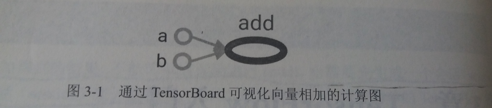
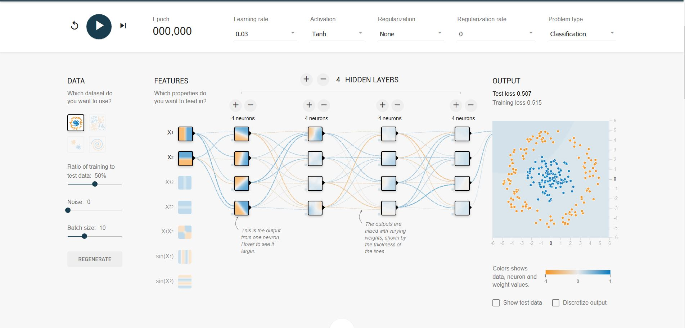
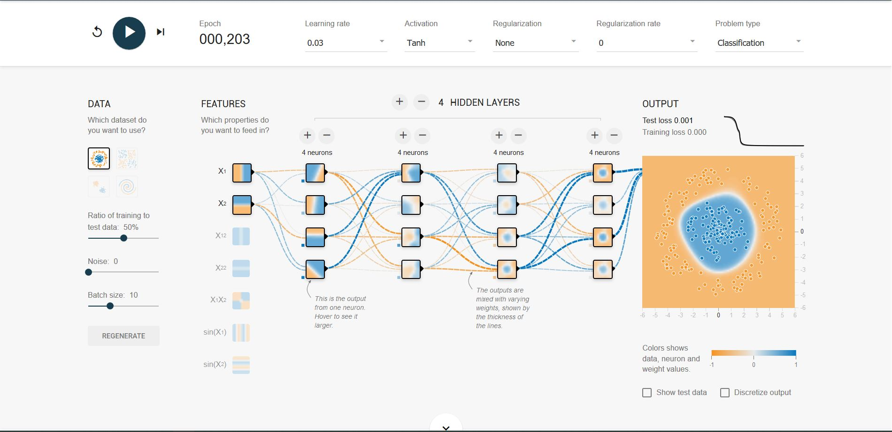
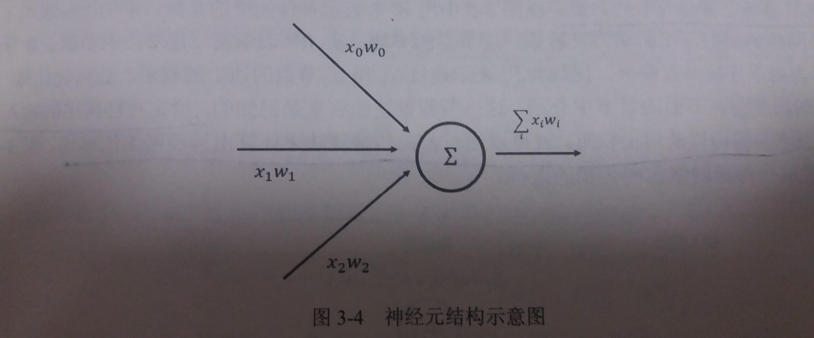
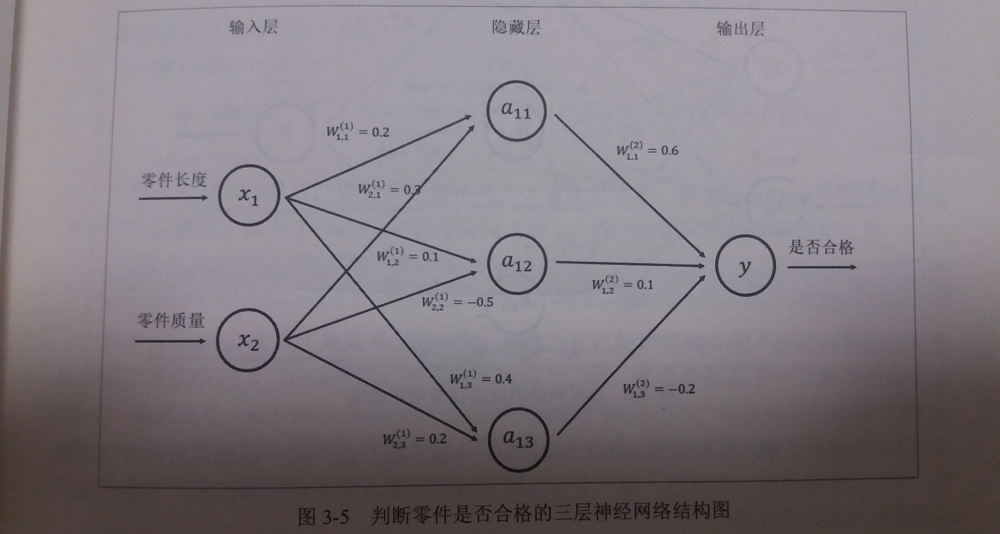
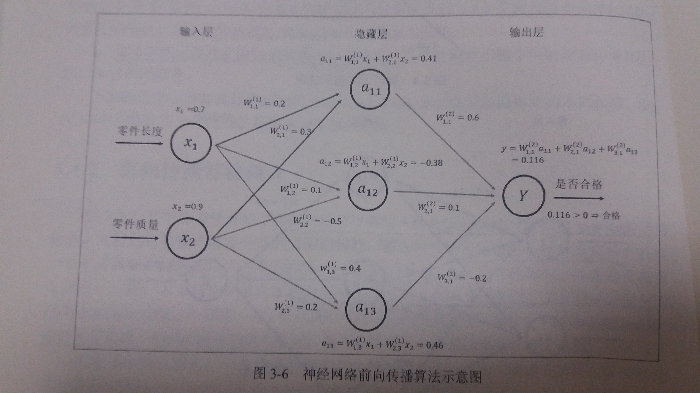
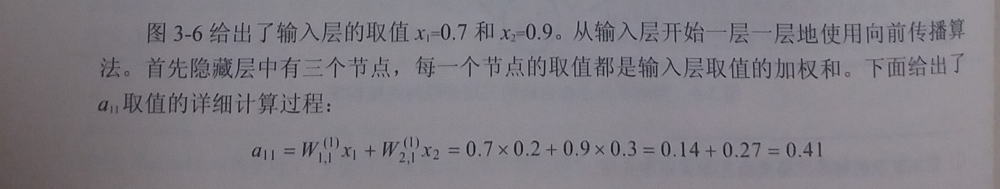
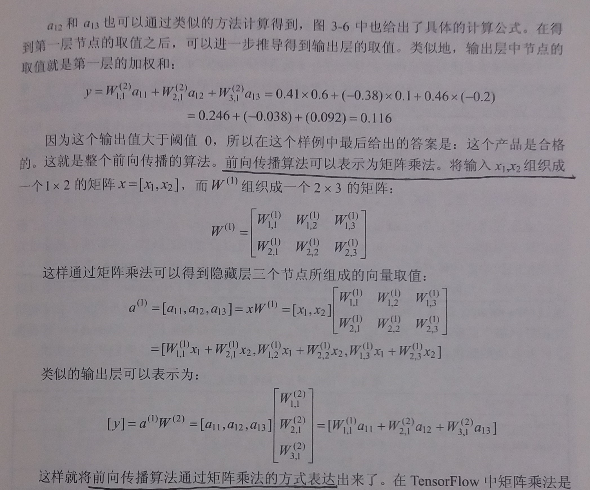
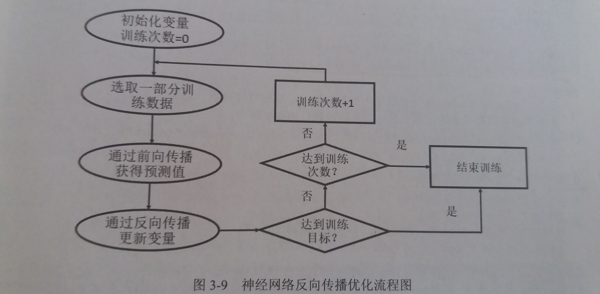

## 第三章 TensorFlow入门
---
### 3.1 TensorFlow计算模型---计算图

- 计算图是TensorFlow中最基本的一个概念，TensorFlow中的所有计算都会被转化为计算图上的节点
---
#### 3.1.1 计算图的概念

- 张量(Tensor)：可以被简单地理解为多维数组

- 流(Flow)：直观地表达了张量之间通过计算相互转化的过程

- 计算图
    - 简介：TensorFlow中的每一个计算都是计算图上的一个节点，而节点之间的边描述了计算之间的依赖关系
    - 节点
        - 每个节点都是一个运算
        - 为了建模方便，TensorFlow会将常量转化为一种永远输出固定值的常量
    - 边
        - 每条边表示了计算之间的依赖关系
        - 如果一个运算的输入依赖于另一个运算的输出，那么这两个运算有依赖关系
    - 例子
    
    a和b这两个常量不依赖于任何其他计算，而add计算则依赖读取两个常量的取值
---
#### 3.1.2 计算图的使用

- TensorFlow程序一般可以分为两个阶段
    - 计算定义阶段：定义计算图中所有的计算
    - 计算执行阶段：详见3.3节

- 计算定义阶段的样例
    ````py
    import tensorflow as tf
    #计算定义阶段开始
    a = tf.constant([1.0,2.0],name="a")
    b = tf.constant([2.0,3.0],name="b")
    result=a+b
    #计算定义阶段结束
    ````

- 其他
    - 在计算定义阶段，TensorFlow会自动将定义的计算转化为计算图上的节点
    - 在TensorFlow中，系统会自动维护一个默认的计算图
    - 通过`tf.get_default_graph()`可以获得当前默认的计算图
- 计算图的两个功能
    - 隔离张量和变量    
        - 通过`tf.graph()`生成新的计算图
        - 不同计算图上的张量和运算都不会共享
    - 提供了管理张量和计算的机制
        - 计算图可以通过`tf.Graph.device()`函数来指定运行计算的设备，这为使用GPU提供了机制
            ````py
            g=tf.Graph()
            with g.device('/gpu:0'):
                result = a + b
            ````
        - 在一个计算图中，可以通过集合(collection)来管理不同类别的资源
---

### 3.2 TensorFlow数据模型---张量
---
- 张量是TensorFlow管理数据的形式
---
#### 3.2.1 张量的概念

- 在TensorFlow中所有的数据都通过张量的形式表示

- 张量可以被理解为多维数组
    - 零阶张量表示标量(scalar)，也就是一个数
    - 第一阶张量为向量(vector)，也就是一个一维数组
    - 第n阶张量为n维数组

- 在张量中并没有真正保存数字，它保存的是如何得到这些数字的计算过程

- 一个张量中主要保存了三个属性
    - 例子
        ````py
        import tensorflow as tf
        a = tf.constant([1.0,2.0],name="a")
        b = tf.constant([2.0,3.0],name="b")
        result = a + b
        print(result)
        ````
        ````py
        #output
        Tensor("add:0", shape=(2,), dtype=float32)
        ````
    - 名字(name)
        - 简介：一个张量的唯一标识符
        - 来源：计算图中的每个节点代表了一个计算，计算的结果保存在张量中，所以张量与计算图上节点所代表的计算结果是对应的
        - 命名：`node:src_output`
            `node`：节点的名称
            `src_output`：表示当前张量是`node`的第几个输出

    - 维度(shape)
        - 简介：描述一个张量的维度信息
        - 例如：`shape=(2,)`说明了张量是一个二维数组，这个数组的长度为2
   
    - 类型(type)
        - 简介：每个张量都有一个唯一的类型
        - 类型包含：实数 ( `tf.float32、tf.float64` ) 、整数 ( `tf.int8、tf.int16、tf.int32、tf.int64、tf.uint8` )、布尔型 ( `tf.bool` ) 和复数 ( `tf.complex64、tf.complex128` )
        - 报错：TensorFlow会对参加计算的所有张量进行类型的检查，当发现类型不匹配时会报错
        - 默认类型：如果不指定类型，TensorFlow会给出默认的类型，比如不带小数点的数会被默认为`int32`，带小数点的数会默认为`float32`
        - 建议：因为使用默认类型可能会导致潜在的类型不匹配问题，所以一般建议通过指定`dtype`来明确指出变量或常量的类型
---
#### 3.2.2 张量的使用

1. 对中间计算结果的引用
    - 当计算复杂度增加时，通过张量引用中间结果可以增加代码可读性
    - 通过张量引用中间结果可以方便获得中间结果

2. 当计算图构建完成后用来获得计算结果
    - 虽然张量本身没有存储具体的数字，但通过session可以获得这些具体的数字
---

### 3.3 TensorFlow运行模型---会话

- 简介
    - 会话(session)用来执行定义好的运算
    - 会话拥有并管理TensorFlow程序运行时的所有资源
    - 所有计算完成之后需要关闭会话来帮助系统回收资源，否则会资源泄漏

- 使用会话的两种模式
    1. 明确调用生成和关闭函数
        ````py
        #创建一个会话
        sess=tf.Session()
        #使用创建好的会话来得到运算结果
        sess.run(result)
        #关闭这个会话
        sess.close()
        #但是如果因抛出异常而退出，未执行close，则还是会出现资源泄漏
        ````
    2. 使用python上下文管理器`with`来自动管理
        ````py
        #创建一个会话，并通过Python中的上下文管理器来管理这个会话
        with tf.Session() as sess:
            #使用创建好的会话来计算关心的结果
            sess.run(result)
        #当上下文退出时自动关闭会话，释放资源
        ````

- 默认的会话
    - 可以设置一个会话为默认的会话，这样，调用一个张量的`eval()`方法，就相当于将计算放到这个默认的会话中运行
        - 例子
            ````py
            sess=tf.Session()
            with sess.as_default():
                print(result.eval())
            ````
            或者
            ````py
            sess=tf.InteractiveSession()
            print(result.eval())
            sess.close()
            ````

- 通过ConfigProto Protocol Buffer来配置需要生成的会话  
    - 例如
        ````
        config=tf.ConfigProto(
            allow_soft_placement=True,
            log_device_placement=True

        )
        ````
    - 通过ConfigProto可以配置类似并行的线程数、GPU分配策略、运算超时时间等参数
---

### 3.4 TensorFlow实现神经网络
---
#### 3.4.1 TensorFlow Playground及神经网络简介
- [TensorFlow Playground---可视化神经网络demo](http://playground.tensorflow.org/)

- Playground设置
    

- Playground迭代203轮的结果
    

- 获得的启示

    - 在机器学习中，所有用于描述实体的数字的组合就是一个实体的**特征向量(feature vector)**，例如：可以用半径和质量来描述一个齿轮，gear --> (r,m)

    - 第一层是**输入层**，代表特征向量中每个特征的取值

    - 同一层的节点不会相互连接，而且每一层只和下一层连接，直到最后一层作为**输出层**得到计算的结果

    - 在输入和输出层之间的神经网络叫做**隐藏层**，一般一个神经网络的隐藏层越多，这个神经网络就越'深'

    - 神经网络就是通过对参数的合理设置来解决分类或者回归问题的

- 使用神经网络解决分类问题的4个步骤
    1. 提取问题中的实体的特征向量作为神经网络的输入，不同实体可以提取不同的特征向量

    2. 定义神经网络的结构，并定义如何从神经网络的输入得到输出，这个过程就是神经网络的前向传播算法

    3. 通过训练数据来调整神经网络中参数的取值，这就是训练神经网络的过程

    4. 使用训练好的神经网络来预测未知的数据
---
#### 3.4.2 前向传播算法简介

- 前向传播简介
    - 前向传播算法主要用来解决如何将输入的特征向量经过层层推导得到最后的输出的问题

- 神经元
    - 例子
    
    - 神经元是构成一个神经网络的最小单元
    - 一个神经元有多个输入和一个输出
    - 一个最简单神经元结构的输出就是所有输入的加权和，而不同输入的权重就是神经元的参数

- 神经网络
    - 所谓神经网络的结构指的是不同神经元之间的连接结构
    - 例子
    

- 全连接神经网络
    - 全连接神经网络就是相邻两层之间任意两个节点之间都有连接

- 计算神经网络的**前向传播**结果需要**三部分**信息
    1. 神经网络的输入
        - 这个输入是从实体中提取的特征向量
    2. 神经网络的连接结构
        - 神经网络是由神经元构成的
        - 神经网络的结构给出不同神经元之间输入输出的连接关系
    3. 每个神经元中的参数

- 前向传播算法样例
)

- 前向传播算法可以通过矩阵乘法的方式表达



- TensorFlowFlow中的矩阵乘法
    - 使用`tf.matmul()`实现矩阵的乘法
    - 例如
        ````py
        a = tf.matmul(x,w1)
        b = tf.matmul(a,w2)
        ````
---
#### 3.4.3 神经网络参数与TensorFlow变量

- 变量简介：变量 ( `tf.Variable` ) 的作用就是保存和更新神经网络中的参数

- 变量初始化
    - TensorFlow中的变量需要指定初始值
    - 一个变量的值在被使用之前，这个变量的初始化过程需要被明确调用
    - 使用随机数初始化
        - 样例
            ````py
            weights = tf.Variable(tf.random_normal([2,3],stddev=2))
            ````
        - 说明
            - 首先调用了TensorFlow变量的声明函数`tf.Variable`
            - `tf.random_normal([2,3],stddev=2)` 
                - 用来产生一个2*3的矩阵
                - 矩阵中的元素是均值为0，标准差为2的随机数
                - 可以通过参数`mean`来指定平均值，在没有指定时默认为0
    - 使用常数初始化
        - 样例
            ````py
            biases = tf.Variable(tf.zeros([3]))
            ````
        - 说明：将产生一个初始值为0，长度为3的变量
    - 使用其他变量的初始值初始化
        - 样例
            ````py
            w1 = tf.Variable(weights.initialized_value())
            w2 = tf.Variable(weights.initialized_value() * 2.0)
            ````

- 通过变量实现神经网络的参数并实现前向传播
    - 样例
        ````py
        import tensorflow as tf
        
        # 声明w1、w2两个变量，并通过seed参数设置了随机种子
        w1 = tf.Variable(tf.random_normal((2,3),stddev=1,seed=1))
        w2 = tf.Variable(tf.random_normal((3,1),stddev=1,seed=1))
        
        # 将输入的特征向量定义为一个常量，x是一个2*1的矩阵
        x = tf.constant([[0.7,0.9]])
        
        # 通过矩阵乘法获得神经网络的输出
        a = tf.matmul(x,w1)
        y = tf.matmul(a,w2)

        # session的配置信息
        config=tf.ConfigProto(
            allow_soft_placement=True,
            log_device_placement=True
        )

        # 使用session获得计算结果
        with tf.Session(config=config) as sess:

            # 对w1、w2进行初始化的过程
            sess.run(w1.initializer)
            sess.run(w2.initializer)

            # 得到最终的运算结果
            print(sess.run(y))
        ````
    - 说明
        - 第一步：定义计算图中的所有计算，也就是定义w1、w2、a和y的过程
        - 第二步：声明一个会话，并通过会话计算结果
            - 计算前需要初始化
                - 在计算最后的y时，需要将所有变量初始化
                - 也就是说，虽然在变量定义时给出了变量初始化的方法，但这个方法并没有真正的运行
            - 使用函数`tf.global_variables_initializer()`直接初始化所有变量
                - 样例
                    ````py
                    init_op = tf.global_variables_initializer()
                    sess.run(init_op)
                    ````

- 变量与张量
    - 简介：变量只是一种特殊的张量
    - 说明：在TensorFlow中，变量的声明函数tf.Variable是一个运算，这个运算的输出结果就是一个张量，这个张量也就是变量，所以变量只是一种特殊的张量

- 变量与集合
    - 所有变量都自动加入到`GraphKeys.VARIABLES`这个集合中
    - 通过`tf.global_variables()`函数可以拿到当前计算图中的所有变量
    - 通过变量声明函数中的`trainable`参数来区分需要优化的参数(如神经网络中的参数)和其他不需要优化参数(如迭代的轮数)
    - 如果声明变量时参数`trainable`为`True`，则这个变量将会被加入到`GraphKeys.TRAINABLE_VARIABLES`集合中
    - 神经网络优化算法会将`GraphKeys.TRAINABLE_VARIABLES`集合中的变量作为默认的优化对象

- 变量的类型
    - 一个变量在构建之后，它的类型就不能再改变了

- 变量的维度
    - 维度在程序运行中是有可能改变的
    - 设置参数`validate_shape=False`就可以修改维度
    - 修改维度在实践中比较罕见
                
---
#### 3.4.4 通过TensorFlow训练神经网络模型

- 训练
    - 设置神经网络参数的过程就是神经网络的训练过程
    - 只有经过有效训练的神经网络模型才可以真正地解决分类或者回归问题

- 监督学习
    - 数据集：使用监督学习的方式设置神经网络参数需要有一个标注好的训练数据集
    - 思想
        - 在已知答案(就是标注)的标注数据集上，模型给出的预测结果要尽量接近真实的答案
        - 通过调整神经网络中的参数对训练数据进行拟合，可以使得模型对未知的样本提供预测的能力

- 反向传播算法(backpropagation algorithm)
    - 流程
    
    - 简介：反向传播算法实现了一个迭代的过程
    - 步骤
        1. 在每次迭代的开始，首先需要选取一小部分训练数据，这一部分数据叫做一个**batch**
        2. 然后，这个batch的样例会通过前向传播算法得到神经网络模型的预测结果
        3. 计算出当前神经网络模型的预测结果与正确答案之间的差距
        4. 基于预测值和真实值之间的差距，反向传播算法会相应更新神经网络参数的取值

- placeholder机制
    - 背景：如果每轮迭代中选取的数据都要通过常量来表示，那么TensorFlow的计算图将会太大，而且利用率低，为了避免这个问题，提供了placeholder机制用于提供输入数据
    - 简介
        - placeholder相当于定义了一个位置，这个位置中的数据在程序运行时再指定
        - 程序不需要生成大量常量来提供输入数据，只需要将数据通过placeholder传入TensorFlow计算图
        - 在placeholder定义时，这个位置上的数据类型是需要指定的，而且类型不可更改
    - 样例代码
        ````py
        import tensorflow as tf
        w1 = tf.Variable(tf.random_normal((2, 3), stddev=1, seed=1))
        w2 = tf.Variable(tf.random_normal((3, 1), stddev=1, seed=1))
        # 此处使用tf.placeholder来声明一个placeholder
        x = tf.placeholder(tf.float32,shape=(3, 2), name="input")
        a = tf.matmul(x, w1)
        y = tf.matmul(a, w2)
        config=tf.ConfigProto(
            allow_soft_placement=True,
            log_device_placement=True
        )
        with tf.Session(config=config) as sess:
            init_op = tf.global_variables_initializer()
            sess.run(init_op)
            # 在程序运行时，才通过feed_dict给placeholder赋值
            # feed_dick是一个字典(map)，在字典中需要给出每个用到的placeholder的取值
            print(sess.run(y, feed_dict={x: [[0.7, 0.9], [0.1, 0.4], [0.5, 0.8]]}))
        ````

- 损失函数
    - 在得到一个batch的前向传播结果后，需要定义一个损失函数来刻画当前的预测值和真实答案之间的差距
    - 然后通过反向传播算法来调整神经网络参数的取值使得差距可以被缩小
    - 交叉熵(cross entropy)是一个常用的损失函数

- 反向传播的优化方法
    - 即通过调整参数使得损失函数刻画的差距被缩小
    - 常用的优化方法有:`tf.train.GradientDescentOptimizer`、`tf.train.AdamOptimizer`和`tf.train.MomenttumOptimizer`
---
#### 3.4.5 完整神经网络样例程序
- 样例程序
    ````py
    import tensorflow as tf
    from numpy.random import RandomState

    # 定义训练数据batch的大小
    batch_size = 8

    # 定义神经网络的参数
    w1 = tf.Variable(tf.random_normal([2, 3], stddev=1, seed=1))
    w2 = tf.Variable(tf.random_normal([3, 1], stddev=1, seed=1))

    # 使用placeholder来定义输入数据
    # 其中将shape的一个维度设置为None可以方便使用不同的batch大小
    x = tf.placeholder(tf.float32, shape=(None, 2), name="x-input")
    y_ = tf.placeholder(tf.float32, shape=(None, 1), name="y-input")

    # 定义神经网络前向传播的过程
    a = tf.matmul(x, w1)
    y = tf.matmul(a, w2)

    # 定义损失函数
    y = tf.sigmoid(y)
    cross_entropy = -tf.reduce_mean(
        y_ * tf.log(tf.clip_by_value(y, 1e-10, 1.0)) + (1-y_) * tf.log(tf.clip_by_value(1-y, 1e-10, 1.0))
    )

    # 定义优化过程
    train_step = tf.train.AdamOptimizer(0.001).minimize(cross_entropy)

    # 使用Numpy生成随机数
    rdm = RandomState(1)

    # 定义数据集的大小
    dataset_size = 128

    # 使用前面的随机数来生成输入数据X和Y
    X = rdm.rand(dataset_size, 2)
    Y = [[int(x1+x2 < 1)] for (x1, x2) in X]

    # 开启会话开始运算
    with tf.Session() as sess:
        # 初始化所有变量
        init_op = tf.global_variables_initializer()
        sess.run(init_op)

        # 训练开始之前打印参数
        print(sess.run(w1))
        print(sess.run(w2))

        # 设置训练的轮数
        STEPS = 5000

        # 开启迭代的训练过程
        for i in range(STEPS):

            # 设置这一组batch的开始值和结束值
            start = (i * batch_size) % dataset_size
            end = min(start+batch_size, dataset_size)

            # 训练神经网络并更新参数
            sess.run(train_step, feed_dict={
                x: X[start:end],
                y_: Y[start:end]
            })

            # 每隔1000轮算一遍交叉熵，以观察训练结果
            if i % 1000 == 0:
                total_cross_entropy = sess.run(cross_entropy, feed_dict={x: X, y_: Y})
                print("After %d training step(s), cross entropy on all data is %g" % (i, total_cross_entropy))

        # 训练结束打印参数
        print(sess.run(w1))
        print(sess.run(w2))

    ````

- 训练神经网络的过程可以分为三个步骤
    1. 定义神经网络的结构和前向传播的输出结果
    2. 定义损失函数以及选择反向传播优化的算法
    3. 生成会话(`tf.Session`)并且在训练数据上反复运行反向传播优化算法
    - 无论神经网络的结构如何变化，这三个步骤是不变的
---

### 小结
---

- 计算图
    - 计算图是TensorFlow的计算模型
    - 所有TensorFlow的程序都是通过计算图的形式表示
    - 计算图的每一个节点都是一个运算
    - 计算图上的边表示了运算之间的数据传递关系
    - 计算图还保存了运行每个运算的设备信息以及运算之间的依赖关系
    - 计算图提供了管理不同集合的功能，并且TensorFlow会自动维护5个不同的默认集合

- 张量
    - 张量是TensorFlow的数据模型
    - TensorFlow中所有运算的输入、输出都是张量
    - 张量本身并不存储任何数据，它只是对运算结果的引用
    - 通过张量，可以更好地组织TensorFlow程序

- 会话
    - 会话是TensorFlow的运算模型
    - 它管理一个TensorFlow程序拥有的系统资源
    - 所有的运算都是通过会话执行时
---


