## 第四章 深层神经网络
---
### 4.1 深度学习与深层网络

- 深度学习的精确定义：一类通过多层非线性变换对高复杂性数据建模算法的合集

- 深层神经网络
    - 深层神经网络是实现“多层非线性变换”最常用的一种方法
    - 实际中深度学习基本上就是深层神经网络的代名词

- 深度学习的两个特性
    1. 多层
    2. 非线性
---
#### 4.1.1 线性模型的局限性

- 线性模型定义：假设一个模型的输入y和输入xi满足以下关系，那么这个模型就是一个线性模型
    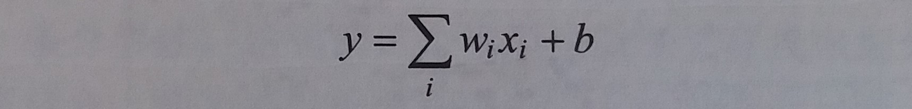

- 线性模型特点：线性模型的最大特点是任意线性模型的组合仍然是线性模型

- 为什么被称为线性模型？
    - 当模型的输入只有一个的时候，x和y形成了二维坐标系上的一条直线
    - 当模型有n个输入时，x和y形成了n+1维空间中的一个平面

- 线性模型局限性：
    - 只通过线性变换，任意层的全连接神经网络和单层神经网络模型的表达能力没有任何区别，而且它们都是线性模型
    - 线性模型只能解决线性可分问题，但是绝大多数问题都是无法线性分割的

- 样例
    - 使用线性模型无法解决线性不可分问题
    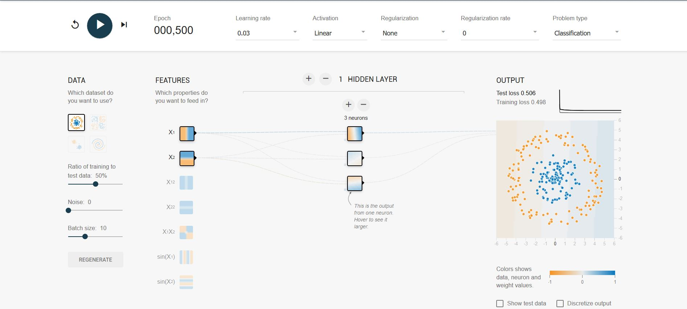

    - 使用线性模型可以解决线性可分问题
    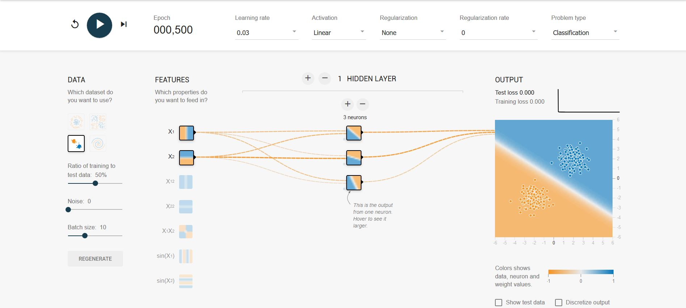

    - 使用非线性模可以解决线性不可分问题
    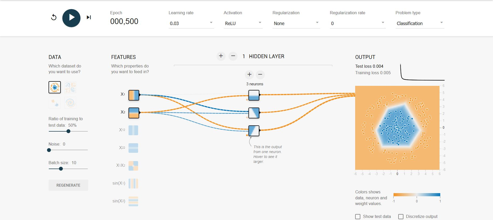

---
#### 4.1.2 激活函数实现去线性化

- 激活函数简介
    - 如果将每个神经元的输出通过一个非线性函数，那么整个神经网络的模型也就不再是线性了
    - 这个非线性函数就是激活函数

- 加入了激活函数和偏置项之后的**神经元**结构
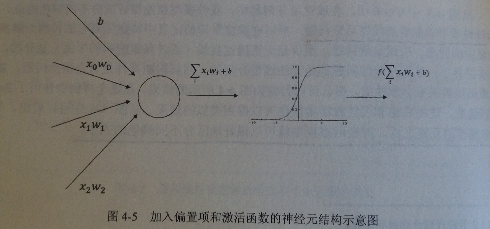

- 常见的非线性激活函数
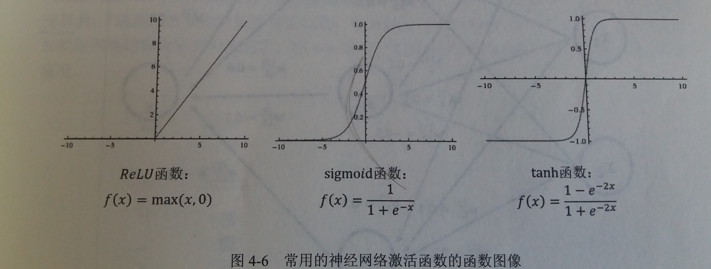
这些激活函数的函数图像都不是一条直线，所以通过这些激活函数，每个节点不再是线性变换，于是整个神经网络模型也就不再是线性的

- 加入了激活函数和偏置项之后的**神经网络**
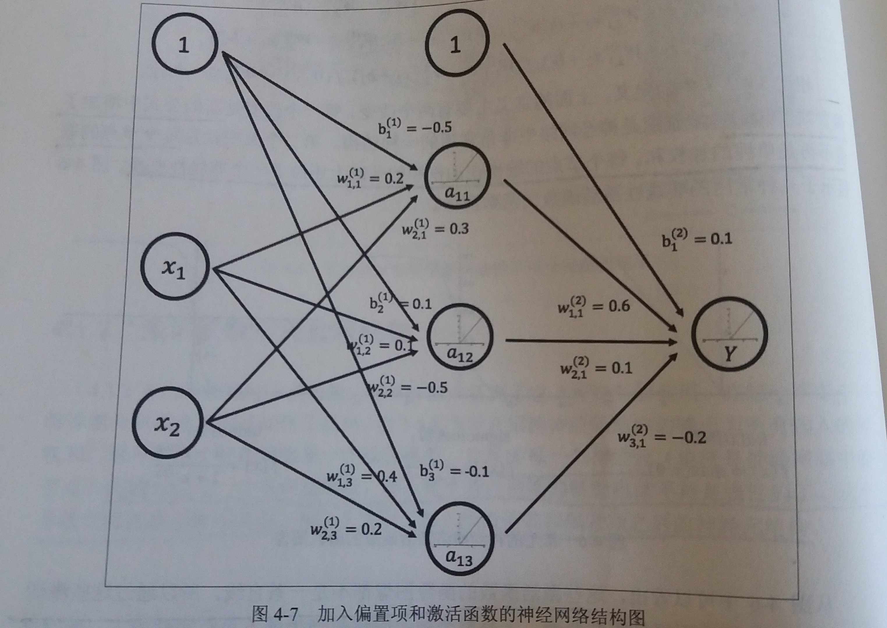
此处偏置项可以表达为一个永远输出为1的节点

- TensorFlow中的激活函数
    - TensorFlow目前提供7种非线性激活函数
    - 比较常见的有
        - `tf.nn.relu`
        - `tf.sigmoid`
        - `tf.tanh`
    - 使用激活函数
        ````
        a = tf.nn.relu(tf.matmul(x, w1) + biases1)
        y = tf.nn.relu(tf.matmul(a, w2) + biases2)  
        ````
---
#### 4.1.3 多层网络解决异或运算

- 异或运算：如果两个输入的符号相同时则输出为0，否则输出为1

- 感知机：可以理解为单层的神经网络


- 感知机的缺陷：感知机无法模拟异或运算
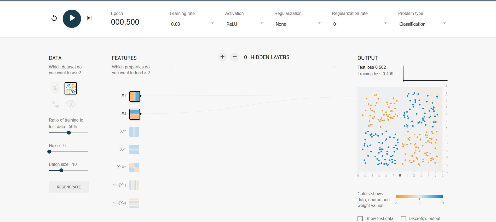

- 当加入隐藏层以后，异或问题可以得到很好的解决
    - 如图
    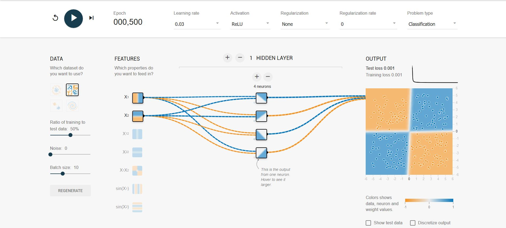
    - 另外
        - 隐藏层的4个节点中，每个节点都有一个角是黑色的
        - 这4个隐藏节点可以被认为代表了从输入特征中抽取的更高维的特征
        - 深层神经网络实际上有组合特征提取的功能
        - 这个特性对于解决不易提取特征向量的问题有很大帮助
---
### 4.2 损失函数定义

- 损失函数简介：神经网络模型的效果以及优化的目标是通过损失函数来定义的
---
#### 4.2.1 经典损失函数

- 分类问题
    - 简介：分类问题希望解决的是将不同的样本分到事先定义好的类别中
    - 例子
        - 判断一个零件是否合格的问题就是一个二分类问题
        - 手写体数字识别问题可以归纳为一个十分类问题
    - 如何通过神经网络解决分类问题
        - 通过神经网络解决多分类问题最常用的方法是设置n个输出节点，其中n为类别的个数
        - 在理想情况下，如果一个样本属于类别k，那么这个类别所对应的输出节点的输出值应该为1，而其他节点的输出都为0
        - 例如：[1,0,0,0,0,0,0,0,0]
    - 如何判断一个输出向量和期望的向量有多接近？
        - 交叉熵(cross entropy)是常用的评判方法之一
    
- 交叉熵
    - 用途：交叉熵用来判断一个输出向量与期望的向量有多接近
    - 公式
        - 给定两个概率分布p和q，通过q来表示p的交叉熵为
        
    - 简介
        - 交叉熵刻画的是两个概率分布之间的距离
        - 也可以理解为，交叉熵刻画的是通过概率分布q来表达概率分布p的困难程度
        - 交叉熵越小，两个概率分布越接近


- 但是神经网络的输出却不一定是一个概率分布，如何将神经网络前向传播得到的结果也变成概率分布呢？
    
    - 如图
    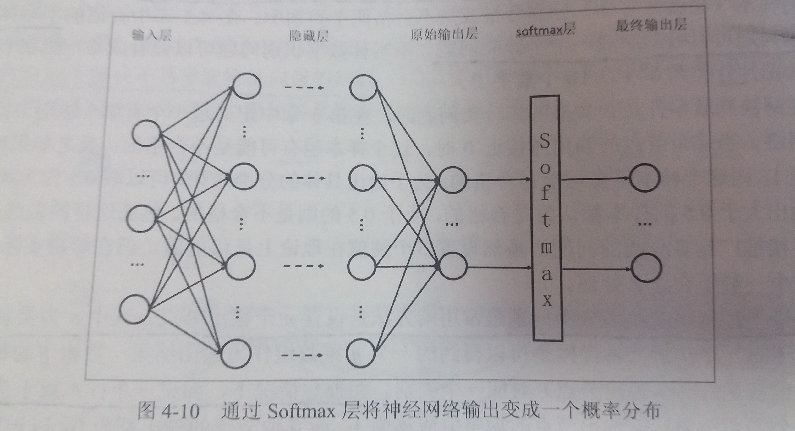
    
    - 使用Softmax函数作为一层额外的处理层，把神经网络的输出变成一个概率分布

    - 假设原始的神经网络输出为y1,y2,...yn，那么经过Softmax回归处理之后的输出为：
    

    - 原始神经网络的输出被用作置信值来生成新的输出，而新的输出满足概率分布的所有要求

    - 这个新的输出可以理解为经过神经网络的推导，一个样例为不同类别的概率分别是多大。
    
    - 这样就把神经网络的输出也变成了一个概率分布，从而可以通过交叉熵来计算预测的概率分布与真实答案的概率分布之间的距离了

- 使用TensorFlow实现交叉熵
    - 样例代码
        ````py
        cross_entropy = - tf.reduce_mean(y_ * 
        tf.log(tf.clip_by_value(y,1e-10,1.0)))
        ````
    - 解读
        - `y_`：代表正确结果，来自于输入
        - `y`：代表预测结果，来自于神经网络的运算结果
        - `tf.clip_by_value()`：把一个张量中的数值限制在一个范围之内
        - `tf.log()`：对张量中所有元素依次求对数
        - `*`：不是矩阵乘法，而是张量之间的每个元素相乘，矩阵乘法要用`tf.matmul()`
        - `tf.reduce_mean()`：对张量中所有元素求平均，并输出一个数字作为平均值
    - 另外
        - 可以直接使用`tf.nn.softmax_cross_entropy_with_logits()`函数实现上述过程
        ````py
        cross_entropy = tf.nn.softmax_cross_entropy_with_logits(
            labels=y_, logits=y)
        ````
- 回归问题
    - 简介
        - 回归问题解决的是对具体数值的预测
        - 这些问题需要预测的不是一个事先定义好的类别，而是一个任意实数
        - 解决回归问题的神经网络一般只有一个输出节点，这个节点的输出值就是预测值
    - 回归问题常用损失函数-----均方误差(MSE,mean squared error)
    
---
#### 4.2.2 自定义损失函数

- TensorFlow支持自定义损失函数，使得神经网络优化的结果更加接近实际问题的需求

- 不同的损失函数会对训练得到的模型产生重大影响

- `tf.greater()`：输入两个向量，比较两个输入向量中每个元素的大小，并返回比较结果

- `tf.where()`：当第一参数为True时，选择第二个参数的值，否则选择第三个参数的值
---
### 4.3 神经网络优化算法
---
- 梯度下降算法(gradient decent)
    - 主要用于优化单个参数的取值
    - 目前还没有一个通用的方法可以对任意损失函数直接求解**最佳的参数**取值
    - 梯度下降算法会迭代式更新参数，不断沿着梯度的反方向让参数朝着总损失更小的方向更新

- 反向传播算法(backpropagation)
    - 反向传播算法给出了一个高效的方式在所有参数上使用梯度下降算法，从而使神经网络模型在训练数据上的损失函数尽可能小
    - 换句话说，反向传播算法就是根据定义好的损失函数优化神经网络中参数的取值，从而使神经网络模型在训练数据集上的损失函数达到一个较小值

- 参数的梯度：可以通过求偏导的方式计算

- 学习率(learning rate)：用来定义每次参数更新的幅度

- 神经网络的优化过程可以分为两个阶段
    1. 通过前向传播算法计算得到的预测值，并将预测值和真实值做对比得出两者之间的差距(损失函数)
    2. 通过反向传播算法计算损失函数对每一个参数的梯度，再根据梯度和学习率使用梯度下降算法更新每一个参数

- 需要注意
    - 梯度下降算法并不能保证被优化的函数达到全局最优解
        - 当函数的偏导为0，参数就不再更新了，因此梯度下降算法只能达到局部最优解
    - 在海量训练数据下，要计算所有训练数据的损失函数是非常消耗时间的
        - 使用随机梯度下降算法加速训练过程：这个算法优化的不是在全部训练数据上的损失函数，而是在每一轮迭代，随机优化某一条训练数据上的损失函数
        - 但是在某一条数据上损失函数更小并不代表在全部数据上损失函数更小，甚至无法达到局部最优

- 为了综合梯度下降算法和随机梯度下降算法的优缺点
    - 每次计算一小部分训练数据的损失函数，这一小部分数据被称为一个batch
    - 通过矩阵运算，每次在一个batch上优化神经网络的参数并不会比单个数据慢太多
    - 每次使用一个batch可以大大减少收敛所需要的迭代次数，同时可以使收敛到的结果更加接近梯度下降的效果
---
### 4.4 神经网络进一步优化
---
#### 4.4.1 学习率的设置

- 学习率：学习率决定参数每次更新的幅度

- 背景
    - 如果学习率过大，可能会导致参数在极优值的两侧来回移动
    - 如果学习率过小，虽然能保证收敛性，但是会大大降低优化速度

- 指数衰减法
    - 简介：可以在训练的前期使用较大的学习率来快速得到一个比较优的解，然后随着迭代的继续逐步减小学习率，使得模型在训练的后期表现较为稳定
    - 公式：`decayed_learning_rate = learning_rate * decay_rate ** (global_step / decay_steps)`
        - `decayed_learning_rate`：每一轮优化时使用的学习率
        - `learning_rate`：事先设置的初始学习率
        - `decay_rate`：衰减系数
        - `global_steps`：当前的迭代轮数
        - `decay_steps`：衰减速度
        - 例如：若 `decay_rate = 0.96`，并且 `decay_steps = 100`；则说明每训练100轮，学习率就是100轮之前的0.96倍
    - TensorFlow的实现：`tf.train.expoential_decay()`
        ````py
        # 声明一个变量
        global_step = tf.Variable(0)

        # 通过exponential_decay函数生成学习率
        learning_rate = tf.train.exponential_decay(0.1, global_step, 100, 0.96, staircase=True)

        # 使用指数衰减的学习率，首先在构造器中传入learning_rate,然后在minimize函数中传入global_step将自动更新global_step参数，从而使得学习率也得到相应更新

        learning_step = tf.train.GradientDescentOptimizer(learning_rate).minimize(loss_func, global_step=global_step) 
        ````
- 对 `tf.train.exponential`中`staircase` 参数的解释
    - 如图
    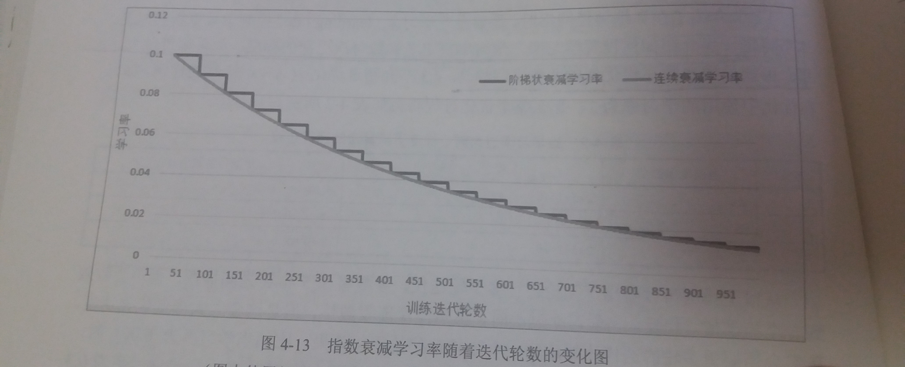
    - 通过设置 `staircase` 参数可以选择不同的衰减方式
    - 当 `staircase = False` 时
        - 学习率随迭代轮次变化的趋势如图中灰线所示
    - 当 `staircase = True` 时
        - global_step / decay_steps会被转化为整数
        - 如图中黑线所示
        - 在这种设置下，`decay_steps` 通常代表了完整的使用一遍训练数据所需要的迭代轮数，这种设置的常用场景是每完整过完一遍训练数据，学习率就减小一次，这可以使得训练数据集中的所有数据对模型训练有相等的作用

- 一般来说初始学习率、衰减系数和衰减速度都是根据经验设置的
---
#### 4.4.2 过拟合问题

- 背景
    - 在真实的应用中想要的并不是让模型尽量模拟训练数据的行为，而是希望通过训练出来的模型对**未知数据**给出判断
    - 模型在训练数据上的表现并不一定代表了它在**未知数据**上的表现

- 过拟合问题
    - 简介：过拟合指的是当一个模型过于复杂之后，它可以很好地记忆每个训练数据中随机噪音的部分而“忘记”了要去学习训练数据中通用的趋势
    - 问题：过度拟合训练数据中的随机噪音虽然可以得到非常小的损失函数，但是对于未知数据可能无法做出可靠的判断
    - 例子
        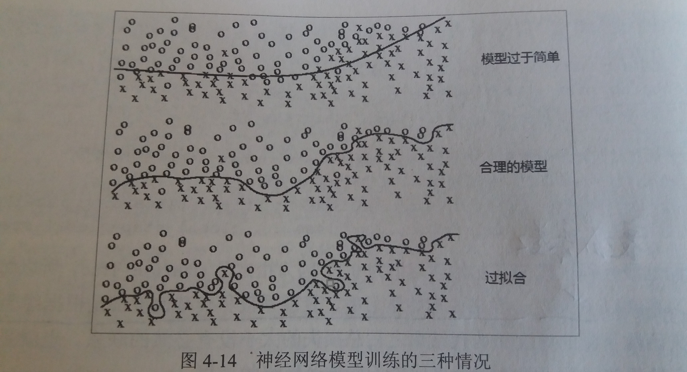
        1. 第一种情况下，模型过于简单，无法刻画问题的趋势，也可以称之为欠拟合
        2. 第二个模型是合理的，它既不会过于关注训练数据中的噪音，又能比较好地刻画问题的整体趋势
        3. 第三个模型就是过拟合了，虽然它完美地划分了不同形状的点，但是这样的划分并不能很好地对未知数据做出判断，因为它**过度拟合**了训练数据中的噪音而忽视了问题的整体规律

- 正则化（regularization）
    - 背景：为了避免过拟合问题，可以使用正则化
    - 思想：
        - 正则化的思想就是在损失函数中加入刻画模型复杂程度的指标：`R(w)`
        - 其中 `w` 表示每条边上的权重，也就是训练的参数
        - 这样通过限制权重的大小，使得模型不能任意拟合训练数据中的随机噪音

- 常用的刻画模型复杂度的函数 `R(w)` 有两种
    - L1正则化
        - 公式
        
        - 特点
            - 会使参数变得更稀疏，即有大量参数取值为0
            - L1正则化的计算公式不可导，因此优化更加复杂，优化方法更多
    - L2正则化
        - 公式
        
        - 特点
            - 不会使参数变得稀疏
            - L2正则化的计算公式可导，因此优化要更加简洁

- TensorFlow实现正则化
    - TensorFlow提供了`tf.contrib.layers.l2_regularizer()`函数，它可以返回一个函数，这个函数可以计算一个给定参数的L2正则化项的值
    - 样例
        ````py
        w = tf.Variable(tf.random_normal([2, 1], stddev=1, seed=1))
        y = tf.matmul(x, w)
        # 在损失函数中额外添加R(w)项，以正则化
        # 其中lamb表示正则化的权重
        loss = tf.reduce_mean(tf.square(y_ - y)) + tf.contrib.layers.l2_regularizer(lamb)(w)
        ````
    - 样例2：使用集合来为多层复杂神经网络添加正则项
        ````py
        import tensorflow as tf
        from numpy.random import RandomState


        # 随机生成并返回一层神经网络边上的权重，并将这个权重的L2正则化损失加入名称为'losses'的集合中
        # lamb代表权重的大小
        def get_weight(shape, lamb):
            # 生成一个变量
            var = tf.Variable(tf.random_normal(shape), dtype=tf.float32)

            # 将新生成变量的L2正则化损失项加入集合
            tf.add_to_collection('losses', tf.contrib.layers.l2_regularizer(lamb)(var))

            # 返回这个变量
            return var

        # 打印所有可训练参数的值
        def print_weights(sess):
            variables = tf.get_collection(tf.GraphKeys.TRAINABLE_VARIABLES)
            print()
            for var in variables:
                print()
                print(var)
                print(sess.run(var))


        # 定义输入数据
        x = tf.placeholder(tf.float32, (None, 2))
        y_ = tf.placeholder(tf.float32, (None, 1))

        # 定义batch的大小
        batch_size = 8

        # 定义每层网络中神经元的个数
        layer_dimension = [2, 10, 10, 10, 1]
        # 神经网络的层数
        n_layers = len(layer_dimension)

        # 当前层的神经元，初始化为输入层神经元
        cur_layer = x
        # 当前层的神经元个数
        in_dimension = layer_dimension[0]

        # 通过一个循环来生成5层全连接的神经网络
        for i in range(1, n_layers):
            # 下一层的节点个数
            out_dimension = layer_dimension[i]
            # 根据这一层和下一层的节点数来生成当前层的权重，并将L2正则添加到集合
            weight = get_weight([in_dimension, out_dimension], 0.001)
            bias = tf.Variable(tf.constant(0.1, shape=[out_dimension]))

            # 使用RuLU激活函数计算下一层的节点，并赋值给当前层变量
            cur_layer = tf.nn.relu(tf.matmul(cur_layer, weight) + bias)
            # 进入下一层之前将下一层的节点数更新为当前层的节点数
            in_dimension = layer_dimension[i]

        # 使用均方误差作为损失函数
        mes_loss = tf.reduce_mean(tf.square(y_ - cur_layer))

        # 将均方误差添加到losses集合
        tf.add_to_collection('losses', mes_loss)

        # 将loess集合中所有元素相加，得到最后的损失函数（包括MSE和正则）
        loss = tf.add_n(tf.get_collection('losses'))

        global_step = tf.Variable(0)

        # 使用指数衰减来设置学习率
        learning_rate = tf.train.exponential_decay(0.1, global_step, 100, 0.96, staircase=True)

        # 定义优化过程,带指数衰减的梯度下降算法
        learning_step = tf.train.GradientDescentOptimizer(learning_rate).minimize(loss, global_step=global_step)

        # 使用Numpy生成随机数
        rdm = RandomState(1)

        # 定义数据集的大小
        dataset_size = 128

        # 使用前面的随机数来生成输入数据X和Y
        X = rdm.rand(dataset_size, 2)
        Y = [[int(x1+x2 < 1)] for (x1, x2) in X]

        # 开启会话开始运算
        with tf.Session() as sess:
            # 初始化所有变量
            init_op = tf.global_variables_initializer()
            sess.run(init_op)

            # 打印所有参数
            print_weights(sess)

            # 设置训练的轮数
            STEPS = 5000

            # 开启迭代的训练过程
            for i in range(STEPS):

                # 设置当前组batch的开始值和结束值
                start = (i * batch_size) % dataset_size
                end = min(start+batch_size, dataset_size)

                # 训练神经网络并更新参数
                sess.run(learning_step, feed_dict={
                    x: X[start:end],
                    y_: Y[start:end]
                })

            # 打印所有参数
            print_weights(sess)

        ````
---
#### 滑动平均模型

- 背景：在采用随机梯度下降算法训练神经网络时，使用滑动平均模型在很多应用中都可以在一定程度上提高最终模型在测试数据上的表现

- TensorFlow使用`tf.train.ExponentialMovingAverage()`来实现滑动平均模型

- 衰减率(decay)：用来控制模型更新的速度，decay越大模型就越趋于稳定

- 影子变量
    - 公式：`shadow_variable = decay * shadow_variable + (1 - decay) * variable`
        - `shadow_variable`：影子变量
        - `variable`：待更新的变量
        - `decay`：衰减率
    - 影子变量的初始值为相应变量的初始值，而每次运行变量更新后，影子变量会按照上述公式来更新自己的值

- 动态设置衰减率
    - 背景：为了使得模型在训练前期可以更新得更快
    - 简介
        - 通过设置`num_updates`参数来动态设置`decay`的大小
        - 此时衰减率为 `min(decay, ((1 + num_updates) / (10 + num_updates))`

- 样例代码
    ````py
    import tensorflow as tf

    # 定义一个变量用来计算滑动平均，这个变量的初始值为0
    v1 = tf.Variable(0, dtype=tf.float32)
    # 定义step用来模拟神经网络迭代的轮数，可以用来动态控制衰减率
    step = tf.Variable(0, trainable=False)

    # 定义一个滑动平均的类，初始化时给定了衰减率(0.99)和控制衰减率的变量step
    ema = tf.train.ExponentialMovingAverage(0.99, step)

    # 定义一个更新变量滑动平均的操作，这里需要给定一个列表，每次执行这个操作时，这个列表中的变量都会被更新
    maintain_averages_op = ema.apply([v1])

    with tf.Session() as sess:
        init_op = tf.global_variables_initializer()
        sess.run(init_op)

        # 通过ema.average(v1)来获得滑动平均之后变量的取值
        print(sess.run([v1, ema.average(v1)]))

        # 更新变量v1的值到5
        sess.run(tf.assign(v1, 5))
        # 使用maintain_averages_op操作来更新v1的滑动平均值
        sess.run(maintain_averages_op)
        print(sess.run([v1, ema.average(v1)]))

        # 更新变量step的值到10000
        sess.run(tf.assign(step, 10000))
        # 更新变量v1的值到10
        sess.run(tf.assign(v1, 10))
        # 使用maintain_averages_op操作来更新v1的滑动平均值
        sess.run(maintain_averages_op)
        print(sess.run([v1, ema.average(v1)]))

        # 再次更新滑动平均值
        sess.run(maintain_averages_op)
        print(sess.run([v1, ema.average(v1)]))

    ````
---