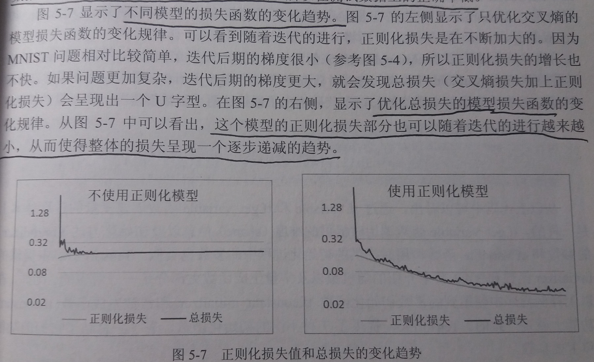

## 第五章 MNIST数字识别问题

### 5.1 MNIST数据处理

- MNIST数据集简介
    - MNIST数据集是NIST数据集的一个子集，是一个手写体数字识别数据集

    - 它包含60000张图片作为训练数据，10000张图片作为测试数据

    - 在MNIST数据集中的每一张图片都代表了0~9中的一个数字，图片的大小都是28*28，且数字都出现在图片的正中间

    - 如图所示，一张数字图片及和它对应的像素矩阵
    

    - 为了验证模型训练的效果，一般还需要从训练数据中划分出一部分数据作为验证数据

- TensorFlow中的封装（基本过时）
    - 样例程序
        ````py
        from tensorflow.examples.tutorials.mnist import input_data

        # 载入MNIST数据集，如果指定地址/path/to/MNIST_data下没有已经下载好的数据
        # 那么TensorFlow会自动下载数据
        mnist = input_data.read_data_sets("/path/to/MNIST_data/", one_hot=True)

        # 打印训练集的数据量
        print("Training data size:", mnist.train.num_examples)

        # 打印验证集的数据量
        print("Validating data size:", mnist.validation.num_examples)

        # 打印测试集的数据量
        print("Testing data size:", mnist.test.num_examples)

        # 打印训练集中某一样例数据
        # 一张数字图片，它的每个像素点都被放到这个长度为128一维数组中
        # 如果一个像素点越接近于1，则颜色越深；越接近于0，则颜色越浅
        print("Example training data:", mnist.train.images[0])

        # 打印训练集中某一样例数据的标记
        # 一个大小为10的一维数组
        # 数组中其中一个数字取值为1,其余数字取值为0
        print("Example training data label:", mnist.train.labels[0])

        # 设置batch的大小
        batch_size = 100

        # 使用next_batch()方法来获得下一个batch的输入数据
        xs, ys = mnist.train.next_batch(batch_size)

        print("X shape:", xs.shape)
        print("Y shape", ys.shape)
        ````
    - 解读
        1. MNIST数据集被划分为train、validation和test三个数据集

        2. 处理后的每一张图片都是一个长度为784的一维数组，因为神经网络的输入是一个特征向量，所以在此把一张二维图像的像素矩阵放到一个一维数组中可以方便TensorFlow将图片的像素矩阵提供给神经网络的输入层
        
        3. 像素矩阵中元素的取值范围为[0,1]，它代表了颜色的深浅
        
        4. 使用mnist.train.next_batch()可以从所有的训练数据中读取一小部分作为一个batch

---

### 5.2 神经网络模型训练及不同模型结果对比
---
#### 5.2.1 TensorFlow训练神经网络

- 回顾主要概念
    - 在神经网络的结构上，深度学习一方面需要使用激活函数实现神经网络模型的去线性化，另一方面需要使用一个或多个隐藏层使得神经网络的结构更深，以解决复杂问题
    - 使用带指数衰减的学习率设置、使用正则化来避免过度拟合，以及使用滑动平均模型可以使得神经网络模型更加健壮

- 直接给出[代码](https://github.com/T0UGH/TFDemo/blob/master/5.2.1MNISTSolution.py)
    ````py
    import tensorflow as tf
    from tensorflow.examples.tutorials.mnist import input_data

    # MNIST数据集相关参数
    INPUT_NODE = 784                # 输入层的节点数，等于图片的像素
    OUTPUT_NODE = 10                # 输出层的节点数，等于类别的数目。0-9这10个数字，所以是10

    # 配置神经网络的参数
    LAYER1_NODE = 500               # 隐藏层节点数，这里只有一个隐藏层，此隐藏层有500个节点
    BATCH_NODE = 100                # batch的大小
    LEARNING_RATE_BASE = 0.8        # 基础的学习率
    LEARNING_RATE_DECAY = 0.99      # 学习率的衰减率
    REGULARIZATION_RATE = 0.0001    # 正则化项在损失函数中的系数
    TRAINING_STEPS = 30000          # 训练轮数
    MOVING_AVERAGE_DECAY = 0.99     # 滑动平均衰减率


    # 给定神经网络的输入和所有参数，计算神经网络的前向传播结果
    # 在这里定义了一个使用ReLU激活函数的三层全连接网络
    # 通过一层隐藏层实现了多层网络结构
    # 通过ReLU激活函数实现了去线性化
    # 并且提供了对滑动平均模型的支持，此时需要传入avg_class
    def inference(input_tensor, avg_class, weights1, biases1, weights2, biases2):
        if avg_class is None:
            layer1 = tf.nn.relu(tf.matmul(input_tensor, weights1) + biases1)
            return tf.matmul(layer1, weights2) + biases2
        else:
            layer1 = tf.nn.relu(tf.matmul(input_tensor, avg_class.average(weights1)) + avg_class.average(biases1))
            return tf.matmul(layer1, avg_class.average(weights2)) + avg_class.average(biases2)


    # 训练模型的整个过程
    def train(mnist):

        # 首先定义输入数据，使用了placeholder
        x = tf.placeholder(tf.float32, [None, INPUT_NODE], 'x-input')
        y_ = tf.placeholder(tf.float32, [None, OUTPUT_NODE], 'y-input')

        # 定义并初始化隐藏层的权重和偏置值
        weight1 = tf.Variable(tf.truncated_normal([INPUT_NODE, LAYER1_NODE], stddev=0.1))
        biases1 = tf.Variable(tf.constant(0.1, shape=[LAYER1_NODE]))
        # 定义并初始化输出层的权重和偏置值
        weight2 = tf.Variable(tf.truncated_normal([LAYER1_NODE, OUTPUT_NODE], stddev=0.1))
        biases2 = tf.Variable(tf.constant(0.1, shape=[OUTPUT_NODE]))

        # 调用inference函数计算前向传播的结果(不带滑动平均的)
        y = inference(x, None, weight1, biases1, weight2, biases2)

        # 定义一个储存训练轮数的变量，用于滑动平均模型和指数衰减的学习率
        global_step = tf.Variable(0, trainable=False)

        # 给定滑动平均衰减率和训练轮数的变量，初始化滑动平均类
        variable_averages = tf.train.ExponentialMovingAverage(MOVING_AVERAGE_DECAY, global_step)

        # 在所有代表神经网络参数的变量上使用滑动平均，即所有tf.trainable_variables集合中的变量
        variable_averages_op = variable_averages.apply(tf.trainable_variables())

        # 计算使用了滑动平均之后的前向传播结果
        average_y = inference(x, variable_averages, weight1, biases1, weight2, biases2)

        # 计算交叉熵
        cross_entropy = tf.nn.sparse_softmax_cross_entropy_with_logits(logits=y, labels=tf.argmax(y_, 1))
        # 对整个batch的交叉熵求平均
        cross_entropy_mean = tf.reduce_mean(cross_entropy)

        # 生成一个L2正则化损失函数
        regularizer = tf.contrib.layers.l2_regularizer(REGULARIZATION_RATE)
        # 计算模型的正则化损失
        regularization = regularizer(weight1) + regularizer(weight2)

        # 将交叉熵和正则化损失求和，得到模型的总损失
        loss = cross_entropy_mean + regularization

        # 设置指数衰减的学习率
        learning_rate = tf.train.exponential_decay(
            LEARNING_RATE_BASE,                     # 基础的学习率，随着迭代的进行，在这个学习率的基础上递减
            global_step,                            # 之前定义的用于储存训练轮数的变量
            mnist.train.num_examples/BATCH_NODE,    # 衰减速度
            LEARNING_RATE_DECAY)                    # 衰减系数，若衰减速度为100，衰减系数为.96，则说明每过100轮学习率变成之前的.96

        # 使用梯度下降算法定义优化过程
        train_step = tf.train.GradientDescentOptimizer(learning_rate).minimize(loss, global_step)

        # 因为使用了滑动平均模型，所以在训练神经网络时，每过一遍数据既需要通过反向传播来更新神经网络中的参数，又需要
        # 更新每个参数的滑动平均值。为了一次完成多个操作，可以使用tf.group()来将两个计算合并起来执行
        train_op = tf.group(train_step, variable_averages_op)

        # 检验对于batch中的每个数据，预测结果是否等于标记值
        correct_prediction = tf.equal(tf.argmax(average_y, 1), tf.argmax(y_, 1))
        # 计算模型在这一组数据中的正确率
        accuracy = tf.reduce_mean(tf.cast(correct_prediction, tf.float32))

        # 开启一个会话，开始计算过程
        with tf.Session() as sess:

            # 对所有变量进行初始化
            tf.global_variables_initializer().run()

            # 准备验证数据，一般可以在神经网络的训练过程中通过验证数据来大致判断停止的条件和评判训练的效果
            validate_feed = {
                x: mnist.validation.images,
                y_: mnist.validation.labels
            }

            # 准备测试数据，作为模型训练结束之后的最终评价标准
            test_feed = {
                x: mnist.test.images,
                y_: mnist.test.labels
            }

            # 迭代地训练神经网络
            for i in range(TRAINING_STEPS):

                # 每过1000轮使用验证数据评价模型
                if i % 1000 == 0:
                    validate_acc = sess.run(accuracy, feed_dict=validate_feed)
                    print("After %d training step(s), validation accuracy using average model is %g" % (i, validate_acc))

                # 每轮都提取一个batch的数据，训练神经网络
                xs, ys = mnist.train.next_batch(BATCH_NODE)
                sess.run(train_op, feed_dict={x: xs, y_: ys})

            # 在训练结束之后，在测试数据上检测神经网络模型的最终正确率
            test_acc = sess.run(accuracy, feed_dict=test_feed)
            print("After %d training step(s), test accuracy using average model is %g" % (i, test_acc))


    # 主程序入口
    def main(argv=None):
        mnist = input_data.read_data_sets("/tmp/data", one_hot=True)
        train(mnist)


    # TensorFlow提供的一个主程序入口，tf.app.run()会调用上面定义的main函数
    if __name__ == '__main__':
        tf.app.run()

    ````
- 输出
    ````
    After 0 training step(s), validation accuracy using average model is 0.0778
    After 1000 training step(s), validation accuracy using average model is 0.9758
    After 2000 training step(s), validation accuracy using average model is 0.9802
    After 3000 training step(s), validation accuracy using average model is 0.9818
    After 4000 training step(s), validation accuracy using average model is 0.983
    After 5000 training step(s), validation accuracy using average model is 0.9826
    After 6000 training step(s), validation accuracy using average model is 0.9828
    After 7000 training step(s), validation accuracy using average model is 0.9838
    After 8000 training step(s), validation accuracy using average model is 0.985
    After 9000 training step(s), validation accuracy using average model is 0.9836
    After 10000 training step(s), validation accuracy using average model is 0.9852
    After 11000 training step(s), validation accuracy using average model is 0.9836
    After 12000 training step(s), validation accuracy using average model is 0.9846
    After 13000 training step(s), validation accuracy using average model is 0.9852
    After 14000 training step(s), validation accuracy using average model is 0.9846
    After 15000 training step(s), validation accuracy using average model is 0.9842
    After 16000 training step(s), validation accuracy using average model is 0.9844
    After 17000 training step(s), validation accuracy using average model is 0.9846
    After 18000 training step(s), validation accuracy using average model is 0.9848
    After 19000 training step(s), validation accuracy using average model is 0.9844
    After 20000 training step(s), validation accuracy using average model is 0.9848
    After 21000 training step(s), validation accuracy using average model is 0.9844
    After 22000 training step(s), validation accuracy using average model is 0.9842
    After 23000 training step(s), validation accuracy using average model is 0.9852
    After 24000 training step(s), validation accuracy using average model is 0.9852
    After 25000 training step(s), validation accuracy using average model is 0.9854
    After 26000 training step(s), validation accuracy using average model is 0.9852
    After 27000 training step(s), validation accuracy using average model is 0.9854
    After 28000 training step(s), validation accuracy using average model is 0.9852
    After 29000 training step(s), validation accuracy using average model is 0.9856
    After 29999 training step(s), test accuracy using average model is 0.9837
    ````
---
#### 5.2.2 使用验证数据集判断模型效果

- 超参数
    - 简介：一般无法通过学习获得，由程序员根据经验手动调整
    - 例如：初始学习率、学习率衰减率、隐藏层节点数、迭代轮数等等

- 如何设置超参数的取值
    - 配置这些超参数都是需要通过实验去调整的

- 使用测试数据来选取超参数会导致神经网络模型过度拟合测试数据，从而导致失去对未知数据的预测能力

- 为了评估神经网络模型在不同超参数下的效果，一般会从训练数据中抽取一部分作为验证数据，使用验证数据来验证模型效果

- 交叉验证
    - 另一种验证模型效果的方式
    - 适用于训练数据不够的情况，但整体速度偏慢

- 在MNIST问题上，完全可以通过模型在验证数据上的表现来判断一个模型的优劣


- 一般来说选取的验证数据分布越接近测试数据分布，模型在验证数据上的表现越可以体现模型在测试数据上的表现
---
#### 5.2.3 不同模型效果比较

- 五种优化方法：
    - 在神经网络的设计上，需要使用**激活函数**和**多层隐藏层**。
    - 在神经网络优化时，可以使用**指数衰减的学习率**、**加入正则化的损失函数**以及**滑动平均模型**

- 在超参数相同的情况下，使用不同优化方法，经过30000训练迭代后，得到的最终模型的正确率

    - 神经网络的结构对最终模型的效果有本质性的影响
    - 使用滑动平均、指数衰减和正则化带来的影响并不特别明显

- 由于MNIST问题本身相对简单，所以滑动平均、指数衰减和正则化带来的提升效果并不特别明显

- 正则化和不使用正则化的损失函数的变化趋势


---

### 5.3 变量管理
---

- 简介
    - TensorFlow提供了通过变量名称来创建或者获得一个变量的机制

    - 通过这个机制，在不同的函数中可以直接通过变量的名字来使用变量，而不需要将变量通过参数的形式到处传递

    - TensorFlow中通过变量名称获得变量的机制主要通过`tf.get_variable()`和`tf.variable_scope()`来实现

- 当`tf.get_variable()`用来创建变量时，它和tf.Variable()的功能是基本等价的
    ````py
    # 下面两个定义是等价的
    v = tf.get_variable("v", shape=[1], initializer=tf.constant_initializer(1.0))
    v = tf.Variable(tf.constant(1.0, shape=[1], name="v"))
    ````

- 对于`tf.get_variable()`，变量名称是一个必填的参数
    - `tf.get_variable()`会根据这个名字去创建或者获取变量
    - `tf.get_variable()`首先试图去创建一个名字为v的参数，如果创建失败，这个程序会报错，这是为了避免无意识的变量复用造成的问题

- 如果需要通过`tf.get_variable()`获得一个已经创建的变量，需要通过`tf.variable_scope()`函数来生成一个上下文管理器，并明确指定在这个上下文管理器中，`tf.get_variable()`将直接获得已经生成的变量
    ````py
    import tensorflow as tf

    # 在名字为foo的命名空间内创建名字为v的变量
    with tf.variable_scope("foo"):
        v = tf.get_variable(
            "v", [1], initializer=tf.constant_initializer(1.0)
        )

    # 因为在命名空间foo中已经存在名字为v的变量，所以以下代码将会报错
    with tf.variable_scope("foo"):
        v = tf.get_variable("v", [1])

    # 在生成上下文管理器时，将参数reuse设置为True。这样tf.get_variable()函数将直接获得已经声明的变量
    with tf.variable_scope("foo", reuse=True):
        v1 = tf.get_variable("v", [1])
        print(v == v1)      # 输出为True，代表v,v1表示的是相同的TensorFlow中变量

    # 将参数reuse设置为True时，tf.variable_scope将只能获得已经创建过的变量，因为在命名空间bar中还没有创建变量v，所以下面会报错
    with tf.variable_scope("bar", reuse=True):
        v3 = tf.get_variable("v", [1])
    ````
    - 当`tf.variable_scope()`函数使用参数reuse=True生成上下文管理器时，这个上下文管理器内所有的`tf.get_variable()`函数会直接获得已经创建的变量,如果变量不存在就会报错
    - 当`tf.variable_scope()`函数不使用参数reuse=True生成上下文管理器时，`tf.get_variable()`会创建新的变量，如果同名的变量已经存在,则`tf.get_variable()`函数会报错

- `tf.variable_scope()`不仅生成上下文管理器，也会生成命名空间，在命名空间中创建的所有变量名称都会带上这个命名空间名的前缀
    ````py
    import tensorflow as tf

    v1 = tf.get_variable("v", [1])
    print(v1.name)          # 输出v:0, "v"为变量名称, ":0"表示此变量是生成这个变量的运算的第一个输出

    with tf.variable_scope("foo"):
        v2 = tf.get_variable("v", [1])
        print(v2.name)      # 输出foo/v:0, 因为在名字空间中，所以变量名称前会加入名字空间的名称

    with tf.variable_scope("foo"):
        with tf.variable_scope("bar"):
            v3 = tf.get_variable("v", [1])
            print(v3.name)  # 输出foo/bar/v:0,
        v4 = tf.get_variable("v1", [1])
        print(v4.name)      # 输出foo/v1:0

    # 创建一个名称为空的名字空间，并设置reuse=True
    with tf.variable_scope("", reuse=True):

        # 可以直接通过带名字空间名称的变量名来获取其他名字空间下的变量
        # 比如这里直接通过指定"foo/bar/v"，来获得名字空间foo/bar下的v变量
        v5 = tf.get_variable("foo/bar/v", [1])
        print(v5 == v3)     # 输出True

        v6 = tf.get_variable("foo/v", [1])
        print(v6 == v2)     # 输出True
    ````
---

### 5.4 TensorFlow模型持久化

- 为了让训练结果可以复用，需要将训练得到的神经网络模型持久化
---
#### 5.4.1 持久化代码实现

- 简介：TensorFlow提供了`tf.train.Saver`类来保存和还原一个神经网络模型

- 保存TensorFlow计算图的代码样例
    ````py
    import tensorflow as tf

    # 声明两个变量并计算它们的和
    v1 = tf.Variable(tf.constant(1.0, shape=[1]), name="v1")
    v2 = tf.Variable(tf.constant(2.0, shape=[1]), name="v2")
    result = v1 + v2

    init_op = tf.global_variables_initializer()

    # 声明tf.train.Saver类用来保存模型
    saver = tf.train.Saver()

    with tf.Session() as sess:
        
        sess.run(init_op)
        
        # 将模型保存到D:PycharmProjects/TFDemo/data/model/540/model.ckpt
        saver.save(sess, "/PycharmProjects/TFDemo/data/model/540/model.ckpt")
    ````
- TensorFlow模型的文件组织
    - TensorFlow模型一般会存在后缀为`.ckpt`的文件中
    - 在这个文件目录下会出现三个文件
        - `model.ckpt.meta`：保存TensorFlow计算图的结构
        - `model.ckpt`：保存TensorFlow程序中每一个变量的取值
        - `checkpoint`：保存了一个目录下所有的模型文件列表
    - 如图
    

- 加载已经保存的TensorFlow模型的代码样例
    ````py
    import tensorflow as tf

    # 使用和保存模型代码中一样的方式来声明变量
    v1 = tf.Variable(tf.constant(1.0, shape=[1]), name="v1")
    v2 = tf.Variable(tf.constant(2.0, shape=[1]), name="v2")
    result = v1 + v2

    saver = tf.train.Saver()

    with tf.Session() as sess:
        # 通过saver.restore加载v1和v2的具体取值，不需要初始化过程
        saver.restore(sess, "/PycharmProjects/TFDemo/data/model
        /540/model.ckpt")
        print(sess.run(result))
    ````
    - 此处并没有运行变量的初始化过程，而是将变量的值通过已经保存的模型加载进来

- 直接加载已经持久化的图的代码样例（为了不重复定义图上的运算）
    ````py
    import tensorflow as tf

    # 直接加载持久化的图
    saver = tf.train.import_meta_graph("/PycharmProjects/TFDemo/data/model/540/model.ckpt.meta")

    # 通过名字获得result变量
    result = tf.get_default_graph().get_tensor_by_name("add:0")

    with tf.Session() as sess:

        # 通过saver.restore加载v1和v2的具体取值，不需要初始化过程
        saver.restore(sess, "/PycharmProjects/TFDemo/data/model/540/model.ckpt")
        # 输出[3.]
        print(sess.run(result))
    ````

- 如何在保存和加载时对变量进行重命名
    - 在声明 `tf.train.Saver` 类时可以提供一个列表来指定需要保存或者加载的变量，比如 `saver = tf.train.Saver([v1])`
    - TensorFlow通过字典将模型保存时的变量名和需要加载的变量联系起来
    ````py
    import tensorflow as tf

    # 这里声明的变量名称与已经保存的模型中的变量的名称不同
    v1 = tf.Variable(tf.constant(1.0, shape=[1]), name="other-v1")
    v2 = tf.Variable(tf.constant(2.0, shape=[1]), name="other-v2")
    result = v1 + v2

    # 若直接使用tf.train.Saver()加载模型会报变量找不到的错误
    # 使用一个字典来重命名变量可以加载原来的模型
    saver = tf.train.Saver({"v1": v1, "v2": v2})

    with tf.Session() as sess:
        saver.restore(sess, "/PycharmProjects/TFDemo/data/model/540/model.ckpt")
        print(sess.run(result))
    ````

- 使用Saver保存和加载滑动平均
    - 每个变量的滑动平均值是通过影子变量维护的，所以要获得变量的滑动平均值实际上就是获得这个影子变量的取值。
    - 如果在加载模型时直接将影子变量映射到变量自身，那么在使用训练好的模型时就不需要再调用函数来获得变量的滑动平均值了

- 将计算图中的变量及其取值通过常量的形式保存
    - 背景：使用`Saver`会保存运行TensorFlow程序所需要的全部信息，但是有时并不需要某些信息。比如，在离线预测时，只需要知道如何从神经网络的输入层经过前向传播计算得到输出层即可，而不需要类似于变量初始化、模型保存等辅助节点的信息
    - 解决：TensorFlow提供了`convert_variables_to_constants()`将计算图中的变量及其取值通过常量的方式保存
        - 导出为常量
            ````py
            import tensorflow as tf
            from tensorflow.python.framework import graph_util

            v1 = tf.Variable(tf.constant(1.0, shape=[1]), name="v1")
            v2 = tf.Variable(tf.constant(2.0, shape=[1]), name="v2")
            result = v1 + v2

            init_op = tf.global_variables_initializer()

            with tf.Session() as sess:
                sess.run(init_op)
                # 导出当前计算图的GraphDef部分，只需要这一部分就可以完成从输入层到输出层的计算过程
                graph_def = tf.get_default_graph().as_graph_def()
                
                # 将图中的变量及其取值转化为常量，同时将图中不必要的节点去掉
                output_graph_def = graph_util.convert_variables_to_constants(sess, graph_def, ['add'])
                
                # 将导出的模型存入文件
                with tf.gfile.GFile("/PycharmProjects/TFDemo/data/model/547/combined_model.pb", "wb") as file:
                    file.write(output_graph_def.SerializeToString())
            ````
        - 导入常量
            ````py
            import tensorflow as tf
            from tensorflow.python.platform import gfile

            with tf.Session() as sess:
                model_filename = "/PycharmProjects/TFDemo/data/model/547/combined_model.pb"

                # 读取保存的模型文件，将文件解析为对应的GraphDef Protocal Buffer
                with gfile.FastGFile(model_filename, 'rb') as file:
                    graph_def = tf.GraphDef()
                    graph_def.ParseFromString(file.read())

                # 将graph_def中保存的图加载到当前的图中。
                # return_elements给出了返回的张量的名称。在保存时给出的是计算节点的名称，所以为"add"，在加载时给出的是张量的名称，所以为add:0
                result = tf.import_graph_def(graph_def, return_elements=["add:0"])
                # 输出[3.0]　　
                print(sess.run(result))
                        ````
---
#### 5.4.2 持久化原理及数据格式

- 当调用`Saver.save()`时，会生成4个文件。TensorFlow持久化通过这四个文件实现

- MetaGraphDef(model.ckpt.meta)
    - TensorFlow通过元图(MetaGraph)来记录计算图中节点的信息以及一些运行所需的元数据
    - 具体信息
        - meta_info_def：记录计算图中的元数据和TensorFlow中使用的所有运算的信息
        - graph_def：记录TensorFlow计算图上的节点信息
        - saver_def：记录持久化模型时所需的一些参数信息
        - collection_def：在TensorFlow计算图中可以维护不同集合，而维护这些集合的底层实现是通过collection_def实现的

- model.ckpt.data和model.ckpt.index
    - 用于持久化TensorFlow中所有变量的取值
    - 其中model.ckpt.data是通过SSTable格式存储的，可以理解为一个键值对列表

- checkpoint
    - 维护由Saver类的某个实例持久化的所有TensorFlow模型文件的文件名
    - 用Saver自动生成且自动维护
---


