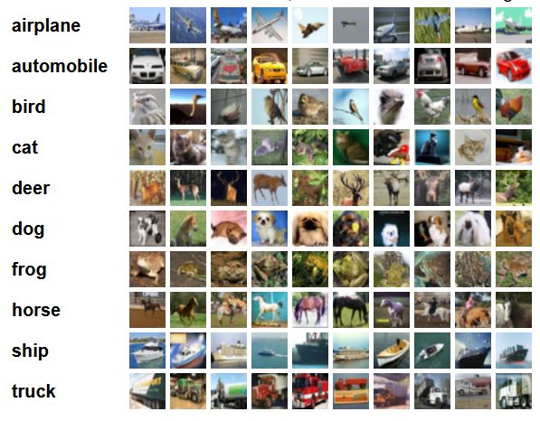
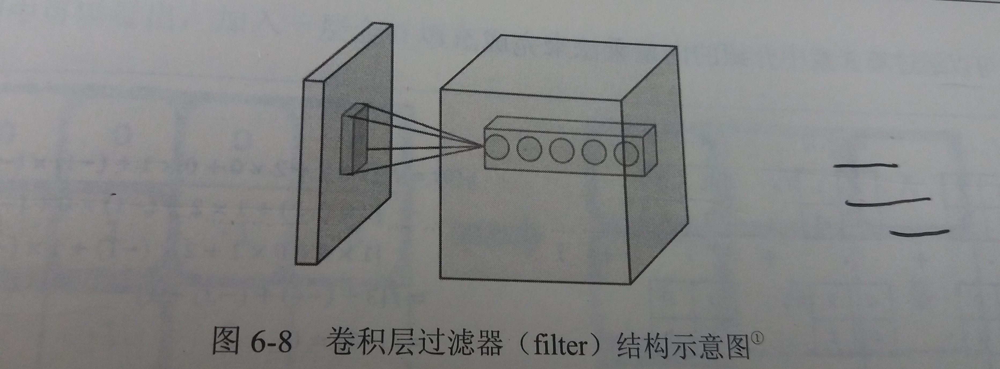
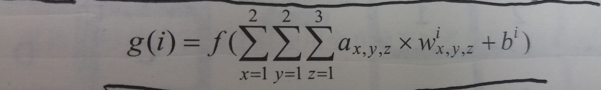
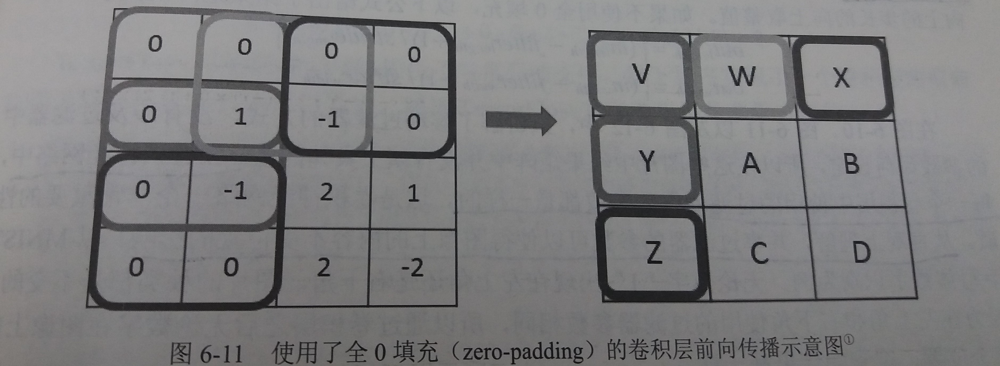
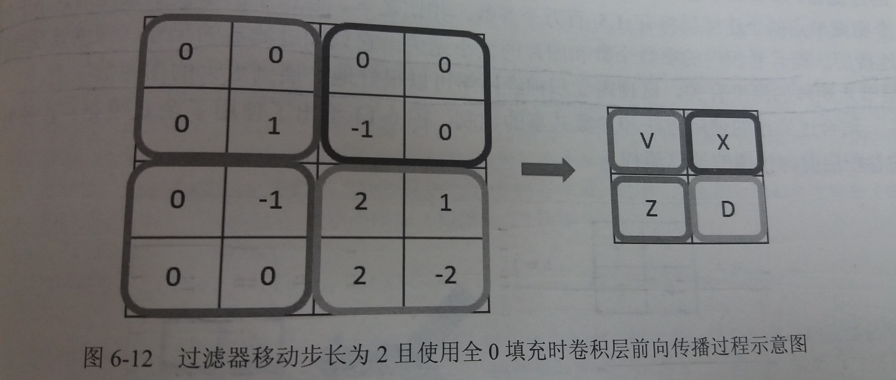
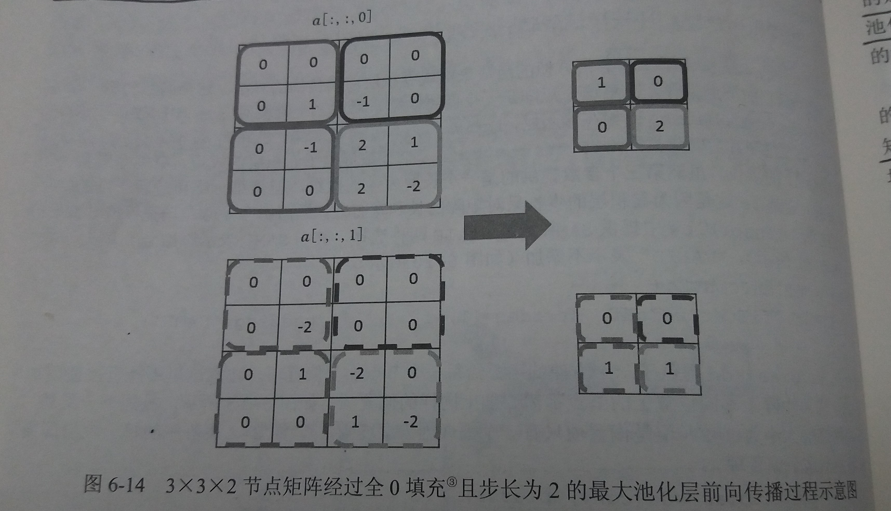
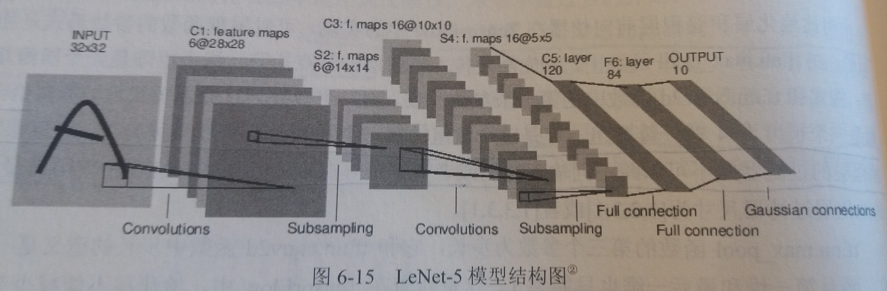
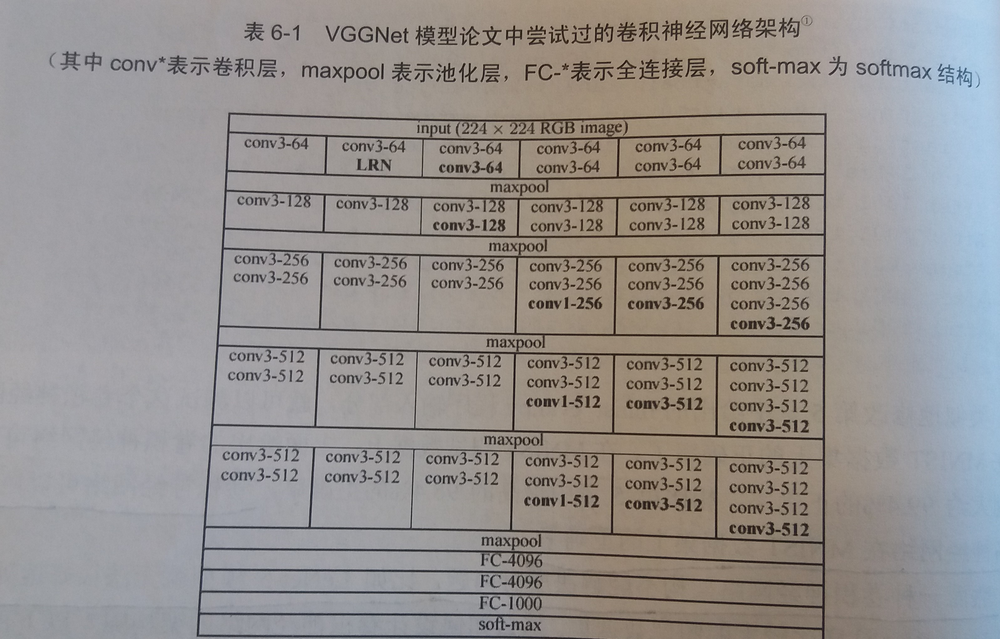
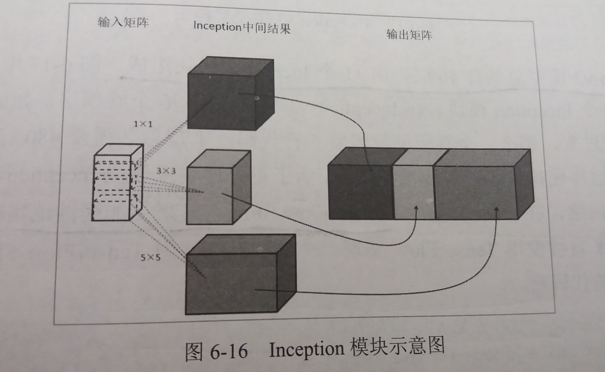
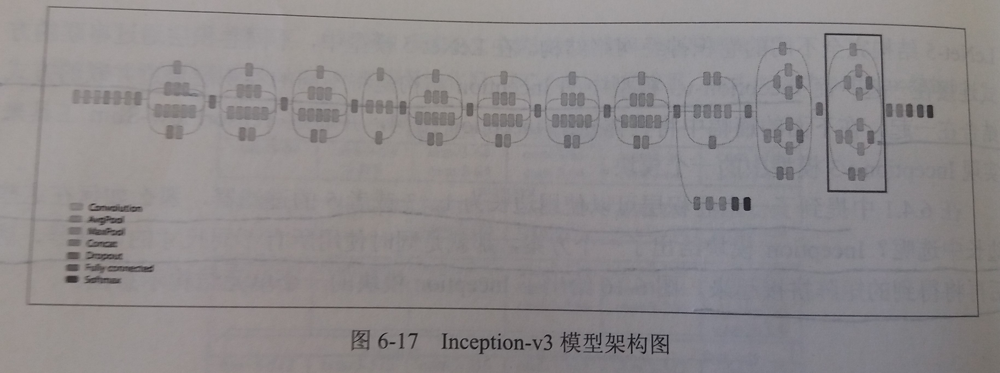

## 第6章 图像识别与卷积神经网络

卷积神经网络(Convolutional Neural Network,CNN)

### 6.1 图像识别问题简介及经典数据集

- 图像识别问题简介
    - 图像识别问题希望借助计算机程序来处理、分析和理解图片中的内容，使得计算机可以从图片中自动识别各种不同模式的目标和对象
    - 卷积神经网络是图像识别问题取得突破性进展的最主要技术支持
    - 在NNIST上，相比其他算法，卷积神经网络可以得到更低的错误率。而且通过卷积神经网络达到的错误率已经非常接近人工标注的错误率

- CIFAR数据集
    - CIFAR数据集分为CIFAR-10和CIFAR-100两个问题，它们都是图像词典项目(Visual Dictionary)中800万张图片的一个子集
    - CIFAR数据集中的图片为32*32的彩色图片
    - CIFAR-10问题收集了来自10个不同种类的60000张图片
    - [CIFAR官网](https://www.cs.toronto.edu/~kriz/cifar.html)提供不同格式的数据集下载
    - CIFAR-10中的图片大小都是固定的且每一张图片中仅包含一个种类的实体
    - 样例
    

- MNIST和CIFAR相对于真实环境的2个问题
    1. 现实生活中的图片分辨率要远高于32*32，而且图像的分辨率也不会是固定的
    2. 现实生活中的物体类别很多，而且一张图片中不会只出现一个种类的物体

- ImageNet图像数据库
    - ImageNet是一个基于WordNet的大型图像数据库
    - 在ImageNet中，将近1500万图片被关联到了WorkNet的大约20000个名词同义词集上
    - 如图

        - 在这张图片上用几个矩形框出了不同实物的轮廓
        - 在物体识别问题上，一般将用于框出实体的矩形称为bounding box

- ILSVRC：ImageNet每年都举办图像识别相关的竞赛(ImageNet Large Scale Visual Recognition Challenge)

- top-N正确率：指的是图像识别算法给出前N个答案的正确率作为比较的方法，其中N的取值一般为3或5

### 6.2 卷积神经网络简介


- 全连接神经网络：每两层之间的所有节点都是有边相连的

- 卷积神经网络简介
    - 卷积神经网络也是通过一层一层的节点组织起来的
    - 卷积神经网络中的每个节点都是一个神经元
    - 卷积神经网络中相邻两层之间只有部分节点相连
    - 为了展示每一层神经元的维度，一般会将每一层卷积层的节点组织成一个三维矩阵
    - 卷积神经网络的输入层就是图像的原始像素，而输出层中的每一个节点代表了不同类别的可信度，这和全连接神经网络的输入输出是一致的

- 卷积与全连接的区别：神经网络中相邻两层的连接方式

- 为什么全连接神经网络无法很好地处理图像数据
    - 使用全连接神经网络处理图像的最大问题在于全连接的参数太多
    - 参数增多除了导致计算速度减慢，还很容易导致过拟合问题

- 在卷积神经网络的前几层，每一层的节点都被组织成一个三维矩阵
    - 比如处理CIFAR-10数据集中的图片时，可以将输入层组织为一个32*32*3的三维矩阵

- 一个卷积神经网络主要由以下5种结构组成
    1. 输入层
        - 输入层是整个神经网络的输入，在处理图像的卷积神经网络中，它一般代表了一张图片的像素矩阵
        - 三维矩阵的长和宽代表了图像的大小，而三维矩阵的深度代表了图像的色彩通道
            - 比如黑白图片的深度为1，而在RGB色彩模式下，图像的深度为3
        - 卷积神经网络通过不同的神经网络结构将上一层的三维矩阵转化为下一层的三维矩阵
    2. 卷积层
        - 卷积层中每个节点的输入只是上一层神经网络的一小块，这个小块常用的大小有3*3或者5*5
        - 卷积层试图将神经网络中的每一小块进行更加深入地分析从而得到抽象程度更高的特征
        - 一般来说，通过卷积层处理过的节点矩阵会变得更深
    3. 池化层(Pooling)
        - 池化层神经网络不会改变三维矩阵的深度，但是它可以缩小矩阵的大小
        - 池化操作可以认为是将一张分辨率较高的图片转化为分辨率较低的图片
        - 通过池化层，可以进一步缩小最后全连接层中节点的个数，从而达到减少整个神经网络中参数的目的
    4. 全连接层
        - 我们可以将卷积层和池化层看作自动图像特征提取的过程
        - 在特征提取完成之后，仍然需要使用全连接层来完成分类任务
    5. Softmax层
        - Softmax层主要用于分类问题
        - 通过Softmax层，可以得到当前样例属于不同种类的概率分布情况

### 6.3 卷积神经网络常用结构

#### 6.3.1 卷积层

- 过滤器
    - 如图
    
    - 简介
        - 过滤器可以将当前层神经网络上的一个子节点矩阵转化为下一层神经网络上的一个单位节点矩阵
        - 单位节点矩阵指的是一个长和宽都为1，但深度不限的节点矩阵
    - 过滤器的尺寸
        - 过滤器所处理的节点矩阵的长和宽都是由人工指定的，这个节点矩阵的尺寸也被称为过滤器的尺寸
        - 过滤器处理的矩阵深度和当前层神经网络节点矩阵的深度是一致的，也就是深度上不做切割，有多深就用多深
    - 过滤器的深度
        - 过滤器另一个需要人工指定的设置是输出的单位节点矩阵的深度，这个设置称为过滤器的深度

- 过滤器的前向传播过程
    - 简介：就是通过左侧小矩阵中的节点计算出右侧单位矩阵中节点的过程
    - 计算公式
        - 公式
        
        - 解读
            - `ax,y,z`：过滤器中节点`(x,y,z)`的取值
            - `f`：激活函数
            - `wix,y,z`：输入节点`(x,y,z)`相对于第`i`个输出节点的权重参数
            - `bi`：第`i`个输出节点的偏置值
        - 假设矩阵的size为2 * 2 * 3,过滤器的深度为5，则参数值为：2 * 2 * 3 * 5 + 5 = 65

- 卷积层结构的前向传播过程
    - 简介：卷积层结构的前向传播过程就是通过将一个过滤器从神经网络的左上角移动到右下角，并且在移动中计算每一个对应的单位矩阵得到的
    - 过滤器每移动一次，可以计算得到一个单位矩阵（深度为k），将这些数值拼接成一个新的矩阵，就完成了卷积层前向传播的过程

- 如何避免卷积层运算前后矩阵尺寸的变化
    - 背景：当过滤器的大小不为1*1时，卷积层前向传播得到的矩阵的尺寸要小于当前层矩阵的尺寸
    - 解决：为了避免尺寸的变化，可以在当前层矩阵的边界上加入全0填充
    - 如图
    

- 通过设置过滤器移动的步长来调整结果矩阵的大小
    - 如图：显示了当移动步长为2且使用全0填充时，卷积层前向传播的过程
    

- 卷积层中过滤器参数的设定
    - 简介：在卷积神经网络中，每一个卷积层中使用的过滤器中的参数都是一样的
    - 直观理解：从直观上理解，共享过滤器的参数可以使得图像上的内容不受位置的影响
    - 好处
        - 共享每一个卷积层中过滤器中的参数可以巨幅减少神经网络上的参数
        - 卷积层的参数个数要远远小于全连接层
        - 而且卷积层的参数个数和图片的大小无关，它只和过滤器的尺寸、深度以及当前层节点矩阵的深度有关，这使得卷积神经网络可以很好的扩展到更大的图像数据上

- 举例：使用全0填充、步长为2的卷积层前向传播的计算流程
    - 如图
    

- 使用TensorFlow实现前向传播过程
    ````py
    import tensorflow as tf

    # 通过tf.get_variable的方式创建过滤器的权重变量
    # 卷积层的参数个数只和过滤器的尺寸、深度以及当前层节点矩阵的深度有关
    # 此处声明的四维矩阵，前两维表示的是过滤器的尺寸，第三维是当前层的深度，第四维是过滤层的深度
    filter_weight = tf.get_variable('weights', [5, 5, 3, 16], initializer=tf.truncated_normal_initializer(stddev=0.1))

    # 通过tf.get_variable的方式创建过滤器的偏重变量
    # 偏置向量的大小等于过滤层的深度
    # 原因是卷积层不仅共享权重矩阵也共享偏置向量
    biases = tf.get_variable('biases', [16], initializer=tf.constant_initializer(0.1))

    # tf.nn.conv2d是用来实现卷积层前向传播的函数
    # 第一个参数为当前层的节点矩阵，这个矩阵为4维矩阵，后面三个维度表示一个节点矩阵，前面一个维度表示一个输入batch
    # 第二个参数为卷积层的权重
    # 第三个参数为不同维度上的步长，是一个长度为4的数组，但第一维和最后一维都是1，因为步长只对矩阵的长和宽有用
    # 第四个参数为填充方法，其中"SAME"表示全0填充，"VALID"表示不填充
    conv = tf.nn.conv2d(input, filter_weight, strides=[1, 1, 1, 1], padding='SAME')

    # tf.nn.bias_add提供了方便的函数给每一个节点加上偏置项
    # 这里不能直接使用加法
    # 因为矩阵上不同位置上的节点都需要加上同样的偏置项，但是偏置项只有一个数
    bias = tf.nn.bias_add(conv, biases)

    # 最后使用ReLU激活函数完成去线性化
    actived_conv = tf.nn.relu(bias)
    ````
---
#### 6.3.2 池化层(Pooling Layer)
- 池化层背景
    - 池化层可以非常有效地缩小矩阵的尺寸，从而减少最后全连接层中的参数
    - 使用池化层既可以加快计算速度也有防止过拟合问题的作用

- 池化层的前向传播过程
    - 简介
        - 池化层前向传播也是通过移动一个类似过滤器的结构完成的
        - 但是池化层过滤器中的计算不是节点的加权和，而是采用更加简单的最大值或者平均值运算
    - 几种池化层结构
        - 最大池化层(max pooling)
            - 使用最大值操作
            - 被使用最多
        - 平均池化层(average pooling)
            - 使用平均值操作

- 池化层过滤器参数设定：也需要人工设定过滤器的大小、是否使用全0填充以及过滤器移动的步长等设置

- 池化层和卷积层过滤器的区别
    - 卷积层使用的过滤器是横跨整个深度的，而池化层使用的过滤器只影响一个深度上的节点
    - 池化层的过滤器除了在长和宽两个维度移动，还需要在深度这个维度上移动

- 举例：
    - 如图所示，是一个最大池化层前向传播计算过程
    

- TensorFlow实现最大池化层的前向传播算法
    - 代码
    ````py
    # tf.nn.max_pool实现了最大池化层的前向传播过程
    # 第一个参数代表输入矩阵
    # ksize提供了过滤器的尺寸，其中第一维和最后一维必须是1，因为过滤器不可以跨不同输入样例或者节点矩阵的深度
    # strides提供了步长信息，同样的，第一维和最后一维也只能是1
    # padding表示填充方式
    pool = tf.nn.max_pool(actived_conv, ksize=[1, 3, 3, 1], strides=[1, 2, 2, 1], padding='SAME')
    ````
    - 除此之外，TensorFlow还提供了`tf.nn.avg_pool`来实现平均池化层

### 6.4 经典卷积网络模型

- 通过这些经典的卷积神经网络的网络结构可以总结出卷积神经网络结构设计的一些模式
---
#### 6.4.1 LeNet-5 模型

- 简介：
    - LeNet-5模型是第一个成功应用于数字识别问题的卷积神经网络
    - 在MNIST数据集上，LeNet-5模型可以达到99.2%的正确率
    - LeNet-5模型总共有7层

- 结构图


- 结构详解
    1. 第一层：卷积层
        - 输入：原始的图像像素，大小为`32*32*1`
        - 过滤器：尺寸为`5*5`，深度为`6`，不使用全0填充，步长为`1`
        - 输出：因为不使用全0填充，所以输出大小为`28*28*6`
    2. 第二层：池化层
        - 输入：第一层的大小为`28*28*6`的输出矩阵
        - 过滤器：大小为`2*2`，步长也为`2`，采用max过滤器
        - 输出：输出矩阵的大小为`14*14*6`
    3. 第三层：卷积层
        - 输入：第二层的大小为`14*14*6`的输出矩阵
        - 过滤器：尺寸为`5*5`，深度为`16`，不使用全0填充，步长为`1`
        - 输出：输出矩阵的大小为`10*10*16`
    4. 第四层：池化层
        - 输入：第三层的大小为`10*10*16`的输出矩阵
        - 过滤器：大小为`2*2`，步长为`2`，采用max过滤器
        - 输出：输出矩阵的大小为`5*5*16`
    5. 第五层：全连接层
        - 输入：第四层的大小为`5*5*16`的输出矩阵
        - 如何将卷积层的输出转化为全连接的输入?
            - 就是将这个三维数组，转化为一维数组，很简单
            - 将`5*5*16`矩阵中的节点拉成一个向量
            - 所以实际的输入为长度为400的一维数组
        - 输出：输出节点有120个
    6. 第六层：全连接层
        - 本层的输入节点个数为120个，输出节点为84个
    7. 第七层：全连接层
        - 这一层输出节点为10个，然后再使用softmax处理得到分类问题的答案即可

- 代码实现：完整的LeNet-5的TensorFlow实现
````py
import os
import tensorflow as tf
import numpy as np
from tensorflow.examples.tutorials.mnist import input_data

INPUT_NODE = 784                # 输入节点数
OUTPUT_NODE = 10                # 输出节点数

IMAGE_SIZE = 28                 # 图片的长和宽
NUM_CHANNELS = 1                # 图片的频道数，单色频道为1，多色RGB频道为3
NUM_LABELS = 10                 # 标记的数目

# 第一层卷积层的尺寸和深度
CONV1_DEEP = 32                 # 第一层卷积层的深度
CONV1_SIZE = 5                  # 第一层卷积层的尺寸

# 第二层卷积层的尺寸和深度
CONV2_DEEP = 64                 # 第二层卷积层的深度
CONV2_SIZE = 5                  # 第二层卷积层的尺寸

# 全连接层的节点数
FC_SIZE = 512

BATCH_NODE = 200                # batch的大小
LEARNING_RATE_BASE = 0.1        # 基础的学习率
LEARNING_RATE_DECAY = 0.99      # 学习率的衰减率
REGULARIZATION_RATE = 0.0001    # 正则化项在损失函数中的系数
TRAINING_STEPS = 30000          # 训练轮数

MODEL_SAVE_PATH = "/PycharmProjects/TFDemo/data/model/531/"
MODEL_NAME = "model.ckpt"


# 定义卷积神经网络的前向传播过程
# 这里添加了一个参数regularizer，用来为全连接层添加正则化损失
def inference(input_tensor, regularizer):

    # 声明第一层卷积层并实现前向传播过程
    # 此层的输入为28*28*1的原始MNIST图片像素
    # 因为卷积层使用了全0填充，所以输出为28*28*32的矩阵
    with tf.variable_scope('layer1-conv1'):

        # 定义和初始化第一层的权重和偏置
        conv1_weights = tf.get_variable("weight", [CONV1_SIZE, CONV1_SIZE, NUM_CHANNELS, CONV1_DEEP], initializer=tf.truncated_normal_initializer(stddev=0.1))
        conv1_biases = tf.get_variable("bias", [CONV1_DEEP], initializer=tf.constant_initializer(0.0))

        # 使用边长为5，深度为32的过滤器，过滤器移动的步长为1，且使用全0填充
        conv1 = tf.nn.conv2d(input_tensor, filter=conv1_weights, strides=[1, 1, 1, 1], padding="SAME")

        # 使用ReLu作为激活函数实现去线性化
        relu1 = tf.nn.relu(tf.nn.bias_add(conv1, conv1_biases))

    # 实现第二层池化层的前向传播过程
    with tf.name_scope('layer2-pool1'):

        # 这里使用的是最大池化层
        # 池化层过滤器的尺寸为2，使用全0填充并且步长为2
        pool1 = tf.nn.max_pool(relu1, ksize=[1, 2, 2, 1], strides=[1, 2, 2, 1], padding="SAME")

    # 声明第三层卷积层的变量并实现前向传播过程，与第一层相似
    with tf.variable_scope('layer3-conv2'):
        conv2_weights = tf.get_variable("weight", [CONV2_SIZE, CONV2_SIZE, CONV1_DEEP, CONV2_DEEP], initializer=tf.truncated_normal_initializer(stddev=0.1))
        conv2_biases = tf.get_variable("bias", [CONV2_DEEP], initializer=tf.constant_initializer(0.0))
        conv2 = tf.nn.conv2d(pool1, conv2_weights, strides=[1, 1, 1, 1], padding="SAME")
        relu2 = tf.nn.relu(tf.nn.bias_add(conv2, conv2_biases))

    # 实现第四层池化层的前向传播过程，与第二层相似
    with tf.name_scope('layer4-pool2'):
        pool2 = tf.nn.max_pool(relu2, ksize=[1, 2, 2, 1], strides=[1, 2, 2, 1], padding="SAME")

    # 将第四层池化层的输出转化为第五层全连接层的输入格式
    pool_shape = pool2.get_shape().as_list()
    # 计算出向量的长度
    nodes = pool_shape[1] * pool_shape[2] * pool_shape[3]
    # -1代表的是此位置的参数根据实际情况给出，并不直接提供定值
    reshaped = tf.reshape(pool2, [-1, nodes])

    # 声明第五层全连接层的变量并实现前向传播过程
    with tf.variable_scope('layer5-fc1'):
        fc1_weights = tf.get_variable("weight", [nodes, FC_SIZE], initializer=tf.truncated_normal_initializer(stddev=0.1))
        if regularizer is not None:
            tf.add_to_collection("losses", regularizer(fc1_weights))
        fc1_biases = tf.get_variable("bias", [FC_SIZE], initializer=tf.constant_initializer(0.1))
        fc1 = tf.nn.relu(tf.matmul(reshaped, fc1_weights) + fc1_biases)

    # 声明第六层全连接层的变量并实现前向传播过程
    with tf.variable_scope('layer6-fc2'):
        fc2_weights = tf.get_variable("weight", [FC_SIZE, NUM_LABELS], initializer=tf.truncated_normal_initializer(stddev=0.1))
        if regularizer is not None:
            tf.add_to_collection('losses', regularizer(fc2_weights))
        fc2_biases = tf.get_variable("bias", [NUM_LABELS], initializer=tf.constant_initializer(0.1))
        logit = tf.matmul(fc1, fc2_weights) + fc2_biases

    return logit


# 训练过程
def train(mnist):

    # 首先定义输入数据，使用了placeholder
    x = tf.placeholder(tf.float32, [None, IMAGE_SIZE, IMAGE_SIZE, NUM_CHANNELS], 'x-input')
    y_ = tf.placeholder(tf.float32, [None, OUTPUT_NODE], 'y-input')

    # 定义一个储存训练轮数的变量，用于滑动平均模型和指数衰减的学习率
    global_step = tf.Variable(0, trainable=False)

    # 生成一个L2正则化损失函数
    regularizer = tf.contrib.layers.l2_regularizer(REGULARIZATION_RATE)

    # 调用inference函数计算前向传播的结果
    y = inference(x, regularizer)

    # 计算交叉熵
    cross_entropy = tf.nn.sparse_softmax_cross_entropy_with_logits(logits=y, labels=tf.argmax(y_, 1))
    # 对整个batch的交叉熵求平均
    cross_entropy_mean = tf.reduce_mean(cross_entropy)

    # 将loss集合中所有元素相加，得到所有的正则化损失
    regularization = tf.add_n(tf.get_collection('losses'))

    # 将交叉熵和正则化损失求和，得到模型的总损失
    loss = cross_entropy_mean + regularization

    # 设置指数衰减的学习率
    learning_rate = tf.train.exponential_decay(
        LEARNING_RATE_BASE,                     # 基础的学习率，随着迭代的进行，在这个学习率的基础上递减
        global_step,                            # 之前定义的用于储存训练轮数的变量
        mnist.train.num_examples/BATCH_NODE,    # 衰减速度
        LEARNING_RATE_DECAY)                    # 衰减系数，若衰减速度为100，衰减系数为.96，则说明每过100轮学习率变成之前的.96

    # 使用梯度下降算法定义优化过程
    train_step = tf.train.GradientDescentOptimizer(learning_rate).minimize(loss, global_step)

    # 检验对于batch中的每个数据，预测结果是否等于标记值
    correct_prediction = tf.equal(tf.argmax(y, 1), tf.argmax(y_, 1))
    # 计算模型在这一组数据中的正确率
    accuracy = tf.reduce_mean(tf.cast(correct_prediction, tf.float32))

    # 声明saver用于持久化训练模型
    saver = tf.train.Saver()

    # 开启一个会话，开始计算过程
    def calculate():
        with tf.Session() as sess:

            # 对所有变量进行初始化
            tf.global_variables_initializer().run()

            # 准备验证数据，一般可以在神经网络的训练过程中通过验证数据来大致判断停止的条件和评判训练的效果
            validate_xs, validate_ys = mnist.validation.next_batch(BATCH_NODE)
            reshaped_validate_xs = np.reshape(validate_xs, [BATCH_NODE, IMAGE_SIZE, IMAGE_SIZE, NUM_CHANNELS])
            validate_feed = {
                x: reshaped_validate_xs,
                y_: validate_ys
            }

            # 准备测试数据，作为模型训练结束之后的最终评价标准
            test_xs = mnist.test.images
            reshaped_test_xs = np.reshape(test_xs, [mnist.test.num_examples, IMAGE_SIZE, IMAGE_SIZE, NUM_CHANNELS])
            test_feed = {
                x: reshaped_test_xs,
                y_: mnist.test.labels
            }

            # 迭代地训练神经网络
            for i in range(TRAINING_STEPS):

                # 每过1000轮使用验证数据评价模型并对模型进行持久化
                if i % 1000 == 0:
                    validate_acc = sess.run(accuracy, feed_dict=validate_feed)
                    # 使用saver对模型持久化
                    saver.save(sess, os.path.join(MODEL_SAVE_PATH, MODEL_NAME), global_step=global_step)
                    print("After %d training step(s), validation accuracy using average model is %g" % (i, validate_acc))

                # 如果3000轮正确率还没到90%，就重新生成随机数，重新开始
                if i == 3000 and float(validate_acc) <= 0.9:
                    return False

                # 每轮都提取一个batch的数据，训练神经网络
                xs, ys = mnist.train.next_batch(BATCH_NODE)

                # 将输入的xs调整为四维矩阵，以训练卷积神经网络
                reshaped_xs = np.reshape(xs, [BATCH_NODE, IMAGE_SIZE, IMAGE_SIZE, NUM_CHANNELS])

                sess.run(train_step, feed_dict={x: reshaped_xs, y_: ys})

            # 在训练结束之后，在测试数据上检测神经网络模型的最终正确率
            test_acc = sess.run(accuracy, feed_dict=test_feed)
            print("After %d training step(s), test accuracy using average model is %g" % (i, test_acc))
            return True

    flag = True
    while flag:
        flag = not calculate()


# 主程序入口
def main(args=None):
    mnist = input_data.read_data_sets("/PycharmProjects/TFDemo/data/MNIST", one_hot=True)
    train(mnist)


# TensorFlow提供的一个主程序入口，tf.app.run()会调用上面定义的main函数
if __name__ == '__main__':
    tf.app.run()
````
- 经典的用于图片分类问题的卷积网络架构
    - 公式：输入层 -> (卷积层+ -> 池化层? )+ -> 全连接层+
    - 解释
        - “卷积层+”
            - 代表一层或多层卷积层
            - 大部分卷积神经网络一般最多连续使用三层卷积层
        - “池化层？”
            - 代表没有或者一层池化层
            - 池化层虽然可以起到减少参数防止过拟合的作用，但是在部分论文中也发现可以直接通过调整卷积层步长来完成
            - 所以有些卷积神经网络没有池化层
        - 卷积神经网络在输出之前一般会经过1-2个全连接层
    - 举例：LeNet-5模型结构
        - 输入层 -> 卷积层 -> 池化层 -> 卷积层 -> 池化层 -> 全连接层 ->全连接层 -> 输出层

- VGGNet
    - 简介：Very Deep Convolutional Networks for Large-Scale Image Recognization
    - 尝试过的不同神经网络结构
    

- 每一层卷积层中参数的配置
    - 尺寸
        - VGGNet中过滤器尺寸一般为3或1
        - LeNet-5中使用尺寸为5的过滤器
        - 一般卷积层过滤器边长不会超过5
    - 深度
        - 在过滤器的深度上，大部分卷积神经网络都采用逐层递增的方式
        - 在VGGNet中一般每经过一次池化层，卷积层过滤器的深度就乘2
    - 步长
        - 卷积层的步长一般为1，但有些模型也会使用2或者3

- 每一层池化层中参数的配置
    - 一般采用最大池化层
    - 过滤器的尺寸一般为2或者3
    - 步长也一般为2或者3
---
#### 6.4.2 Inception-v3 模型

- Inception-v3简介
    - Inception-v3模型中的Inception结构是将不同的卷积层通过并联的方式结合在一起
    - 卷积层可以使用边长为1、3、5的过滤器，Inception同时使用所有不同尺寸的过滤器，然后再将矩阵拼接起来

- Inception模块的思想
    - 如图
    
    - Inception模块会首先使用不同尺寸的过滤器处理输入矩阵
    - 不同的矩阵代表了Inception模块中的一条计算路径
    - 虽然过滤器的大小不同，但如果所有的过滤器都使用全0填充且步长为1，那么前向传播得到的结果矩阵的长和宽与输入矩阵一致
    - 这样经过不同过滤器处理的结果矩阵可以拼接为一个更深的矩阵

- Inception-v3模型的架构
    - 如图
    
    - Inception-v3模型总共有46层，由11个Inception模块组成
    - 在Inception-v3模型中有大概96个卷积层

- TensorFlow-Slim工具
    - 可以用来更加简洁地实现卷积神经网络
    - 代码对比
        ````py
        import tensorflow.contrib.slim as slim
        import tensorflow as tf

        # 直接使用TensorFlow原始API实现卷积层
        with tf.variable_scope('scope-name'):
            weights = tf.get_variable('weights', [32, 32, 1, 5], initializer=tf.truncated_normal_initializer(stddev=0.1))
            biases = tf.get_variable('biases', [5], initializer=tf.constant_initializer(0.0 ))
            # 这里用input代表上一层的输入，并不是实际存在的变量
            conv = tf.nn.conv2d(input, weights, strides=[1, 1, 1, 1], padding="SAME")
            relu = tf.nn.relu(tf.nn.bias_add(conv, biases))

        # 使用slim实现卷积层
        # slim.conv2d函数有3个必填参数
        # 第一个参数为输入矩阵
        # 第二个参数为当前卷积层过滤器的深度
        # 第三个参数为过滤器的尺寸
        # 可选参数有过滤器移动的步长，是否使用全0填充，激活函数的选择，变量的命名空间等
        net = slim.conv2d(input, 32, [3, 3])
        ````

- 使用Slim工具实现Inception-v3中某个模块的前向传播
    ````py
    import tensorflow as tf
    import tensorflow.contrib.slim as slim

    # slim.arg_scope函数可以用于设置默认的参数取值
    # 第一个参数是一个函数列表
    # 后面的参数都是可选参数，代表默认的参数取值
    # 在函数列表中的所有函数将使用默认的参数取值
    # 例如：在调用slim.conv2d(net, 320, [1,1])函数时会自动加上stride=1和padding='SAME'的参数
    # 如果在函数调用时指定了stride，那么默认的stride不会被调用
    # 这进一步减少了代码冗余
    with slim.arg_scope([slim.conv2d, slim.max_pool2d, slim.avg_pool2d], stride=1, padding='SAME'):

        # 这里省略了Inception-v3其他模块的代码，并假设net代表上一次的输出结果
        net = tf.placeholder(tf.float32, [None, 32, 32, 1], 'x-input')

        # 为一个Inception模块声明一个统一的变量命名空间
        with tf.variable_scope('Mixed_7c'):

            # 为Inception模块中每一条路径声明一个命名空间
            with tf.variable_scope('Branch_0'):
                branch_0 = slim.conv2d(net, 320, [1, 1], scope='Conv2d_0a_1x1')

            # Inception模块的第二条路径，这条计算路径上的结构本身也是一个Inception结构
            with tf.variable_scope('Branch_1'):
                branch_1 = slim.conv2d(net, 384, [1, 1], scope='Conv2d_0a_1x1')
                branch_1 = tf.concat(3, [
                    slim.conv2d(branch_1, 384, [1, 3], scope='Conv2d_0b_1x3'),
                    slim.conv2d(branch_1, 384, [3, 1], scope='Conv2d_0c_3x1')
                ])

            # Inception模块的第三条路径，这条计算路径上的结构本身也是一个Inception结构
            with tf.variable_scope('Branch_2'):
                branch_2 = slim.conv2d(net, 448, [1, 1], scope='Conv2d_0a_1x1')
                branch_2 = slim.conv2d(branch_2, 384, [3, 3], scope='Conv2d_0b_3x3')
                branch_2 = tf.concat(3, [
                    slim.conv2d(branch_2, 384, [1, 3], scope='Conv2d_0c_1x3'),
                    slim.conv2d(branch_2, 384, [3, 1], scope='Conv2d_0d_3x1')
                ])

            # Inception模块的第四条路径，这条计算路径上的结构本身也是一个Inception结构
            with tf.variable_scope('Branch_3'):
                branch_3 = slim.avg_pool2d(net, [3, 3], scope='AvgPool_0a_3x3')
                branch_3 = slim.conv2d(branch_3, 192, [1, 1], scope='Conv2d_0b_1x1')

        # 当前Inception模块的最后输出是由上面4个计算结果拼接得到的
        net = tf.concat(3, [branch_0, branch_1, branch_2, branch_3])

    ````
---

### 6.5 卷积神经网络迁移学习

#### 6.5.1 迁移学习介绍

- 背景
    - 随着模型层数及复杂度的增加，模型在ImageNet上的错误率也随之降低
    - 然而训练复杂的卷积神经网络需要非常多的标注数据
    - 并且训练一个复杂的神经网络需要几天甚至几周的时间

- 简介
    - 所谓迁移学习，就是将一个问题上训练好的模型通过简单的调整使其适用于一个新的问题

- 瓶颈层
    - 迁移到新问题时，可以保留训练好的Inception-v3模型中所有卷积层的参数，只是替换最后一层全连接层，在**最后这一层全连接层之前**的网络层称为**瓶颈层**

- 思想
    - 将新的图像通过训练好的卷积神经网络直到瓶颈层的过程可以看作是对图像进行特征提取的过程
    - 在训练好的Inception-v3模型中，因为将瓶颈层的输出再通过一个单层的全连接层神经网络可以很好地区分1000种类别的图像，所以有理由认为瓶颈层输出的节点向量可以被作为任意图像的要给更加精简且表达能力更强的特征向量
    - 在新数据集上，可以先用这个训练好的神经网络对图像进行特征提取，然后再将提取得到的特征向量作为输入来训练一个新的单层全连接神经网络处理新的分类问题

- 优劣
    - 一般来说，如果数据量足够，迁移学习的效果不如完全重新训练
    - 但是迁移学习所需的训练时间和训练样本数要远远小于训练完整的模型
---
#### 6.5.2 TensorFlow实现迁移学习


