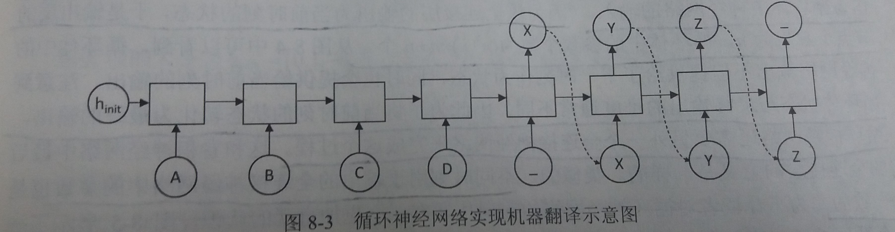

## 第8章 循环神经网络

- 本章将介绍
    1. 循环神经网络(recurrent neural network, RNN)
    2. 长短时记忆网络(long short-term memory, LSTM)-----循环神经网络中的一个重要结构
---
### 8.1 循环神经网络简介

- 循环神经网络的历史、传统机器学习和全连接的瓶颈
    - 循环神经网络(RNN)源自1982年由Saratha Sathasivam提出的霍普菲尔德网络
    - 传统的机器学习算法非常依赖于人工提取的特征
    - 基于全连接神经网络的方法也存在参数太多，无法利用数据中时间序列信息等问题
    - 循环神经网络挖掘数据中时序信息以及语义信息的深度表达能力被充分利用，并在语音识别、语言模型、机器翻译以及时序分析等方面实现了突破

- 循环神经网络简介
    - 循环神经网络的主要用途是处理和预测**序列**数据
    - 循环神经网络的来源就是为了刻画一个序列**当前的输入**与**之前信息**的关系
    - 从网络结构上，循环神经网络会记忆之前的信息，并利用之前的信息影响后面节点的输出
    - 循环神经网络的隐藏层之间的节点是有连接的，**隐藏层的输入**不仅包括**输入层的输入**，还包括**上一时刻隐藏层的输入**

- 循环神经网络的经典结构
    - 如图
    
    - 解释
        - 在每一时刻t,循环神经网络会针对该时刻的输入结合当前模型的状态给出一个输出，并更新模型状态
        - 循环神经网络的主体结构A的输入除了来自输入层xt，还有一个循环的边来提供上一时刻的隐藏状态(hidden state)ht-1
        - 在每一个时刻，循环神经网络的模块A在读取了xt和ht-1之后会生成新的隐藏状态ht,并产生本时刻的输出ot
        - 由于模块A中的运算和变量在不同时刻是相同的，因此循环神经网络理论上可以被看作是同一神经网络结构无限复制的结果
        - 循环神经网络是在不同时间位置共享参数，从而能够使用有限的参数处理任意长度的序列

- 循环神经网络经典结构展开
    - 如图
    
    - 循环神经网络对长度为N的序列展开之后，可以视为一个有N个中间层的前馈神经网络
    - 这个前馈神经网络可以直接使用反向传播算法进行训练，这样的训练方法称为"沿时间反向传播"(Back-Propagation Through Time)

- 循环神经网络与时间序列处理
    - 从循环神经网络的结构特征可以很容易看出它擅长解决与时间序列相关的问题
    - 对于一个序列数据，可以将这个序列上不同时刻的数据依次传入循环神经网络的输入层
    - 输出可以是对序列中下一个时刻的预测，也可以是对当前时刻信息的处理结果
    - 循环神经网络要求每个时刻都有一个输入，但不一定每个时刻都需要有输出

- 以机器翻译为例介绍循环神经网络如何解决实际问题
    - 如图
    
    - 循环神经网络中每一个时刻的输入为需要翻译的句子中的单词
    - 需要翻译的句子是ABCD，那么循环神经网络第一段每一个时刻的输入就分别为A、B、C、D，然后用“_”作为待翻译句子的结束符
    - 在第一段，循环神经网络没有输出
    - 从结束符"_"开始，循环神经网络进入翻译阶段
    - 该阶段中每个时刻的输入是上一个时刻的输出，而最终得到的输出XYZ就是句子ABCD翻译的结果

- 循环体的概念
    - 循环神经网络可以看作是同一神经网络结构在时间序列上被复制多次的结果，这个被复制多次的结构被称为循环体
    - 一个简单的循环体
    

- 循环神经网络的前向传播简介
    - 循环体中的神经网络的输入有两部分
        1. 上一时刻的状态:ht-1
        2. 当前时刻的输入样本:xt
    - 将上一时刻的状态与当前时刻的输入拼接为一个大的向量作为循环体中神经网络的输入
        - 例如：假设输入向量的维度为x，隐藏状态的维度为n，那么循环体的全连接网络的输入大小为n+x
    - 输出为当前时刻的状态ht，一个长度为n的向量
    - 然而有时RNN输出不仅需要提供给下一时刻作为状态，也需要提供给当前时刻作为当前时刻的输出
    - 此时需要一个全连接层，输入为前面计算出的状态向量，输出为当前时刻的输出，而不同时刻用于产生当前时刻输出的全连接层的参数也是共享的
    - 举例：一个循环神经网络前向传播的具体计算过程
        - 如图
        
        - 计算过程详解
        
        

- 循环神经网络的损失函数和优化过程
    - 损失函数：因为RNN在每个时刻都有一个输出，所以循环神经网络的总损失为所有时刻上的损失函数的综合
    - 优化过程：在定义完损失函数之后，套用第四章介绍的优化框架即可完成模型训练的过程
    - 在实际训练过程中，如果序列太长，会导致优化时出现梯度消散和梯度爆炸的问题

- 循环神经网络前向传播样例代码
    ````py
    import numpy as np

    X = [1, 2]
    state = [0.0, 0.0]

    # 定义循环体A中产生当前状态的全连接层的参数，包括权重和偏置
    w_cell_state = np.asarray([[0.1, 0.2], [0.3, 0.4]])
    w_cell_input = np.asarray([0.5, 0.6])
    b_cell = np.asarray([0.1, -0.1])

    # 定义用于输出的全连接层的参数
    w_output = np.asarray([[1.0], [2.0]])
    b_output = 0.1

    # 按照时间顺序执行循环神经网络的前向传播过程
    for i in range(len(X)):

        # 计算循环体中的全连接层神经网络
        before_activation = np.dot(state, w_cell_state) + X[i] * w_cell_input + b_cell
        state = np.tanh(before_activation)
        # 根据当前时刻状态计算最终输出
        final_output = np.dot(state, w_output) + b_output

        # 输出每个时刻的信息
        print("before activation: ", before_activation)
        print("state: ", state)
        print("output: ", final_output)

    '''
    运行上面程序可以得到输出
    before activation:  [0.6 0.5]
    state:  [0.53704957 0.46211716]
    output:  [1.56128388]
    before activation:  [1.2923401  1.39225678]
    state:  [0.85973818 0.88366641]
    output:  [2.72707101]
    '''
    ````
---

### 8.2 长短时记忆网络(LSTM)结构

- 背景
    - 循环神经网络通过保存历史信息来帮助当前的决策
    - 但是存在长期依赖(long-term dependecies)问题
        - 有时模型可能需要某些长期的信息来执行当前的任务
        - 比如：当模型试图去预测段落“某地开设了大量工厂，空气污染十分严重......这里的天空都是灰色的”的最后一个单词时，仅仅根据短期依赖就无法解决这个问题。因为只根据最后一小段，最后一个词可以是“蓝色的”或者“灰色的”。但如果模型需要预测清楚具体是什么颜色，就需要考虑先前提到但离当前位置较远的上下文信息

- LSTM简介
    - LSTM的设计就是为了解决长期依赖问题
    - LSTM是一种拥有三个“门”结构的特殊网络结构
    - 结构图如下
    

- 门结构
    - LSTM靠一些“门”的结构让信息有选择性地影响循环神经网络中每个时刻的状态
    - 所谓“门”的结构就是一个使用sigmoid神经网络和一个按位做乘法的操作，这两个操作合在一起就是一个“门”的结构
    - 为什么被称为“门”结构
        - 因为sigmoid作为激活函数的全连接神经网络层会输出一个0到1之间的数值，描述当前输入有多少信号量可以通过这个结构
        - 这个结构的功能就类似于“门”，当门打开时(sigmoid神经网络层输出为1时)，全部信息都可以通过
        - 当门关上时(sigmoid神经网络层输出为0时)，任何信息都无法通过

- 遗忘门
    - 作用：让循环神经网络“忘记”之前没有用的信息
    - 工作原理
        - 遗忘门会根据当前的输入xt和上一时刻输出ht-1决定哪一部分记忆需要被遗忘
        - 假设状态向量c的长度为n
        - 遗忘门会根据当前的输入xt和上一时刻输出ht-1计算一个维度为n的向量`f=sigmoid(W1x+W2h)`，它在每个维度的值都在`(0,1)`范围内
        - 再将上一时刻的状态ct-1与f向量按位相乘，那么f取值接近0的维度上的信息就会被遗忘，而f取值接近1的维度上的信息会被保留

- 输入门
    - 作用：循环神经网络忘记了部分之前的状态之后，还需要从当前的输入补充最新的记忆
    - 工作原理
        - 输入门会根据当前的输入`xt`和上一时刻输出`ht-1`决定哪些信息加入到状态`ct-1`中生成新的状态`ct`

- 输出门
    - 作用：LSTM在计算得到新的状态`ct`后需要产生当前时刻的输出，这个输出由输出门完成
    - 工作原理
        - 输出门根据最新的状态`ct`、上一时刻的输出`ht-1`和当前的输入`xt`来决定该时刻的输出`ht`

- 使用LSTM结构的RNN的前向传播过程
    - LSTM单元细节图如下
    
    - 具体LSTM每个门的公式定义如下
    
    

- 在TensorFlow中实现LSTM结构的RNN前向传播
    ````py
    import tensorflow as tf

    # 定义一个LSTM结构
    # LSTM中使用的变量也会在该函数中自动被声明
    lstm = tf.nn.rnn_cell.BasicLSTMCell(lstm_hidden_size)

    # 将LSTM中的状态初始化为全0数组
    # state中包含两个张量，其中state.c和state.h分别对应了LSTM单元细节图中的c状态和h状态
    # batch_size给出了一个batch的大小
    state = lstm.zero_state(batch_size, tf.float32)

    # 定义损失函数
    loss = 0.0

    # 在训练中为了将循环神经网络展开成前馈神经网络，需要直到训练数据的序列长度
    # 其中，num_steps代表了这个长度
    for i in range(num_steps):
        
        # 在第一个时刻声明LSTM结构中使用的变量，在之后的时刻都需要复用之前定义好的变量
        if i > 0:
            tf.get_variable_scope().reuse_variables()
        
        # 每一步处理时间序列中的一个时刻
        # 将当前输入current_input和前一时刻状态state(ht-1和ct-1)传入LSTM结构，
        # 可以得到当前LSTM的输出lstm_output(ht)和更新后状态state(ht和ct)
        # lstm_output可以用于输出给其他层，state用于输出给下一时刻
        lstm_output, state = lstm(current_input, state)
        
        # 将当前时刻LSTM结构的输出传入一个全连接层得到最后的输出
        final_output = fully_connected(lstm_output)
        
        # 计算当前输出的损失
        loss += calc_loss(final_output, expected_output)
        
    # 然后使用类似第四章介绍的方法训练模型
    train()
    ````

### 8.3 循环神经网络的变种
---
#### 8.3.1 双向循环神经网络和深层循环神经网络

- 双向循环神经网络(bidirectional RNN)
    - 简介
        - 在有些问题中，当前时刻的输出不仅和之前的状态有关，也和之后的状态有关，这时就需要双向循环神经网络
        - 例如：预测一个语句中缺失的单词不仅需要根据前文判断，还需要根据后文判断，这时双向循环网络就可以发挥它的作用
        - 双向循环神经网络由两个独立的循环神经网络叠加在一起组成
        - 输出是由这两个循环神经网络的输出拼接而成
    - 结构图
    
    - 工作原理
        - 双向循环神经网络的主体结构就是两个单向循环神经网络的结合
        - 在每个时刻t，输入会同时提供给两个方向相反的循环神经网络
        - 两个网络独立进行计算，各自产生该时刻的新状态和输出，而双向循环神经网络的最终输出是这两个单向网络的输出的简单拼接
        - 两个循环神经网络除方向不同之外，其余结构完全对称
        - 每一层网络中的循环体可以自由选用任意结构，如前面介绍过的简单RNN、LSTM均可作为循环体

- 深层循环神经网络(deep RNN)
    - 简介
        - 为了增强模型的表达能力，可以在网络中设置多个循环层，将每层循环网络的输出传给下一层进行处理
    - 结构图
    
    - 工作原理
        - 如图，在一个L层的深层循环网络中，每一时刻的输入xt到输出ot之间有L个循环体
        - 网络因此可以抽象更加高层的信息
        - 网络中每一层的循环体中参数是一致的，而不同层中的参数可以不同
    - 代码实现
        ````py
        import tensorflow as tf 

        # 定义一个基本的LSTM结构作为循环体的基础结构
        # 深层循环神经网络也支持使用其他的循环体结构
        lstm_cell = tf.nn.rnn_cell.BasicLSTMCell

        # 通过MultiRNNCell类实现深层循环神经网络的结构
        # 其中number_of_layers表示有多少层
        stacked_lstm = tf.nn.rnn_cell.MultiRNNCell([lstm_cell(lstm_size) for _ in range(number_of_layers)])

        # 和经典的循环神经网络一样，可以通过zero_state函数来获得初始状态
        state = stacked_lstm.zero_state(batch_size, tf.float32)

        # 计算每一时刻的前向传播过程
        for i in range(len(num_steps)):
            
            if i > 0:tf.get_variable_scope().reuse_variables()
            
            # 每一步处理时间序列中的一个时刻
            # 将当前输入current_input和前一时刻状态state(ht-1和ct-1)传入LSTM结构，
            # 可以得到当前LSTM的输出lstm_output(ht)和更新后状态state(ht和ct)
            # lstm_output可以用于输出给其他层，state用于输出给下一时刻
            stacked_lstm_output, state = stacked_lstm(current_input, state)
            
            # 通过一个全连接层得到当前时刻的最终输出
            final_output = fully_connected(stacked_lstm_output)
            
            # 累加损失函数
            loss += calc_loss(final_output, expected_output)
        ````
---
#### 8.3.2 循环神经网络的dropout

- 通过dropout，可以让神经网络更加健壮(robust)

- 循环神经网络一般只在不同层循环体结构之间使用dropout，而不在同一层的循环体结构之间使用
    - 也就是说，从时刻t-1传递到时刻t时，循环神经微那里过不会进行状态的dropout
    - 而在同一时刻t中，不同层循环体之间会使用dropout
    - 如图
    

- 代码实现
    ````py
    import tensorflow as tf 

    # 定义LSTM结构
    lstm_cell = tf.nn.rnn_cell.BasicLSTMCell

    # 使用DropoutWrapper类来实现dropout功能
    # 这个类可以传入两个参数来控制dropout的概率
    # input_keep_prob 用来控制输入的dropout概率
    # output_keep_prob 用来控制输出的dropout概率
    stacked_lstm = tf.nn.rnn_cell.MultiRNNCell([tf.nn.rnn_cell.DropoutWrapper(lstm_cell(lstm_size)) for _ in range(number_of_layers)])
    ````
---

### 8.3 循环神经网络的变种

- 简介：以时序预测为例，利用循环神经网络实现对函数sinx取值的预测

- 代码如下
    ````py
    import numpy as np
    import tensorflow as tf
    import matplotlib.pyplot as plt


    # 声明常量
    HIDDEN_SIZE = 30                    # LSTM中隐藏节点的个数
    NUM_LAYERS = 2                      # LSTM的层数

    TIMESTEPS = 10                      # 循环神经网络的训练序列长度
    TRAINING_STEPS = 6000               # 训练轮数
    BATCH_SIZE = 32                     # batch的大小

    TRAINING_EXAMPLES = 10000           # 训练数据个数
    TESTING_EXAMPLES = 1000             # 测试数据个数
    SAMPLE_GAP = 0.1                    # 采样间隔


    # 产生训练所用数据集X和标记Y
    # 输入为一个数组,数组中的每个元素是sin函数的x值和对应的y值
    # 输出为生成的数据集x和标记y
    def generate_data(seq):
        x, y = [], []

        # 将序列的第i项到第i+TIMESTEPS-1项，共TIMESTEPS项作为输入
        # 将序列的第i+TIMESTEPS项作为输出
        # 即，使用sin函数前TIMESTEPS个节点的信息，来预测第i + TIMESTEPS个节点的函数值
        for i in range(len(seq) - TIMESTEPS):
            x.append([seq[i:i+TIMESTEPS]])
            y.append([seq[i + TIMESTEPS]])

        return np.array(x, dtype=np.float32), np.array(y, dtype=np.float32)


    # 定义模型、前向传播过程、损失函数和优化过程
    # 输入为数据x、标记y和是否是训练过程is_training
    # 返回预测结果，损失函数，优化过程
    def lstm_model(x, y, is_training):

        # 使用多层的LSTM结构
        cell = tf.nn.rnn_cell.MultiRNNCell([tf.nn.rnn_cell.BasicLSTMCell(HIDDEN_SIZE) for _ in range(NUM_LAYERS)])

        # 将多层的LSTM结构连接成RNN网络并计算其前向传播的结果
        outputs, _ = tf.nn.dynamic_rnn(cell, x, dtype=tf.float32)

        # outputs是顶层LSTM在每一步的输出结果
        # 它的维度为[batch_size, time, HIDDEN_SIZE]
        # 本问题中只关注最后一个时刻的输出结果
        output = outputs[:, -1, :]

        # 对LSTM网络的输出再加一层全连接层并计算损失
        predictions = tf.contrib.layers.fully_connected(output, 1, activation_fn=None)

        # 只在训练时计算损失函数和优化步骤，测试时直接返回预测结果
        if not is_training:
            return predictions, None, None

        # 计算损失函数
        loss = tf.losses.mean_squared_error(y, predictions)

        # 创建模型优化器并得到优化步骤
        train_op = tf.contrib.layers.optimize_loss(loss, tf.train.get_global_step(), optimizer="Adagrad", learning_rate=0.1)

        # 返回预测结果，损失函数，优化过程
        return predictions, loss, train_op


    # 训练模型
    def train(sess, train_x, train_y):

        # 对数据进行处理，将训练数据以数据集的方式提供给计算图

        # 切分传入Tensor的第一个维度，生成相应的dataSet
        ds = tf.data.Dataset.from_tensor_slices((train_x, train_y))

        # ds.repeat : Repeats this dataset `count` times.
        # ds.shuffle : 随机打乱这个数据集的元素
        # ds.batch : 将此数据集的连续元素组合成batch
        ds = ds.repeat().shuffle(1000).batch(BATCH_SIZE)

        # make_one_shot_iterator()用来生成一个迭代器来读取数据
        # one_shot迭代器人如其名，意思就是数据输出一次后就丢弃了
        # 之后每次x, y被会话调用迭代器就会将指针指向下一个元素
        x, y = ds.make_one_shot_iterator().get_next()

        # 调用模型传入数据并得到预测结果、损失函数和优化步骤
        with tf.variable_scope("model"):
            predictions, loss, train_op = lstm_model(x, y, True)

        # 初始化变量
        sess.run(tf.global_variables_initializer())

        # 开启训练
        for i in range(TRAINING_STEPS):
            _, loss_result = sess.run([train_op, loss])
            if i % 100 == 0:
                print("After %d training step(s), the loss result is %f" % (i, loss_result))


    # 测试模型
    def run_eval(sess, test_x, test_y):

        # 将测试数据以数据集的方式提供给计算图

        # 切分传入Tensor的第一个维度，生成相应的dataSet
        data_set = tf.data.Dataset.from_tensor_slices((test_x, test_y))

        # 类型转换，将Dataset转换为BatchDataset
        data_set = data_set.batch(1)

        # make_one_shot_iterator()用来生成一个迭代器来读取数据
        # one_shot迭代器人如其名，意思就是数据输出一次后就丢弃了
        x, y = data_set.make_one_shot_iterator().get_next()

        with tf.variable_scope("model", reuse=True):

            # 调用模型得到预测结果
            prediction, _, _ = lstm_model(x, [0.0], False)

            # 将预测结果存入数组中
            predictions, labels = [], []
            for i in range(TESTING_EXAMPLES):
                prediction_result, labels_result = sess.run([prediction, y])
                predictions.append(prediction_result)
                labels.append(labels_result)

            # 计算rmse作为评价标准
            predictions = np.array(predictions).squeeze()
            labels = np.array(labels).squeeze()
            rmse = np.sqrt(((predictions - labels) ** 2).mean(axis=0))
            print("Mean Square Error is: %f" % rmse)

            # 对预测的sin函数曲线进行绘图
            plt.figure()
            plt.plot(labels, label="real_sin")
            plt.plot(predictions, label='predictions')
            plt.legend()
            plt.show()


    # 主程序入口
    def main(args=None):

        # 产生训练集数据的起始值
        train_start = 0
        # 产生训练集数据的终止值，也就是测试集数据的起始值
        train_end = test_start = (TRAINING_EXAMPLES + TIMESTEPS) * SAMPLE_GAP
        # 产生测试集数据的终止值
        test_end = test_start + (TESTING_EXAMPLES + TIMESTEPS) * SAMPLE_GAP

        # 产生训练集数据和测试集数据
        train_x, train_y = generate_data(np.sin(np.linspace(train_start, train_end, TRAINING_EXAMPLES + TIMESTEPS, dtype=np.float32)))
        test_x, test_y = generate_data(np.sin(np.linspace(test_start, test_end, TESTING_EXAMPLES + TIMESTEPS, dtype=np.float32)))

        # 开启会话开始计算
        with tf.Session() as sess:

            # 训练模型
            train(sess, train_x, train_y)

            # 使用训练好的模型对测试数据进行预测
            run_eval(sess, test_x, test_y)


    # TensorFlow提供的一个主程序入口，tf.app.run()会调用上面定义的main函数
    if __name__ == '__main__':
        tf.app.run()

    # 某次训练的结果
    '''
    After 0 training step(s), the loss result is 0.525303
    After 100 training step(s), the loss result is 0.002255
    After 200 training step(s), the loss result is 0.000643
    ...
    After 9800 training step(s), the loss result is 0.000001
    After 9900 training step(s), the loss result is 0.000001
    Mean Square Error is: 0.001200
    '''
    ````