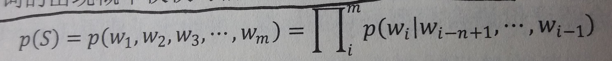
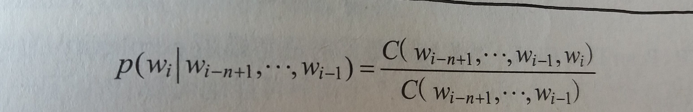
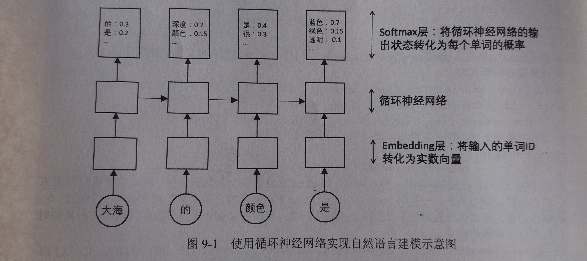
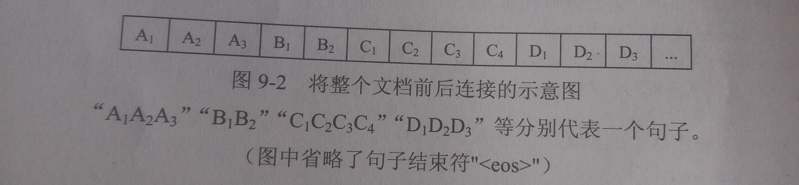
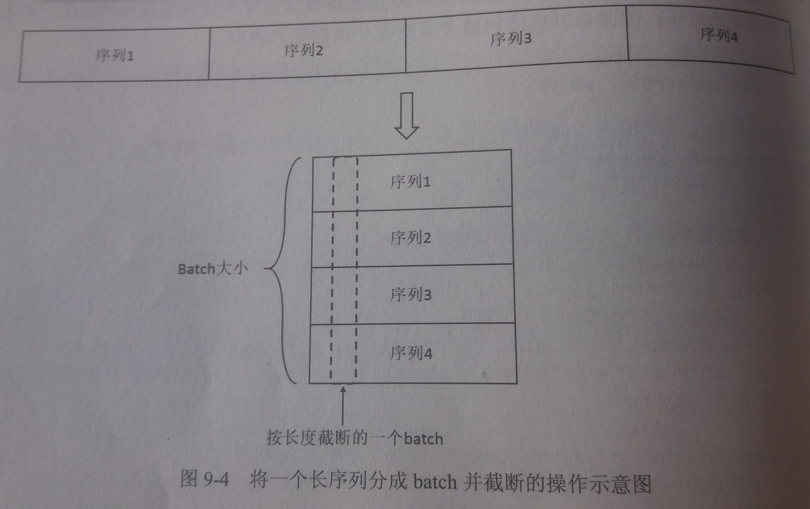

## 第9章 自然语言处理

- 发展历程
    1. 在自然语言处理研究的早期，人们试图整理出关于自然语言的语法，并根据这些语法去理解和生成句子
    2. 从20世纪80年代起，随着硬件计算能力的增强和大型语料库的出现，使用统计方法对语言进行概率建模的方式开始变成主流
    3. 从2010年起，基于循环神经网络的方法在许多自然语言处理的问题上超越了传统的统计模型
---
### 9.1 语言模型的背景知识

#### 9.1.1 语言模型简介

- 语言模型简介
    - 假设一门语言中所有可能的句子服从某一个概率分布，每个句子出现的概率加起来为1，那么语言模型的任务就是预测每个句子在语言中出现的概率
    - 把句子看成单词的序列，语言模型可以表示为一个计算`p(w1,w2,w3,...,wm)`的模型
    - 语言模型仅仅对句子出现的概率进行建模，并不尝试“理解”句子的内容含义

- 语言模型应用
    - 很多生成自然语言文本的应用都依赖语言模型来优化输出文本的流畅性
        - 生成的句子在语言模型中的概率越高，说明其越有可能是一个流畅、自然的句子
    - 神经网络机器翻译的Seq2Seq模型可以看作是一个条件语言模型(Conditional Language Model)，它相当于是在给定输入的情况下对目标语言的所有句子估算概率，并选择其中概率最大的句子作为输出

- 如何计算一个句子的概率
    - 一个句子可以被看成一个单词序列`S = (w1, w2, w3, w4, ... wm)`
        - 其中`m`代表句子的长度
    - 它的概率可以表示为：`p(S) = p(w1, w2, w3, w4, ... wm) = p(w1) * p(w2 | w1) * p(w3 | w1, w2)...p(wm | w1, w2, w3,..., wm-1)`
        - 其中`p(wm | w1, w2, w3,..., wm-1)`表示，已知前m-1个单词时，第m个单词为wm的条件概率

- 然而
    - 任何一门语言的词汇量都很大，词汇的组合更是不计其数
    - 假设一门语言的词汇量为V，如果要将`p(wm | w1, w2, w3,..., wm-1)`的所有参数保存在一个模型中，则需要`pow(v, m)`个参数，数量太多

- n-gram
    - 为了控制参数的数量，n-gram模型做了一个有限历史假设：当前单词的出现概率仅仅与前面的`n-1`个单词相关
    - 公式如下
    
    - n-gram模型中的n指的是当前单词依赖它前面的单词的个数
    - 通常n可以取1、2、3、4，其中n取1、2、3时分别称为unigram、bigram、trigram
    - 假设某种语言的单词表大小为V，那么n-gram模型需要估计的不同参数数量为O(pow(v, n))量级
    - 当n越大时，n-gram模型在理论上越准确，但也越复杂，需要的计算量和训练语料数据量也越大
    - n-gram模型的参数一般采用最大似然估计(Maximum Likelihood Estimation, MLE)方法计算
    
    - 训练语料的规模越大，参数估计的结果越可靠
    - 但即使训练数据的规模非常大时，还是有许多单词序列在训练语料中不会出现，这就导致许多参数为0，为了避免因为乘以0而导致整个句子概率为0，使用最大似然估计的方法时需要加入平滑避免参数取值为0
---
#### 9.1.2 语言模型的评价方法-----复杂度(perplexity)

- 复杂度简介(perplexity)
    - 语言模型效果好坏的常用评价指标是复杂度(perplexity)
    - 在一个测试集上得到的perplexity越低，说明建模的效果越好
    - 复杂度计算公式
    - perplexity值刻画的是语言模型预测一个语言样本的能力
        - 比如，已知(w1, w2, w3,..., wm)这句话会出现在语料库中，那么通过语言模型计算得到的这句话的概率越高，说明语言模型对这个语料库拟合的越好
    
- perplexity的理解
    - perplexity实际上计算每一个单词得到的概率倒数的几何平均
    - perplexity可以理解为模型预测下一个词时的平均可选择数量
    - 目前在PTB数据集上最好的语言模型perplexity为47.7，就是在平均情况下，该模型预测下一个词时，有47.7个词等可能地可以作为下一个词的合理选择

- perplexity与交叉熵
    - 交叉熵(Cross Entropy)用来描述两个概率分布之间的一种距离
    - 在数学上log perplexity可以看作真实分布与预测分布之间的交叉熵
    - 即每个位置上单词的真实分布与模型的预测分布之间的交叉熵

- TensorFlow提供了两个方便计算交叉熵的函数
    ````py
    import tensorflow as tf

    # 假设词汇表的大小为3，语料包含两个单词"2 0"
    word_labels = tf.constant([2, 0])

    # 假设模型对两个单词预测时，产生的logit分别为[2.0, -1.0, 3.0]和[1.0, 0.0, -0.5]
    # 注意这里的logit不是概率，因此它们不是0.0-1.0之间的数字
    # 如需要计算概率，则需要调用prob = tf.nn.softmax(logits)
    # 但这里计算交叉熵的函数直接输入logits即可
    predict_logits = tf.constant([[2.0, -1.0, 3.0], [1.0, 0.0, -0.5]])

    # 使用sparse_softmax_cross_entropy_with_logits函数计算交叉熵，即log perplexity的值
    loss = tf.nn.sparse_softmax_cross_entropy_with_logits(labels=word_labels, logits=predict_logits)

    # 计算perplexity损失的值
    sess = tf.Session()
    print(sess.run(loss))
    '''
    [0.32656264 0.4643688 ]
    '''

    # softmax_cross_entropy_with_logits与上面的函数类似，但是需要将预测目标以概率分布的形式给出
    word_prob_distribution = tf.constant([[0.0, 0.0, 1.0], [1.0, 0.0, 0.0]])
    loss = tf.nn.softmax_cross_entropy_with_logits(labels=word_prob_distribution, logits=predict_logits)

    # 计算perplexity损失的值
    print(sess.run(loss))
    '''
    [0.32656264 0.4643688 ]
    '''

    # 由于softmax_cross_entropy_with_logits允许提供一个概率分布，因此在使用时有更大的自由度
    # 一种叫label smoothing的技巧是将正确数据的概率设为一个比1.0略小的值，将错误数据的概率设为比0.0略大的值
    # 这样可以避免模型与数据过拟合，在某些时候可以提高训练效果
    word_prob_smooth = tf.constant([[0.01, 0.01, 0.98], [0.98, 0.01, 0.01]])
    loss = tf.nn.softmax_cross_entropy_with_logits(labels=word_prob_smooth, logits=predict_logits)
    print(sess.run(loss))
    '''
    [0.37656265 0.48936883]
    '''
    ````

### 9.2 神经语言模型
---

- 循环神经网络可以将任意长度的上文信息存储在隐藏状态中，因此使用循环神经网络作为语言模型有着天然的优势

- RNN自然语言模型DEMO
    - 如图
    
    - 工作原理
        - 每个时刻的输入为一个句子中的单词wi
        - 每个时刻的输出为一个概率分布，表示句子中下一个位置为不同单词的概率p(wi+1 | w1, w2, w3,..., wi)
        - 比如
            - 第一个时刻输入的单词为“大海”，而输出为p(x|"大海")
            - 即知道第一个词为大海后，其他不同单词出现在下一个位置的概率
            - 若p("的"|"大海")=0.8，则“大海”之后的单词为“的”出现的概率为0.8
        - 类似的，可以得到p("颜色"|"大海","的")、p("是"|"大海","的","颜色")、p("蓝色|"大海","的","颜色","是")
        - 然后将这些概率取对数再平均起来，就可以得到在这个句子上计算的log perplexity
#### 9.2.1 PTB数据集的预处理

- 背景:自然语言文本数据无法直接被当成数值提供给神经网络，所以需要对它进行预处理

- PTB(Penn Treebank Dataset)文本数据集是目前语言模型学习中使用最为广泛的数据集

- 数据集中共含有9998个词汇，加上稀有词语的特殊符号`<unk>`和语句结束换行符`<eos>`在内，一共10000个词汇

- 为了将文本转化为模型可以读入的单词序列，需要将这10000个不同的词汇分别映射到0-9999之间的整数编号
    ````py
    import codecs
    import collections
    from operator import itemgetter

    # 训练集数据文件
    RAW_DATA = "/PycharmProjects/TFDemo/data/PTB/data/ptb.train.txt"
    # 输出的词汇表文件
    VOCAB_OUTPUT = "/PycharmProjects/TFDemo/data/PTB/generate/ptb.vocab"

    # 统计单词出现的频率
    counter = collections.Counter()
    with codecs.open(RAW_DATA, 'r', 'utf-8') as file:
        for line in file:
            for word in line.strip().split():
                counter[word] += 1

    # 按照词频顺序对单词进行排序
    sorted_word_to_cnt = sorted(counter.items(), key=itemgetter(1), reverse=True)
    sorted_words = [x[0] for x in sorted_word_to_cnt]

    # 加入句子结束符<eos>
    sorted_words = ["<eos>"] + sorted_words

    # 将排序好的单词写入输出文件，其中行号就代表了单词的编号
    with codecs.open(VOCAB_OUTPUT, 'w', 'utf-8') as file_output:
        for word in sorted_words:
            file_output.write(word + '\n')
    ````
- 在确定了词汇表之后，再将训练文件、测试文件等都根据词汇文件转化为单词编号，每个单词编号就是它在词汇文件中的行号
    ````py
    import codecs

    RAW_DATA = "/PycharmProjects/TFDemo/data/PTB/data/ptb.train.txt"
    VOCAB = "/PycharmProjects/TFDemo/data/PTB/generate/ptb.vocab"
    OUTPUT_DATA = "/PycharmProjects/TFDemo/data/PTB/generate/ptb.train"

    # 读取词汇表，并建立词汇到单词编号的映射
    with codecs.open(VOCAB, "r", "utf-8") as f_vocab:
        vocab = [w.strip() for w in f_vocab.readlines()]
    word_to_code = {k: v for (k, v) in zip(vocab, range(len(vocab)))}

    # 打开输入与输出文件
    fin = codecs.open(RAW_DATA, "r", "utf-8")
    fout = codecs.open(OUTPUT_DATA, "w", "utf-8")

    # 根据词汇映射进行转码
    for line in fin:
        words = line.strip().split() + ["<eos>"]
        out_line = ' '.join([str(word_to_code[w]) for w in words]) + '\n'
        fout.write(out_line)

    # 关闭文件
    fin.close()
    fout.close()

    ````

- 在实际工程中，通常使用TFRecords格式来提高读写效率
---
#### 9.2.2 PTB数据的batching方法

- 背景
    - 在文本数据中，由于每个句子的长度不同，又无法像图像一样调整到固定维度，因此batching时需要一些特殊操作
    - 最常见的方法是使用填充(padding)，将同一batch内的句子长度补齐
    - 在PTB数据集中，每个句子并非随机抽取的文本，而是在上下文之间有关联的内容
    - 语言模型为了利用上下文信息，必须将前面句子的消息传递到后面的句子

- 解决方案1
    - 简介：如果模型大小不限，最理想的设计是将整个文档前后连接起来，当作一个句子来训练
    - 如图
    
    - 问题
        - 这样会导致计算图过大
        - 另外序列过长还会导致梯度爆炸问题

- 解决方案2
    - 简介
        - 将长序列切割为固定长度的子序列
        - 循环神经网络在处理完一个子序列后，它最终的隐藏状态将复制到下一个序列作为初始值
        - 这样，在前向计算时，效果等同于一次性顺序读取了整个文档
        - 而在反向传播时，梯度则只会在每个子序列内部传播
    - 如图
    

- 解决方案3
    - 背景
        - 为了利用计算时的并行能力
        - 我们希望每一次计算可以对多个句子进行并行处理
        - 同时又要尽量暴增batch之间的上下文连续
    - 简介
        - 先将整个文档切分为若干个连续段落
        - 再让batch中的每个位置负责其中一段
    - 如图
    

- 下面的代码从文本文件中读取数据，并按照解决方案3将数据整理为batch
    ````py
    import numpy as np

    TRAIN_DATA = "/PycharmProjects/TFDemo/data/PTB/generate/ptb.train"
    TRAIN_BATCH_SIZE = 20
    TRAIN_NUM_STEP = 35


    # 从文件中读取数据，并返回包含单词编号的数组
    def read_data(file_path):
        with open(file_path, 'r') as fin:
            # 将整个文档读入一个长字符串
            id_string = ' '.join([line.strip() for line in fin.readlines()])
        id_list = [int(w) for w in id_string.split()]
        return id_list


    def make_batches(id_list, batch_size, num_step):
        # 计算总的batch数量，每个batch包含的单词数量是batch_size * num_steps
        num_batches = (len(id_list) -1) // (batch_size * num_step)

        # 将数据整理为一个维度为[batch_size, num_batches * num_step]的二维数组
        data = np.array(id_list[:num_batches * batch_size * num_step])
        data = np.reshape(data, [batch_size, num_batches * num_step])

        # 沿着第二个维度将数据切分为num_batches个batch，存入一个数组中
        data_batches = np.split(data, num_batches, axis=1)

        # 重复上述操作，但是每个位置向右移动一位
        # 作为输入数据的标记值，也就是RNN每一步输入所需要预测的下一个单词
        label = np.array(id_list[1: num_batches * batch_size * num_step + 1])
        label = np.reshape(label, [batch_size, num_batches * num_step])
        label_batches = np.split(label, num_batches, axis=1)

        # 返回一个长度为num_batches的数组，其中每一项包括一个data矩阵和一个label矩阵
        return list(zip(data_batches, label_batches))


    def main():
        train_batches = make_batches(read_data(TRAIN_DATA), TRAIN_BATCH_SIZE, TRAIN_NUM_STEP)
        print(train_batches)


    if __name__ == '__main__':
        main()
    ````

---
#### 9.2.3 基于循环神经网络的神经语言模型

- 神经语言模型与第8章介绍的循环神经网络相比，多了两层：词向量层(embedding)和softmax层

- 词向量层
    - 词向量
        - 在输入层，每一个单词用一个实数向量表示，这个向量被称为“词向量”(word embedding)
        - 词向量可以形象地理解为将词汇表嵌入到一个固定维度的实数空间中
    - 将单词编号转化为词向量的用处
        1. 降低输入的维度
            - 如果不使用词向量层，而直接将单词以one-hot vector的形式输入循环神经网络，那么输入的维数大小将与词汇表大小相同
            - 而词向量的维度通常小于词汇表大小
            - 这将大大减少循环神经网络的参数数量与计算量
        2. 增加语义信息
            - 简单的单词编号不包含任何语义信息
                - 两个单词之间编号相近，并不代表它们的含义有任何关联
            - 词向量层将稀疏的编号转化为稠密的向量表示，这使得词向量有可能包含更加丰富的信息
            - 在自然语言应用中学习得到的词向量通常将含义相似的词赋予取值相近的词向量，使得上层的网络可以更容易地抓住相似单词之间的共性
    - 词向量层的定义代码
        ````py
        embedding = tf.get_variable("embedding", [VOCAB_SIZE, EMB_SIZE])

        # 输出的矩阵比输入矩阵多一个维度，新增维度的大小为EMB_SIZE
        # 在语言模型中，一般input_data的维度为batch_size * num_steps
        # 在经过词向量层之后, 维度为batch_size * num_steps * EMB_SIZE
        input_embedding = tf.nn.embedding_lookup(embedding, input_data)
        ````

- Softmax层
    - 作用：将循环神经网络的输出转化为一个单词表中每个单词的输出概率
    - 步骤
        1. 使用一个线性映射将循环神经网络的输出映射为一个维度与词汇表大小相同的向量，这一步输出叫做logits
        2. 调用softmax方法将logits转化为加和为1的概率
            - 事实上，语言模型的每一步输出都可以看作一个分类问题，在VOCAB_SIZE个可能的类别中决定这一步最可能输出的单词

- 通过共享参数减少参数数量
    - Softmax层和词向量层的参数数量都与词汇表大小VOCAB_SIZE成正比
    - 由于VOCAB_SIZE的数值通常较大，而HIDDEN_SIZE相对较小，导致softmax和embdding在整个网络的参数数量中占有很大比例
    - 有研究指出，如果共享词向量层和Softmax层的参数，不仅能大幅度减少参数数量，还能提高最终模型结果

- 完整代码
    ````py
    import numpy as np
    import tensorflow as tf

    TRAIN_DATA = '/PycharmProjects/TFDemo/data/PTB/generate/ptb.train'  # 训练数据路径
    EVAL_DATA = '/PycharmProjects/TFDemo/data/PTB/generate/ptb.valid'   # 验证数据路径
    TEST_DATA = '/PycharmProjects/TFDemo/data/PTB/generate/ptb.test'    # 测试数据路径

    HIDDEN_SIZE = 300                                                   # 隐藏层规模
    NUM_LAYERS = 2                                                      # 深层循环网络中LSTM结构的层数
    VOCAB_SIZE = 10000                                                  # 词典规模
    TRAIN_BATCH_SIZE = 20                                               # 训练数据batch的大小
    TRAIN_NUM_STEP = 35                                                 # 训练数据截断长度,可以理解为单词序列的长度
    EVAL_BATCH_SIZE = 1                                                 # 测试数据batch的大小
    EVAL_NUM_STEP = 1                                                   # 测试数据截断长度

    NUM_EPOCH = 5                                                       # 使用训练数据的轮数
    LSTM_KEEP_PROB = 0.9                                                # LSTM节点不被dropout的概率
    EMBEDDING_KEEP_PROB = 0.9                                           # 词向量不被dropout的概率
    MAX_GRAD_NORM = 5                                                   # 用于控制梯度膨胀的梯度大小上限
    SHARE_EMB_AND_SOFTMAX = True                                        # 在Softmax层和词向量层之间共享参数


    # 使用PTBModel类定义整个模型的结构
    class PTBModel(object):

        def __init__(self, is_training, batch_size, num_steps):

            # 记录使用的batch大小和截断长度
            self.batch_size = batch_size
            self.num_steps = num_steps

            # 定义每一步的输入和预期输出
            # 两者的维度都为[batch_size, num_steps]
            self.input_data = tf.placeholder(tf.int32, [batch_size, num_steps])
            self.targets = tf.placeholder(tf.int32, [batch_size, num_steps])

            # 定义使用LSTM结构为循环体结构且使用dropout的深层循环神经网络
            drop_keep_prob = LSTM_KEEP_PROB if is_training else 1.0
            lstm_cells = [
                tf.nn.rnn_cell.DropoutWrapper(
                    tf.nn.rnn_cell.BasicLSTMCell(HIDDEN_SIZE),
                    output_keep_prob=drop_keep_prob
                )
                for _ in range(NUM_LAYERS)
            ]
            cell = tf.nn.rnn_cell.MultiRNNCell(lstm_cells)

            # 初始化最初的状态，即全0的向量
            # 这个量只在每个epoch初始化第一个batch时使用
            self.initial_state = cell.zero_state(batch_size, tf.float32)

            # 定义词向量矩阵
            embedding = tf.get_variable("embedding", [VOCAB_SIZE, HIDDEN_SIZE])

            # 将输入单词转化为词向量
            inputs = tf.nn.embedding_lookup(embedding, self.input_data)

            # 只在训练中使用dropout
            if is_training:
                inputs = tf.nn.dropout(inputs, EMBEDDING_KEEP_PROB)

            # 定义输出列表，这里先将不同时刻LSTM结构的输出收集起来，再一起提供给sotfmax层
            outputs = []
            state = self.initial_state
            with tf.variable_scope("RNN"):
                for time_step in range(num_steps):
                    if time_step > 0:
                        tf.get_variable_scope().reuse_variables()
                    cell_output, state = cell(inputs[:, time_step, :], state)
                    outputs.append(cell_output)
            output = tf.reshape(tf.concat(outputs, 1), [-1, HIDDEN_SIZE])

            # Softmax层:将RNN在每个位置上的输入转化为各个单词的logits
            if SHARE_EMB_AND_SOFTMAX:
                weight = tf.transpose(embedding)
            else:
                weight = tf.get_variable("weight", [HIDDEN_SIZE, VOCAB_SIZE])
            bias = tf.get_variable("bias", [VOCAB_SIZE])
            logits = tf.matmul(output, weight) + bias

            # 定义交叉熵损失函数和平均损失
            loss = tf.nn.sparse_softmax_cross_entropy_with_logits(labels=tf.reshape(self.targets, [-1]), logits=logits)
            self.cost = tf.reduce_sum(loss) / batch_size
            self.final_state = state

            # 只在训练模型时定义反向传播操作
            trainable_variables = tf.trainable_variables()
            # 控制梯度大小不能超过MAX_GRAD_NORM
            grads, _ = tf.clip_by_global_norm(tf.gradients(self.cost, trainable_variables), MAX_GRAD_NORM)
            # 定义优化方法
            optimizer = tf.train.GradientDescentOptimizer(learning_rate=1)
            # 定义训练步骤
            self.train_op = optimizer.apply_gradients(zip(grads, trainable_variables))


    # 使用给定的模型model在数据data上运行train_op并返回在全部数据上的perplexity值
    def run_epoch(sess, model, batches, train_op, output_log, step):
        # 计算平均perplexity的辅助变量
        total_costs = 0.0
        iters = 0
        # 将state初始化为全0
        state = sess.run(model.initial_state)

        # 训练一个epoch
        for x, y in batches:
            # 在当前batch上运行train_op并计算损失值
            # 交叉熵损失函数计算的就是下一个单词为给定单词的概率
            cost, state, _ = sess.run(
                [model.cost, model.final_state, train_op],
                {model.input_data: x, model.targets: y, model.initial_state: state}
            )
            total_costs += cost
            iters += model.num_steps

            if output_log and step % 100 == 0:
                print("After %d steps, perplexity is %.3f" % (step, np.exp(cost / model.num_steps)))
            step += 1

        return step, np.exp(total_costs / iters)


    # 从文件中读取数据，并返回包含单词编号的数组
    def read_data(file_path):
        with open(file_path, 'r') as fin:
            # 将整个文档读入一个长字符串
            id_string = ' '.join([line.strip() for line in fin.readlines()])
        id_list = [int(w) for w in id_string.split()]
        return id_list


    # 将包含单词编号的数组进行batching
    def make_batches(id_list, batch_size, num_step):

        # 计算总的batch数量，每个batch包含的单词数量是batch_size * num_steps
        num_batches = (len(id_list) -1) // (batch_size * num_step)

        # 将数据整理为一个维度为[batch_size, num_batches * num_step]的二维数组
        data = np.array(id_list[:num_batches * batch_size * num_step])
        data = np.reshape(data, [batch_size, num_batches * num_step])

        # 沿着第二个维度将数据切分为num_batches个batch，存入一个数组中
        data_batches = np.split(data, num_batches, axis=1)

        # 重复上述操作，但是每个位置向右移动一位
        # 作为输入数据的标记值，也就是RNN每一步输入所需要预测的下一个单词
        label = np.array(id_list[1: num_batches * batch_size * num_step + 1])
        label = np.reshape(label, [batch_size, num_batches * num_step])
        label_batches = np.split(label, num_batches, axis=1)

        # 返回一个长度为num_batches的数组，其中每一项包括一个data矩阵和一个label矩阵
        return list(zip(data_batches, label_batches))


    def main():

        # 定义初始化函数
        initializer = tf.random_uniform_initializer(-0.05, 0.05)

        # 定义训练用的循环神经网络模型
        with tf.variable_scope("language_model", reuse=None, initializer=initializer):
            train_model = PTBModel(True, TRAIN_BATCH_SIZE, TRAIN_NUM_STEP)

        # 定义测试用的循环神经网络模型，它与train_model共用参数，但是没有dropout
        with tf.variable_scope("language_model", reuse=True, initializer=initializer):
            eval_model = PTBModel(False, EVAL_BATCH_SIZE, EVAL_NUM_STEP)

        # 训练模型
        with tf.Session() as sess:
            # 初始化变量
            tf.global_variables_initializer().run()
            # 初始化训练集、验证集和测试集数据
            train_batches = make_batches(read_data(TRAIN_DATA), TRAIN_BATCH_SIZE, TRAIN_NUM_STEP)
            eval_batches = make_batches(read_data(EVAL_DATA), EVAL_BATCH_SIZE, EVAL_NUM_STEP)
            test_batches = make_batches(read_data(TEST_DATA), EVAL_BATCH_SIZE, EVAL_NUM_STEP)

            step = 0

            # 一共要用所有训练数据NUM_EPOCH次，以提高训练精度
            for i in range(NUM_EPOCH):

                print("In iteration: %d" % (i + 1))
                # 先运行训练过程
                step, train_pplx = run_epoch(sess, train_model, train_batches, train_model.train_op, True, step)
                print("Epoch: %d Train Perplexity: %.3f" % (i + 1, train_pplx))
                # 运行验证过程
                _, eval_pplx = run_epoch(sess, eval_model, eval_batches, tf.no_op(), False, 0)
                print("Epoch: %d Eval Perplexity: %.3f" % (i + 1, eval_pplx))

            # 优化结束后，运行测试过程
            _, test_pplx = run_epoch(sess, eval_model, test_batches, tf.no_op(), False, 0)
            print("Test Perplexity: %.3f" % test_pplx)


    if __name__ == '__main__':
        main()

    '''
    In iteration: 1
    After 0 steps, perplexity is 9971.553
    After 100 steps, perplexity is 781.005
    After 200 steps, perplexity is 590.538
    After 300 steps, perplexity is 348.273
    After 400 steps, perplexity is 400.334
    ...
    After 6400 steps, perplexity is 66.869
    After 6500 steps, perplexity is 62.698
    After 6600 steps, perplexity is 72.749
    Epoch: 5 Train Perplexity: 72.026
    Epoch: 5 Eval Perplexity: 106.827
    Test Perplexity: 103.619
    '''
    ````
---
