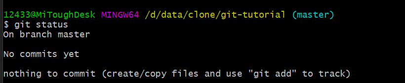
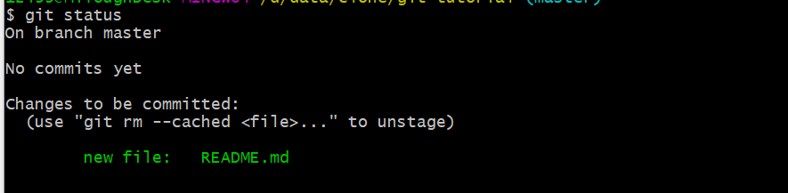
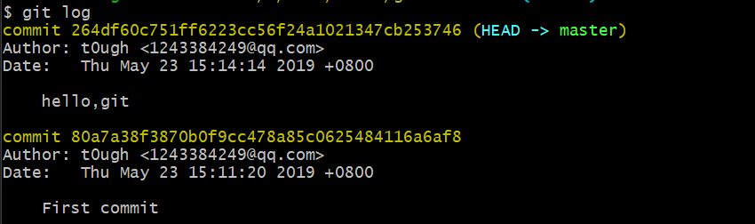
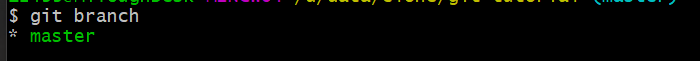
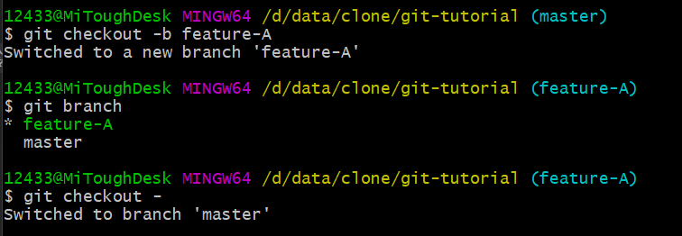
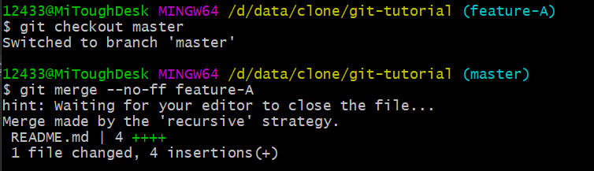
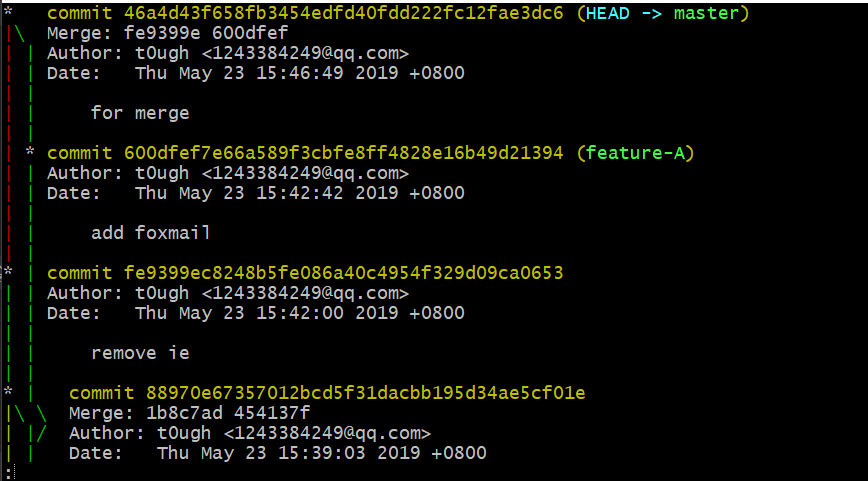
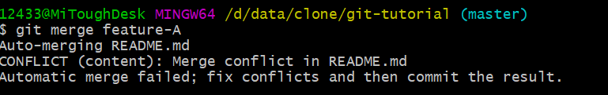
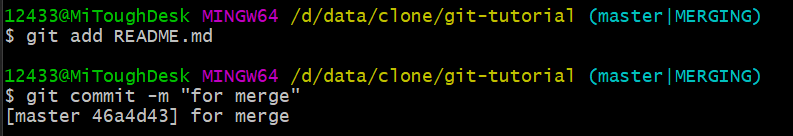

## 1 通过实际操作学习Git

[一个很好的git学习网站](https://learngitbranching.js.org/)

### 1.1 基本操作

#### 1.1.1 git init-初始化仓库

````
$ git init
````

执行`git init`命令后会生成`.git`目录，这个目录中存储了管理当前目录内容所需的仓库数据

我们当前所在的目录称为"附属于该仓库的工作树"，在工作树中对文件进行编辑，然后记录到仓库中，以此管理文件的历史快照。若想要将文件恢复到之前的状态，可从仓库中调取之前的快照，在工作树种打开

#### 1.1.2 git status-查看仓库的状态

````
$ git status
````



#### 1.1.3 git add-向暂存区中添加文件

假如只是在工作树中创建了文件，那么该文件不会被记入Git仓库的版本管理对象

要想让文件成为Git仓库的管理对象，需要用`git add`命令将其假如暂存区(Stage或Index)中，暂存区是提交之前的临时区域



````
$ git add README.md
````

#### 1.1.4 git commit-保存仓库中的历史记录

git commit 命令可以将当前暂存区中的文件实际保存到仓库的历史记录中。通过这些记录，可以在工作树中复原文件

````
$ git commit -m "first commit"
````

#### 1.1.5 git log-查看提交日志



- `git log`:查看以往仓库中提交的日志

- `git log --pretty=short`:只显示提交日志的第一行

- `git log -p`:显示提交后文件的改动

#### 1.1.6 git diff-查看更改前后的区别

`git diff`命令可以查看工作树、暂存区、最新提交之间的差别

- `git diff`:查看当前工作树和暂存区的区别

- `git add`:使用此指令将工作树中的文件加入暂存区，此时工作树和暂存区没有区别

- `git diff HEAD`:查看暂存区与最新提交的区别

### 1.2 分支的操作

在进行多个并行作业时，我们会用到分支。在这类分支中往往同时存在多个最新代码状态。

master分支是Git默认创建的分支，因此基本上所有开发都是以这个分支为中心进行的

#### 1.2.1 git branch-展示分支一览表



````
$ git branch
````

分支左侧的星号，表示我们当前所在的分支

#### 1.2.2 git checkout -b-创建、切换分支

`git checkout -b feature-A`:创建并切换到feature-A分支

`git checkout -`:切换回上一分支



#### 1.2.3 特性分支

特性分支是集中实现单一特性(功能)，除此之外不进行任何作业的分支。日常开发中往往会创建数个特性分支，并保留一个稳定分支，一般是master分支担当

基于特性的工作在特性分支中进行，特性完成后再与master合并。这样可以保证master分支随时供人查看和创建新的特性分支

#### 1.2.4 git merge-合并分支

````
$ git merge --no-ff feature-A
````



#### 1.2.5 git log --graph-以图表形式查看分支

````
$ git log --graph
````



#### 1.2.6 git reset-回溯历史版本

借助分散仓库的优势，可以在不影响其他仓库的前提下对历史版本进行操作

`git reset --hard`根据目标时间点的哈希值，将当前仓库回溯到指定状态
````
$ git reset --hard fd0cbcsdfa
HEAD is now at fd0cbf0 Add index
````

`git reflog`查看当前仓库的操作日志，可以在日志中找到对应的哈希值

#### 1.2.7 git commit --amend-修改提交信息

````
$ git commit --amend
````

此命令可以修改上一条提交信息

### 1.3 合并冲突

此处合并时发生了冲突



1. 查看冲突部分并解决

2. 冲突解决后，使用`git add`和`git commit`命令，将合并的处理结果提交



### 1.4 推送到远程仓库

远程仓库，是与本地仓库相对独立的另一个仓库，主要部署在github上

#### 1.4.1 在github上创建远程仓库

#### 1.4.2 git remote add-添加远程仓库

````
$ git remote add origin git@github.com:t0ugh/git-tutorial.git
````

#### 1.4.3 git push 推送到远程仓库

1. 推送到`master`分支
    ````
    $ git push -u origin master
    ````
    - `-u`参数可以在推送的同时将`origin`仓库的`master`分支设置为本地仓库当前分支的`upstream`

2. 推送到`master`之外的分支
    ````
    $ git checkout -b feature-D
    $ git push -u origin feature-D
    ````
    - 我们在本地仓库中创建`feature-D`分支，然后将它`push`给远程仓库并保持分支名称不变
    - 现在，在远程仓库的GitHub页面就可以查看到`feature-D`分支S

### 1.5 从远程仓库获取

#### 1.5.1 git clone-获取远程仓库

##### 1 获取远程仓库

````
$ git clone git@github.com:t0ugh/git-tutorial.git
````

执行`git clone`命令后，我们会默认位于`master`分支下，同时系统将`origin`设置为该远程仓库的标识符

也就是说当前本地仓库的`master`分支与Github端远程仓库(`origin`)的`master`分支在内容上完全相同

````
$ git branch -a
* master
  remotes/origin/HEAD -> origin/master
  remotes/origin/feature-D
  remotes/origin/master
````


##### 2 获取远程的feature-D分支

将feature-D分支获取到本地仓库
````
$ git checkout -b feature-D origin/feature-D
````

##### 3 修改并推送feature-D分支

以名为origin的feature-D分支为来源，在本地创建feature-D分支

对本地内容进行修改和提交，提交后，推送到远程的feature-D分支

````
$ git push
````

#### 1.5.2 git pull-获取最新的远程仓库分支

使用git pull命令，将本地的feature-D分支更新到最新状态

````
$ git pull origin feature-D
````

如果两人同时修改了同一部分的源代码，push很容易发生冲突。所以多名开发者在同一个分支中进行工作时，为减少冲突情况的发生，建议更频繁的进行push和pull操作
