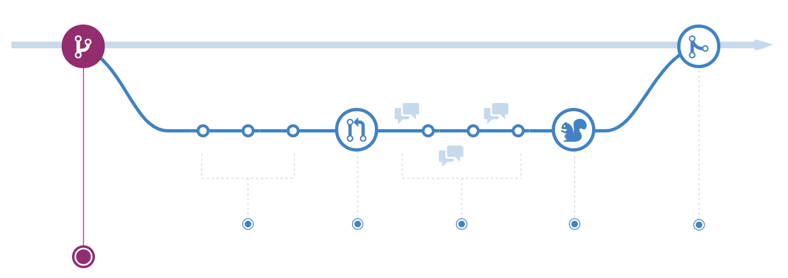
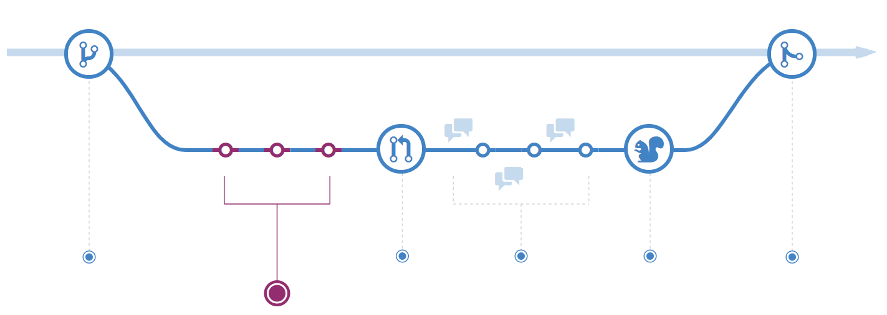
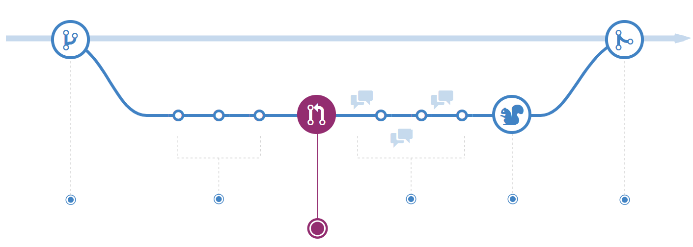
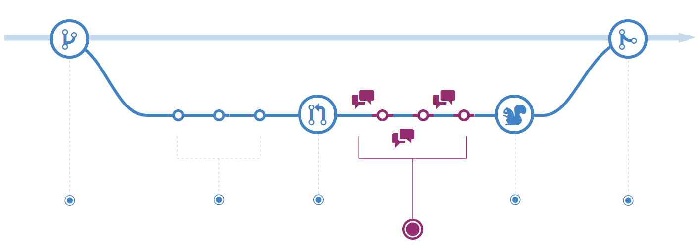
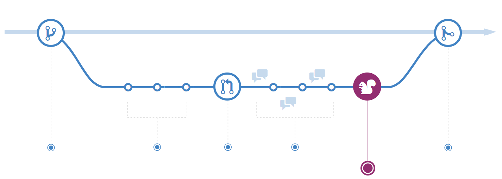
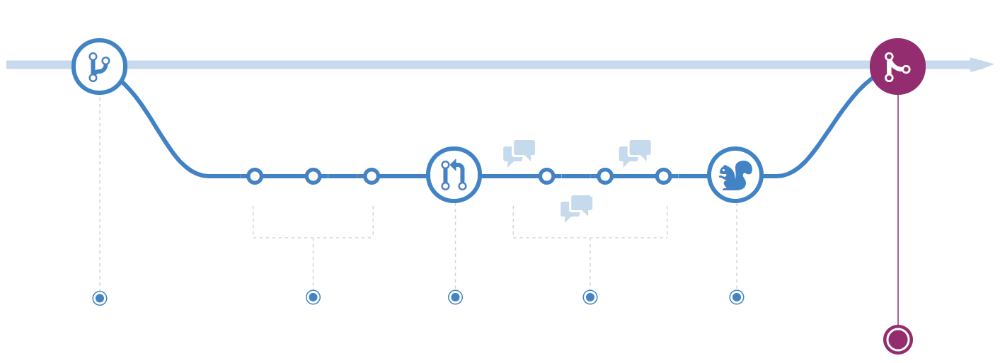

## 3 了解 Github flow

[原文地址](https://guides.github.com/introduction/flow/)

GitHub流程是一种轻量级，基于分支的工作流程，支持定期进行部署的团队和项目

### 3.1 新建分支

当你为一个项目工作时，你可能在任何特定时间产生一堆不同的功能或想法。其中一些深思熟虑，可以着手去做的，另一些只是雏形。分支可以帮助你管理这些工作流。

在项目中创建分支后，你就会拥有一个可以尝试新想法的环境。你在这个分支上做的更改不会影响到`master`分支，因此你可以安全而自由地进行`code`和`commit`，并且非常清楚地知道这些提交将不会影响到主分支。

分支是Git中的核心概念，整个GitHub流程都是基于它的。分支的唯一一条规律：`master`分支中的任何内容始终都是可部署的。

在开发新功能或修复bug时，创建新分支非常重要。你的分支名称应该是具有描述性的(如`refactor-authentication`，`user-content-cache-key`，`make-retina-avatars`)，以便其他人可以看到正在开发什么奇奇怪怪的功能。

### 3.2 添加commit(Add Commit)

创建分支后，就可以开始进行更改了。无论何时添加，编辑或删除文件，你都需要进行提交。`add commit`的过程会在你处理功能分支时跟踪你的进度。

`commit`还可以创建一份历史记录，以便其他人可以了解你都做了什么工作。每个`commit`都有一个与之关联的提交信息，该信息描述这次提交做了什么。

提交信息很重要，因为Git会跟踪你的更改和提交。通过编写清晰的提交消息，你可以更轻松地让其他人跟进并提供反馈。

### 3.3 打开一个 pull request

`Pull Requests`会启动有关你的分支的讨论。你的队友可以确切地看到将合并什么改变

你可以在开发过程中的任何时候打开`Pull Request`
1. 当你没有写代码但想要分享一些屏幕截图或不成熟想法
2. 当你遇到困难并需要帮助或建议时
3. 或者当你准备好某人时审查你的工作。

通过在`Pull Request`消息中使用`GitHub`的`@mention`系统，你可以询问特定人员或团队的反馈，无论他们身处何方。

`Pull Requests`对于贡献开源项目和管理对共享存储库的更改很有用。如果您使用的是共享存储库模型，则`Pull Requests`会在合并到主分支之前帮助启动关于代码审查的讨论。

### 3.4 讨论并检查代码

一旦发起了`Pull Request`，审核代码的人可能会有问题或意见。也许编码风格太差，或者缺少单元测试，又或者一切看起来都很棒。Pull Requests旨在鼓励和记录此类对话。

你还可以参考有关提交的讨论和反馈继续开发你的分支。如果有人提出了你代码中的问题，你可以在分支中修复它并`push`更改。GitHub将在统一的`Pull Request`视图中显示你的新`commit`以及其他人的评论。

### 3.5 部署

使用GitHub，你可以在合并到`master`之前从当前分支进行部署，来完成在生产中的最终测试。

一旦你的`Pull Request`被同伴检查完并通过了单元测试，你可以部署更改并在生产环境中验证它们。

### 3.6 合并

如果你的更改已在生产环境中得到验证，就可以将当前分支合并到主分支中了。

合并后，`Pull Request`会保留代码更改的历史记录，所以队友们都可以了解到你都完成了哪些新特性。

