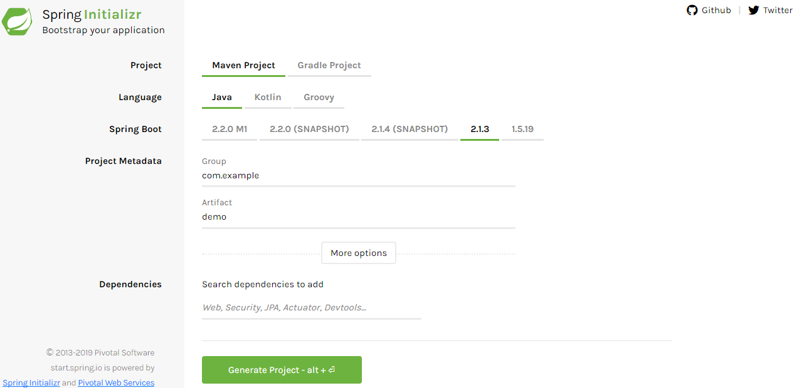

## 了解SpringBoot

### 1 什么是SpringBoot

Spring Boot 是由 Pivotal 团队提供的全新框架，其设计目的是用来简化新 Spring 应用的初始搭建以及开发过程。

该框架使用了特定的方式来进行配置，从而使开发人员不再需要定义样板化的配置。

Spring Boot 其实不是什么新的框架，它默认配置了很多框架的使用方式，就像 Maven 整合了所有的 Jar 包，Spring Boot 整合了所有的框架。

### 2 使用SpringBoot的好处

开箱即用、简单、快速、方便

### 3 使用SpringBoot搭建项目

1. 访问 [http://start.spring.io/](http://start.spring.io/)

2. 配置工程的基本信息


3. 点击Generate Project下载项目压缩包

4. 解压后用idea打开即可，maven会自动下载依赖

5. 建议的目录类型
````
com
  +- example
    +- myproject
      +- Application.java
      |
      +- model
      |  +- Customer.java
      |  +- CustomerRepository.java
      |
      +- service
      |  +- CustomerService.java
      |
      +- controller
      |  +- CustomerController.java
      |
````

