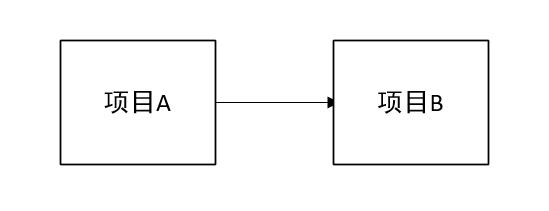
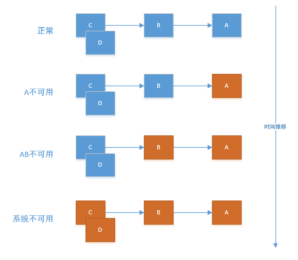

## SpringCloud初步了解

[原文地址](http://www.ityouknow.com/spring-cloud.html)

### 1 大话SpringCloud

Spring Cloud从技术架构上降低了对大型系统构建的要求，使我们以非常低的成本（技术或者硬件）搭建一套高效、分布式、容错的平台

#### 1.1 SpringCloud

Spring Cloud是一系列框架的集合。它利用Spring Boot的开发便利性巧妙地简化了分布式系统基础设施的开发，如服务发现注册、配置中心、消息总线、负载均衡、断路器、数据监控等，都可以用Spring Boot的开发风格做到一键启动和部署。

微服务是可以独立部署、水平扩展、独立访问（或者有独立的数据库）的服务单元，springcloud就是这些微服务的管家，采用了微服务这种架构之后，项目的数量会非常多

#### 1.2 和SpringBoot的关系

- Spring Boot 是 Spring 的一套快速配置脚手架，可以基于Spring Boot 快速开发单个微服务
- Spring Cloud是一个基于Spring Boot实现的云应用开发工具
- Spring Boot专注于快速、方便集成的单个个体，Spring Cloud是关注全局的服务治理框架
- Spring Boot使用了默认大于配置的理念，很多集成方案已经帮你选择好了，能不配置就不配置
- Spring Cloud很大的一部分是基于Spring Boot来实现，但Spring Boot可以离开Spring Cloud独立使用开发项目

#### 1.3 Spring Cloud的优势

- 产出于spring大家族，可以保证后续的更新、完善
- Spring Boot提供的开箱即用性
- 作为一个微服务治理的大家伙，考虑的很全面，几乎服务治理的方方面面都考虑到了
- Spring Cloud 活跃度很高，教程很丰富，遇到问题很容易找到解决方案
- 轻轻松松几行代码就完成了熔断、均衡负载、服务中心的各种平台功能

#### 1.4 其他

- Spring Cloud对于中小型互联网公司来说是一种福音，因为这类公司往往没有实力或者没有足够的资金投入去开发自己的分布式系统基础设施，使用Spring Cloud一站式解决方案能在从容应对业务发展的同时大大减少开发成本。

- 同时，随着近几年微服务架构和Docker容器概念的火爆，也会让Spring Cloud在未来越来越“云”化的软件开发风格中立有一席之地，尤其是在目前五花八门的分布式解决方案中提供了标准化的、全站式的技术方案，意义可能会堪比当前Servlet规范的诞生，有效推进服务端软件系统技术水平的进步。

### 2 注册中心Eureka

#### 2.1 注册中心

注册中心，管理各种服务功能包括服务的注册、发现、熔断、负载、降级等

正常调用项目A请求项目B

有了服务中心之后，任何一个服务都不能直接去调用，都需要通过服务中心来调用

通过服务中心来获取服务你不需要关注你调用的项目IP地址，由几台服务器组成，每次直接去服务中心获取可以使用的服务去调用即可

由于各种服务都注册到了服务中心，就有了去做很多高级功能条件
1. 几台服务提供相同服务来做均衡负载
2. 监控服务器调用成功率来做熔断，移除服务列表中的故障点
3. 监控服务调用时间来对不同的服务器设置不同的权重等等。

#### 2.2 Eureka

Eureka的基础架构
1. Eureka Server: 提供服务注册和发现
2. Service Provider: 服务提供方，将自身服务注册到Eureka中，从而使得服务消费方能够找到
3. Service Consumer: 服务消费方，从Eureka获取注册服务列表，从而能够消费服务

### 3 熔断器Hystrix

#### 3.1 雪崩效应

在微服务架构中通常会有多个服务层调用，基础服务的故障可能会导致级联故障，进而造成整个系统不可用的情况，这种现象被称为服务雪崩效应。

服务雪崩效应是一种因服务提供者的不可用导致服务消费者的不可用,并将不可用逐渐放大的过程。

如下图所示: A作为服务提供者，B为A的服务消费者，C和D是B的服务消费者。A不可用引起了B不可用，并将不可用像滚雪球一样放大到C和D，雪崩效应形成了

#### 3.2 熔断器

熔断器可以实现快速失败，如果它在一段时间内侦测到许多类似的错误，会强迫其以后的多个调用快速失败，不再访问远程服务器，使得应用程序继续执行而不浪费CPU时间去等待长时间的超时产生。

熔断器也可以使应用程序能够诊断错误是否已经修正，如果已经修正，应用程序会再次尝试调用操作。

熔断器模式就像是那些容易导致错误的操作的一种代理。这种代理能够记录最近调用发生错误的次数，然后决定是允许操作继续，还是快速失败。熔断器开关相互转换的逻辑如下图：

#### 3.2.3 Hystrix特性

1. 断路器机制
    - 当Hystrix Command请求后端服务失败数量超过一定比例(默认50%), 断路器会切换到开路状态(Open). 这时所有请求会直接失败而不会发送到后端服务
    -  断路器保持在开路状态一段时间后(默认5秒), 自动切换到半开路状态(HALF-OPEN). 这时会判断下一次请求的返回情况, 如果请求成功, 断路器切回闭路状态(CLOSED), 否则重新切换到开路状态(OPEN)
    - 一旦后端服务不可用, 断路器会直接切断请求链, 避免发送大量无效请求影响系统吞吐量, 并且断路器有自我检测并恢复的能力.

2. Fallback
    - Fallback相当于是降级操作
    - 对于查询操作, 我们可以实现一个fallback方法, 当请求后端服务出现异常的时候, 可以使用fallback方法返回的值
    - fallback方法的返回值一般是设置的默认值或者来自缓存.

3. 资源隔离
    - 在Hystrix中, 主要通过线程池来实现资源隔离
    - 通常在使用的时候我们会根据调用的远程服务划分出多个线程池. 例如调用产品服务的Command放入A线程池, 调用账户服务的Command放入B线程池. 这样做的主要优点是运行环境被隔离开了. 
    - 这样就算调用服务的代码存在bug或者由于其他原因导致自己所在线程池被耗尽时, 不会对系统的其他服务造成影响. 

### 4 服务网关Zuul

在微服务架构中，后端服务往往不直接开放给调用端，而是通过一个API网关根据请求的url，路由到相应的服务。

当添加API网关后，在第三方调用端和服务提供方之间就创建了一面墙，这面墙直接与调用方通信进行权限控制，后将请求均衡分发给后台服务端。

#### 4.1 为什么需要API GateWay

在微服务架构模式下后端服务的实例数一般是动态的，对于客户端而言很难发现动态改变的服务实例的访问地址信息。
因此在基于微服务的项目中为了简化前端的调用逻辑，通常会引入API Gateway作为轻量级网关，同时API Gateway中也会实现相关的认证逻辑从而简化内部服务之间相互调用的复杂度。

### 5 Spring Cloud Config配置中心

随着线上项目变的日益庞大，每个项目都散落着各种配置文件，如果采用分布式的开发模式，需要的配置文件随着服务增加而不断增多。

某一个基础服务信息变更，都会引起一系列的更新和重启，配置中心便是解决此类问题的灵丹妙药。

#### 5.1 配置中心提供的核心功能

- 提供服务端和客户端支持
- 集中管理各环境的配置文件
- 配置文件修改之后，可以快速的生效
- 可以进行版本管理
- 支持大的并发查询
- 支持各种语言

#### 5.2 Spring Cloud Config

Spring Cloud Config项目是一个解决分布式系统的配置管理方案。

它包含了Client和Server两个部分，server提供配置文件的存储、以接口的形式将配置文件的内容提供出去，client通过接口获取数据、并依据此数据初始化自己的应用。

Spring cloud使用git或svn存放配置文件，默认情况下使用git
