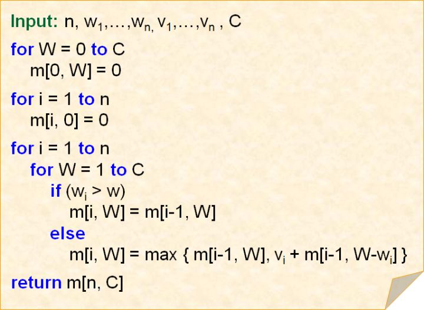

## 动态规划(Dynamic Programing, DP)

动态规划是一种通过把原问题分解为相对简单的子问题的方式求解复杂问题的方法

动态规划常常适用于有重叠子问题和最优子结构性质的问题，动态规划方法所耗时间远少于朴素解法

动态规划背后的基本思想非常简单。大致上，若要解一个给定问题，我们需要解其不同部分，再根据子问题的解以得出原问题的解

通常许多子问题非常相似，为此动态规划法试图仅仅解决每个子问题一次，从而减少计算量：一旦某个给定子问题的解已经算出，则将其记忆化存储，以便下次需要同一个子问题解时直接查表。这种做法在重复子问题的数目关于输出的规模呈指数增长时特别有用

### 概述

动态规划在查找有许多重叠子问题的情况的最优解时有效，它将问题重新组合为子问题。为了避免多次解决这些子问题，它们的结果都逐渐被计算并被保存，从简单的问题直到整个问题都被解决。因此，动态规划保存递归时的结果，因而不会在解决同样的问题时花费时间。

动态规划只能应用于有最优子结构的问题。最优子结构的意思是局部最优解能决定全局最优解。简单来说，问题可以被划分为子问题来解决

### 适用情况

1. 最优子结构性质: 如果问题的最优解所包含的子问题的解也是最优的，我们就称该问题具有最优子结构性质。最优子结构性质为动态规划算法解决问题提供了重要的线索
2. 无后效性: 即子问题的解一旦确定，就不再改变，不受在这之后、包含它的更大的问题的求解决策影响
3. 子问题重叠性质: 子问题重叠性质是指在用递归算法自顶向下对问题进行求解时，每次产生的子问题并不总是新问题，有些子问题会被重复计算多次。动态规划算法正是利用了这种子问题重叠性质，对每个子问题只计算一次，然后将其计算结果保存到一个表格中，当再次需要计算已经计算过的子问题时，只是在表格中简单地查看一下结果，从而获得较高的效率

### 实例--01背包问题

#### 问题描述

有`N`件物品和一个容量为`V`的背包。第i件物品的费用是`c[i]`，价值为`w[i]`。求解将哪些物品装入背包可使价值总和最大

#### 基本思路

这是最基础的背包问题，特点是：每种物品仅有一件，可以选择放或不放。 用子问题定义状态：即`f[i][v]`表示前`i`件物品恰放入一个容量为`v`的背包可以获得的最大价值。其状态转移方程为

> f[i][v]=max{f[i-1][v],f[i-1][v-c[i]]+w[i]}

其中`i`表示放第`i`个物品

`v`表示背包所容纳的重量

`f[i][v]`表示前`i`件物品恰放入一个容量为`v`的背包可以获得的最大价值

`w[i]`表示第`i`件商品的价值

若只考虑第`i`件物品的策略（放或不放），那么就可以转化为一个只牵扯前`i-1`件物品的问题。

如果不放第`i`件物品，那么问题就转化为前`i-1`件物品放入容量为`v`的背包中，价值为`f[i-1][v]`；

如果放第`i`件物品，那么问题就转化为前`i-1`件物品放入剩下的容量为`v-c[i]`的背包中”，此时能获得的最大价值就是`f[i-1][v-c[i]]`再加上通过放入第i件物品获得的价值`w[i]`

#### 举例

假设现在有5件商品，每件商品的的价值和重量如下图所示，背包的容量 `C = 11`，现在来求解这个01背包问题

首先，我们制作一个表格

表格的每一列表示产品，列数等于产品数加一，即列数为6列。表格的行数等于背包的容量数加一，即行数为12行。

假设我们按照商品序号从`1`到`5`的顺序放入商品，表格中的每个元素表示：当背包容量为j时，我们放到第`i`个商品时，背包价值的最大值。

首先当背包为空时，价值为0，所以我们把第一行初始化为0。

而当背包的容量为0时，我们无法放入任何商品，价值为0，所以我们把第一列初始化为0。

对于其他元素，进行如下判断

- 当商品重量大于背包容量时，我们一定无法放入商品，所以此时背包的价值继承自放入上一商品时的最大价值，即表格同列的上一个值。

- 当重量小于总重时，我们需要考虑是否放入此商品。我们比较放与不放的价值哪个较大。对于放入商品的价值，我们将背包容量减去此商品的重量后，查表。对于不放入商品的价值，继承自放入上一商品时的最大价值。例如，当表格运算到`[{1,2,3}, 5]`时,我们首先考虑将商品放入背包，则此时背包重量为0，我们查询`[{1,2},0]`发现此时价值为0，则这种情况下的价值为`0 + 18 = 18`。然后我们考虑不将商品放入背包，此时背包的价值继承自放入上一商品时的最大价值，我们查询`[{1, 2}, 5]`,这种情况下的价值为 `7`。明显第一种情况更好，则我们将这个元素的值设置为`18`。

当我们计算到表格的右下角元素时，此问题已经解决了，就是右下角元素的值

#### 伪代码

### 与内容无关的部分

