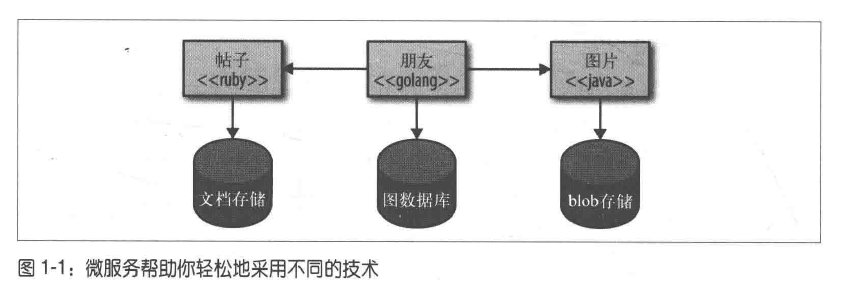

## 1 微服务

### 1.1 什么是微服务

简介: 微服务就是一些协同工作的小而自治的服务

#### 1.1.1 很小，专注于做好一件事

单一职责原则: 把因相同原因而变化的东西聚合到一起，而把因不同原因而变化的东西分离开来

微服务将单一职责原则应用于独立的服务中。根据业务的边界来确定服务的边界，这样就很容易确定某个功能代码应该方法哪里。由于该服务专注于某个边界之内，因此可以很多地避免由于代码库过大衍生出的很多相关问题

服务大小的权衡
- 服务越小，微服务架构的优点和缺点也就约明显
- 使用的服务越小，独立性带来的好处就越多，但是管理大量服务也会越复杂

#### 1.1.2 自治性

1. 一个微服务就是一个独立的实体:
    - 它可以独立的部署在PAAS平台上
    - 也可以作为一个操作系统进程存在
    - 我们要尽量避免把多个服务部署在同一机器上，这会大大简化分布式系统的构建

2. 服务之间通过网络调用通信，从而加强服务之间的隔离性，避免紧耦合

3. 这些服务可以彼此间独立地进行修改，并且某一个服务地部署不应该引起该服务消费方地变动

4. 服务会暴露出API，然后服务之间通过API通信
    - API通常是技术无关的，以保证技术的选择不被限制

### 1.2 主要好处

微服务有很多好处，其中**一些好处也适用于任何一个分布式系统**，但相对于分布式系统或者面向服务的架构而言，微服务要更胜一筹，它会把这些好处推向极致

#### 1.2.1 技术异构性

1. 在一个由多个服务相互协作的系统中，可以在不同的服务中使用最适合该服务的技术
    - 例如: 如果系统中一部分需要做性能提升，额可以使用性能更好的技术栈重新构建该部分
    - 再例如：系统的不同部分可以使用不同的存储技术，社交网络可以使用图数据库，而文本可以使用对象存储技术等等
    

2. 微服务可以帮助我们更好的采用新技术
    - 在一个服务中采用新技术的风险要远远小于在整个系统中引入新技术

#### 1.2.2 弹性

舱壁:
- 如果系统中的一个组件不可用，但并没有导致级联故障，那么系统的其他部分还可以正常运行
- 系统边界就是一个很显然的舱壁

优点
- 在单块系统中，如果服务不可用，那么所有的功能都会不可用
- 而微服务系统中，只会导致部分功能不可用

#### 1.2.3 扩展(性能层面)

庞大的单块服务只能作为一个整体进行扩展。即使系统中只有一小部分存在性能问题，也需要对整个服务进行扩展。如果使用较小的多个服务，则可以只对需要扩展的服务进行扩展，这样就可以把那些不需要扩展的服务运行在更小的、性能稍差的硬件上

例如

- 图片部分需要进行性能提升，所以部署4个实例
- 而朋友部分不需要扩展，可以部署在比较差的硬件上

#### 1.2.4 简化部署

在微服务架构中，各个服务的部署是独立的，这样可以更快地对特定部分的代码进行部署。如果真的出现了问题，也只会影响一个服务，并且容易快速回滚

#### 1.2.5 与组织结构相匹配

微服务架构可以很好地将架构与组织结构相匹配，避免出现过大的代码库，从而获得理想的团队大小及生产力

#### 1.2.6 可组合性

先略，没看懂

#### 1.2.7 对可替代性的优化

使用微服务架构的团队可以在需要时轻易地重写服务，或者删除不再使用地服务。当一个代码块只有几百行时，人们也不会对它有太多感情地依赖，所以很容易替换它

### 1.3 面向服务的架构

SOA(Service-Oriented Architecture, 面向服务的架构)是一种设计方法
- 其中包含多个服务， 而服务之间通过配合最终会提供一系列功能
- 一个服务通常以独立的形式存在于操作系统进程中
- 服务之间通过网络调用，而非通过进程内调用的方式进行通信

在现实世界中，由于我们对项目的系统和架构有着更好的了解，所以能够更好地实施SOA，而这事实上就是微服务架构。可以认为微服务架构是SOA的一种特定方法

### 1.4 其他分解技术

#### 1.4.1 共享库

基本上所有语言都支持将整个代码库分解为多个库，这是一种非常标准的分解技术。这些库可以由第三方或自己的组织提供

#### 1.4.2 模块

除了简单的库之外，有些语言提供了自己的模块分解技术。
- 它们允许对模块进行生命周期管理，这样就可以把模块部署到运行的进程中，
- 并且可以在不停止整个进程的前提下对某个模块进行修改

### 1.5 没有银弹

微服务不是免费的午餐，更不是银弹。我们需要面对微服务带来的复杂性，需要在部署、测试和监控等方面做很多的工作，还需要考虑如何扩展系统
