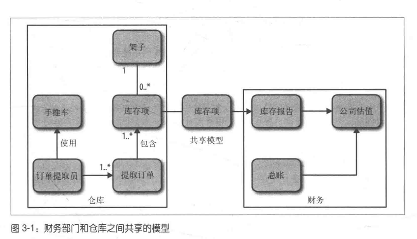
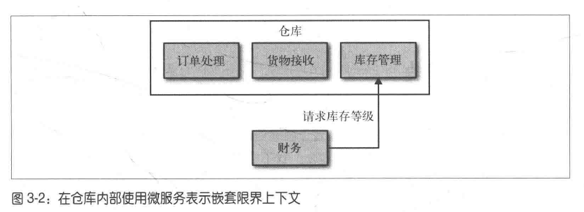
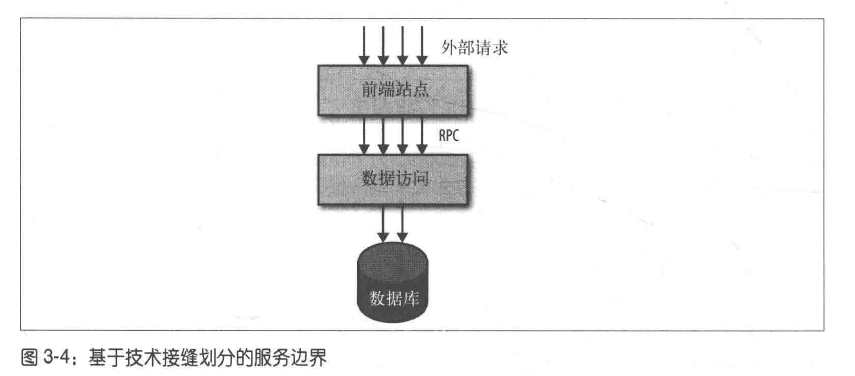

## 3 如何建模服务

> 对手的论证让我想到了异教徒。当别人问异教徒世界是由什么支撑时，他说:"一只乌龟。"别人再问他:"那乌龟是由什么支撑呢?"他回答:"另一只乌龟。"

### 3.1 什么样的服务是好服务

#### 3.1.1 松耦合

如果做到服务之间的松耦合，那么修改一个服务就不需要修改另一个服务。使用微服务最重要的一点就是，能够独立修改及部署单个服务而不需要修改系统的其他部分

什么会导致解耦合呢？一个典型的错误是，使用紧耦合的方式做服务之间的集成，从而使得一个服务的修改会招致其消费者的修改

一个松耦合的服务应该尽可能少地知道与之协作地那些服务地信息，这也意味着，应该限制两个服务之间不同调用形式的数量，因为除了潜在的性能问题之外，过度的通信可能会导致紧耦合

#### 3.1.2 高内聚

我们希望把相关的行为聚集在一起，把不相关的行为放到别处。如果要改变某一个行为的话，最好能够只在一个地方进行修改，然后就可以尽快地发布。如果需要在很多不同地地方做这些修改，那么可能需要同时发布多个微服务才能交付这个功能。在多个不同的地方进行修改会很慢，同时部署多个服务的风险也很高

### 3.2 限界上下文

Eric Evans认为:"任何一个给定的领域都包含多个限界上下文，每个限界上下文中的模型分为两部分，一部分不需要与外界通信，另一部分需要，每个限界上下文都有明确的接口，该接口决定了它会暴露哪些模型给其他的上下文。"

微服务应该清晰的与限定上下文保持一致

#### 3.2.1 共享的隐藏模型

不应该盲目地将一个模型全部暴露出去，所以对于某个模型，存在内部和外部两种表示方式

#### 3.2.1 模块和服务

在同一个进程内使用模块可以减少耦合，所以一旦你发现领域内部的限界上下文(服务)，一定要使用模块对其进行建模。

#### 3.2.3 过早划分

将一个已有的代码块划分为微服务，要比从头开始构建微服务简单很多，所以不建议过早划分

### 3.3 业务功能

当思考组织内的限界上下文时，应该从这些上下文能够提供的功能考虑。比如，仓库的一个功能是提供当前的库存清单，财务上下文能提供月末账单或者为一个新招的员工创建工资单。为了实现这些功能，可能需要交换存储信息的模型

### 3.4 逐步划分上下文

一开始你会识别一些粗粒度的限界上下文，而这些限界上下文可能又包含一些嵌套的限界上下文。例如，可以将仓库分解为:订单管理、库存管理、货物接受等

可以使嵌套上下文不直接对外可见。对于外界，它们用的还是仓库的功能，但发出的请求其实被透明地映射到了两个或多个服务上。

### 3.5 关于业务概念的沟通

如果把系统分解为限界上下文的话，对于某个功能所做的修改，更倾向于局限在一个单独的微服务边界之内，这样就减少了修改的范围，并能够更快地进行部署

### 3.6 技术边界

按照地理位置或者技术接缝对单块系统进行划分是不合理的，例如下图

