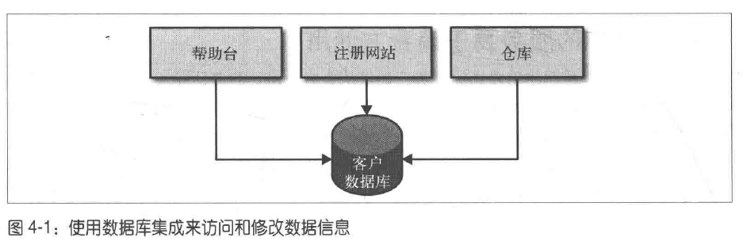
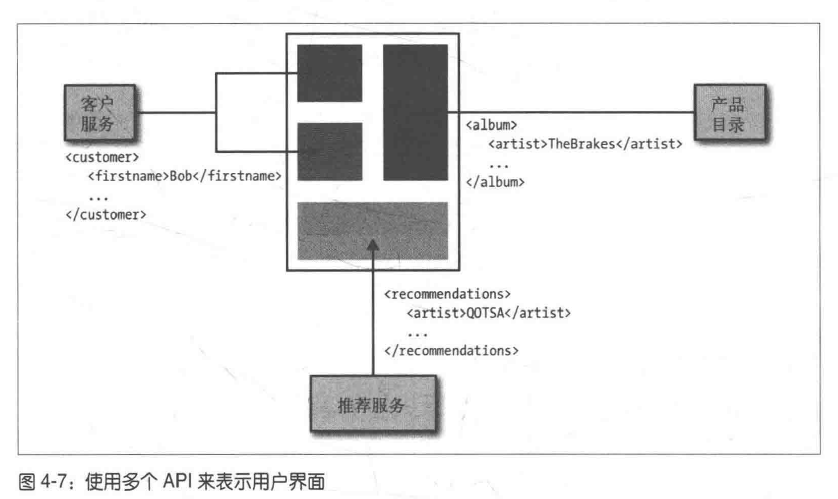
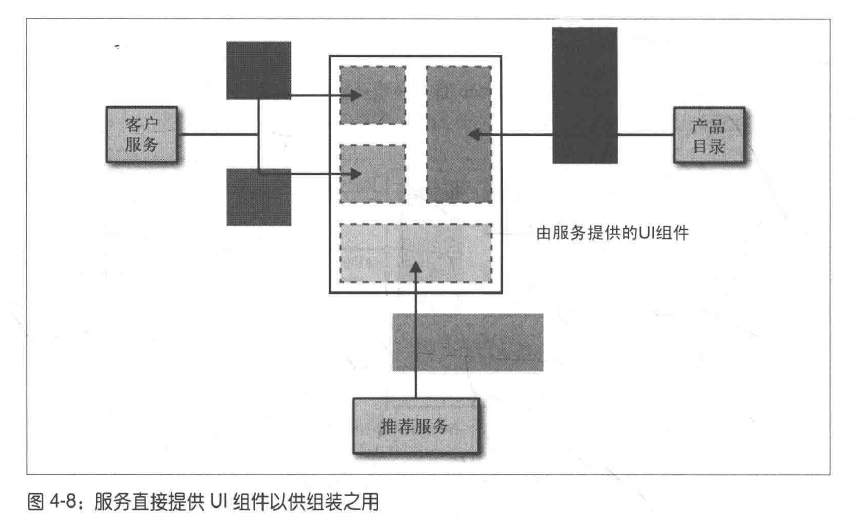
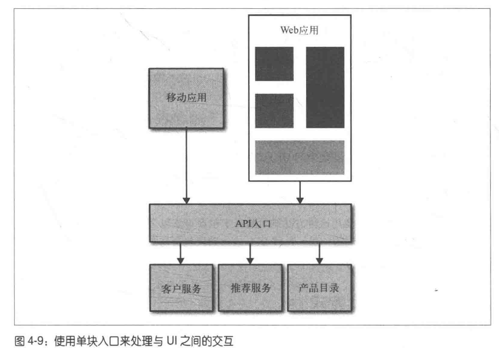
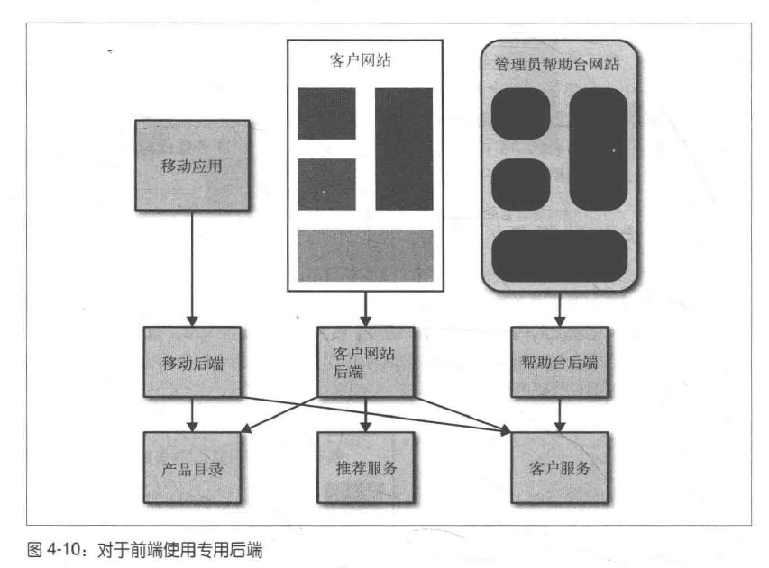

## 4 集成

集成是微服务相关技术中最重要的一个。做的好的话，微服务可以保持自治性，可以独立地修改和发布它们。做的不好，会带来灾难

### 4.1 寻找理想地集成技术

#### 4.1.1 避免破坏性修改

有时候，对某个服务做的一些修改会导致该服务的消费方也随之发生改变。后面会讨论如何处理这种情形，但是我们希望选用的技术可以尽量避免这种情况的发生。比如，如果一个微服务在一个响应中添加了一个字段，那么已有的消费方不应该受到影响

#### 4.1.2 保证API的技术无关性

在IT中，唯一不变的就是变化。新的工具、框架、语言层出不穷。

保持开放，也是引入微服务的原因。保证微服务之间通信方式的技术无关性很重要。这意味着，不应该选择那种对微服务的具体实现技术有限制的集成方式

#### 4.1.3 使你的服务易于消费者使用

消费者应该可以很容易地使用服务。理想情况下，消费方应该可以使用任何技术来实现。另一方面，提供一个客户端库也可以简化消费方的使用

#### 4.1.4 隐藏内部实现细节

与细节绑定意味着，如果想要改变服务内部的一些实现，消费者就需要跟着做出改变。这会增加修改的成本。所有倾向于暴露内部实现细节的技术都不应该被采用

### 4.3 共享数据库

最常用的集成形式是数据库集成。使用这种方式，如果其他服务想要从一个服务获取信息，可以直接访问数据库。如果想要修改，也可以直接在数据库中修改。这种方式很简单，可能是最快的集成方式



但实践起来却有很大的问题
1. 外部系统对内部细节完全可见
    - 存储在数据库中的数据结构对所有人平等给
    - 如果我决定修改表结构，消费方就无法进行工作
2. 消费方与特定的技术绑定在一起
    - 消费方被迫只能使用关系型数据库，无法轻易替换
3. 行为问题
    - 对数据库操作的相似逻辑出现在了多个服务中。当修复一个bug时，可以需要修改多个不同的地方

使用数据库集成无法实现高内聚和低耦合。服务之间很容易通过数据库集成来共享数据，但是无法共享行为。

### 4.4 同步与异步

首先介绍同步和异步
- 同步: 发起一个远程调用后，调用方会阻塞自己并等待整个操作的完成
- 异步: 调用方不需要等待操作的完成就可以返回，甚至不需要关心整个操作完成与否

两种客户端/服务器协作风格
- 请求/响应式
    - 客户端发起一个请求，然后等待响应
    - 这种模式既可以用于同步通信又可以用于异步通信
    - 对于异步通信，我发起一个请求，然后注册一个回调，当服务端操作结束之后，会调用整个回调
- 基于事件
    - 客户端不是发起请求，而是发布一个事件，然后期待其他的写作者接收到该消息，并且知道该怎么做
    - 基于事件的系统天生就是异步的
    - 客户端发布一个事件，但并不需要知道谁或者什么会对此做出响应，这也意味着，可以在不影响客户端的情况下对该事件添加新的订阅者

### 4.5 编排与协同

有两种架构风格可以采用
- 使用编排(orchestration)的话，我们会依赖于某个中心大脑来指导并驱动整个流程，就像管弦乐队中的指挥一样
- 使用协同(choreography)的话，我们仅仅会告知系统中各个部分各自的职责，而把具体怎么做的细节留给它们自己，就像芭蕾舞中每个舞者都有自己的方式，同时也会响应周围其他人

编排方式的缺点
- 某个服务作为中心控制点承担了太多职责，它成为网状结构的中心枢纽及很多逻辑的起点
- 会导致出现少量上帝，而与其打交道的那些服务都会沦为贫血的，基于CRUD的服务

协同
- 如果使用协同，仅仅从某个服务中使用异步的方式触发一个事件。其他服务可以订阅这个事件并做出相应的处理，这种方式可以消除耦合
- 但是需要做一些额外的工作来控制流程，保证其正确地进行。处理该问题的一种方法是，构建一个监控系统。实际的监控活动是针对每个服务的，但最终需要把监控的结果映射到业务流程中
- 协同的方式可以降低系统耦合度，并且可以更加灵活地对现有系统进行修改。但是需要额外地工作来对业务流程做跨服务地监控

### 4.6 远程方法调用

远程方法调用使用本地调用的方式和远程进行交互

RPC的实现会帮忙快速生成服务端和客户端的桩代码，易于使用

RPC的问题
1. 技术的耦合，如Java RMI，与平台绑定太紧密
2. 本地调用和远程调用并不相同
    - RPC会花大量的时间对负荷进行封装、解封装以及网络通信
    - 网络本身不可靠
3. 脆弱性
    - 若服务端对RPC接口进行了修改，客户端也不得不重新生成桩
    - 而为了应对这些修改，需要同时对服务端和客户端进行部署，由此引发了问题: 服务端和客户端无法分离

使用RPC时要注意
1. 不要对远程调用过度抽象，以致于网络因素完全被隐藏
2. 确保你可以独立地升级服务端的接口而不用强迫客户端升级

相比于使用数据库做集成的方式，RPC显然是一个巨大的进步

### 4.7 REST

REST是受Web启发而产生的一种架构风格。

REST最重要的概念是资源，一个资源的对外显示方式和内部存储方式之间没有什么耦合

REST本身没有提到底层使用什么协议，但事实上最常用HTTP

#### 4.7.1 REST和HTTP

HTTP本身提供了很多功能，这些功能对于实现REST风格非常有用

HTTP的动词可以和资源的CRUD一起使用，REST制订了对所有资源的一套标准。对于一个资源，例如Customer，访问接口只有一个，即`Customer`，但可以通过HTTP协议的不同动词对其进行不同的操作
1. GET: 使用幂等的方式获取资源
2. POST: 创建资源
3. PUT: 更新资源
4. DELETE: 删除资源

HTTP的状态码必须精确
- 1xx：相关信息
- 2xx：操作成功
- 3xx：重定向
- 4xx：客户端错误
- 5xx：服务器错误

#### 4.7.2 超媒体作为程序状态的引擎

REST引入的用来避免客户端和服务端之间产生耦合的另一个原则是"HATEOAS"(Hypermedia As The Engine Of Application State, 超媒体作为程序状态的引擎)

超媒体的概念是: 有一块内容，该内容包含了指向其他内容的链接，而这些内容的格式可以不同(如文本、图像、声音等)

HATEOAS背后的想法是，客户端应该与服务端通过那些指向其他资源的链接进行交互，而这些交互有可能造成状态转移。它不需要知道资源在服务端的URI，相反客户端根据链接导航到它想要的东西

举一个例子
- 考虑Amazon这个站点，随着时间的推移，购物车的位置、链接、图像都有可能发生变化。但是我们人类足够聪明，无论确切的形式和底层的控件怎么变化，我们依然知道想要浏览购物车应该去点哪个按钮。
- 在网页上做出的一些增量更改，只要这些客户和站点之间的隐式约定仍然满足，这些修改就不会破坏站点的功能

举一个更现实的例子
- 使用超媒体控制时，我们希望作为客户端的其他服务也可以达到同样的聪明程度
- 首先看看MusicCorp可能用到的超媒体控制有哪些
    ````xml
    <album>
        <name>Give Blood</name>
        <link rel='/artist' href='/artist/theBrakes'>
        <description>Awesome, short, brutish, funny and loud, Must buy!</description>
        <link rel='/instantpurchase' href='/instantPurchase/1234'>
    </album>
    ````
- 这个文档中存在两个超媒体控制，读取该文档的客户端服务需要知道，应该从rel为artist的链接中获取作者信息，而从rel为instantpurchase中获取购买链接
- 作为一个客户端服务，我们不需要知道购买专辑的URI，只需要访问专辑资源，找到其购买链接，然后访问它即可。购买🐕链接的位置可能会改变，URI也可能会改变，URI也可能会变。但是客户端不会在意这些，这会使得客户端和服务端之间实现了松耦合
- 这样底层细节就被很快地隐藏起来，我们可以随意改变链接的展现形式，只要客户端服务仍然能够通过特定的协议找到它即可
- 使用这些链接来对客户端和服务端进行解耦，从长期来看有着很显著的好处，因为你不需要一再调整客户端代码来匹配服务端的修改

这种方式有一个缺点
- 客户端和服务端之间的通信次数会变多，因为客户端需要不断地发现链接、请求、再发现链接，直到找到自己想要进行的那个操作

#### 4.7.3 JSON、XML还是其他

基于HTTP的REST主要提供两种响应形式，一种是XML的，另一种是JSON的

JSON更加简单，内容更紧凑

XML可以使用链接进行超媒体控制

#### 4.7.4 留心过多的约定

由于REST越来越流行，帮助我们构建RESTFul Web服务的框架也随之流行起来。然而有些工具内在的耦合性所带来的痛苦会远远大于从一开始就消除概念之间的耦合所需要的代价

一种比较很有效的模式是先设计外部接口，等到外部接口稳定以后再实现微服务内部的数据持久化。在此期间，简单地将实体持久化到本地磁盘的文件上。这样做可以保证服务的接口是由消费者的需求驱动出现的，从而避免数据存储方式对外部接口的影响。

#### 4.7.5 基于HTTP的REST的缺点

1. 易用性: 实现超媒体控制基本靠自己
2. 性能上的问题
3. HTTP对于低延迟通信来说不是好的选择
4. 不支持高级的序列化和反序列化机制

### 4.8 实现基于事件的异步协作方式

#### 4.8.1 技术选择

主要有两个部分要考虑: 微服务发布事件机制和消费者接收事件机制

一种实现方式是使用像RabbitMQ这样的消息代理
- 生产者(producer)使用API向代理发布事件
- 代理也可以向消费者提供订阅服务，并在事件发生时通知消费者
- 这种代理甚至可以跟踪消费者的状态，比如标记哪些消息是被消费者已经消费过的
- 这种系统通常具有很好的伸缩性和松耦合
- 但是会增加开发流程的复杂度，因为需要一个额外的消息代理系统才能开发及测试服务

另一种方法是使用HTTP来传播事件
- ATOM是一个符合REST规范的协议
- 可以通过它提供资源聚合(feed)的发布服务，而且有很多现成的客户端库可以用来消费该聚合
- 当客户服务发生改变时，只需要简单地向该聚合发布一个事件即可，消费者会轮询该聚合以查看变化

#### 4.8.2 异步架构的复杂性

事件驱动的系统耦合度很低而且伸缩性很好，但是这种编程风格会导致一定的复杂性
- 需要考虑响应返回时需要怎么处理
- 该响应是否成功返回到发送消息的节点，如果是的话，节点服务停止了怎么办，如果不是，是否需要把消息事先存储在某个其他地方，以便做相应处理

### 4.9 服务即状态机

服务应该根据限界上下文进行划分，我们的`Costomer`微服务应该拥有与这个上下文中行为相关的所有逻辑

当消费者想对`Costomer`进行修改时，它会向`Costomer`服务发送一个合适的请求。`Costomer`服务根据自己的逻辑决定是否接收该请求。`Costomer`服务控制了所有与`Costomer`生命周期相关的事件。我们想要避免简单地对CRUO进行封装的贫血服务。如果出现了在`Costomer`服务之外与其进行相关的修改的情况，就失去了内聚性

### 4.10 响应式扩展

响应式扩展(Reactive extensions, Rx)提供了一种机制，在此之上，你可以把多个调用的结果组装起来并在此基础上执行操作。调用本身可以是阻塞的或者非阻塞的。Rx改变了传统的流程，以往我们会获取一些数据，然后基于此进行操作，现在你可以做的是简单的对操作的结果进行观察，结果会根据相关数据的改变自动更新

### 4.11 微服务世界中的DRY和代码重用的危险

Don't Repeat Yourself.虽然从字面上看DRY是避免重复代码，但其更精确的定义是避免系统行为和知识的重复。这是很合理的建议，如果想要修改的部分在系统中有重复的话，就很容易漏掉某些部分的修改，从而导致bug

使用DRY可以得到重用性比较好的代码。把重复代码抽取出来，然后就可以在多个地方调用。但这种方法在微服务架构中是很危险的

建议是在微服务内部不要违反DRY，在跨服务的情况下可以适当违反DRY

Netflix对客户端库的处理方式是: 客户端库处理类似服务发现、故障模式、日志等方面的工作，而这些工作与服务本身的职责没有什么关系

### 4.12 按引用访问

传递实体时，无法保证其他人是否对资源做了修改，导致此实体已失效，所以要传递引用来进行验证

### 4.13 版本管理

微服务的版本管理比较复杂。大家担心服务的接口难免发生变化，那么如何管理这些变化呢

#### 4.13.1 尽可能延迟

减少破坏性修改影响的最好办法是尽量不做这样的修改。比如数据库集成很容易引入破坏性的修改，但是REST就好的多

另一个延迟破坏性修改的关键是客户端要灵活地响应服务端，客户端尽可能灵活地相应服务端这点符合Postel法则(鲁棒性法则)。该法则认为，系统中地每个模块都应该"宽进严出"，即对自己发送的东西要严格，对接受的东西要宽容

#### 4.13.2 及早发现破坏性修改

即使使用最好的技术，也难以避免破坏性修改的出现。建议使用消费者驱动的契约来及早定位这些问题

#### 4.13.3 使用语义化的版本管理

如果一个客户端能够仅仅通过查看服务的版本号，就知道它是否能够与之进行集成，那就太棒了。语义化版本管理就是一种能够支持这种方式的规则说明

语义化版本管理的每个版本号遵循这样的格式
- MAJOR: 包含向后不兼容的修改
- MINOR: 有新功能增加，但是向后兼容
- PATCH: 对已有功能的缺陷修复

#### 4.13.4 不同的接口共存

我们不想强迫客户端随着服务器一起升级，因为希望微服务可以独立于彼此进行发布。所以可以在同一个服务上使新接口和老接口同时存在

#### 4.13.5 同时使用多个版本的服务

可以同时运行不同版本的服务，然后把老用户路由到老版本的服务，而新用户可以看到新版本的服务

### 4.14 用户界面

用户界面是连接各个微服务的工具，而只有把各个服务集成起来才能真正为用户创造价值

#### 4.14.1 API组合

假设我们的服务彼此之间已经通过XML或者JSON通信了，那么可以让用户界面直接与这个API进行交互



这种方式的问题是
1. 很难为不同的设备定制不同的响应
2. 谁来创建用户界面，如果UI是另一个团队创建的，那么可能会退回到以前那种分层合作模式

#### 4.14.2 UI片段的组合

另一种方法是直接让服务暴露一部分UI，然后只需要简单地将这些片段组合在一起就可以创建出整体UI



这种方法的关键优势是，修改服务的团队同时可以维护这些UI片段，允许我们快速完成修改

这种方式的问题是
1. 无法保证用户体验的一致性
2. 原生应用和胖客户端可能无法消费服务端提供的UI组件。解决方式是在原生应用中嵌入HTML来重用这些服务端组件
3. 有时候服务提供概念的能力难以嵌入到小部件或界面中

#### 4.14.3 为后端服务的前端

使用服务端的聚合接口或API入口，该入口可以对多个后端调用进行编排，并为不同设备提供定制化内容



一种更好的方法是保证这样的后端只为一个应用或用户界面服务



这种模式叫做BFF(Backends For Frontends, 为前端服务的后端)。这一层专门为前端提供服务，它也是用户界面的一部分，尽管它位于服务器端，但是业务逻辑不要泄漏到这一层中

