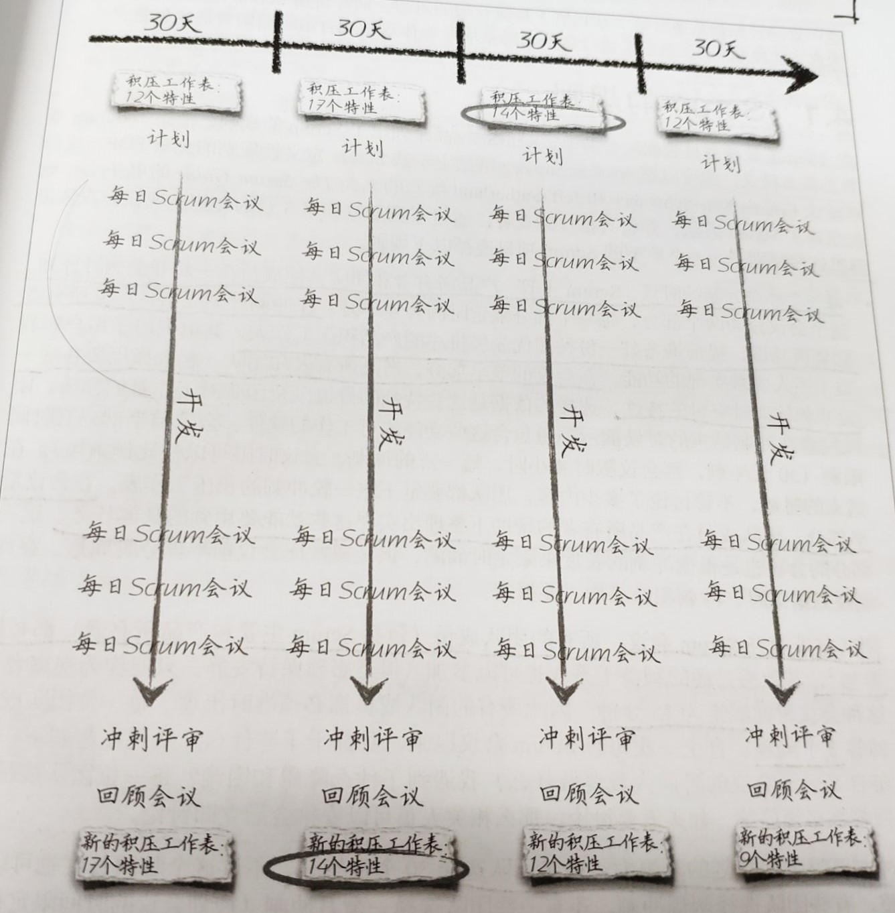

## 3 Scrum和自组织团队

### 3.1 Scrum基本模式

- Scrum中有3种主要的**角色**：产品所有者、Scrum主管和团队成员

- **产品所有者**和团队成员一起工作，负责维护**产品积压工作表**(production backlog)，并对表中的项指定优先级

- 软件在多轮时间限定的迭代中完成开发，这些迭代称为**冲刺**。在每一轮冲刺开始，团队进行**冲刺规划**，从积压工作表中选择本轮要开发的特性。所确定的列表成为**冲刺挤压工作表**

- 团队每天碰面，开一个短会，更新成员各自的进度，并讨论遇到的问题。称为**每日Scrum会议**。每个成员回答三个问题
    1. 自上一次每日Scrum会议以来，我都**做了什么**
    2. 从现在起到下一次每日Scrum会议的时间内我**要做什么**
    3. 我遇到了什么**困难**

- **Scrum主管**要和整个团队一同工作，帮助团队成员克服困难，保证项目正常运转。在每轮冲刺结束的时候，会有一次**冲刺评审**，向产品所有者和其他利益干系人展示可工作的软件。团队还会召开**回顾会议**，找出要从这一轮冲刺中吸取的经验。

### 3.2 Scrum的规则

- 每个冲刺**开始时**，需要进行**冲刺启动会**。会议开始前，产品所有者要提前准备好一份按照优先级排序的**产品积压工作表**。在会议的前半部分，产品所有者和团队**一起选择出要在这一轮冲刺结束时交付的特性**，时长为4小时。在会议的后半部分，团队成员在产品所有者的帮助下**整理出实现这些特性要用到的具体任务**，时长为4小时。

- 团队**每天召开Scrum会议**。所有成员必须参加，会议时长15分钟，所有人回答三个问题
    1. 自上一次每日Scrum会议以来，我都**做了什么**
    2. 从现在起到下一次每日Scrum会议的时间内我**要做什么**
    3. 我遇到了什么**困难**

- 冲刺要**限定在规划的时间**内，一般为30个自然日

- 冲刺结束后，团队召开**冲刺评审会**，向客户和利益干系人展示可工作的软件。团队不能展示中间产物。

- 冲刺结束后，召开**冲刺回顾会议**，讨论可以改进工作方式的地方。团队和Scrum主管参会(产品所有者也可以参加)。每个人回答两个问题
    1. 在这一轮冲刺中有哪些事情做得不错
    2. 未来有哪些事情可以改进

### 3.3 Scrum中的成员角色

#### 3.3.1 Scrum主管指导团队的决策

- Scrum项目中**没有单独负责计划的人**
- 因为如果团队中负责计划和负责执行的人不同，那么一旦遇到麻烦，成员很容易互相指责
- Scrum主管并不负责计划，他可以**帮助团队制订计划**
- 更重要的，他会指导团队使用Scrum及其相关实践，**让所有人觉得计划是大家一起制订的**

#### 3.3.2 产品所有者帮助团队了解软件的价值

- 在Scrum团队中，产品所有者就是**对公司做出承诺**的人
- 这个人必须站出来，保证在项目结束时能交付某个具体的东西
- 产品所有者要**对积压工作表负责**并制订优先级，还要让大家理解一项挤压工作表怎么就算完成了
- 在冲刺的过程中，产品所有者每天都会与团队成员一起工作，回答大量的细节问题，**向团队成员就软件以及用户体验回答具体问题**，还会**做出很多关于产品工作方式的小决策**
- Scrum依赖产品所有者**对业务的决策能力**，产品所有者要花时间**与用户和利益干系人沟通**，以获得开发人员需要的答案并负责让产品积压工作表反应公司需求的最新变化
- 产品所有者并**不一定了解技术细节**，但没有问题

#### 3.3.3 每个人都对项目负责

- Scrum要求: 冲刺的时候，**让项目成功这件事情比你的其他任何职业目标都要重要**

### 3.4 Scrum的价值观

#### 3.4.1 每一位成员都承诺实现项目的目标

- 只有在团队、Scrum主管以及产品所有者能够作出决策的时候才能真正做到这一点

- 他们不需要层层官僚审批就可以做出这样的决策

#### 3.4.2 团队成员互相尊重

- 很多程序员，特别是技术水平很高的程序员，往往纯粹根据技术能力建立尊重，这是高效采用Scrum的一个障碍

- 好的Scrum主管会让程序员指导产品所有者对用户思考方式以及公司的需求有着深入的理解

#### 3.4.3 所有人都专注于工作

- 当团队中所有成员都专注于冲刺目标并且有足够的自由完成满足这些目标所需要的工作，那么整个团队就能够发生自组织，在需求变化的时候很轻松地调整方向

- 因为背景切换需要消耗大量的认知，所以执行多任务没有什么意义

- 好的Scrum团队有权忽略被要求参加的无关会议、各种不相干的组织等让人分心的事情，而不用担心影响自己的事业或晋升

#### 3.4.4 团队重视开放

- 在Scrum团队工作的时候，团队中的其他所有人都应该了解你当前正在做的工作是如何朝着当前目标前进的

- 通过任务板，大家可以看到其他所有人要做的工作，以及还没有完成的工作量

- 通过燃尽图，大家可以自己度量冲刺达成目标的速度

- 高效的每日Scrum会议是纯粹的开放性实践，每个人都会分享自己的任务、遇到的困难以及当前的进度，让整个团队都了解这些事项

- 缺乏透明的组织更容易要求团队去达成一个不切实际的目标，并迫使团队加班

#### 3.4.5 团队成员有勇气全力支持项目

- 要应对与Scrum以及敏捷价值观冲突的公司阻力是需要勇气的

- 每个人都要相信，交付有价值的软件可以帮助自己克服针对这些价值观的阻力

### 3.5 Scrum的实践

#### 3.5.1 每日Scrum例会

"可见" - "检查" - "调整"周期

- "可见":每个人每天讲述手头的工作
- "检查":全体成员倾听讲述
- "调整":同事给出某些方面的改进建议

最后责任时刻

- 在最后责任时刻做出决策可以保留灵活的选择权，更容易针对变化进行调整
- 任务分配

在每日Scrum例会中，每一位团队成员都要**回答三个问题**：从上一次例会到现在我都干了些什么？到下一次例会前我要干什么？什么事情阻碍了我的进度？

**团队每天都通过这些问题集体检查项目的计划**，并且针对项目中发生的变化进行调整。在某个项目中，这些问题的答案给团队提供了持续的反馈

Scrum团队**在最终责任时刻作出决策**，这样可以保留灵活的选择权，更容易针对变化进行调整

每日Scrum例会是**整个团队的事情**，并不只限于Scrum主管和产品所有者，所有人都要平等参会

召开有效的每日Scrum会议
- 表现得像猪一样
- 细节会后讨论
- 轮流先行
- 不要当作例行公事
- 所有人都要参与
- 不要开成最新状态汇报会
- 检查每一项任务
- 计划需要则改变

#### 3.5.2 冲刺、计划和回顾会议

Scrum既是**增量式**的也是**迭代式**的
- 增量是指Scrum把任务分解为连续的冲刺
- 迭代是在于团队在每一轮新的冲刺中都会根据项目中发生的变化进行调整

当真正的Scrum团队说他们被“**交付价值**”所激励的时候。他们的意思是说他们最重要的目标是开发出改善用户生活的软件

**产品所有者**的职责是**帮助团队理解他们的用户**、理解用户所做的工作以及理解用户如何使用软件，通过这种方式可以让团队能一直受到交付价值的激励
