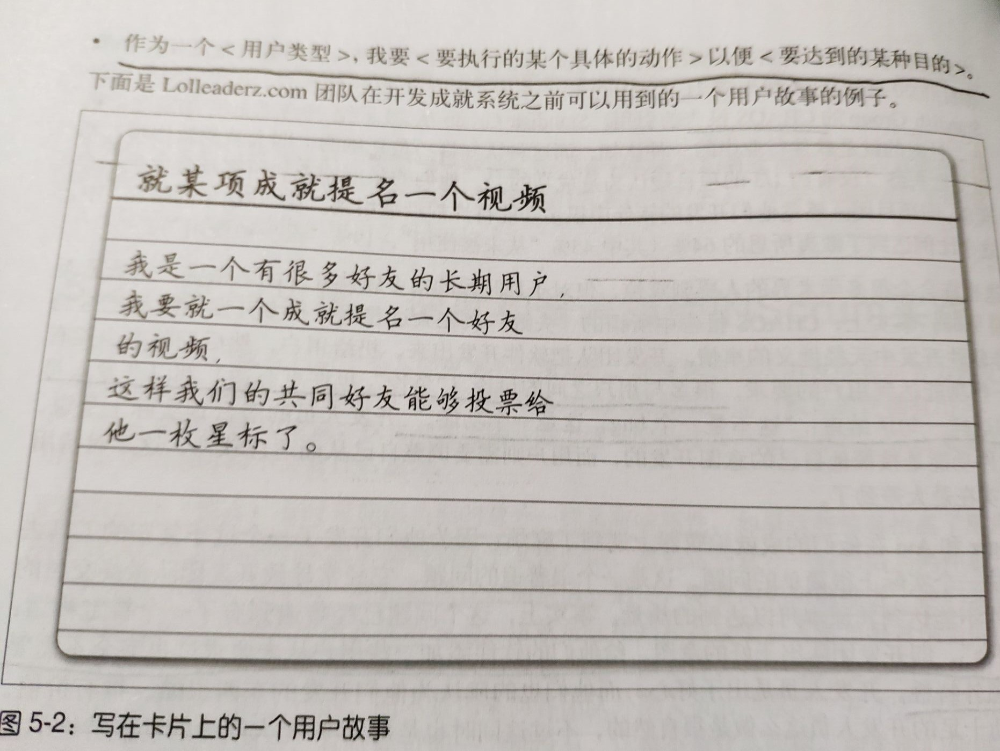
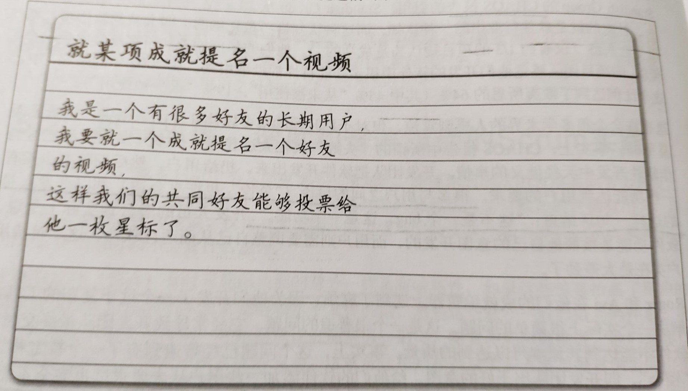
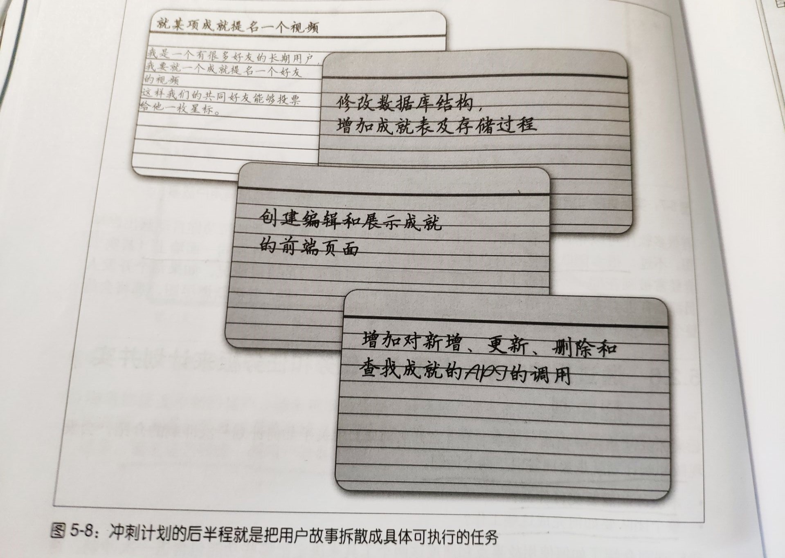
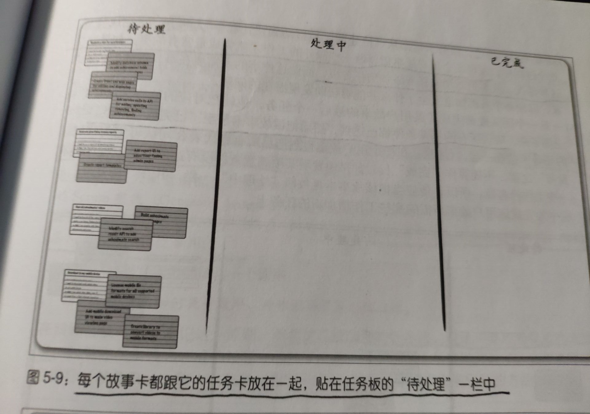
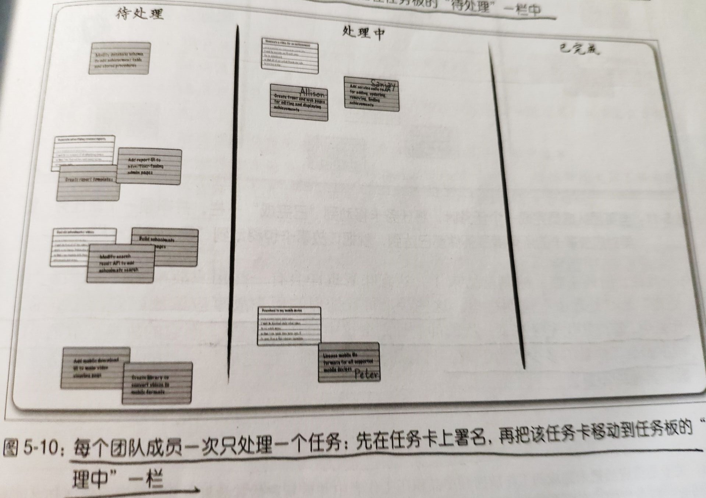
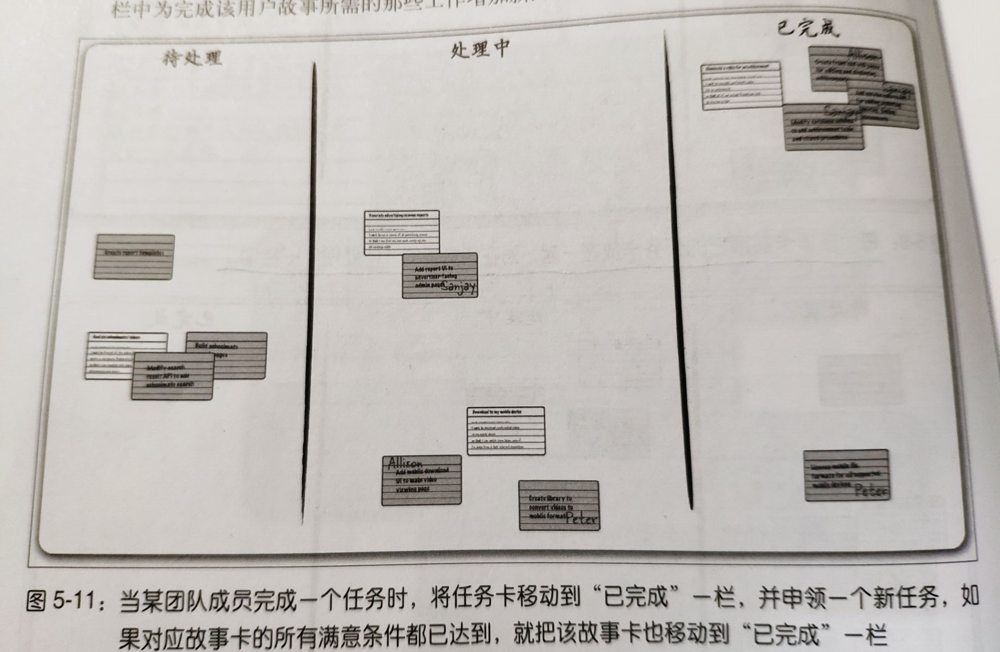

## 4 Scrum计划和集体承诺

本章要点
- Scrum团队所使用的计划冲刺的方法
- 用户故事如何帮助你确切了解用户需求
- 将使用故事点和项目速度来估计你的团队在一次冲刺中能完成
- 学习两个有价值的可视化工具(燃尽图和任务板)

### 4.1 以用户故事构建用户真正会用到的功能

简介
- 用户故事是描述用户使用软件某一特定功能时的一个简明工具

- 作为一个`<用户类型>`，我要`<要执行的某个具体的动作>`以便`<要达到的某种目的>`

- 一个用户故事的例子

    

用户故事的使用
- 要开始一个冲刺的时候，产品所有者和开发团队可以从积压工作表中抽出一些用户故事，并把它们作为

### 4.2 满意条件

简介
- 一般满意条件是针对每个用户故事定义的，编写完用户故事后，再把用户使用该软件能够做的一些具体的事情也写出来，形成**满意条件**

- 一个满意条件的例子

- 满意条件用来给**完成**下一个具体的**定义**，这就给团队和产品所有者一个具体的、没有歧义的方式来确定一个用户故事完成了没有

### 4.3 故事点和速度

故事点

- 所谓**故事点**，就是通过给每个用户故事**分配**一定的**点数**，用以表示开发这个用户故事需要付出多大努力。

- 通常这些点数是通过将当前用户故事和**过去开发的用户故事**进行**比较**得到的

项目速度

- 随着故事点的分配，你的团队就会开始发现他们能够在一次冲刺中完成相当于多少个故事点的用户故事，
- 我们用`点数/每周期`作为**项目的速度**

一次使用故事点方法的冲刺计划会议
1. 从**产品积压工作表**中**最有价值**的那些用户故事开始

2. 从中选择一个用户故事，从**过去的冲刺**中选一个工作量相当的用户故事，将后者的故事点数赋给前者

3. 跟**团队讨论**，看这个估计是否准确

4. 如此循环，直到**积累**够一次冲刺的故事点

### 4.4 燃尽图

简介

- 燃尽图是一种让任何人都可以一眼看出**当前的冲刺与团队过去的速度**相比如何的方法

燃尽图的使用方式

1. 以空白的折线图开始。X轴为日期，Y轴是故事点数。将起点和终点连接就得到了所谓的“**指导线**”

2. 一旦第一个用户故事**完成**并移动到任务板的"已完成"一栏，就在图中画下下一个点

3. 可能在每日例会中发现需要**增加**新的工作，当把新的任务卡添加到任务板时，团队一起对新增任务进行工时估计并加入到燃尽图中

4. 在项目的尾声，留意你的真实进度与指导线之间的差距，如果你的真实进度曲线总是高于指导线一大截，就需要适当**移除**一些用户故事了

### 4.5 通过用户故事、故事点、任务和任务板来计划并实施冲刺

常见的作法

1. Scrum主管主持第二次冲刺计划会议，从第一个用户故事开始，逐个**讨论每个用户故事需要做哪些具体的工作**。
    - 大家一起得出一个**任务列表**，列表中的每个任务都是大家认为可以在一天以内完成的。
    - 每个任务都要有一张**任务卡**，和对应的故事卡放到一起
    

2. 用户**故事卡和任务卡**被放到一起，并添加到任务板的"待处理"一栏

    
    

3. 团队成员完成了一个任务并准备开始下一个任务时，他就把已完成任务的任务卡移到"**已完成**"一栏，然后把接下来要处理的任务放到"**处理中**"一栏

    

4. 假如发现某个用户故事需要**添加额外**的任务卡，就把新增的任务添加到任务板

5. 一旦一个团队成员完成了某用户故事的最后一个任务，他就把对应的故事卡从任务板上揭下来，**确认所有的满意条件都已达到**，然后把该故事卡移到"**已完成**"一栏

    

6. 一旦冲刺结束，将**待处理和处理中**两栏中的用户故事重新放回产品积压工作表

