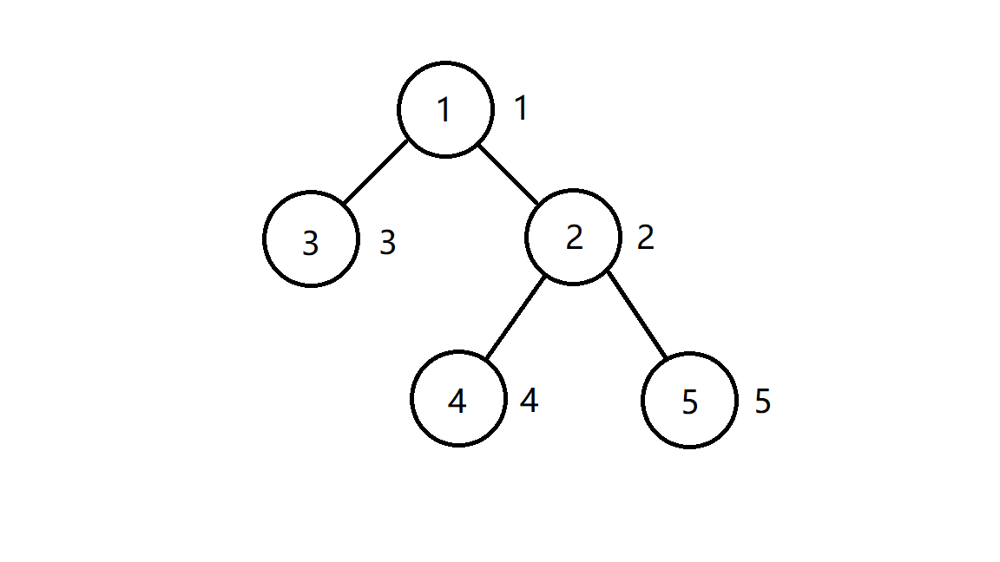

## 树形动态规划--节点选择

### 问题描述

有一棵 `n` 个节点的树，树上每个节点都有一个正整数权值。如果一个点被选择了，那么在树上和它相邻的点都不能被选择。求选出的点的权值和最大是多少？

### 分析

此题目可以使用动态规划来求解，一个节点只有被选择和不被选择两种情况。

首先构建一个名为dp的 `n * 2` 大小的矩阵，矩阵中的`dp[i][0]`表示不选择`i`节点时的权重最大值,`dp[i][1]`表示选择`i`节点时的权重最大值。最初时将矩阵中所有元素全部初始化为 `0` 。

然后我们列出状态转移方程

- 假如 `i` 是叶子节点
    >dp[i][0] = 0
    >
    >dp[i][1] = w(i)

- 假如 `i` 不是叶子节点
    >dp[i][0] = ∑ max(dp[j][0], dp[j][1])
    >
    >dp[i][1] = w(i) + ∑ dp[j][0]

接下来按照后序遍历的顺序遍历整个树，来完成dp矩阵中所有值的计算，举例如下

### 举例

输入的树如图所示，共有五个节点，每个节点的权重值标注在其右侧。


按照后序遍历，节点遍历顺序为 `3 -> 4 -> 5 -> 2 -> 1`

#### 1 初始化状态

|Select\Node | 1 | 2 | 3 | 4 | 5 |
|------------|---|---|---|---|---|
| 0          | 0 | 0 | 0 | 0 | 0 |
| 1          | 0 | 0 | 0 | 0 | 0 |

#### 2 后序遍历到3号节点

|Select\Node | 1 | 2 | 3 | 4 | 5 |
|------------|---|---|---|---|---|
| 0          | 0 | 0 | 0 | 0 | 0 |
| 1          | 0 | 0 | 3 | 0 | 0 |

#### 3 后序遍历到4号节点

|Select\Node | 1 | 2 | 3 | 4 | 5 |
|------------|---|---|---|---|---|
| 0          | 0 | 0 | 0 | 0 | 0 |
| 1          | 0 | 0 | 3 | 4 | 5 |

#### 4 后序遍历到5号节点

|Select\Node | 1 | 2 | 3 | 4 | 5 |
|------------|---|---|---|---|---|
| 0          | 0 | 0 | 0 | 0 | 0 |
| 1          | 0 | 0 | 3 | 4 | 5 |

#### 5 后序遍历到2号节点

|Select\Node | 1 | 2 | 3 | 4 | 5 |
|------------|---|---|---|---|---|
| 0          | 0 | 9 | 0 | 0 | 0 |
| 1          | 0 | 2 | 3 | 4 | 5 |

#### 6 后序遍历到1号节点

|Select\Node | 1 | 2 | 3 | 4 | 5 |
|------------|---|---|---|---|---|
| 0          | 5 | 9 | 0 | 0 | 0 |
| 1          | 10| 2 | 3 | 4 | 5 |

此时取根节点位置 `0` 和 位置 `1` 中值较大者即可，本例中显然 `5 < 10` ,所以最终结果为 `10` 

### 代码(java)
````java
import java.util.ArrayList;
import java.util.Scanner;

public class Main {
    int node_num;
    int[] weight;
    ArrayList<Integer>[] adjacencyTable;
    int[][] dp;

    public void generate_dp(int node_id, int parent_id){
        for (int temp_id: adjacencyTable[node_id]) {
            if(temp_id != parent_id){
                generate_dp(temp_id, node_id);
                dp[node_id][0] += Math.max(dp[temp_id][0], dp[temp_id][1]);
                dp[node_id][1] += dp[temp_id][0];
            }
        }
        dp[node_id][1] += weight[node_id];
    }

    public void run(){
        Scanner scanner = new Scanner(System.in);
        node_num = scanner.nextInt();
        weight = new int[node_num];
        adjacencyTable = new ArrayList[node_num];
        dp = new int[node_num][2];
        for(int i = 0; i < node_num; i ++){
            weight[i] = scanner.nextInt();
            adjacencyTable[i]= new ArrayList<>();
        }
        for(int i = 0; i < node_num - 1; i ++){
            int node_1 = scanner.nextInt() - 1;
            int node_2 = scanner.nextInt() - 1;
            adjacencyTable[node_1].add(node_2);
            adjacencyTable[node_2].add(node_1);
        }
        generate_dp(0, -1);
        System.out.println(Math.max(dp[0][0], dp[0][1]));
    }

    public static void main(String[] args) {
        new Main().run();
    }
}
````
注: oj只有50分，后5个点超时

### 代码(转, c ++)

原文链接 [蓝桥杯 ALGO-4 算法训练 结点选择](https://www.liuchuo.net/archives/3937)

````c++
#include <iostream>
#include <vector>
using namespace std;
int dp[100010][2];
vector<vector<int> > v;
void dfs(int node, int pre) {
    for (int i = 0; i < v[node].size(); i++) {
        int temp = v[node][i];
        if (temp != pre) {
            dfs(temp, node);
            dp[node][0] += max(dp[temp][0], dp[temp][1]);
            dp[node][1] += dp[temp][0];
        }
    }
}
int main() {
    int n, a, b;
    scanf("%d", &n);
    for (int i = 1; i <= n; i++)
        scanf("%d", &dp[i][1]);
    v.resize(n + 1);
    for (int i = 1; i <= n - 1; i++) {
        scanf("%d%d", &a, &b);
        v[a].push_back(b);
        v[b].push_back(a);
    }
    dfs(1, 0);
    cout << max(dp[1][0], dp[1][1]);
    return 0;
}
````
另: 柳神是我的!!!
