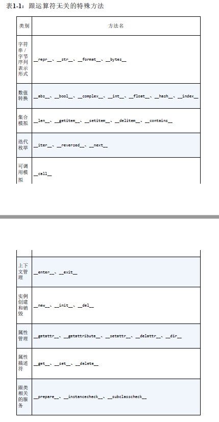
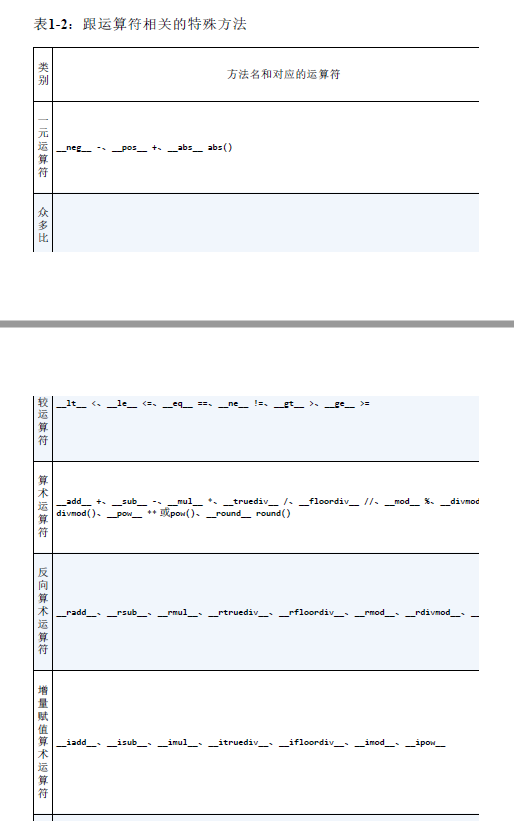
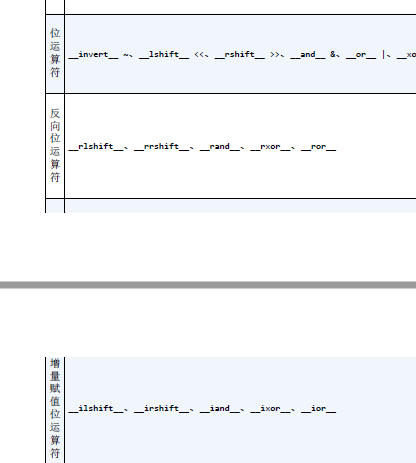

## 第1章 Python数据模式

>Guido对语言设计美学的深入理解让人震惊。我认识不少很不错的编程语言设计者，它们设计出来的东西确实很精彩，但是从来都不会有用户。Guido知道如何在理论上做出一定妥协，设计出来的语言让使用者觉得如沐春风，这真是不可多得  -----Jim Hugunin

- Python最好的品质之一是一致性

- 数据模型
    - 数据模型所描述的API，为使用最地道的预言特性来构建你自己的对象提供了工具
    - 数据模型其实是对Python框架的描述，它规范了这门语言自身构建模块的接口，这些接口包括但不限于序列、迭代器、函数、类和上下文管理器

- 特殊方法
    - Python解释器碰到特殊的句法时，会使用特殊方法去激活一些基本的对象操作
    - 这些特殊方法的名字以两个下划线开头，以两个下划线结尾
    - 举例：obj[key]的背后是__getitem__方法，为了能求得my_collection[key]的值，解释器实际上会调用my_collection.getitem(key)
    - 这些特殊方法名能让你自己的对象实现和支持一下的语言构架，并与之交互：
        - 迭代
        - 集合类
        - 属性访问
        - 运算符重载
        - 函数和方法的调用
        - 对象的创建和销毁
        - 字符串表示形式和格式化
        - 管理上下文(即with块)
    - 特殊方法也称为魔术方法(magic method)或者双下方法(dunder method)

### 1.1 一摞Python风格的纸牌

- 纸牌类代码实例
````py
    import collections
    from random import choice
    Card = collections.namedtuple('Card', ['rank', 'suit'])


    class FrenchDeck:
        ranks = [str(n) for n in range(2, 11)] + list('JQKA')
        suits = 'spades diamonds clubs hearts'.split()

        def __init__(self):
            self._cards = [Card(rank, suit) for suit in self.suits for rank in self.ranks]

        def __len__(self):
            return len(self._cards)

        def __getitem__(self, position):
            return self._cards[position]
````

- namedtuple(下面的内容跑题了)
    - 用来构建只有少数属性但是没有方法的对象
    - 例如：数据库条目

- 短小但强悍的FrenchDeck都可以做什么
    1. 可以跟任何标准Python集合类型一样，用`len()`函数查看一叠牌有多少张
        ````py
        deck = FrecnDeck()
        len(deck) # 52
        ````
    2. 从一叠牌中抽取特定一张卡牌是容易的
        ````py
        deck[0] # Card(rank='2', suit='spades')
        ````
    3. 我们并不需要单独写一个方法来抽取一张纸牌，只需调用内置函数`random.choice()`
        ````py
        choice(deck) # Card(rank='K', suit='hearts')
        ````
    4. 我们的deck类已经可以支持切片(slicing)操作了，因为我们实现了`__getitem__`方法
        ````py
        deck[:3] # [Card(rank='2', suit='spades'), Card(rank='3', suit='spades'), Card(rank='4', suit='spades')]
        ````
    5. 另外，仅仅实现了`__getitem__`方法,这摞牌就可以迭代了
        - input:
            ````py
            for card in deck:
                print(card)
            
            ````
        - output:
            ````
            ...
            Card(rank='8', suit='hearts')
            Card(rank='9', suit='hearts')
            Card(rank='10', suit='hearts')
            Card(rank='J', suit='hearts')   
            Card(rank='Q', suit='hearts')
            Card(rank='K', suit='hearts')
            Card(rank='A', suit='hearts')
            ...
            ````  
    6. `in`运算符也可以用在我们的FrenchDeck类上了
        - 代码
            ````py
            Card('Q', 'hearts') in deck # True
            ````
        - 原因
            - 一个类型如果没有实现`__contains__`方法，那么`in`运算符就会按顺序做一次迭代搜索
            - 因为我们的`FrenchDeck`实现了`__getitem__`方法，所以可以迭代，所以支持`in`运算符
    
- 通过实现特殊方法来利用Python数据模型的好处
    1. 作为你的类的用户，它们不必去记住操作的格式名称
        - 例如：得到元素个数是`size()`还是`len()`？
    2. 可以更加方便地使用Python标准库，如`random.choice()`函数，而不用重新发明轮子

- 写在最后
    - 虽然`FrenchDeck`隐式地继承了`object`类，但是功能却不是继承而来的
    - 我们通过数据模型和一些合成来实现了这些功能
    - 通过实现`__len__`和`__getitem__`两个特殊方法,`FrenchDeck`就跟一个Python自有的序列数据类型一样，可以体现出Python语言的核心特性(例如迭代和切片)

### 1.2 如何使用特殊方法

1. 首先要明确，特殊方法的存在是为了被**Python解释器**调用的，你自己并不需要调用它们
    - 举例：在执行`len(my_obj)`的时候，如果`my_obj`是一个自定义类的对象，那么Python会自己去调用其中由你实现的`__len__`方法

2. 如果是Python内置的类型，比如列表、字符串、字节序列等，那么CPython会抄近路以获得更快的执行速度
    - 举例：在内置类型中，`__len__`实际上会直接返回`PyVarObject`中的`ob_size`属性

3. 很多时候，特殊方法的调用是隐式的
    - 举例：`for i in x:`背后实际用的是`iter(x)`，而这个函数的背后则是`__iter()__`方法

4. 通常你的代码无需直接使用特殊方法

5. 通过内置的函数(例如len、iter、str,等等)来使用特殊方法是最好的选择

6. 不要自己想当然的随意添加特殊方法，比如`__foo__`之类的，因为虽然现在这个名字没有在Python内部被使用，以后就不一定了

#### 1.2.1 模拟数值类型

此处我们实现一个二维向量类，作为例子
````py
from math import hypot


class Vector:
    def __init__(self, x=0, y=0):
        self.x = x
        self.y = y

    def __repr__(self):
        return 'Vector(%r,%r)' % (self.x, self.y)

    def __abs__(self):
        return hypot(self.x, self.y)

    def __bool__(self):
        return bool(abs(self))

    def __add__(self, other):
        x = self.x + other.x
        y = self.y + other.y
        return Vector(x, y)

    def __mul__(self, scalar):
        return Vector(self.x * scalar, self.y * scalar)


# 因为实现的__add()__方法，所以我们可以使用加号运算符来完成向量相加
v1 = Vector(2, 4)
v2 = Vector(2, 1)
print(v1 + v2)  # Vector(4, 5)

# 因为实现了__abs()__方法，所以我们可以调用abs()函数来完成求绝对值操作
v = Vector(3, 4)
print(abs(v))   # 5.0

# 因为实现了__mul()__方法，所以我们可以使用乘法运算符完成向量与数字相乘
print(v * 3)    # Vector(9, 12)
````

注意
- 这些特殊方法并不会在这个类自身的代码中使用
- 即便其他程序要使用这个类的这些方法，也不会直接调用它们

#### 1.2.2 字符串表示形式

`repr`函数

- Python的内置函数

- 可以把一个对象用字符串的形式表达出来以便辨认

- 这就是“字符串表示形式”

`__repr__`所返回的字符串应该准确、无歧义并且尽可能表达出如何用代码创建出这个被打印的对象

如果`__str__`函数没有被实现，而Python又需要调用它时，会用`__repr__`代替

#### 1.2.3 算术运算符

通过`__add__`和`__mul__`，前面的向量类可以使用`+`和`*`这两个算术运算符

这两个方法的返回值都是新创建的向量对象，被操作的两个向量还是原封不动，代码里只是读取它们的值而已

中缀表达式的基本原则就是不改变操作对象，而是产出一个新的值

#### 1.2.4 自定义的布尔值

任何对象都可以用于需要布尔值的上下文中，Python调用bool(x)，判断x是真还是假

判断boolean值的流程

- 默认情况下，我们自己定义的类的实例总被认为是真的，除非这个类对`__bool__`或`__len__`函数有自己的实现

- `bool(x)`的背后是调用`x.__bool__()`的结果

- 如果不存在`x.__bool__()`，那么`bool(x)`会尝试调用`x.__len()__`
    - 若返回0,则bool会返回False
    - 否则返回True

### 1.3 特殊方法一览

跟运算符无关的特殊方法



跟运算符相关的特殊方法




### 1.4 为什么len不是普通方法

为什么len不是普通方法

- Raymond Hetting的回答:“实用胜于纯粹”

- 如果x是一个内置类型的实例，那么len(x)的速度会非常快,也就是在str、list、memoryview等类型上，这个操作非常高效

- len之所以是特殊方法，是为了让Python自带的数据结构可以走后门

- 这种处理方式在保持内置类型的效率和保证语言的一致性之间找到了一个平衡点

### 1.5 本章小结

1. 通过实现特殊方法，自定义数据类型可以表现得像内置类型一样，从而让我们写出更具表达力的代码(更具Python风格的代码)

2. Python对象的一个基本要求就是它得有合理的字符串表达形式
    - 我们可以通过`__repr__`和`__str__`来满足这个要求
    - 前者便于我们调试和记录日志
    - 后者则是给终端用户看的

3. Python通过运算符重载这一模式提供了丰富的数值类型，除了内置的那些，还有`decimal.Decimal`和`fractions.Fraction`。这些数据类型都支持中缀算术运算符


        