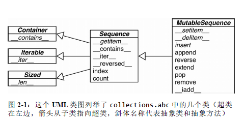

## 第2章 序列构成的数组

>你可能注意到了，之前提到的几个操作可以无差别地应用于文本、列表和表格上，我们把文本、列表和表格叫做**数据火车**，for命令通常能作用于数据火车上。---Geurts、Meertens和Pemberton, ABC Programmer's Handbook

- ABC语言很多点子在现在看起来都很有Python风格
    - 序列的泛型操作
    - 内置的元组和映射类型
    - 用缩进来架构的源码
    - 无需变量声明的强类型
    - 用同一的风格处理序列数据

- Python从ABC继承了用统一的风格处理序列数据这一特点
    - 无论哪种数据结构，字符串、列表、字节序列、数组、XML元素，亦或是数据库查询结果
    - 它们都共用一套丰富的操作：迭代、切片、排序，还有拼接

### 2.1 内置序列类型概览

- 第一种分类方法
    - 容器序列
        - 简介
            - 存放的是不同类型的数据
            - 即存放它们所包含的任意类型的对象的引用
        - 例如：list、tuple和collections.deque等
    - 扁平序列
        - 简介
            - 存放的是相同类型的数据
            - 扁平序列其实是一段连续的内存空间，更加紧凑
            - 但是只能存放诸如字符、字节和数值这种基础类型
        - 例如：str、bytes、bytearray、memoryview和array.array

- 第二种分类方法
    - 可变序列
        - 例如：list、bytearray、array.array、collections.deque和memoryview
    - 不可变序列
        - 例如：tuple、str和bytes
    - 可变序列与不可变序列的差别和联系
        - 如图
        
        - 可变序列从不可变序列中继承了一些方法
        - 同时可变序列又自己实现了一些方法

### 2.2 列表推导和生成器表达式

- 列表推导：是构建列表的快捷方式，它异常强大，但相关语法比较晦涩

- 生成器表达式：具有生成各种类型的元素并用它们来填充序列的功能

#### 2.2.1 列表推导与和可读性

- 列表推导：列表推导可以帮助我们把一个序列或是其他可迭代类型中的元素过滤或是加工，然后新建一个列表

- 比较使用列表推导和不使用列表推导代码的可读性
    - 把一个字符串变成Unicode码位的列表
    ````py
    symbols = 'αλνοηπ'
    codes = []
    for symbol in symbols:
        codes.append(ord(symbol))
    print(codes)
    # [945, 955, 957, 959, 951, 960]
    ````
    - 把字符串变成Unicode码位的另外一种写法
    ````py
    symbols = 'αλνοηπ'
    codes = [ord(symbol) for symbol in symbols]
    print(codes)
    # [945, 955, 957, 959, 951, 960]
    ````

- 使用列表推导的原则
    - 只用列表推导来创建新的列表，并且尽量保持简短
    - 如果列表推导过于复杂，要考虑用for循环重写

- Python3中列表推导不存在变量泄漏的问题
    - 解释
        - 列表推导、生成器表达式、结合推导和字典推导在Python3中都有了自己的局部作用域
        - 表达式内部的变量和赋值只在局部起作用
        - 表达式的上下文里的同名变量还可以正常引用，局部变量并不会影响它们
    - 举例
        ````py
        x = 'ABC'
        dummy = [ord(x) for x in x]
        print(x)        # ABC
        print(dummy)    # [65, 66, 67]
        ````

#### 2.2.2 列表推导同filter和map的比较

- 举例：用列表推导和map/filter组合来创建同样的表单
    ````py
    symbols = 'αλνοηπ'
    codes = [ord(symbol) for symbol in symbols if ord(symbol) > 127]
    print(codes)
    ````
    ````py
    symbols = 'αλνοηπ'
    codes = list(filter(lambda c: c > 127, map(ord, symbols)))
    print(codes)
    ````

- 总结
    - filter和map合起来能做的事，列表推导也能做，而且还不需要借助难以理解和阅读的lambda表达式
    - 而且map/filter组合起来的效果不一定比列表推导快

#### 2.2.3 笛卡尔积

- 笛卡尔积
    - 简介：两个或以上的列表中的元素对构成的**元组**，这些元组构成的**列表**就是笛卡尔积
    - 举例如图
    

- 使用列表推导计算笛卡尔积
    ````py
    colors = ['black', 'white']
    sizes = ['S', 'M', 'L']

    tshirts = [(color, size) for color in colors for size in sizes]
    print(tshirts)
    # 此处先按照颜色排列，再按照尺码排列
    # [('black', 'S'), ('black', 'M'), ('black', 'L'), ('white', 'S'), ('white', 'M'), ('white', 'L')]

    tshirts = [(color, size) for size in sizes for color in colors]
    print(tshirts)
    # 此处先按照尺码排列，再按照颜色排列
    # [('black', 'S'), ('white', 'S'), ('black', 'M'), ('white', 'M'), ('black', 'L'), ('white', 'L')]
    ````

#### 2.2.4 生成器表达式

- 生成器表达式
    - 具有生成各种类型的元素并用它们来填充序列的功能
    - 生成器表达式背后遵守了迭代器协议，可以逐个地产出元素，而不是先建立一个完整的列表，然后再把这个列表传递到某个构造函数里
    - 这样可以大幅节省内存

- 生成器表达式语法与列表推导差不多，只不过把方括号换成了圆括号

- 如何用生成器表达式建立元组和数组
    ````py
    import array

    symbols = 'black'

    # 如果生成器表达式是要给函数调用过程中唯一的参数，那么不需要额外再用括号把它围起来
    symboltuple = tuple(ord(symbol) for symbol in symbols)
    print(symboltuple)
    # (98, 108, 97, 99, 107)

    # array的构造方法需要两个参数，因此括号是必须的
    symbolarray = array.array('I', (ord(symbol) for symbol in symbols))
    print(symbolarray)
    # array('I', [98, 108, 97, 99, 107])
    ````

- 使用生成器表达式计算笛卡尔积
    ````py
    colors = ['black', 'white']
    sizes = ['S', 'M', 'L']
    for tshirt in ('%s %s' % (c, s) for c in colors for s in sizes):
        print(tshirt)
    ````

- 生成器表达式最大的优点：逐个产出元素，可以节省内存

### 2.3 元组不仅仅是不可变的列表

#### 2.3.1 元组和记录

- 元组其实是对数据的记录：元组中的每个元素都存放了记录中一个字段的数据，外加这个字段的位置，正是这个位置信息给数据赋予了意义

- 如果在任何的表达式里我们在元组内对元素排序，这些元素所携带的信息就会丢失，因为这些信息是跟它们的位置有关的

- 把元组用作记录
    ````py
    # 洛杉矶国际机场的经纬度信息
    lax_coordinates = (33.9425, -118.408056)

    # 东京市的一些信息：市名、年份、人口、人口变化率和面积
    city, year, pop, chg, area = ('Tokyo', 2003, 32450, 0.66, 8014)

    # 一个元组列表，元组的形式为(country_code, passport_number)
    traveler_ids = [('USA', '31195855'), ('BRA', 'CE342567'), ('ESP', 'XDA205856')]

    # 在迭代过程中，passport变量被绑定到每个元组上
    for passport in sorted(traveler_ids):
        print('%s/%s' % passport)

    # for循环可以分别提取元组中的元素，也叫做拆包
    # 因为元组中的第二个元素对当前情景没有什么用，所以它赋值给"_"占位符
    for country, _ in traveler_ids:
        print(country)


    '''
    BRA/CE342567
    ESP/XDA205856
    USA/31195855
    USA
    BRA
    ESP
    '''
    ````

#### 2.3.2 元组拆包

- 元组拆包举例
    1. 平行赋值：把一个可迭代对象中的元素，一并赋值到由对应的变量组成的元组中
        ````py
        # 平行赋值demo
        lax_coordinates = (33.9425, -118.408056)

        latitude, longitude = lax_coordinates

        print(latitude)
        print(longitude)

        '''
        33.9425
        -118.408056
        '''
        ````
    2. 不使用中间变量交换两个变量的值
        ````py
        b, a = a, b
        ````
    3. 用`*`运算符把一个可迭代对象拆开作为函数的参数
        ````py
        print(divmod(20, 8))

        t = (20, 8)
        # 使用*运算符将元组拆开作为函数的参数
        print(divmod(*t))

        quotient, remainder = divmod(*t)
        print(quotient)
        print(remainder)

        '''
        (2, 4)
        (2, 4)
        2
        4
        '''
        ````
    4. 使用元组拆包接收函数以元组形式返回的多个值
        ````py
        import os

        # 使用元组拆包接收函数以元组形式返回的多个值
        _, filename = os.path.split('C:/Users/admin/Desktop/NoTe/FluentPython-note/ch2-序列构成的数组/3-元组不仅仅是不可变列表.md')
        print(filename)

        '''
        3-元组不仅仅是不可变列表.md
        '''
        ````
        - 在拆包时，我们不总是对元组里所有的数据都感兴趣，_占位符可以帮助处理这种情况

- 元组拆包注意
    - 元组拆包可以应用到任何可迭代对象上
    - 唯一的硬性要求是：被迭代对象中的元素个数必须要跟接受这些元素的元组的空挡数一致
    - 除非我们用`*`来表示忽略多余的元素

- 用`*`处理剩下的元素
    ````py
    a, b, *rest = range(5)
    print(a, b, rest)

    a, b, *rest = range(3)
    print(a, b, rest)

    a, b, *rest = range(2)
    print(a, b, rest)

    '''
    0 1 [2, 3, 4]
    0 1 [2]
    0 1 []
    '''
    ````
- 在平行赋值时，*前缀最多只能用于一个变量，但是这个变量可以出现在赋值表达式的任意位置
    ````py
    a, b, *body, d = range(5)
    print(a, b, body, d)

    *head, b, c, d = range(5)
    print(head, b, c, d)
    '''
    0 1 [2, 3] 4
    [0, 1] 2 3 4
    '''
    ````

#### 2.3.3 嵌套元组拆包

- 接受表达式的元组可以是嵌套式的，例如(a, b, (c, d))

- 只要这个接受元组的嵌套结构符合表达式本身的嵌套结构，Python就可以做出正确的对应

- 嵌套元组Demo
````py
# 每个元组内有4个元素，其中最后一个元素是一对坐标
metro_areas = [
    ('Tokyo', 'JP', 36.933, (35.689722, 139.691667)),
    ('Delhi NCR', 'IN', 21.935, (28.613889, 77.208889)),
    ('Mexico City', 'MX', 20.142, (19.433333, -99.133333)),
    ('New York-Newark', 'US', 20.104, (40.808611, -74.020386)),
    ('Sao Paulo', 'BR', 19.649, (-23.547778, -46.635833))
]

print('{:15}|{:^9}|{:^9}'.format('','lat.','long.'))
fmt = '{:15}|{:9.4f}|{:9.4f}'

# 把输入元组的最后一个元素拆包到由变量构成的元组里，这样就获得了坐标
for name, cc, pop, (latitude, longitude) in metro_areas:
    
    # 这个条件用来把输出限定在西半球的城市
    if longitude <= 0:
        print(fmt.format(name, latitude, longitude))


'''
               |  lat.   |  long.  
Mexico City    |  19.4333| -99.1333
New York-Newark|  40.8086| -74.0204
Sao Paulo      | -23.5478| -46.6358
'''
````

- 注意
    - 在Python3之前，元组可以作为形参放到函数声明中，例如`def fn(a, (b, c), d):`
    - 然而Python3不再支持这种格式

#### 2.3.4 具名元组

- `collections.namedtuple`是一个工厂函数，它可以用来构建一个带字段名的元组和一个有名字的类

- `namedtuple`创建的类的大小
    - 用namedtuple创建的类的实例所消耗的内存跟元组是一样的，因为字段名都被存在对应的类中
    - 但是这个实例跟普通的对象实例比起来要小一些，因为Python不会用`__dict__`来存放这些实例的属性

- 用具名元组来记录一个城市的信息
    ````py
    from collections import namedtuple

    # 创建一个具名元组需要两个参数，一个是类名，另一个是类的各个字段的名字
    # 后者可以是由多个字符串组成的可迭代对象，或者是由空格分隔开的字段名组成的字符串
    City = namedtuple('City', 'name country population coordinates')

    # 存放在对应字段中的数据要以一串参数的形式传入构造函数中
    tokyo = City('Tokyo', 'JP', 36.933, (35.689722, 139.691667))

    # 可以通过字段名或者位置来获得一个字段的信息
    print(tokyo)
    print(tokyo.population)
    print(tokyo.country)
    print(tokyo[1])
    '''
    City(name='Tokyo', country='JP', population=36.933, coordinates=(35.689722, 139.691667))
    36.933
    JP
    JP
    '''
    ````

- 具名元组还有一些自己专有的属性
    - 例如：`_fields`类属性、类方法`_make(iterable)`、实例方法`_asdict()`
    ````py
    from collections import namedtuple

    # 创建一个具名元组需要两个参数，一个是类名，另一个是类的各个字段的名字
    # 后者可以是由多个字符串组成的可迭代对象，或者是由空格分隔开的字段名组成的字符串
    City = namedtuple('City', 'name country population coordinates')

    # fields属性是一个包含这个类所有字段名称的元组
    print(City._fields)

    LatLong = namedtuple("LatLong", "lat long")
    delhi_data = ('Delhi NCR', 'IN', 21.935, LatLong(28.613889, 77.208889))

    # 用_make()通过接受一个可迭代对象来生成这个类的一个实例，它的作用与City(*delhi_data)是一样的
    delhi = City._make(delhi_data)

    # _asdict()可以把剧名元组以collections.OrderedDict的形式返回，我们可以利用它来把元组里的信息友好地呈现出来
    print(delhi._asdict())

    for key, value in delhi._asdict().items():
        print(key + ": ", value)
    ````

#### 2.3.5 作为不可变列表的元组

- 除了跟增减元素相关的方法之外，元组支持列表的其他所有方法


### 2.4 切片

- 在Python中，像列表(list)、元组(tuple)、字符串(str)这类序列类型都支持切片操作


#### 2.4.1 为什么切片和区间会忽略最后一个元素

- 在切片和区间操作里不包含区间范围的最后一个元素是Python的风格

- 切片和区间忽略最后一个元素的好处
    1. 当只有最后一个位置消息时，我们可以快速看出切片和区间里有几个元素
        - 比如：range(3)和my_list[:3]都返回3个元素
    2. 当起止位置信息都可见时，我们可以快速计算出切片和区间的长度，用后一个数减去第一个下标(stop - start)即可
    3. 这样做也可以让我们可以利用任意一个下标来把序列分割成不重叠的两部分
        - 只要写成my_list[:x]和my_list[x:]即可


#### 2.4.2 切片对象

- 一个众所周知的秘密是，我们还可以用s[a:b:c]的形式对s在a和b之间以c为间隔取值
    - 例如
        ````py
        s = 'bicycle'
        print(s[::3])
        print(s[::-1])
        print(s[::-2])
        '''
        bye
        elcycib
        eccb
        '''
        ````
- 可以使用`slice()`数据类型声明切片变量，这样可以增加代码可读性
    - 代码略


#### 2.4.3 多维切片和省略

- []运算符还可以使用以逗号分开的多个索引或者是切片
    - 例如,`numpy.ndarray`就可以用`a[i, j]`这种形式来获取二维矩阵中的元素
    - 也可以使用`a[m:n, k:l]`的方式来得到二维切片

- Python内置的序列类型都是一维的，因此它们只支持单一的索引，成对出现的索引大部分在外部库中使用，例如Numpy等


- 另外，在Numpy中, ... 用作多维数组切片的快捷方式
    - 比如，如果x是四维数组，那么x[i,...]就是x[i, :, :, :]的缩写


#### 2.4.4 给切片赋值

- 如果把切片放在赋值语句的左边，或者把它作为del操作的对象，我们就可以对序列进行嫁接、切除或就地修改操作

- 注意：如果赋值的对象是一个切片的话，那么赋值语句的右侧必须是一个可迭代对象，即便只有单独一个值，也要转换成可迭代序列

- 例如
    ````py
    l = list(range(10))
    print(l)
    #  [0, 1, 2, 3, 4, 5, 6, 7, 8, 9]
    l[2: 5] = [20, 30]
    print(l)
    # [0, 1, 20, 30, 5, 6, 7, 8, 9]
    del l[5: 7]
    print(l)
    # [0, 1, 20, 30, 5, 8, 9]
    l[3::2] = [11, 22]
    print(l)
    # [0, 1, 20, 11, 5, 22, 9]
    l[2:5] = [100]
    print(l)
    # [0, 1, 100, 22, 9]
    ````

### 2.5 对序列使用+和*
---

- Python程序员会默认序列是支持`+`和`*`操作的

- 通常`+`号两侧的序列由相同类型的数据所构成

- 在拼接过程中，两个被操作的序列都不会被修改，Python会**新建**一个包含同样类型数据的序列来作为拼接的结果

- 如果想把一个序列复制几份然后再拼接起来，更快捷的做法是把这个序列乘以一个整数，同样这个操作也会产生一个**新序列**
    ````py
    l = [1, 2, 3]
    print(l * 5)
    '''
    [1, 2, 3, 1, 2, 3, 1, 2, 3, 1, 2, 3, 1, 2, 3]
    '''
    ````

---
#### 2.5.1 建立由列表组成的列表

- 有时我们需要初始化一个嵌套着几个列表的列表

1. 方案一：使用列表推导
    ````py
    board = [['_'] * 3 for _ in range(3)]
    print(board)
    board[1][2] = 'X'
    print(board)
    '''
    [['_', '_', '_'], ['_', '_', '_'], ['_', '_', '_']]
    [['_', '_', '_'], ['_', '_', 'X'], ['_', '_', '_']]
    '''
    ````

2. 方案二：一种错的方法，此时列表中嵌套的三个子列表全部指向同一对象
    ````py
    board = [['_'] * 3] * 3
    print(board)
    board[1][2] = 'X'
    print(board)
    '''
    [['_', '_', '_'], ['_', '_', '_'], ['_', '_', '_']]
    [['_', '_', 'X'], ['_', '_', 'X'], ['_', '_', 'X']]
    '''
    ````

3. 方案三：等价于方案一，只是不够简洁
    ````py
    board = []
    for _ in range(3):
        # 每次迭代都新建一个列表(row)，作为新的一行追加到游戏板(board)
        row = ['_'] * 3
        board.append(row)
    print(board)
    board[2][0] = 'X'
    print(board)
    '''
    [['_', '_', '_'], ['_', '_', '_'], ['_', '_', '_']]
    [['_', '_', '_'], ['_', '_', '_'], ['X', '_', '_']]
    '''
    ````

4. 方案四：等价于方案二，所以也是错误的
    ````py
    row = ['_'] * 3
    board = []
    for i in range(3):
        # 追加同一个行对象(row)3次到游戏板(board)
        board.append(row)
    print(board)
    board[2][0] = 'X'
    print(board)
    '''
    [['_', '_', '_'], ['_', '_', '_'], ['_', '_', '_']]
    [['X', '_', '_'], ['X', '_', '_'], ['X', '_', '_']]
    '''
    ````

### 2.6 序列的增量赋值

- 增量赋值运算符 `+=` 和 `*=` 的表现取决于它们的第一个操作对象

- +=背后的特殊方法是`__iadd__`(用于'就地加法')，工作原理如下
    - 例如`a += b`
    - 如果a实现了`__iadd__`方法，就调用这个方法
    - 同时对于可变序列(list等)，a会就地改变，就像调用`a.extend(b)`一样
    - 如果a没有实现`__iadd__`方法，`a += b`这个表达式的效果就变得与`a = a + b`一样了
        - 首先计算 `a + b`，得到一个新的对象
        - 然后赋值给`a`

- 总体来说，可变序列一般都实现了`__iadd__`方法，而不可变序列根本不支持这个操作，对这个方法的实现也无从谈起

- 但是不可变序列是支持 `+=` 运算符的，它只是把这个运算当作`a = a + b`处理
    ````py
    row = tuple(i for i in range(3))
    print(row)
    row += (4, 5)
    print(row)
    '''
    (0, 1, 2)
    (0, 1, 2, 4, 5)
    '''
    ````
### 2.7 list.sort方法和内置函数sorted

- `list.sort`
    - `list.sort`方法会就地排序列表，也就是说不会把原列表复制一份
    - 所以这个方法的返回值为`None`，提醒你本方法不会新建一个列表
    - 在这个情况下返回`None`其实是Python的一个惯例
        - 如果一个函数或则好方法对对象进行的是就地改动，那它就应该返回`None`
        - 这样调用者就知道传入的参数发生了改动，而不是产生新的对象
    - 用返回None来表示就地改动有一个缺点
        - 调用者无法将其串联起来
    
- `sorted`
    - `sorted`方法会新建一个列表作为返回值
    - 这个方法接受**任何形式的可迭代对象**作为参数，甚至包括不可变序列或者生成器
    - 不管`sorted`接受的是什么参数，都将返回一个列表

- `list.sort`和`sorted`方法都有两个可选的关键字参数
    - `reserve`
        - 如果被设置为`True`，被排序的序列里的元素都会以降序输出
    - `key`
        - 这个参数需要传入一个只有一个参数的函数
        - 这个函数会被用到序列里的每一个元素，所产生的结果将是排序算法依赖的对比关键字
        - 比如
            - key=str.lower可以实现忽略大小写的排序
            - key=len进行基于字符串长度的排序

- sortDemo
    ````py
    fruits = ['grape', 'raspberry', 'apple', 'banana']
    print(sorted(fruits))
    # ['apple', 'banana', 'grape', 'raspberry']
    print(fruits)
    # ['grape', 'raspberry', 'apple', 'banana']

    print(sorted(fruits, reverse=True))
    # ['raspberry', 'grape', 'banana', 'apple']
    print(sorted(fruits, key=len, reverse=True))
    # ['raspberry', 'banana', 'grape', 'apple']

    print(fruits)
    # ['grape', 'raspberry', 'apple', 'banana']
    fruits.sort()
    print(fruits)
    # ['apple', 'banana', 'grape', 'raspberry']
    ````

### 2.8 用bisect来管理已排序的序列

- 标准库的bisect模块给我们提供了二分查找算法

- bisect模块包含两个主要函数,`bisect`和`insort`，两个函数都利用二分查找算法来在有序序列中查找或插入元素

#### 2.8.1 用bisect来搜索

- 简介
    - `bisect(haystack, needle)`在haystack(干草垛)里搜索needle(针)的位置
    - 该位置满足的条件是，把needle插入这个位置之后，haystack还能保持升序
    - 也就是说这个函数返回的位置前面的值，都小于或等于needle的值

- `bisect`的可选参数
    - `lo`：表示搜索范围的下标，**包括**这个元素(老规矩)，默认为`0`
    - `hi`：表示搜索范围的上标，**不包括**这个元素(老规矩)，默认为`len()`

- `bisect_left`和`bisect_right`
    - `bisect`函数其实就是`bisect_right`函数
    - `bisect_left`返回的插入位置是跟它相等的元素之前的位置
    - `bisect_right`返回的插入位置是跟它相等的元素之后的位置

- demo：根据一个分数，找到它所对应的成绩
    ````py
    import bisect


    def grade(score, breakpoints=[60, 70, 80, 90], grades='FDCBA'):
        i = bisect.bisect(breakpoints, score)
        return  grades[i]


    print([grade(score) for score in [33, 99, 77, 70, 89, 90, 100]])

    '''
    ['F', 'A', 'C', 'C', 'B', 'A', 'A']
    '''
    ````

#### 2.8.2 用bisect.insort插入新元素

- `insort(seq, item)`把变量item插入到序列seq中，并能保持seq的升序排序

- `insort`和`bisect`一样，有`lo`和`hi`两个可选参数用来控制查找的范围

- 它也有个变体叫`insort_left`

### 2.9 当列表不是首选时

- 比如，要存放1000万个浮点数的话，数组(array)要高效得多，因为数组在背后存放的并不是float对象，而是数字的机器翻译，也就是字节描述

- 再比如，如果需要频繁对序列做先进先出的操作，deque(双端队列)的速度应该会更快

- 如果在你的代码里，**包含操作**的频率很高，用set(集合)会更合适，因为set是无序的

#### 2.9.1 数组

- 简介
    - 如果我们需要一个只包含数字的列表，那么`array.array`比`list`是更好的选择
    - 数组支持所有跟可变序列有关的操作，包括`.pop`、`.insert`、`.extend`
    - 数组还提供了从文件读取和存入文件的更快的方法，如`.frombytes`和`.tofile`

- 创建数组需要一个类型码，这个类型码用来表示在底层的C语言应该存放怎样的数据类型

- Python不会允许你在数组里存放除指定数据类型之外的数据

- 从Python3.4开始，数组(array)类型不再支持诸如`list.sort()`这种就地排序方法

- arrayDemo
    ````py
    from array import array
    from random import random

    # 利用一个可迭代对象生成双精度浮点数组，这里使用的可迭代对象是一个生成器表达式
    floats = array('d', (random() for _ in range(10 ** 5)))
    print(floats[-1])
    fp = open('floats.bin', 'wb')
    # 把所有元素以机器值的形式存入一个文件
    floats.tofile(fp)
    fp.close()

    # 新建一个双精度浮点空数组
    floats2 = array('d')
    fp = open('floats.bin', 'rb')
    # 把1000万个浮点数从二进制文件里读取出来
    floats2.fromfile(fp, 10**5)
    fp.close()
    print(floats2[-1])
    # 对比两个数组的内容是否完全一致
    print(floats2 == floats)
    ````

#### 2.9.2 内存视图

- `memoryview`是一个内置类，它能让用户在不需要复制内容的前提下，在数据结构之间共享内存

- 其中`memoryview.cast`可以用不同的方式读写同一块内存数据，而且内容字节不会随意移动

- memoryviewDemo
    ````py
    from array import array

    numbers = array('h', [-2, -1, 0, 1, 2])
    memv = memoryview(numbers)
    print(len(memv))
    print(memv[0])

    # 用cast将memv里的内容转换为无符合类型('B')
    memv_oct = memv.cast('B')
    print(memv_oct.tolist())
    # 修改位于位置5的字节赋值为4
    memv_oct[5] = 4
    # 因为我们把占了两个字节的整数的高位字节改成了4，所以这个有符号整数的值就变成了1024
    print(numbers)

    '''
    5
    -2
    [254, 255, 255, 255, 0, 0, 1, 0, 2, 0]
    array('h', [-2, -1, 1024, 1, 2])
    '''
    ````

#### 2.9.3 NumPy和SciPy

- Numpy实现了多维同质数组(homogeneous array)和矩阵

- Scipy是基于Numpy的另一个库，提供了很多跟科学计算有关的算法，专为线性代数、数值分析和统计学而设计

- Scipy把基于C和Fortran的工业级数学计算功能用交互式且高度抽象的Python包装起来，让科学家如鱼得水

- NumpyDemo
    ````py
    import numpy as np

    # 新建一个0-11的整数的numpy.ndarray，然后把它打印出来
    a = np.arange(12)
    print(a)
    print(type(a))
    # 查看数组的维度
    print(a.shape)
    # 改变数组的维度
    a.shape = 3, 4
    print(a)
    # 打印第二行
    print(a[2])
    # 打印第二行第一个元素
    print(a[2, 1])
    # 打印第二行第一列元素
    print(a[:-1])
    # 将数组行列交换
    print(a.transpose())
    '''
    [ 0  1  2  3  4  5  6  7  8  9 10 11]
    <class 'numpy.ndarray'>
    (12,)
    [[ 0  1  2  3]
    [ 4  5  6  7]
    [ 8  9 10 11]]
    [ 8  9 10 11]
    9
    [[0 1 2 3]
    [4 5 6 7]]
    [[ 0  4  8]
    [ 1  5  9]
    [ 2  6 10]
    [ 3  7 11]]
    '''
    ````

#### 2.9.4 双向队列和其他形式的队列

- 利用.append和.pop方法，我们可以把列表当作栈或者队列使用，但是删除列表的第一个元素之类的操作是很费时的

- `collections.deque`类(双向队列)是个线程安全、可以快速从两端添加或者删除元素的数据类型

- `append`和`popleft`都是原子操作，也就是deque可以在多线程程序中安全地当作先进先出的队列使用，而使用者不必担心资源锁问题

- dequeDemo
    ````py
    from collections import deque
    # maxlen是可选参数，代表这个队列可以容纳的元素的个数，而且一旦设定，这个属性无法改变
    dq = deque(range(10), maxlen=10)
    print(dq)
    # 队列的旋转操作接受一个参数n,当n>0时，队列中最右边的n个元素被移动到队列的左边，当n<0时，队列中最左边的n个元素被移动到队列的右边
    dq.rotate(3)
    print(dq)
    dq.rotate(-4)
    print(dq)
    # 当试图对一个已满的队列头部做添加操作，它尾部的元素会被山除掉
    dq.appendleft(-1)
    print(dq)
    # 在尾部添加3个元素会挤掉-1, 1和2
    dq.extend([11, 22, 33])
    print(dq)
    # extendleft(iter)会把可迭代里的元素逐个添加到双向队列的左边，因此列表中的元素会逆序出现在队列中
    dq.extendleft([10, 20, 30, 40])
    print(dq)
    '''
    deque([0, 1, 2, 3, 4, 5, 6, 7, 8, 9], maxlen=10)
    deque([7, 8, 9, 0, 1, 2, 3, 4, 5, 6], maxlen=10)
    deque([1, 2, 3, 4, 5, 6, 7, 8, 9, 0], maxlen=10)
    deque([-1, 1, 2, 3, 4, 5, 6, 7, 8, 9], maxlen=10)
    deque([3, 4, 5, 6, 7, 8, 9, 11, 22, 33], maxlen=10)
    deque([40, 30, 20, 10, 3, 4, 5, 6, 7, 8], maxlen=10)
    '''
    ````

### 2.10 本章小结

1. Python序列类型最常见的分类为可变和不可变序列，另外一种分类方式也很有用，那就是把它们分成扁平序列和容器序列

2. 列表推导和生成器表达式则提供了灵活构建和初始化序列的方式

3. 元组在Python中扮演两种角色
    - 用作无名称的字段的记录
    - 看作不可变的列表

4. 序列切片

5. 重复拼接`seq * n`在正确使用的前提下，能让我们方便地初始化含有不可变元素的多维列表

6. 增量赋值 `+=` 和 `*=` 会区别对待可变和不可变序列

7. 序列的sort方法和内置的sorted函数可以实现就地排序和新建序列排序

8. bisect.bisect实现了二分查找

9. array.array、deque、Numpy等提供了除了列表之外的其他选择


