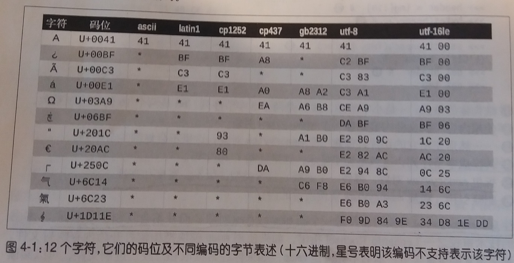

## 第4章 文本和字节序列

> 人类使用文本，计算机使用字节序列。————————Esther Nam和Travis Fischer

- Python3明确地区分了人类可读的文本字符串和原始的字节序列
---
### 4.1 字符问题

- 字符串：字符串是一个简单的概念，一个**字符串**就是一个**字符序列**

- 字符：字符的最佳定义就是Unicode字符

- Unicode标准把**字符的标识**和**具体的字节表述**进行了如下的明确区分
    
    - **字符的标识**
        - 即**码位**，是0-1114111的数字(十进制)，在Unicode标准中以4-6个十六进制数字表示，而且加上前缀“U+”
        - 例如，字母A的码位是`U+0041`，欧元符号的码位是`U+20AC`，高音谱号的码位是`U+1D11E`
        - 大约`10%`的有效码位有对应的字符
        - 使用内置的`ord()`函数可以查看码位的具体值

    - **字符的具体表述**
        - 字符的具体表述取决于所用的**编码**
        - **编码**是**在码位和字节序列之间转换时使用的算法**
        - 例如，A(`U+0041`)的码位编码成单个字节`\x41`，而在UTF-16LE编码中编码成两个字节`\x41\x00`
        - 再例如，欧元符号(`U+20AC`)再UTF-8编码中是三个字节:`\xe2\x82\xac`，而在UTF-16LE中编码成两个字节：`\xac\x200`

- 把码位转换成字节序列的过程叫做**编码**，把字节序列转换成码位的过程是**解码**

- 示例：编码与解码
    ````py
    >>> s = 'café'
    >>>len(s)
    4                                                                                                                                     
    >>> b = s.encode('utf8')                                                                                                
    >>> b                                                                                                                   
    b'caf\xc3\xa9'
    >>>len(b)
    5                                                                                                          
    >>> b.decode('utf8')                                                                                                    
    'café'                                                                                                                    
    ````
---

 ### 4.2 字节概要

 - 首先要知道，Python内置了两种基本的二进制序列类型：Python3引入的不可变bytes类型和Python2.6添加的可变bytearray类型

 - bytes和bytearray对象的各个元素是介于0-255（含）之间的整数

 - 示例：包含5个字节的bytes和bytearray对象
    ````py
    # bytes对象可以从str对象使用给定的编码构建
    >>> cafe = bytes('café', encoding='U8')
    >>> cafe
    b'caf\xc3\xa9'
    # 各个元素是range(256)内的整数
    >>> cafe[0]
    99
    # bytes对象的切片还是bytes对象，即使是只有一个字节的切片
    >>> cafe[:1]
    b'c'
    >>> cafe_array = bytearray(cafe)
    >>> cafe_array
    # bytearray没有字面量句法，而是以bytearray()和字节序列字面量参数的形式表示
    bytearray(b'caf\xc3\xa9')
    >>> cafe_array[0]
    99
    # bytearray对象的切片还是bytearray对象
    >>> cafe_array[:1]
    bytearray(b'c')
    ````
- 注意
    - my_bytes[0]获得的是一个整数，而my_bytes[:1]返回的是一个长度为1的bytes对象——————这一点应该不会十分意外
    - 对于除了str之外的其他序列类型,s[i]返回的都是一个元素，而s[i:i+1]则返回一个序列，里面只有s[i]这个元素
    - 对于str来说,s[i] == s[i:i+1]，它们返回的都是一个只有一个字符的字符串

- 在bytes或者bytearray中，各个字节的值可能会使用下列三种不同的方式显示
    - 方式
        1. 可打印的ASCII范围内的字节(从空格到~)，使用ASCII字符本身
        2. 制表符、换行符、回车符和`\`对应的字节，使用转义序列`\t`、`\n`、`\r`、`\\`
        3. 其他字节的值，使用十六进制转义序列(例如，\x00是空字节)
    - 例如:字符序列`'café'`的使用uft8编码的字节序列为`b'caf\xc3\xa9'`，前3个字节`b'caf'`在可打印的ASCII范围内，后两个字节则不然

- 除了格式化方法和几个处理unicode数据的方法之外，str类型的其他方法都支持bytes和bytearray类型

- 构建bytes或bytearay实例可以调用各自的构造方法，传入下述参数
    - 一个str对象和一个encoding关键字参数
    - 一个可迭代对象，提供0~255之间的数值
    - 一个实现了缓冲协议的对象(如bytes、bytearray、memoryview、array.array)；此时，把源对象中的字节序列复制到新建的二进制序列中

- 结构体和内存视图
    - struct模块
        - struct模块提供了一些函数，把打包的字节序列转换成不同类型的字段组成的元组
        - struct模块能处理bytes、bytearray和memoryview对象
    - memoryview类
        - memoryview类不是用来创建或储存字节序列，而是共享内存，让你访问其他二进制序列、打包的数组和缓冲中的数据切片，而无需复制字节序列
    - 示例：使用memoryview和struct提取一个GIF图像的宽度和高度
        ````py
        import struct
        # 结构体的格式：<是小字节符，3s3s是两个3字节序列，HH是两个16位二进制整数
        fmt = '<3s3sHH'
        with open('fil.gif','rb') as fp:
            # 使用内存中的文件内容创建一个memoryview对象
            img = memoryview(fp.read())
            # 使用它的切片再创建一个memoryview对象；这里不会复制字节序列
            header = img[:10]
            # 转换为字节序列
            print(bytes(header))
            # 拆包memoryview对象，得到一个元组，包含类型、版本、宽度和高度
            print(struct.unpack(fmt, header))
            # 删除引用，释放memoryview实例所占用的内存
            del header
            del img
        '''
        b'GIF98a+\x02\xe6\x00'
        (b'GIF', b'89a', 555, 230)
        '''
        ````

### 4.3 基本的编解码器
---
- Python自带超过100种编解码器(codec, encoder/decoder)，用于在文本和字节之间相互转换

- 每个编解码器有一个名称，如'utf_8'，而且经常有几个别名，如'utf8','utf-8'和'U8'

- 这些名称可以传给`open()`、`str.encode()`、`bytes.decode()`等函数的encoding参数

- 示例：使用3个编解码器编码字符串'中国'，而得到的字节序列差异很大
    ````py
    >>> for codec in ['gb2312', 'utf-8', 'utf-16']:
    ...     print(codec, '中国'.encode(codec), sep='\t')
    ...
    gb2312  b'\xd6\xd0\xb9\xfa'
    utf-8   b'\xe4\xb8\xad\xe5\x9b\xbd'
    utf-16  b'\xff\xfe-N\xfdV'
    ````

- 一些典型的编码
    - 如图
    
    - 编码
        1. latin1(即iso8859_1)：一种重要的编码，是其他编码的基础，例如cp1252和Unicode
        2. cp1252：Microsoft指定的latin1的超集，添加了许多有用的符号
        3. cp437：IBM PC最初的字符集，包含框图符号。与后面出现的latin1不兼容
        4. gb2312：用于编码简体中文的陈旧标准
        5. utf-8：目前web中最常用的8位编码；与ASCII兼容(纯ASCII文本是有效地UTF-8文本)
        6. utf-16le：UTF-16是16位编码方案的一种形式
    
---

### 4.4 了解编解码问题

- 简介
    - 虽然有个一般性的UnicodeError异常，但是报告错误时几乎都会指明具体的异常
    - UnicodeEncodeError:把字符串转换为二进制序列时发生的异常
    - UnicodeDecodeError:把二进制序列转换为字符串时发生的异常
    - SyntaxError:如果源码的编码与预期不符，加载Python模块时还可能抛出SyntaxError
---
#### 4.4.1 处理UnicodeEncodeError

- 简介
    - 多数非UTF编解码器只能处理Unicode字符的小部分子集
    - 把文本转换为字节序列时，如果目标编码中没有定义某个字符，就会抛出UnicodeEncodeError异常，除非把errors参数传给编码方法或函数，对错误进行特殊处理

- 示例：编码成字节序列：成功和错误处理
    ````py
    >>> city = 'São paulo'
    # utf编码可以处理任何字符串
    >>> city.encode('utf8')
    b'S\xc3\xa3o paulo'
    >>> city.encode('utf16')
    b'\xff\xfeS\x00\xe3\x00o\x00 \x00p\x00a\x00u\x00l\x00o\x00'
    # cp437无法处理'ã'字符，从而抛出UnicodeEncodeError异常
    >>> city.encode('cp437')
    Traceback (most recent call last):
    File "<stdin>", line 1, in <module>
    File "/usr/lib/python3.6/encodings/cp437.py", line 12, in encode
        return codecs.charmap_encode(input,errors,encoding_map)
    UnicodeEncodeError: 'charmap' codec can't encode character '\xe3' in position 1: character maps to <undefined>
    # error='ignore'方法悄无声息的跳过无法编码的字符，这样做通常不很妥当
    >>> city.encode('cp437', errors='ignore')
    b'So paulo'
    # error='replace'把无法编码的字符替换成'?'；数据损坏了，但是用户知道出现了问题
    >>> city.encode('cp437', errors='replace')
    b'S?o paulo'
    # 'xmlcharrefreplace'把无法编码的字符替换成了XML实体
    >>> city.encode('cp437', errors='xmlcharrefreplace')
    b'S&#227;o paulo'
    ````

- 另外
    - 编解码器的错误处理方式时可扩展的。你可以为errors参数注册额外的字符串
    - 方法是把一个名称和一个错误处理函数传给`codecs.register_error`函数
---
#### 4.4.2 处理UnicodeDecodeError

- 简介
    - 不是每个字节都包含有效的ASCII字符，也不是每个字符序列都是有效的UTF-8或者UTF-16
    - 因此，把二进制序列转换为文本时，如果假设是UTF-8或者UTF-16中的一个，遇到无法转换的字节序列时会抛出UnicodeDecodeError
    - 另一方面，许多陈旧的8位编码——如'cp1252'、'iso8859-1'、'koi8_r'等——能解码任何字节序列流而不抛出错误，因此，如果程序使用错误的8位编码，解码过程悄无声息，而得到的是无用输出

- 鬼符(gremlin)：乱码字符称为鬼符

- 示例：把字节序列解码成字符串：成功和错误处理
    ````py
    # 这些字节序列是使用latin1编码的"Montréal"；'\xe9'字节对应'é'
    >>> octets = b'Montr\xe9al'
    # 可以使用'cp1252'解码，因为它是latin1的有效超集
    >>> octets.decode('cp1252')
    'Montréal'
    # ISO-8859-7用于编码希腊文，因此无法正确解释'\xe9'字节，而且没有抛出错误
    >>> octets.decode('iso8859_7')
    'Montrιal'
    # KOI8-R用来编码俄文，这里'\xe9'对应西里尔字母'И'
    >>> octets.decode('koi8_r')
    'MontrИal'
    # 'utf-8'编解码器检测到octets不是有效的utf-8字符串，抛出UnicodeDecodeError
    >>> octets.decode('utf_8')
    Traceback (most recent call last):
    File "<stdin>", line 1, in <module>
    UnicodeDecodeError: 'utf-8' codec can't decode byte 0xe9 in position 5: invalid continuation byte
    # 使用'replace'错误处理方式，`\xe9`替换成了"�"(码位是U+FFFD)，这是官方指定的REPLACEMENT CHARACTER(替换字符)，表示未知字符
    >>> octets.decode('utf_8', errors='replace')
    'Montr�al'
    ````
---
#### 4.4.3 使用预期之外的编码加载模块时抛出的SyntaxError

- Python源码的默认编码
    - Python3默认使用utf-8编码源码
    - Python2默认使用ASCII

- 如果加载的.py模块中包含utf-8之外的数据会产生SyntaxError异常
    - 为了修正这个问题有两种解决办法
        1. 在文件顶部添加一个神奇的coding注释
            - 例如:`# coding: cp1252`
        2. 将这个源码的编码方式直接转换成UTF8

- 源码中能否使用非ASCII名称
    - Python3允许源码中使用非ASCII标识符，但是通常Python2不允许这么做
    - 如果代码是开源的，那么标识符应该使用英文，也就是只能使用ASCII字符
---
#### 4.4.4 如何找出字节序列的编码

- 如何找出字节序列的编码
    - 简单来说，不能。必须有人告诉你

- 有些通信协议和文件格式，比如HTTP和XML，包含明确制定内容编码的首部

- 统一字符编码侦测包Chardet
    - 它通过试探和分析编码中字节的特点来确定编码的类型
    - 可以识别所支持的30种编码
    - Chardet是个Python库，可以在程序中使用，不过它也提供了命令行工具chardetext
---
#### 4.4.5 BOM:有用的鬼符

- BOM
    - 就是字节序标识(byte-order mark)，指明编码时使用Intel CPU的大字节序还是小字节序
    - 例如:u16编码开头的`b'\xff\xfe'
- 小字节序和大字节序
    - 在小字节序设备中，各个码位的最低有效字节在前面
        - 例如:字母"E"的码位是U+0049，十进制为69，所以在字节偏移的第二位和第三位编码为69和0
    - 在大字节序CPU中，编码顺序相反

- 为了避免混淆，UTF-16编码在要编码的文本钱吗需要加上特殊的不可见字符ZERO WIDTH NO-BREAK SPACE(U+FEFF)。在小字节序系统中，这个字符编码为`b\xff\xfe`；而在大字节序系统中，这个编码时`b\xfe\xff`，以此来进行区分。

- UTF-16有两个变种:UTF-16LE，显式地指出使用小字节序；UTF-16BE，显式地指出使用大字节序。如果使用这两种编码，不会生成BOM

- 与字节序有关个问题只对一个字(word)占多个字节的编码(如utf-16和utf-32)有影响；UTF-8不管使用什么字节序，生成的字节序列都是一致的，所以不需要使用BOM
---

### 4.5 处理文本文件

- Unicode三明治
    - 处理文本的最佳实践就是"Unicode三明治"
    - 意思是
        1. 要尽早把输入的字节序列解码为字符串
        2. 程序的业务逻辑部分只负责处理字符串
        3. 对输出来说，要尽量晚地把字符串编码成字节序列
    - 多数web框架都是这样做的，使用框架时很少接触字节序列

- Python3中的Unicode三明治
    - 在Python3中能轻松地采纳Unicode三明治的建议
    - 因为内置的`open`函数会在读取文件的时候进行必要的解码，以文本模式写入文件的时候还会进行必要的编码
    - 所以调用`my_file.read()`得到的以及传给`my_file.write(text)`方法的都是字符串对象

- 默认编码问题
    - 如果在打开文件的时候没有指定编码，将使用当前环境的默认编码
    - 在Windows环境下的默认编码是(windows 1252)，而在GNU/Linux或Mac OS X中的默认编码时utf-8
    - 所以需要在多台设备或者多种场合下运行的代码，一定不能依赖默认编码。打开文件时始终应该明确传入`encoding=`参数

- 继续探究
    ````py
    # 默认情况下,open函数采用文本模式，返回一个TextIOWrapper对象
    >>> fp = open('cafe.txt','w',encoding='utf-8')
    >>> fp
    <_io.TextIOWrapper name='cafe.txt' mode='w' encoding='utf-8'>
    # 在TextIOWrapper对象上调用write方法返回写入的Unicode字符数
    >>> fp.write('café')
    4
    >>> fp.close()
    >>> import os
    # 在os.stat的报告文件中有5个字节，UTF-8编码的'é'占两个字节:\xc3\xa9
    >>> os.stat('cafe.txt').st_size
    5
    # `rb`标识表明在二进制模式中读取文件，返回的是BufferedReader对象而不是TextIOWrapper对象
    >>> fp4 = open('cafe.txt','rb')
    >>> fp4
    <_io.BufferedReader name='cafe.txt'>
    # 读取得到的是字节序列，符合预期
    >>> fp4.read()
    b'caf\xc3\xa9'
    ````

- 注意
    - 除非想判断编码，否则不要在二进制模式下打开文本文件
    - 即使如此，也应该使用Chardet，而不是重新发明轮子

- Windows系统的编码问题
    - 在Windows中，不仅同一个系统中使用不同的编码(如cp850和cp1252)
    - 还有只支持ASCII和127个额外的字符的代码页，而且不同代码页之间增加的字符也有所不同

- 关于编码默认值的最佳建议是:别依赖默认值，如果遵从Unicode三明治建议，而且始终在程序中显式指定编码，将避免很多问题
---

### 4.6 为了正确比较而规范化的Unicode字符串

- 因为unicode有组合字符(变音符号和附加到前一个字符上的记号，打印时作为一个整体)，所以字符串比较起来很麻烦
    - 例如:
    ````py
    >>> s1 = 'café'
    >>> s2 = 'cafe\u0301'
    >>> s1, s2
    ('café', 'café')
    >>> len(s1),len(s2)
    (4, 5)
    >>> s1 == s2
    False
    ````

- 这个问题的解决方案是使用unicodedata.normalize函数提供的Unicode规范化，这个函数的第一个参数是这4个字符串中的一个
    - NFC:使用最少的码位构建等价的字符串
    - NFD：把组合字符分解为基字符和单独的组合字符
    - NFKC和NFKD：会进行一定的字符替换(略)

- 使用`str.casefold()`可以把所有的文本都变成小写

- 使用`nfc_equal`和`fold_equal`可以对字符串进行规范化或小写化之后再比较
---

### 4.7 Unicode文本排序

- Python比较任何类型的序列时，会一一比较序列里的各个元素，对于字符串来说，比较的是码位

- 然而不同的地区采用的排序规则可能有所区别

- 在Python中，非ASCII文本的标准排序方式是使用locale.strxfrm函数，它会把字符串转换成适合所在地域进行比较的形式

- PyUCA库使用纯Python实现了Unicode排序算法，它没有考虑地区设置

### 4.8 Unicode数据库

- Unicode标准提供了一个完整的数据库
    - 不仅包括码位与字符名称之间的映射，还有各个字符的元数据，以及字符之间的关系
    - 例如,Unicode数据库记录了字符是否可以打印，是不是字母、是不是数字，或者是不是其他数值符号

- unicodedata模块中有几个函数用来获取字符的元数据
    - 例如
        - 字符在标准中的官方名称是不是组合字符
        - 符号对应的人类可读数值(不是码位)

### 4.9 本章小结

- 本章首先澄清了人们对一个字符等于一个字节的误解，我们必须把文本字符串和它们在文件中的二进制序列标书区分开

- bytes和bytearray是两种二进制序列类型

- 编码和解码

- UnicodeEncodeError、UnicodeDecodeError和由于Python源码文件编码错误导致的SyntaxError

- Chardet包用于检测元数据使用的是什么编码

- 在打开文件时，encoding-关键字参数不是必需的，但是应该指定。不然不一致的默认编码会导致跨平台不兼容性

- 文本比较很复杂，因为Unicode为某些字符提供了不同的表示，所以匹配文本之前一定要先规范化

- Unicode数据库包括码位与字符名称之间的映射，还有各个字符的元数据，以及字符之间的关系
---