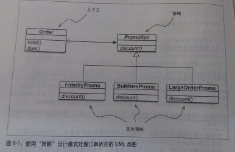

## 第六章 使用一等函数实现设计模式

> 符合模式并不表示做得对.————————Ralph Johnson

- 虽然设计模式与语言无关，但这并不意味着每一个模式都能在每一门语言中使用

- 《设计模式：可复用面向对象软件的基础》的作者在引言中承认，所用的语言决定了哪些模式可用

- 具体而言
    - Norvig建议在有一等函数的语言中重新审视"策略"、"命令"、"模板方法"和"访问者"模式
    - 通常，我们可以把这些模式中涉及的某些类的实例替换成简单的函数，从而减少样本代码
---
### 6.1 案例分析：重构策略模式

- 如果合理利用作为一等对象的函数，某些设计模式可以简化，"策略"模式就是其中一个很好的例子

#### 6.1.1 经典的策略模式

- 下图指出了策略模式对类的编排  
    

- 策略模式的定义
    > 定义一系列算法，把它们一一封装起来，并且使它们可以相互替换。本模式使得算法可以独立于使用它的客户而变换

- 策略模式的组成部分
    - 上下文：把一些计算委托给不同算法的可互换组件，它提供服务
    - 策略：实现不同算法的

- 策略模式的注意事项
    - 按照《设计模式：可复用面向对象软件的基础》一书中的说明，具体策略由上下文类的客户选择
    - 具体怎么选择策略，不在这个模式的职责范围内

- 示例：实现Order类，支持插入式折扣策略
    ````py
    from abc import ABC, abstractmethod
    from collections import namedtuple

    Customer = namedtuple('Customer', 'name fidelity')


    class LineItem:

        def __init__(self, product, quantity, price):
            self.product = product
            self.quantity = quantity
            self.price = price

        def total(self):
            return self.price * self.quantity


    class Order:  # 上下文

        def __init__(self, customer, cart, promotion=None):
            self.customer = customer
            self.cart = list(cart)
            self.promotion = promotion

        def total(self):
            if not hasattr(self, '__total'):
                self.__total = sum(item.total() for item in self.cart)
            return self.__total

        def due(self):
            if self.promotion is None:
                discount = 0
            else:
                discount = self.promotion.discount(self)
            return self.total() - discount

        def __repr__(self):
            fmt = '<order total: {:.2f} due: {:.2f}>'
            return fmt.format(self.total(), self.due())


    class Promotion(ABC):  # 策略:抽象基类

        @abstractmethod
        def discount(self, order):
            """返回折扣金额(正值)"""


    class FidelityPromo(Promotion):  # 第一个具体策略
        """为积分为1000或以上的用户提供5%折扣"""

        def discount(self, order):
            return order.total() * .05 if order.customer.fidelity >= 1000 else 0


    class BulkItemPromo(Promotion):  # 第二个具体策略
        """单个商品为20个或以上时提供10%折扣"""

        def discount(self, order):
            discount = 0
            for item in order.cart:
                if item.quantity >= 20:
                    discount += item.total() * .1
            return discount


    class LargeOrderPromo(Promotion):  # 第三个具体策略
        """订单中的不同商品达到10个或以上时提供7%折扣"""

        def discount(self, order):
            distinct_items = {item.product for item in order.cart}
            if len(distinct_items) >= 10:
                return order.total() * .07
            return 0

    ````
---
#### 6.1.2 使用函数实现策略模式

- 背景
    - 在前一节的示例中，每个具体策略都是一个类，而且都只定义了一个方法，即discount.此外，策略实例是没有状态的
    - 也就是说它们看起来像普通的函数，所以没有理由不把具体策略换成简单的函数，并且去掉Promo抽象类

- 示例: Order类和使用函数实现的折扣策略
    ````py
    from collections import namedtuple

    Customer = namedtuple('Customer', 'name fidelity')


    class LineItem:

        def __init__(self, product, quantity, price):
            self.product = product
            self.quantity = quantity
            self.price = price

        def total(self):
            return self.price * self.quantity


    class Order:  # 上下文

        def __init__(self, customer, cart, promotion=None):
            self.customer = customer
            self.cart = list(cart)
            self.promotion = promotion

        def total(self):
            if not hasattr(self, '__total'):
                self.__total = sum(item.total() for item in self.cart)
            return self.__total

        def due(self):
            if self.promotion is None:
                discount = 0
            else:
                discount = self.promotion(self)
            return self.total() - discount

        def __repr__(self):
            fmt = '<order total: {:.2f} due: {:.2f}>'
            return fmt.format(self.total(), self.due())


    def fidelity_promo(order):
        """为积分为1000或以上的用户提供5%折扣"""
        return order.total() * .05 if order.customer.fidelity >= 1000 else 0


    def bulk_item_promo(order):
        """单个商品为20个或以上时提供10%折扣"""
        discount = 0
        for item in order.cart:
            if item.quantity >= 20:
                discount += item.total() * .1
        return discount


    def large_order_promo(order):
        """订单中的不同商品达到10个或以上时提供7%折扣"""
        distinct_items = {item.product for item in order.cart}
        if len(distinct_items) >= 10:
            return order.total() * .07
        return 0
    ````

- 享元模式与函数的讨论
    - 值得注意的是，《设计模式：可复用面向对象软件的基础》一书的作者指出：“策略对象通常是很好的享元(flyweight)。”
    - 那本书的另一部分对“享元”下了定义：享元是可共享的对象，可以同时在多个上下文中使用
    - 共享是推荐的做法，这样不必在每个新的上下文中使用相同的策略时不断新建具体策略对象，从而减少消耗
    - 函数比用户定义的类的实例轻量，而且无需使用享元模式，因为各个策略函数在Python编译模块时只会创建一次。普通的函数也是"可共享的对象"，可以同时在多个上下文中使用
---
#### 6.1.3 选择最佳策略：简单的方式

- 示例:best_promo迭代一个函数列表，并找出折扣额度最大的
    - 代码
        ````py
        # promos列出以函数实现的各个策略
        promos = [fidelity_promo, bulk_item_promo, large_order_promo]
        def best_promo(order):
            """选择可用的最佳折扣"""
            # 使用生成器表达式把order传个promos列表中的各个函数，返回计算出的最大折扣额度
            return max(promo(order) for promo in promos)
        ````
    - 解释
        - promos是函数列表。习惯函数是一等对象之后，自然而然就会构建这种结构存储函数
    - 缺点
        - 若想添加新的促销策略，要定义相应的函数，还要记得把它添加到promos列表中
---
#### 6.1.4 找出模块中的全部策略

- Python中的模块
    - 在Python中模块也是一等对象，而且标准库提供了几个处理模块的函数
    - 内置函数`globals()`
        - 返回一个字典，表示当前的全局符号表
        - 这个符号表始终针对当前模块(对函数或方法来说，是指定义它们的模块，而不是调用它们的模块)

- 方案一:使用globals函数来自动寻找其他可用的*_promo函数
    - 示例：内省模块中的全局命名空间，构建promos列表
    ````py
    promos = [globals()[name] for name in globals() if name.endwith('_promo') and name != 'best_promo']

    def best_promo(order):
        """选择可用的最佳折扣"""
        return max(promo(order) for promo in promos)
    ````
    - 解释
        - 通过迭代globals()来找到所用的_promo函数
        - 过滤掉best_promo自身，防止无限递归
        - best_promo内部的代码没有变化

- 方案二
    - 在一个单独的模块中保存所有的策略函数，并把best_promo排除在外
    - 通过内省这个模块来构建策略函数列表

- 另外
    - 动态收集促销折扣函数更为显示的一种方案是使用简单的修饰器
---
### 6.2 命令模式

- 命令模式也可以通过把函数作为参数传递而简化

- 命令模式简介
    - 命令模式的目的是解耦调用操作的对象(调用者)和提供实现的对象(接收者)
    - 命令模式的做法是在调用者和接收者之间放一个Command对象，让它实现只有一个方法的接口，调用接收者中的方法执行所需的操作。这样，调用者无需理解接收者的接口，而且不同的接收者可以适应不同的Command子类

- 命令模式的类图如下

- Python对命令模式的简化
    - 我们可以不为调用者提供一个Command实例，而是给它一个函数，就如我们对策略模式做的那样
---
