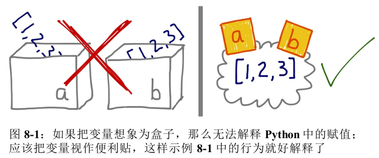
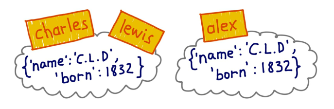
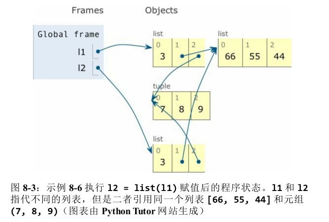
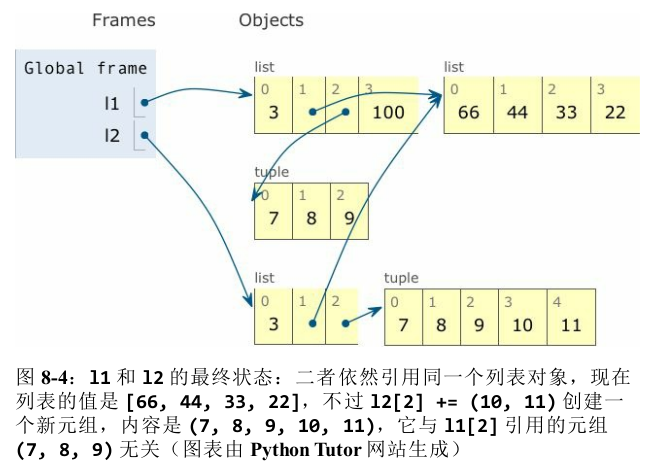

## 第8章 对象引用、可变性和垃圾回收

>“你不开心,”白骑士用一种忧虑的声调说,“让我给你唱一首歌安
>慰你吧......这首歌的曲名叫作 :《黑线鳕的眼睛》。”
>“哦,那是一首歌的曲名,是吗?”爱丽丝问道,她试着使自己感到
>有兴趣。
>“不,你不明白,”白骑士说,看来有些心烦的样子,“那是人家这
>么叫的曲名。真正的曲名是《老而又老的老头儿》。”(改编自第
>8 章“这是我自己的发明”)
>——Lewis Carroll《爱丽丝镜中奇遇记》
---
### 8.1 变量不是盒子

- 引子
    - 人们经常使用"变量是盒子"这样的比喻，但是这有碍于理解面向对象语言中的引用式变量
    - Python变量类似于Java中的引用式变量，因此最好把它们理解为**附加在对象上的标注**

- 示例 8-1 变量`a`和`b`引用同一个列表，而不是那个列表的副本
    ````py
    >>> a = [1, 2, 3]
    >>> b = a
    >>> a.append(4)
    >>> b
    [1, 2, 3, 4]
    ````

- 如图  
    

- 变量的赋值方式
    - 对引用式变量来说，说把变量分配给对象更合理，反过来说就有问题。毕竟，**对象在赋值之前就创建了**
    - 为了理解Python中的赋值语句，应该始终先读右边。对象在右边创建或获取，在此之后左边的变量才会绑定到对象上，就像为对象贴上便利贴一样

---

### 8.2 标识、相等性和别名

- 别名
    - 因为变量不过是标注，所以无法阻止为对象贴上多个标注
    - 贴的多个标注，就是别名

- 示例 
    - 背景：Lewis Carroll 是 Charles Lutwidge Dodgson 教授的笔名。Carroll 先生指的就是 Dodgson 教授,二者是同一个人。然而,假如有冒充者(姑且叫他 Alexander Pedachenko 博士)生于 1832年,声称他是 Charles L. Dodgson。这个冒充者的证件可能一样,但 Pedachenko 博士不是Dodgson 教授
    - 如图  
    
    - 代码
        ````py
        >>> charles = {'name': 'Charles L. Dodgson', 'born': 1832}
        # lewis 是 charles 的别名
        >>> lewis = charles 
        >>> lewis is charles
        True
        # is 运算符和 id 函数确认了这一点
        >>> id(charles), id(lewis) 
        (4300473992, 4300473992)
        # 向 lewis 中添加一个元素相当于向 charles 中添加一个元素
        >>> lewis['balance'] = 950 
        >>> charles
        {'name': 'Charles L. Dodgson', 'balance': 950, 'born': 1832}
        # alex 指代的对象与赋值给 charles 的对象内容一样
        >>> alex = {'name': 'Charles L. Dodgson', 'born': 1832, 'balance': 950}
        # 比较两个对象,结果相等,这是因为 dict 类的 __eq__ 方法就是这样实现的
        >>> alex == charles 
        True
        # 但它们是不同的对象。这是 Python 说明标识不同的方式:a is not b
        >>> alex is not charles 
        True
        ````

- 标识
    - 每个对象都有标识、类型和值
    - **对象一旦创建,它的标识绝不会变**;你可以把标识理解为对象在内存中的地址
    - `is` 运算符比较两个对象的标识
    - `id()` 函数返回对象标识的整数表示,在CPython中`id()`返回对象的内存地址

---
#### 8.2.1 在 == 和 is 之间选择

- 简介
    - `==` ： 比较的是两个对象的值(对象中保存的数据)
    - `is`
        - 比较的是对象的标识
        - 在变量和单例值之间比较时，应该用 `is`
            ````py
            >>> x is None
            True
            >>> x is not None
            False
            ````

- 比较
    - `is` 运算符比 `==` 速度快,因为它不能重载,所以 Python 不用寻找并调用特殊方法,而是直接比较两个整数 ID
    - 而 `a == b` 是语法糖,等同于`a.__eq__(b)`
    - 继承自 `object` 的 `__eq__` 方法比较两个对象的 ID,结果与 `is` 一样
    - 但是多数内置类型使用更有意义的方式覆盖了 `__eq__`方法,会考虑对象属性的值
---
#### 8.2.2 元组的相对不可变性

- 简介
    - 元组与多数 Python 集合(列表、字典、集,等等)一样,保存的是对象的引用
    - 如果引用的元素是可变的,即便元组本身不可变,元素依然可变
    - 也就是说,元组的不可变性其实是指 `tuple` 数据结构的**物理内容(即保存的引用)**不可变,与**引用的对象无关**

- 示例 元组中不可变的是元素的标识，元组的值会随着引用的可变对象的变化而变
    ````py
    # t1 不可变,但是 t1[-1] 可变
    >>> t1 = (1, 2, [30, 40])
    # 构建元组 t2,它的元素与 t1 一样
    >>> t2 = (1, 2, [30, 40])
    # 虽然 t1 和 t2 是不同的对象,但是二者相等——与预期相符
    >>> t1 == t2 
    True
    # 查看 t1[-1] 列表的标识
    >>> id(t1[-1]) 
    4302515784
    # 就地修改 t1[-1] 列表
    >>> t1[-1].append(99)
    >>> t1
    (1, 2, [30, 40, 99])
    # t1[-1] 的标识没变,只是值变了
    >>> id(t1[-1]) 
    4302515784
    # 现在,t1 和 t2 不相等
    >>> t1 == t2 
    False
    ````

- 元组的相对不可变性解释了 2.6.1 节的谜题。这也是**有些元组不可散列**(参见 3.1 节中的“什么是可散列的数据类型”附注栏)的原因

---

### 8.3 默认做浅复制

#### 8.3.1 浅复制
- 浅复制
    - 只复制最外层容器，副本中的元素是源容器中元素的引用
    - 如果所有元素都是不可变的，那么这样没有什么问题，还能节省内存
    - 但是如果有可变元素，可能导致意想不到的问题

- 示例： 如何进行浅复制
    ````py
    >>> l1 = [3, [55, 44], (7, 8, 9)]
    # 使用构造方法进行浅复制
    >>> l2 = list(l1)
    # 使用[:]进行浅复制
    >>> l3 = l1[:]
    >>> l2
    [3, [55, 44], (7, 8, 9)]
    # 副本与源列表相等
    >>> l2 == l1 
    True
    # 但是二者指代不同的对象
    >>> l2 is l1 
    False
    ````
- 示例 ： 浅复制导致的问题
    ````py
    l1 = [3, [66, 55, 44], (7, 8, 9)]
    l2 = list(l1)
    # l2 是 l1 的浅复制副本。此时的状态如下图所示
    l1.append(100)
    # 把 100 追加到 l1 中,对 l2 没有影响
    l1[1].remove(55)
    # 把内部列表 l1[1] 中的 55 删除。这对 l2 有影响,因为 l2[1] 绑定的列表与 l1[1] 是同一个
    print('l1:', l1)
    print('l2:', l2)
    # 对可变的对象来说,如 l2[1] 引用的列表,+= 运算符就地修改列表。这次修改在 l1[1] 中也有体现,因为它是 l2[1] 的别名
    l2[1] += [33, 22] 
    # 对元组来说,+= 运算符创建一个新元组,然后重新绑定给变量l2[2]
    l2[2] += (10, 11) 
    print('l1:', l1)
    print('l2:', l2)
    ````
    
    

- 所以，浅复制虽然容易操作，但是有时得到的结果并不是你想要的
---
#### 8.3.2 为任意对象做深复制和浅复制

- 深复制：副本不共享内部对象的引用

- copy模块
    - copy 模块提供的 deepcopy 和 copy 函数能为任意对象做深复制和浅复制

- 一般来说,深复制不是件简单的事。如果对象有循环引用,那么这个朴素的算法会进入无限循环。deepcopy 函数会记住已经复制的对象,因此能优雅地处理循环引用

- 深复制有时可能太深了。例如,对象可能会引用不该复制的外部资源或单例值。我们可以实现特殊方法 `__copy__()` 和`__deepcopy__()`,控制 copy 和 deepcopy 的行为

---

### 8.4 函数的参数作为引用时

- Python传参的方案
    - Python唯一支持的传参方式是共享传参(call by sharing)
    - 共享传参是指：函数的各个形式参数获得实参中各个引用的副本，也就是说，函数内部的形参是实参的别名
    - 这种方案的结果是，函数可能修改作为参数传入的可变对象，但是无法修改那些对象的标识。也就是说**传入的参数可能会受到函数的影响而改变**

- 示例：函数可能会修改接收到的可变对象
    ````py
    >>> def f(a, b):
    ...     a += b
    ...     return a
    ... 
    >>> x = 1
    >>> y = 2
    >>> f(x, y)
    3
    >>> # 数字x没变
    >>> x, y
    1, 2
    >>> a = [1, 2]
    >>> b = [3, 4]
    >>> f(a, b)
    [1, 2, 3, 4]
    >>> # 列表a变了
    >>> a, b
    ([1, 2, 3, 4], [3, 4])
    >>> t = (10, 20)
    >>> u = (30, 40)
    >>> f(t, u)
    (10, 20, 30, 40)
    >>> # 元组t没变
    >>> t, u
    ((10, 20), (30, 40))
    ````
---
#### 8.4.1 不要使用可变类型作为参数的默认值

- 背景：可选参数可以有默认值,这是 Python 函数定义的一个很棒的特性,这样我们的 API 在进化的同时能保证向后兼容。然而,我们应该避免使用可变的对象作为参数的默认值

- 示例：幽灵列车，它将说明为什么应该避免使用可变的对象作为参数的默认值
    ````py
    class HautedBus:
        """备受幽灵乘客折磨的校车"""
        # 如果没传入 passengers 参数,使用默认绑定的列表对象,一开始是空列表
        def __init__(self, passengers=[]):
            # 这个赋值语句把 self.passengers 变成 passengers 的别名,而没有传入 passengers 参数时,后者又是默认列表的别名
            self.passengers = passengers

        def pick(self, name):
            # 在 self.passengers 上调用 .remove() 和 .append() 方法时,修改的其实是默认列表,它是函数对象的一个属性
            self.passengers.append(name)

        def drop(self, name):
            self.passengers.remove(name)


    if __name__ == '__main__':
        # 一开始,bus1 是空的,因此把默认的空列表赋值给self.passengers
        bus1 = HautedBus()
        bus1.pick('peter')
        # bus2 一开始也是空的,因此还是赋值默认的列表
        # 但是默认列表不为空!
        bus2 = HautedBus()
        bus2.pick('alice')
        # bus1和bus2共享了乘客
        print(bus1.passengers)
        print(bus2.passengers)
        print(bus1.passengers is bus2.passengers)
        # 最后发现默认参数实际上是绑定在类的init方法的defaults属性上,作为一个类的属性,它只有一份,不会拷贝
        print(bus1.passengers is HautedBus.__init__.__defaults__[0])
    ````
- 解释：为什么应该避免使用可变的对象作为参数的默认值
    - 默认值在定义函数时计算(通常在加载模块时),因此默认值变成了**函数对象的属性**(上例中是`HautedBus`类的`init`方法上的`default属性`)
    - 因此,如果默认值是可变对象,而且修改了它的值,那么后续的函数调用都会受到影响
    - 其实`bus1.passengers`和`bus2.passengers`都是别名,它绑定到`HauntedBus.__init__.__defaults__`属性的第一个元素上
---
#### 8.4.2 防御可变参数
- 简介
    - 如果定义的函数接收可变参数，应该谨慎考虑调用者是否期望改变传入的参数
    - 例如，如果函数接收一个字典，而且在处理的过程中要修改它，那么这个副作用要不要体现到函数外部

- 示例：消失的篮球队
    ````py
    # basketball_team 中有 5 个学生的名字
    >>> basketball_team = ['Sue', 'Tina', 'Maya', 'Diana', 'Pat']
    # 使用这队学生实例化 TwilightBus
    >>> bus = TwilightBus(basketball_team)
    # 一个学生从 bus 下车了,接着又有一个学生下车了 
    >>> bus.drop('Tina') 
    >>> bus.drop('Pat')
    # 下车的学生从篮球队中消失了
    >>> basketball_team 
    ['Sue', 'Maya', 'Diana']
    ````
    - TwilightBus 违反了设计接口的最佳实践,即“最少惊讶原则”
    - 学生从校车中下车后,她的名字就从篮球队的名单中消失了

- 解决：
    - 除非这个方法确实想修改通过参数传入的对象,否则在类中直接把参数赋值给实例变量之前一定要三思
    - 因为这样会为参数对象创建别名
    - 如果不确定,那就创建副本。这样客户会少些麻烦

---

### 8.5 del和垃圾回收

>对象绝不会自行销毁；然而，无法得到对象时，可能会被当做垃圾回收

- `del`简介
    - `del`语句删除名称，而不是对象
    - `del` 命令可能会导致对象被当作垃圾回收,但是仅当删除的变量保存的是对象的最后一个引用,或者无法得到对象时

- `__del__`特殊方法
    - 有个 `__del__` 特殊方法,但是它不会销毁实例,不应该在代码中调用
    - 即将销毁实例时,Python 解释器会调用 `__del__` 方法,给实例最后的机会,释放外部资源

- 垃圾回收算法
    - 在 CPython 中,垃圾回收使用的主要算法是引用计数
    - 实际上,每个对象都会统计有多少引用指向自己
    - 当引用计数归零时,对象立即就被销毁:CPython 会在对象上调用 `__del__` 方法(如果定义了),然后释放分配给对象的内存

- 总结
    - `del`不会删除对象，但是执行`del`操作后可能导致对象不可获取从而被删除

---
