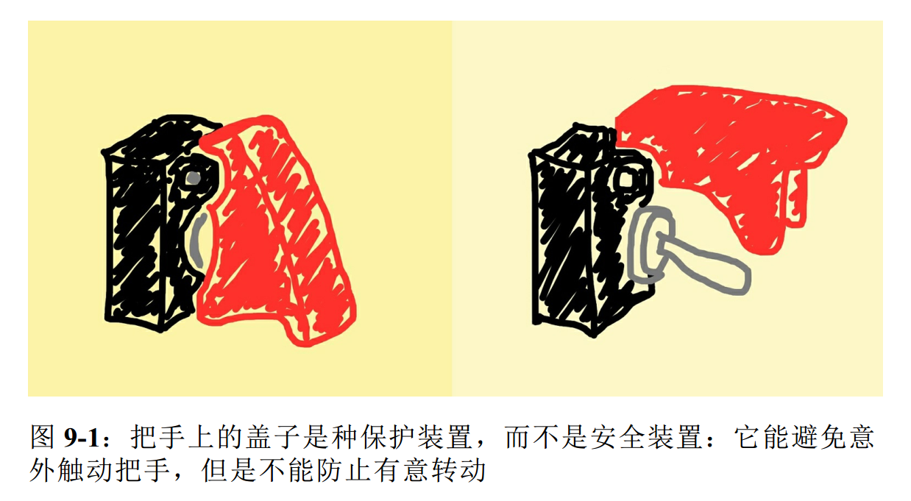

## 第9章 符合Python风格的对象

> 绝对不要使用两个前导下划线，这是很烦人的自私行为---Ian Bicking

- 得益于Python数据模型，自定义类型的行为可以像内置类型那样自然

- 实现如此自然的行为，靠的不是继承，而是鸭子类型：我们只需按照行为实现对象所需的方法即可

---
### 9.1 对象的表示形式

- Python提供两种**获取对象的字符串表示形式**的标准方法
    - `repr()`:以便于开发者理解的方式返回对象的字符串表示形式
    - `str()`:以便于用户理解的方式返回对象的字符串表示形式
    - 我们可以通过实现`__repr__`和`__str__`特殊方法，为`repr()`和`str()`提供支持

- Python还为对象提供了其他的表示形式
    - `bytes()`函数调用对象的`__byte__`方法来获取对象的字节序列表示形式
    - `format`函数调用对象的`__format__`，使用特殊的格式代码显示对象的字符串表示形式

- 注意
    - 在 Python 3 中,`__repr__`、`__str__` 和 `__format__` 都必须返回 Unicode 字符串(`str` 类型)
    - 只有 `__bytes__` 方法应该返回字节序列(`bytes` 类型)

---

### 9.2 再谈向量类

- 为了说明用于生成对象表示形式的众多方法,我们将使用一个 `Vector2d` 类

- 我们期望 Vector2d 实例具有的基本行为如下所示
    ````py
    >>> v1 = Vector2d(3, 4)
    # Vector2d 实例的分量可以直接通过属性访问(无需调用读值方法)
    >>> print(v1.x, v1.y) 
    3.0 4.0
    # Vector2d 实例可以拆包成变量元组
    >>> x, y = v1 
    >>> x, y
    (3.0, 4.0)
    # repr 函数调用 Vector2d 实例,得到的结果类似于构建实例的源码
    >>> v1 
    Vector2d(3.0, 4.0)
    # 这里使用 eval 函数,表明 repr 函数调用 Vector2d 实例得到的是对构造方法的准确表述
    >>> v1_clone = eval(repr(v1)) 
    >>> v1 == v1_clone 
    True
    # print 函数会调用 str 函数,对 Vector2d 来说,输出的是一个有序对
    >>> print(v1) 
    (3.0, 4.0)
    # bytes 函数会调用 __bytes__ 方法,生成实例的二进制表示形式
    >>> octets = bytes(v1) 
    >>> octets
    b'd\\x00\\x00\\x00\\x00\\x00\\x00\\x08@\\x00\\x00\\x00\\x00\\x00\\x00\\x10@'
    # abs 函数会调用 __abs__ 方法,返回 Vector2d 实例的模
    >>> abs(v1) 
    5.0
    # bool 函数会调用 __bool__ 方法,如果 Vector2d 实例的模为零,返回 False,否则返回 True
    >>> bool(v1), bool(Vector2d(0, 0))
    True, False
    ````

- 我们对vector2d类的实现如下所示，现在,Vector2d 用到了几个特殊方法,这些方法提供的操作是 Python 高手期待设计良好的对象所提供的
    ````py
    from array import array
    import math


    class Vector2d:

        # typecode 是类属性,在 Vector2d 实例和字节序列之间转换时使用
        typecode = 'd'

        # 在 __init__ 方法中把 x 和 y 转换成浮点数,尽早捕获错误,以防调用 Vector2d 函数时传入不当参数
        def __init__(self, x, y):
            self.x = float(x)
            self.y = float(y)

        # 定义 __iter__ 方法,把 Vector2d 实例变成可迭代的对象,这样才能拆包(例如,x, y = my_vector)。这个方法的实现方式很简单,直接调用生成器表达式一个接一个产出分量
        def __iter__(self):
            return (i for i in (self.x, self.y))

        # __repr__ 方法使用 {!r} 获取各个分量的表示形式,然后插值,构成一个字符串;因为 Vector2d 实例是可迭代的对象,所以 *self 会把 x 和 y 分量提供给 format 函数
        def __repr__(self):
            class_name = type(self).__name__
            return '{}({!r}, {!r})'.format(class_name, *self)

        # 从可迭代的 Vector2d 实例中可以轻松地得到一个元组,显示为一个有序对
        def __str__(self):
            return str(tuple(self))

        # 为了生成字节序列,我们把 typecode 转换成字节序列,然后迭代 Vector2d 实例,得到一个数组,再把数组转换成字节序列
        def __bytes__(self):
            return bytes([ord(self.typecode)]) + bytes(array(self.typecode, self))

        # 为了快速比较所有分量,在操作数中构建元组
        def __eq__(self, other):
            return tuple(self) == tuple(other)

        # 模是 x 和 y 分量构成的直角三角形的斜边长
        def __abs__(self):
            return math.hypot(self.x, self.y)

        # __bool__ 方法使用 abs(self) 计算模,然后把结果转换成布尔值,因此,0.0 是 False,非零值是 True
        def __bool__(self):
            return bool(abs(self))

            
    ````

---

### 9.3 备选构造方法

- 我们可以把Vector2d实例转换成字节序列；同理，应该能从字节序列转换成Vector2d实例，如下所示
    ````py
    # 类方法使用classmethod装饰器修饰
    @classmethod
    # 不用传入self参数；相反，要通过cls传入类本身
    def frombytes(cls, octets):
        # 从第一个字节中读取typecode
        typecode = chr(octets[0])
        # 使用传入的octets字节序列创建一个memoryview，然后使用typecode转换，就是转换成typecode表示的类型
        memv = memoryview(octets[1:]).cast(typecode)
        # 拆包转换后的memoryview，得到构造方法所需的一对参数
        return cls(*memv)
    ````

---

### 9.4 classmethod与staticmethod

#### 9.4.1 classmethod

- 用来定义操作类(而不是操作实例)的方法

- classmethod改变了调用方法的方式，因此类方法的第一个参数是类本身，而不是实例
    
- classmethod最常用的用途是定义备选构造方法，如上一节所示
    
- 按照约定，类方法的第一个参数名为cls(但是Python不介意具体怎么命名)

#### 9.4.2 staticmethod

- staticmethod装饰器也会改变方法的调用方式，但是第一个参数不是特殊的值

- 其实静态方法就是普通的函数，只是碰巧在类的定义体中，而不是在模块层定义
    
- staticmethod不是特别有用
    - 如果想定义不需要与类交互的函数,那么在模块中定义就好了
    - 有时,函数虽然从不处理类,但是函数的功能与类紧密相关,因此想把它放在近处
    - 即便如此,在同一模块中的类前面或后面定义函数也就行了

---

### 9.5 格式化显示

- 内置的`format()`函数和`str.format()`方法把各个类型的格式化方法委托给相应的`.__format__(format_spec)`方法

- `format_spec`是格式说明符，它是:
    - `format(my_obj, format_spec)`的第二个参数
    - `str.format()`方法的格式字符串,{}里代换字段中冒号后面的部分

- 示例:`format`和`str.format`的使用方法
    ````py
    >>> brl = 1/2.43 # BRL到USD的货币兑换比价
    >>> brl
    0.4115226337448559
    # 格式说明符是 '0.4f'
    >>> format(brl, '0.4f') 
    '0.4115'
    # 格式说明符是 '0.2f'。代换字段中的 'rate' 子串是字段名称,与格式说明符无关,但是它决定把 .format() 的哪个参数传给代换字段
    >>> '1 BRL = {rate:0.2f} USD'.format(rate=brl)
    '1 BRL = 0.41 USD'
    ````
    '{0.mass:5.3e}' 这样的格式字符串其实包含两部分,冒号左边的 '0.mass' 在代换字段句法中是字段名,冒号后面的 '5.3e' 是格式说明符

- 格式规范微语言为一些内置类型提供了专用的表示代码
    ````py
    >>> format(42, 'b')
    '101010'
    >>> format(2/3, '.1%')
    '66.7%'
    >>> type(format(2/3, '.1%'))
    <class 'str'>
    >>> 
    ````
- 格式规范微语言是可扩展的，因为各个类可以自行决定如何解释`format_spec`参数

- 相关文献：[“Format Specification Mini-
Language"](https://docs.python.org/3/library/string.html#formatspec)

---

### 9.6 可散列的Vector2d

- 为了把Vector2d实例变成可散列的
    - 必须使用`__hash__`方法和`__eq__`方法
    - 此外，还要让向量是不可变的，我们可以把x和y分量设置为只读特性，这样向量就不可变了

- 实例9-7:让向量不可变
    ````py
    class Vector2d:
        typecode = 'd'

        def __init__(self, x, y):
            # 使用两个前导下划线，把属性设为私有的
            self.__x = float(x)
            self.__y = float(y)

        # property装饰器把读值方法标记为特性
        # 读值方法与公开属性同名，都是x
        @ property
        def x(self):
            return self.__x

        @ property
        def y(self)
            return self.__y

        # 这里使用self.x而不是self.__x是为了保持访问一致性
        def __iter__(self):
            return (i for i in (self.x, self.y))

    ````

- 下面我们只要实现`__hash__`方法即可，这个方法返回一个整数
    ````py
    def __hash__(self):
        # 我们使用运算符异或(^)混合各分量的散列值，我觉得这种方法有一些问题,hash值会重复
        return hash(self.x) ^ hash(self.y)
    ````

- 如果定义的类型有标量数值，可能还要实现`__int__`和`__float__`方法(分别被`int()`和`float()`构造函数调用)，以便在某些情况下进行强制类型转换

### 9.7 Python的私有属性和"受保护的"属性

- Python不能像Java那样使用private修饰符创建私有属性，但是Python有个简单的机制，能避免子类意外覆盖"私有属性"

- **名称改写---用来避免子类意外覆盖"私有属性"**
    - 举个例子：
        - 有人编写了一个名为 Dog 的类， 这个类的内部用到了 mood实例属性， 但是没有将其开放
        - 现在， 你创建了 Dog 类的子类： Beagle
        - 如果你**在毫不知情的情况下又创建了名为 mood 的实例属性**， 那么在继承的方法中就**会把 Dog 类的 mood 属性覆盖掉**。 这是个难以调试的问题。
    - 解决方法
        - 如果以 `__mood` 的形式（两个前导下划线， 尾部没有或最多有一个下划线） 命名实例属性， Python 会把属性名存入实例的 `__dict__` 属性中， 而且会在前面加上一个下划线和类名。 
        - 因此， 对Dog 类来说， `__mood` 会变成 `_Dog__mood`； 对 Beagle 类来说， 会变成`_Beagle__mood`。 这个语言特性叫**名称改写（name mangling）**
    - 注意：
        - 名称改写是一种安全措施，不能保证万无一失，它的目的是避免意外访问
        - 如下图
        
        - 只要知道改写私有属性名的机制，任何人都能直接读取和修改私有属性
            ````py
            >>> v1 = Vector2d(3, 4)
            >>> v1.__dict__
            {'_Vector2d__y': 4.0, '_Vector2d_x': 3.0}
            >>> v1._Vector2d_x
            3.0
            >>> v1._Vector2d_x = 7
            7.0
            ````

- **约定俗成的"受保护"属性**
    - 不是所有 Python 程序员都喜欢名称改写功能， 也不是所有人都喜欢self.__x 这种不对称的名称。
    - 有些人不喜欢这种句法， 他们约定使用一个下划线前缀编写“受保护”的属性（如 self._x）
    - Python 解释器不会对使用单个下划线的属性名做特殊处理， 不过这是很多 Python 程序员严格遵守的约定， 他们不会在类外部访问这种属性
    - 遵守使用一个下划线标记对象的私有属性很容易，就像遵守使用全大写字母编写常量那样容易

---

### 9.8 使用__slot__属性节省空间

- 背景
    - 默认情况下，Python在各个实例中名为`__dict__`的字典里存储实例属性
    - 然后为了使用底层的散列表提升访问速度，字典会消耗大量内存(散列表一般装不满，所以会浪费内存)
    - 如果要处理**数百万个属性不多**的实例，通过`__slots__`类属性，能节省大量内存

- 如何使用`__slot__`属性
    - 定义 `__slots__` 的方式是， 创建一个类属性， 使用 `__slots__` 这个名字， 并把它的值设为一个字符串构成的可迭代对象， 其中各个元素表示各个实例属性,如下所示
        ````py
        class Vector2d:
            __slots__ = ('__x', '__y')
            typecode = 'd'
        ````
    - 在类中定义 `__slots__` 属性的目的是告诉解释器： “这个类中的所有实例属性都在这儿了！ ”这样， Python 会在各个实例中使用类似元组的结构存储实例变量， 从而避免使用消耗内存的 `__dict__` 属性

- 注意
    1. 继承自超类的`__slots__`属性没有效果，Python只会使用各个类中定义的`__slots__`属性
    2. 在类中定义`__slots__`属性之后，实例不能再有`__slots__`中所列出名称之外的其他属性
    3. 如果类中定义了 `__slots__` 属性， 而且想把实例作为弱引用的目标， 那么要把 `__weakref__` 添加到 `__slots__` 中

---

### 9.9 覆盖类属性

- 背景
    - Python 有个很独特的特性： **类属性可用于为实例属性提供默认值** 
    - `Vector2d` 中有个 `typecode` 类属性， `__bytes__` 方法两次用到了它， 而且都故意使用 `self.typecode` 读取它的值 
    - 因为 `Vector2d` 实例本身没有 `typecode` 属性， 所以 `self.typecode` 默认获取的是`Vector2d.typecode` 类属性的值

- 可以为各个实例的 `typecode` 属性定制不同的值
    - 如果为不存在的实例属性赋值， 会新建实例属性
    - 假如我们为 `typecode` 实例属性赋值， 那么同名类属性不受影响,然而，自此之后，实例读取的 `self.typecode` 是实例属性 `typecode`， 也就是把同名类属性遮盖了
    - 借助这一特性， 可以为各个实例的 `typecode` 属性定制不同的值,如下所示
        ````py
        >>> from vector2d_v3 import Vector2d
        >>> v1 = Vector2d(1.1, 2.2)
        >>> dumpd = bytes(v1)
        >>> dumpd
        b'd\x9a\x99\x99\x99\x99\x99\xf1?\x9a\x99\x99\x99\x99\x99\x01@'
        >>> len(dumpd) 
        17
        >>> v1.typecode = 'f' 
        >>> dumpf = bytes(v1)>>> dumpf
        b'f\xcd\xcc\x8c?\xcd\xcc\x0c@'
        >>> len(dumpf) 
        9>
        >> Vector2d.typecode 
        'd'    
        ````

- 如果想修改类属性的值，必须直接在类上修改，如下所示
    ````py
    >>> Vector2d.typecode = 'f'
    ````

- 通过创建一个只用于定制类的数据属性的子类，也可以修改类属性，并且更符合Python风格
    ````py
    >>> from vector2d_v3 import Vector2d
    >>> class ShortVector2d(Vector2d): 
    ... typecode = 'f'
    ...
    >>> sv = ShortVector2d(1/11, 1/27) 
    >>> sv
    ShortVector2d(0.09090909090909091, 0.037037037037037035)
    9
    ````

---

### 9.10 本章小结

