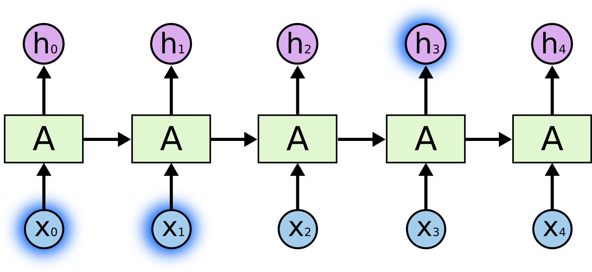
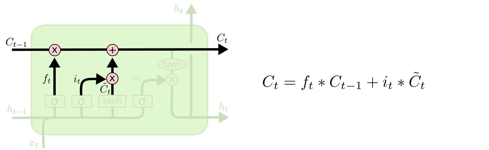

## 理解LSTM网络

### 循环神经网络(RNN)

人类不会每时每刻都重新开始思考。当你阅读这篇文章时，你会根据你对之前单词的理解来理解每个单词。你不要丢掉之前的内容，然后再从头开始思考。你的思考是有持久性的。

传统的神经网络不能做到这一点，这似乎是一个主要的缺点。例如，假设您想要对电影中每个点发生的事件进行分类。目前尚不清楚传统神经网络如何利用其对电影中先前事件的推理来得出后面的事件。

循环神经网络解决了这个问题。它们是带有循环的网络，允许信息持续存在。

在上图中，神经网络结构 A 通过一些输入 xt 并输出一个值 ht。循环允许信息从网络的一个步骤传递到下一个步骤。

这些循环使得循环神经网络看起来有点神秘。但是，如果你多想一点，事实证明它们与普通的神经网络并没有什么不同。可以将循环神经网络视为同一网络的多个副本，每个副本都将消息传递给后继者。考虑如果我们展开循环会发生什么：

这种类似链的性质表明，递归神经网络与序列和列表密切相关。它们是用于此类数据的神经网络的自然架构。 

他们肯定会被使用！在过去几年中，将RNN应用于各种问题取得了令人难以置信的成功：语音识别，语言建模，翻译，图像识别......这个列表还在继续。我将不展开讨论使用RNNs可以实现的惊人壮举，以及Andrej Karpathy的优秀博客文章，回归神经网络的不合理有效性。但他们真的很棒。

这些成功的关键在于使用“LSTM”，这是一种非常特殊的递归神经网络，对于许多任务而言，它比标准版本好得多。几乎所有基于递归神经网络的令人兴奋的结果都是用它们实现的。这篇论文将探讨这些LSTM。

### 长期依赖问题

RNN的一个优点是他们可能能够将先前信息连接到当前任务，例如使用先前的视频帧中的信息可能得出对当前帧的理解。如果RNN可以做到这一点，它们将非常有用。 

有时，我们只需要通过很近的信息来得到当前任务。例如，考虑一种语言模型，试图根据之前的单词预测下一个单词。如果我们试图预测 "the clouds are in the sky" 的最后一个词，我们不需要任何进一步的背景 - 很明显下一个词将是 "sky"。在这种情况下，如果相关信息与所需信息之间的距离很小，则RNN可以学习使用过去的信息。

但也有一些情况需要更多的背景知识。考虑尝试预测文本中的最后一个词“我在法国长大......我说流利的法语。”最近的信息表明，下一个词可能是一种语言的名称，但如果我们想缩小哪种语言，我们需要从更进一步的背景来看，法国的背景。相关信息之间距离很大是完全可能的。 

不幸的是，随着距离的扩大，RNN无法学习连接信息

理论上，RNN绝对能够处理这种“长期依赖性”。人类可以仔细挑选参数来解决这种形式的玩具问题。遗憾的是，在实践中，RNN似乎无法学习它们。 Hochreiter和Bengio等人对该问题进行了深入探讨。他们找到了一些非常根本的原因来说明为什么它可能很难。

值得庆幸的是，LSTM结构不存在这个问题！

### LSTM 网络

长短期记忆网络 - 通常只称为“LSTM” - 是一种特殊的RNN，能够学习长期依赖性。它们是由Hochreiter和Schmidhuber提出的.它在各种各样的问题上都表现得非常好，现在被广泛使用。

LSTM明确旨在解决长期依赖性问题。长时间记住信息实际上是他们的默认行为，而不是他们难以学习的东西！

所有递归神经网络都具有一个循环体。在标准RNN中，该循环体将具有非常简单的结构，例如单个tanh层。

LSTM也具有循环体，但循环体具有不同的结构。它由四个被称为门的结构组成，而不是一个简单的tanh，并以一种非常特殊的方式进行交互。

不要担心发生了什么的细节。我们将逐步介绍LSTM图。现在，让我们试着理解我们将要使用的符号。 

在上图中，每条线都携带一个整个向量，从一个节点的输出到其他节点的输入。粉色圆圈表示逐位运算，如矢量加法，而黄色框表示简单的神经网络结构。行合并表示连接，而行分叉表示其内容被复制，副本将转移到不同的位置。

### LSTM的核心理念

LSTM的关键是单元状态，水平线贯穿图的顶部。 

单元状态有点像传送带。它直接沿着整个链运行，只有一些次要的线性交互。信息很容易沿着它不变地流动。

LSTM能够通过被称为门的结构来移除或添加信息到单元状态。 

门是一种可选择通过信息的方式。它们由sigmoid神经网络层和逐位乘法运算组成。

sigmoid层输出0到1之间的数字，描述每个组件应该通过多少信息。值为零意味着“不让任何信息通过”，而值为1则意味着“让一切都通过！

LSTM具有三个这样的门，用于保护和控制单元状态。

### LSTM详细运算过程

LSTM的第一步是确定我们将从单元状态中丢弃哪些信息。该判定由称为“遗忘门层”的sigmoid层来进行。它输入ht-1和xt，并在单元状态Ct-1中为每个数字输出一个0到1之间的数字。 1代表“完全保留这个”，而0代表“完全丢弃这个”。

让我们回到之前提到的试图根据以前的所有单词预测下一个单词的那个语言模型的示例。在这样的问题中，单元状态可能包括当前受试者的性别，因此可以使用正确的代词。当我们看到一个新受试者时，我们想要忘记旧受试者的性别。

下一步是确定我们将在单元状态中存储哪些新信息。这有两个部分。首先，称为“输入门层”的sigmoid层决定我们将更新哪些值。接下来，tanh层创建可以添加到状态的新候选值Ct的向量。然后，我们将结合他们两个的结构来创建状态更新。

在我们的语言模型的例子中，我们想要将新受试者的性别添加到单元状态中，以替换我们需要忘记的旧受试者。

现在是时候将旧的单元状态Ct-1更新为新的单元状态Ct。之前的步骤已经决定要做什么，我们只需要实际做到这一点。

我们将旧状态逐位乘以ft，忘记我们之前的步骤中决定忘记的内容。然后我们把它和it * Ct相加。这是新的状态。

在语言模型的情况下，我们实际上丢弃了关于旧主题的性别的信息并添加新信息，正如我们在前面的步骤中所做的那样。

最后，我们需要决定我们要输出的内容。此输出将基于我们的单元状态，但将是被过滤的版本。首先，我们运行一个sigmoid层，它决定我们要输出的单元状态的哪些部分。然后，我们将单元状态通过tanh（将值变到-1和1之间）并将其乘以sigmoid门的输出，这样我们只输出我们决定输出的部分。

### 长期记忆的变种

到目前为止我所描述的是一个非常常规的LSTM。但并非所有LSTM都与上述相同。事实上，似乎几乎所有涉及LSTM的论文都使用略有不同的版本。差异很小，但值得一提。

### 结论

早些时候，我提到了人们使用RNN取得的显着成果。基本上所有这些都是使用LSTM实现的。对于大多数任务来说，它们确实工作得更好！ 

写下来作为一组方程式，LSTM看起来非常令人生畏。希望在这篇文章中逐步走过它们，使它们更加平易近人。 

LSTM是我们通过RNN实现的重要一步。很自然地想知道：还有另一个重要的步骤吗？研究人员普遍认为：“是的！下一步是它的注意力！“我们的想法是让RNN的每一步都从一些更大的信息集中选择信息。例如，如果您使用RNN创建描述图像的标题，则可能会选择图像的一部分来查看其输出的每个单词。实际上，徐等人做到这一点，如果你想探索注意力，它可能是一个有趣的起点！使用注意力已经取得了许多非常令人兴奋的结果，而且似乎还有很多事情即将来临......

注意力不是RNN研究中唯一激动人心的线索。例如，Kalchbrenner等人的Grid LSTMs似乎非常有希望。在生成模型中使用RNN的工作似乎也很有趣。过去几年对于递归神经网络来说是一个激动人心的时刻，即将到来的神经网络只会更加激动人心！

