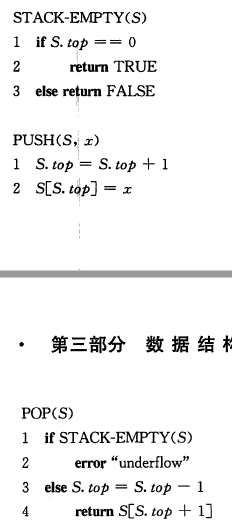
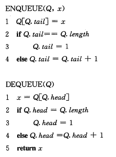

### 10.1 栈和队列

#### 10.1.1 简介

- 栈和队列都是动态集合，且在其上进行DELETE操作所移除的元素都是预先设定的

- 栈实现的是一种后进后出(last-in, first-out, LIFO)策略

- 队列实现的是一种先进先出(first-in, first-out, FIFO)策略

#### 10.1.2 栈

- 栈操作
    - `PUSH`
    - `POP`
    - `STACK-EMPTY`

- 可以用一个大小为`n`的数组来实现一个最多容纳`n`个元素的栈

- 如果试图对一个空栈执行弹出操作，则称为栈下溢(underflow)

- 如果试图对一个满栈执行压入操作，则成为栈上溢(overflow, 著名的stackoverflow)

- 栈操作的伪代码  

- 三种栈操作的执行时间都是`O(1)`

#### 10.1.3 队列

- 队列中的`INSERT`操作称为入队(`ENQUEUE`),`DELETE`操作称为出队(`DEQUEUE`)

- 利用长度为`n`的数组可以实现一个最多容纳`n-1`个元素的队列的一种方式

- 队列操作的伪代码  

- 两种队列操作的执行时间都是`O(1)`

