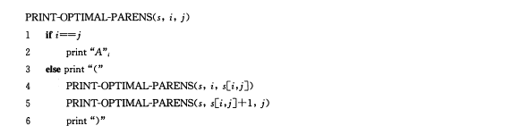

## 第15章 动态规划

**动态规划**(dynamic programming)与分治方法相似，都是通过组合子问题的解来求解原问题。分治方法是将问题划分为互不相交的子问题，递归地求解子问题，再将它们的解结合起来，求出原问题的解。与之相反，动态规划用于子问题重叠的情况，即不同的子问题具有公共的子子问题。动态规划算法对每个子问题只求解一次，将其解保存到一个表格中，从而无需每次求解一个子子问题时都重新计算，避免了这种不必要的计算工作

动态规划方法通常用来求解**最优化问题**。这类问题可以有很多可行解，每个解都有一个值，我们希望寻找具有最优值的解。我们称这个解为问题的一个最优解

我们按照如下4个步骤来设计一个动态规划算法

1. 刻画一个最优解的结构特征
2. 递归地定义最优解的值
3. 计算最优解的值，通常采用自底向上的方法
4. 利用计算出来的信息构建最优解

### 15.1 钢条切割

#### 问题描述

给定一段长度为n英寸的钢条和一个价格表p<sub>i</sub>(i = 1, 2, ..., n)，求切割钢条方案，使得销售收益r<sub>n</sub>最大

#### 问题分析

假设钢条的价格表如下


考虑n=4的情况，下图给出了n=4的所有可能的切割情况


我们用普通的加号来代表切割方案，例如: 将`7=2+2+3`表示为将长度7英寸的钢条切割为三段。

对于上述价格表样例，我们可以观察所有最优收益值r<sub>i</sub> (i = 1, 2, ..., 10)及对应的最初切割方案


第一个参数p<sub>n</sub>表示不切割，直接出售长度为 `n` 英尺的钢条的方案。其他 `n-1` 个参数对应另外 `n - 1`种方案: 对每个 `i = 1, 2, ..., n-1`，首先把钢条切割为长度为`i`和`n-i`的两段，接着求解这两段的最优切割收益r<sub>n</sub>和r<sub>n-1</sub>。由于无法预知哪种方案会获得最优收益，我们必须考察所有可能的`i`，选取其中收益最大者。如果直接出售原钢条会获得最大收益，我们当然可以选择不做任何切割。

注意到，为了求解规模为`n`的原问题，我们先求解形式完全相同，但规模更小的子问题。即当完成首次切割后，我们将两端钢条看成两个独立的钢条切割问题实例。我们通过组合两个相关子问题的最优解，并在所有可能的两段切割方案中提取组合收益最大者，构成原问题的最优解。我们称钢条切割问题满足最优子结构性质: 问题的最优解由相关子问题的最优解组合而成，而这些子问题可以独立求解

#### 解决方案1---使用自顶向下的递归方法求解

我们将钢条从左边切割下长度为 `i` 的一段，支队右边剩下的长度为 `n-i` 的一段继续进行切割(递归求解)，对左边的一段则不再进行切割。即问题分解的方式为：将长度为`n`的钢条分解为左边开始一段，以及剩余部分继续分解的结果。

这样，不做任何切割的方案就可以描述为: 第一段的长度为 `n`，收益为 p<sub>n</sub>，剩余部分长度为0，对应的收益为r<sub>0</sub> = 0。

公式如下


伪代码如下,它采用的是一种直接的自顶向下的递归方法
````
CUT-ROD(p, n)
    if n == 0
        return 0
    q = -∞
    for i = 1 to n
        q = max(q, p[i] + CUT-ROD(p, n-i))
    return q
````

一旦输入规模稍微变大，程序运行时间会变得相当长。每当将 `n` 增加 `1` ，程序运行时间差不多会增加 `1` 倍。

为什么`CUT-ROD`的效率如此差，原因是，`CUT-ROD`反复地用相同的参数值对自身进行递归调用，即它反复求解相同的子问题。如下图所示


此算法的时间复杂度为


#### 解决方案2---使用动态规划方法求解最优钢条切割问题

动态规划的思想如下所述。我们已经看到，朴素递归算法之所以效率很低，是因为它反复求解同样的子问题。因此，动态规划方法仔细安排求解顺序，对每个问题只求解一次，并将结果保存下来。如果随后再次需要此子问题的解，只需查找保存的结果，而不必重复计算。因此，动态规划方法是付出额外的内存空间来节省计算时间，是典型的时空权衡(time-memory-trade-off)的例子。而时间上的节省可能是非常巨大的:可能将指数时间的解转化为一个多项式时间的解。

动态规划有两种等价的实现方法

1. 第一种方法称为带备忘的自顶向下法(top-down with memorization)。此方法仍按照自然的递归形式编写过程，但过程会保存每个子问题的解(通常保存在一个数组或散列表中)。当需要一个子问题的解时，过程首先检查是否已经保存过此解。如果是，则直接返回保存的值，从而节省了计算时间；否则，按通常方式计算这个子问题。我们称这个递归过程是带备忘的(memoized)，因为它记住了之前已经计算出的结果。

2. 第二种方法称为自底向上法(bottom-up method)。这种方法一般需要恰当定义子问题"规模"的概念，使得任何子问题的求解都只依赖于"更小的"子问题的求解。因此我们可以将子问题按规模排序，按照由小至大的顺序进行求解。当求解某个子问题时，它所依赖的那些更小的子问题都已求解完毕，结果已经保存。每个子问题只需求解一次，当我们求解它时，它的所有前提子问题都已求解完成

下面给出的是带备忘的自顶向下法的伪代码
````
MEMOIZED-CUT-ROD(p,n)
    let r[0..n] be a new array
    for i = 0 to n
        r[i] = -∞
MEMORIZED-CUT-ROD-AUX(p,n,r)
    if r[n] >= 0
        return r[n]
    if n == 0
        q = 0
    else q = -∞
        for i = 1 to n
            q = max(q, p[i] + MEMOIZED-CUT-ROD-AUX(p, n-i, r))
    r[n] = q
    return q
````

自底向上版本更为简单
````
BOTTOM-UP-CUT-ROD(p, n)
    let r[0..n] be a new array
    r[0] = 0
    for j = 1 to n
        q = -∞
        for i = 1 to j
            q = max(q, p[i] + r[j - i])
        r[j] = q
    return r[n]
````
自底向上版本采用子问题的自然顺序；若 `i<j`，则规模为 `i` 的子问题比规模为 `j` 的子问题"更小"。因此，过程依次求解规模为 `j = 0, 1, ..., n` 的子问题

此算法的时间复杂度为 Θ(n<sup>2</sup>)

#### 子问题图

当思考一个动态规划问题时，我们应该弄清所涉及的子问题及子问题之间的依赖关系

问题的子问题图准确地表达了这些信息，下图显示了 `n=4` 时钢条切割问题地子问题图。
它是一个有向图，每个顶点唯一地对应一个子问题。若求子问题x地最优解时需要直接用到子问题y地最优解，那么在子问题图中就会有一条从子问题x的定点到子问题y的定点的有向边。


自底向上的动态规划方法处理子问题图中顶点的顺序为: 对于一个给定的子问题`x`，在求解它之前求解邻接它的子问题`y`。对于任何子问题，直至它依赖的所有子问题均已求解完成，才会求解它

子问题图`G=(V, E)`的规模可以帮我们确定动态规划算法的运行时间。由于每个子问题只求解一次，因此算法运行时间等于每个子问题求解时间之和。通常，一个子问题的求解时间与子问题图中对应顶点的度(出射边的数目)成正比，而子问题的数目等于子问题图的顶点数。因此，通常情况下，动态规划算法的运行使劲按与顶点与边的数量呈线性关系

### 15.2 矩阵链乘法

#### 问题描述

给定一个 `n` 个矩阵的序列(矩阵链)(A<sub>1</sub>),我们希望计算它们的乘积如下

A<sub>1</sub>A<sub>2</sub>...A<sub>n</sub>

由于矩阵乘法满足结合律，因此任何加括号的方法都会得到相同的计算结果。我们称有如下性质的矩阵乘积链为完全括号化的(fully parenthesized): 它是单一矩阵，或者是两个完全括号化的矩阵乘积链的积，且已外加括号。

例如，如果矩阵链为(A1, A2, A3, A4)，则共有5种完全括号化的矩阵乘积链

(A1(A2(A3A4)))  
(A1((A2A3)A4))  
((A1A2)(A3A4))  
((A1(A2A3))A4)  
(((A1A2)A3)A4)  

对矩阵链加乘法的方式会对矩阵运算的代价产生重大影响

两个矩阵 `A` 和 `B` 只有相容(compatible)，即 `A` 的列数等于 `B` 的行数时，才能相乘。如果 `A` 是 `p * q` 的矩阵,`B` 是 `q * r` 的矩阵，那么乘积 `C` 是 `p * r` 的矩阵。计算 `C` 所需时间由标量乘法的次数决定，即 `p * q * r`

以矩阵链 `(A1, A2, A3)` 相乘为例，来说明不同的加括号方式会导致不同的计算代价。假设三个矩阵的规模分别是 `10 * 100`、`100 * 5`、 `5 * 50`。如果按照 `((A1A2)A3)` 的顺序计算，为计算 `A1A2` ，需要做 `10 * 100 *5` 次标量乘法，再与A3相乘又需要做 `10 * 5 * 50` 次标量乘法，一共需要`7500`次。假如按照 `((A1)A2A3)` 的顺序，需要 `75000` 次

矩阵链乘法问题(matrix-chain multiplication problem): 给定n个矩阵的链 `(A1, A2, ..., An)`, 矩阵`Ai` 的规模是p<sub>i-1</sub> * p<sub>i</sub>(1<=i<=n)，求完全括号化方案，使得计算乘积 `A1A2...An` 所需标量乘法次数最少

#### 计算括号化方案的数量

首先说明穷举所有可能的括号化方案不会产生一个高效的算法

对于一个 `n` 个矩阵的链，令 `P(n)` 表示可供选择的括号化方案的数量。当 `n=1` 时，由于只有一个矩阵，因此只有一种完全括号化方案。当 `n>=2` 时，完全括号化的矩阵乘积可描述为两个完全括号化的部分积相乘的形式，而两个部分积的划分点在第 `k` 个矩阵和第 `k+1` 个矩阵之间，`k` 为 `1, 2, ...., n - 1`中的任意一个值。可以得到递归式


经过证明，这种方法的时间复杂度为 Ω(2<sup>n</sup>)。因此通过暴力搜索穷尽所有可能的括号化方案来寻求最优方案，是一个糟糕的策略

#### 应用动态规划方法

我们按照如下4个步骤来进行

1. 刻画一个最优解的结构特征(寻找最优子结构)
2. 递归地定义最优解的值
3. 计算最优解地值，通常采用自底向上的方法
4. 利用计算出的信息构建一个最优解

##### 步骤1 : 最优括号化方案的结构特征(寻找最优子结构)

动态规划的第一步是寻找最优子结构，然后就可以利用这种子结构从子问题的最优解构造原问题的最优解

下面给出本问题的最优子结构。假设`Ai Ai+1 ... Aj`的最优括号化方案的分割点在 `Ak` 和 `Ak+1` 之间。那么继续对子链`Ai Ai+1 ... Ak`和`Ak+1 ... Aj`进行括号化时，我们应该直接采用独立求解它时所得的最优方案

我们已经看到，一个非平凡的矩阵链乘法问题的实例的任何解都需要划分链，而任何最优解都是由子问题实例的最优解构成的。因此，为了构建一个矩阵链乘法问题实例的最优解，我们可以将问题划分为两个子问题(`Ai Ai+1 ... Ak`和`Ak+1 ... Aj`的最优括号化问题)，求出子问题实例的最优解，然后将子问题的最优解组合起来。我们必须保证在确定分割点时，已经考察了所有可能的划分点，这样就可以保证不会遗漏最优解

##### 步骤2 : 一个递归求解方案(递归地定义最优解的值)

下面用子问题的最优解来递归地定义原问题最优解地代价。对矩阵链乘法问题，我们可以将对所有 `1<=i<=j<=n`确定`Ai Ai+1 ... Aj`的最小代价括号化方案作为子问题。令`m[i, j]`表示计算矩阵 A<sub>i * j</sub>所需标量乘法次数的最小值，那么。原问题的最优解---计算A<sub>1 * n</sub>所需的最低代价就是`m[1, n]`

我们可以递归地定义`m[i, j]`如下。

对于 i=j 时的平凡问题，矩阵链只包含唯一地矩阵A<sub>i * i</sub> = A<sub>i</sub>，不需要做任何标量乘法计算。所以，对所有 `i = 1, 2, ..., n` 来说，`m[i, i] = 0`。

若 `i<j`，我们利用步骤1中得到的最优子结构来计算`m[i, j]`。我们假设`Ai Ai+1 ... Aj`的最优括号化方案的分割点在矩阵`Ak`和`Ak+1`之间，其中`i<=k<j`。那么，`m[i, j]`就等于计算`Ai * k`和`Ak+1 * j`的代价加上两者相乘的代价的最小值。由于矩阵Ai的大小为 `pi-1 * pi`，易知`Ai * k`和`Ak+1 * j`相乘的代价为`pi-1 * pk * pj`次标量乘法运算。因此我们得到


上述递归公式假定最优分割点 `k` 是已知的，但实际上不知道。不过 `k` 只有 `j-i` 种可能的取值。我们只需检查这`j-i`种情况，找出最优者即可。一次迭代求解公式变为


##### 步骤3 : 计算最优代价

现在，我们可以很容易地基于上面的递归公式写出一个递归算法，来计算 `A1A2...An` 相乘的最小代价 `m[1, n]` 。此递归算法是指数时间的，并不比暴力搜索算法好

此递归算法会在递归调用中多次遇到同一个子问题，这种子问题重叠的性质是应用动态规划的另一个标志

我们采用自底向上表格法来计算最优代价。假定矩阵Ai的规模为 `pi-1 * pi(i = 1, 2, ..., n)`。它的输入是一个序列`p=(p0, p1, ..., pn)`，其长度为`p.length = n + 1`。过程用一个辅助表`m[1..n, 1..n]`来保存代码`m[i, j]`，用另一个辅助表`s[1..n-1, 2..n]`记录最优值`m[i, j]`对应的分割点`k`。我们就可以利用表s构建最优解。

为了实现自底向上的方法，我们必须确定计算 `m[i, j]` 时需要访问哪些其他表项。`m[i, j]` 的值只依赖于那些少于 `j-i+1` 个矩阵链相乘的最优计算代价。因此算法应该按照长度递增的顺序求解矩阵链括号化问题，并按对应的顺序填写表`m`

````
MATRIX-CHAIN-ORDER(p)
    n = p.length - 1
    let m[1..n,1..n] and s[1..n-1, 2..n]be new tables
    for i = 1 to n
        m[i, i] = 0
    for l = 2 to n
        for i = 1 to n - l + 1
        j = i + l - 1
        m[i, j] = ∞
        for k = i to j - 1
            q = m[i, k] + m[k+1, j] + p[i - 1] * p[k] * [pj]
        if q < m[i, j]
            m[i, j] = q
            s[i, j] = k
    return m and s
````

下图展示了对一个长度为6的矩阵链执行此算法的过程


简单分析`MATRIX-CHAIN-ORDER`的嵌套循环结构，可以看到算法的运算时间为O(n<sup>3</sup>)。

##### 步骤4: 构建最优解

我们可以根据表s记录的信息来递归地恢复最优解，算法如图


### 15.3 动态规划原理

在本节我们将关注适合应用动态规划方法求解的最优化问题应该具备的两个要素: 最优子结构和子问题重叠

#### 最优子结构

用动态规划问题求解最优化问题的第一步就是刻画最优解的结构。如果一个问题的最优解包含其子问题的最优解，我们就称此问题具有最优子结构性质。因此，某个问题是否适合应用动态规划算法，它是否具有最优子结构性质是一个好结构(当然，具有最优子结构性质也可能意味着适合应用贪心策略)

本章前面的两个问题都具有最优子结构性质。在15.1中，我们观察到，长度为 `n` 的钢条的最优切割方案是由第一次切割后得到的两端钢条的最优切割方案组成的。在15.2中，我们看到 `Ai Ai+1 ... Aj` 的最优括号化方案首先在 `Ak` 和 `Ak+1`之间进行划分，然后对 `Ai Ai+1 ... Ak` 和 `Ak+1 Ak+2 ... Aj`继续进行最优括号化

发掘最优子结构性质的过程，遵循如下通用模式

1. 证明问题最优解的一个组成部分是做出一个选择，例如，选择钢条第一次切割位置，选择矩阵链的划分位置等，做出这次选择会产生一个或多个待解决的子问题

2. 对于一个给定问题，在其可能的第一步选择中，你假定已经知道哪种选择才会得到最优解，你现在并不关心这种选择具体是如何得到的，只是假定已经知道了这种选择

3. 给定可获得最优解的选择后，你确定这次选择会产生哪些子问题，以及如何最好地刻画子问题空间

4. 利用"剪贴-粘贴"(cut-and-paste)技术证明: 作为构成子问题最优解的组成部分，每个子问题的解就是它本身的最优解。证明这一点可以用反证法: 假定子问题的解不是其自身的最优解，那么我们就可以从原问题的解中"剪切"掉哪些非最优解，将最优解"粘贴"进去，从而得到原问题一个更优的解，这与最初的解是原问题最优解的前提假设矛盾。

对于不同问题领域，最优子结构的不同体现在两个方面:

1. 原问题的最优解中涉及多少个子问题，以及

2. 在确定最优解使用哪些子问题时，我们需要考察多少种选择

在钢条切割问题中，长度为 `n` 的钢条的最优切割方案仅仅使用一个子问题(长度为`n - i` 的钢条的最有切割)，但必须考察 `i` 的 `n` 种不同取值，来确定哪一个会产生最优解。 `Ai Ai+1 ... Aj` 的矩阵链乘法问题种，最优解使用两个子问题，我们需要考察 `j - i` 种情况。对于给定的矩阵链划分位置----矩阵`Ak`，我们需要求解两个子问题---- `Ai Ai+1 ... Ak`和`Ak+1 Ak+2 .. Aj`的括号化方案----而且两个子问题都必须求解最优方案。一旦确定了子问题的最优解，就可以在 `j - i` 个候选的 `k` 中选取最优者

我们可以用子问题的总数和每个子问题需要考察多少种选择这两个因素来粗略分析动态规划算法的运行时间。对于钢条切割问题，共有 Θ(n)个子问题，每个子问题最多需要考察 n 种选择，因此运行时间为O(n<sup>2</sup>)

#### 一些微妙之处----子问题无关性

为什么最长简单路径问题的子结构与最短路径有这么大的差别？原因在于，虽然最长路径问题和最短路径问题的解都用到了两个子问题，但两个最长简单路径子问题是相关的，而两个最短路径子问题是无关的。这里，子问题无关的含义是，同一个原问题的一个子问题的解不影响另一个子问题的解。换个角度来开，我们所面临的困境就是：求解一个子问题时用到了某些资源，导致这些资源在求解其他子问题时不可用。

#### 重叠子问题

适合用动态规划方法求解的最优化问题应该具备的第二个性质是子问题空间必须足够小，即问题的递归算法会反复求解相同的子问题，而不是一直产生新的子问题，一般来讲，不同子问题的总数是输入规模的多项式函数为好。如果递归算法求解相同的子问题，我们就称最优化问题具有重叠子问题性质。与之相对的，适合用分治方法求解的问题通常在递归的每一步都生成一个全新的子问题。动态规划算法通常这样利用重叠子问题性质: 对每个子问题求解一次，将解存在一张表种，当再次需要这个子问题时，直接查表，每次查表代价为常数时间

#### 重构最优解

从实际考虑，我们通常将每个子问题所作的选择存在一个表中，这样就不必根据代价值来重构这些信息

#### 备忘

带备忘的递归算法为每个子问题维护一个表项来保存它的解。每个表项的初值设为一个特殊值，表示尚未填入子问题的解。当递归调用过程第一次遇到子问题时，计算其解，并存入对应表项，随后每次遇到同一个子问题，只是简单地查表，返回其解

为求解矩阵链乘法问题，我们既可以用带备忘地自顶向下动态规划算法，也可以用自底向上的动态规划算法，时间复杂度均为 O(n<sup>3</sup>)。两个方法都利用了重叠子问题性质。不同的子问题一共只有Θ(n<sup>2</sup>)个，对每个子问题，两种方法都只计算一次。而没有备忘机制的自然递归算法的运行时间是指数阶，因为它会反复求解同样的子问题

通常情况下，如果每个子问题必须至少求解一次，自底向上动态规划算法会比自顶向下备忘算法快(都是O(n<sup>3</sup>)时间，相差一个常量系数)，因为自底向下算法没有递归调用的开销，表的维护开销也更小。

相反，如果子问题空间中的某些子问题完全不必求解，备忘方法就体现其优势了，因为它只会求解那些绝对必要的子问题

### 15.4 最长公共子序列

#### 问题定义

一种衡量DNA串S<sub>1</sub>和S<sub>2</sub>的相似度的方式是：寻找第三个串S<sub>3</sub>，它的所有碱基也都出现在S<sub>1</sub>和S<sub>2</sub>中，且在三个串中出现的顺序都相同，但在S<sub>1</sub>和S<sub>2</sub>中不要求连续出现，可以找到的S<sub>3</sub>越长，就可以认为S<sub>1</sub>和S<sub>2</sub>的相似度越高, 这种相似度概念就是最大公共子序列问题。

一个给定序列的子序列，就是将给定序列中零个或多个元素去掉之后得到的结果。其形式化定义如下: 给定一个序列 X = (x<sub>1</sub>, x<sub>2</sub>, ..., x<sub>m</sub>),另一个序列 Z = (z<sub>1</sub>, z<sub>2</sub>, ..., z<sub>k</sub>)满足如下条件时称为X的子序列(subsequence)，即存在一个严格递增的X的下标序列(i<sub>1</sub>, i<sub>2</sub>, ..., i<sub>k</sub>),对所有j = 1, 2, ...k,满足 x<sub>i<sub>j</sub></sub> = z<sub>j</sub>。

最大公共子序列问题(longest-common-subsequence problem)给定两个序列 X = (x<sub>1</sub>, x<sub>2</sub>, ..., x<sub>m</sub>) 和 Y = (y<sub>1</sub>, y<sub>2</sub>, ..., y<sub>n</sub>),求 X 和 Y 长度最长的公共子序列。

#### 步骤1: 刻画最大公共子序列的特征

如下面的定理所示，LCS问题具有最优子结构性质。子问题的自然分类对应两个输入序列的"前缀"对。

定理 15.1 (LCS的最优子结构) 令 `X=<x1, x2, ..., xm>` 和 `Y=<y1, y2, ..., yn>` 为两个序列，`Z=<z1, z2, ..., zk>` 为 `X` 和 `Y` 的任意LCS
1. 如果 x<sub>m</sub> = y<sub>n</sub>，则z<sub>k</sub>=x<sub>m</sub>=y<sub>n</sub>,且Z<sub>k-1</sub>是X<sub>m-1</sub>和Y<sub>n-1</sub>的一个LCS
2. 如果 x<sub>m</sub> != y<sub>n</sub>，那么z<sub>k</sub> != x<sub>m</sub>,意味着Z是X<sub>m-1</sub>和Y的一个LCS
3. 如果 x<sub>m</sub> != y<sub>n</sub>，那么z<sub>k</sub> != y<sub>n</sub>,意味着Z是X和Y<sub>n-1</sub>的一个LCS

定理15.1告诉我们，两个序列的LCS包含两个序列前缀的LCS。因此，LCS问题具有最优子结构性质

#### 步骤2: 一个递归的求解方案

定理 15.1 意味着，在求 `X=<x1, x2, ..., xm>` 和 `Y=<y1, y2, ..., yn>` 的一个LCS时，我们需要求解一个或两个子问题。如果 x<sub>m</sub> = y<sub>n</sub>, 我们应该求解X<sub>m-1</sub>和Y<sub>n-1</sub>的一个LCS。将 x<sub>m</sub> = y<sub>n</sub> 追加到一个LCS的末尾，就得到 X 和 Y 的一个LCS。如果 x<sub>m</sub> != y<sub>n</sub>，我们必须求解两个子问题，求 X<sub>m-1</sub> 和 Y 的一个LCS与 X 和 Y<sub>n-1</sub> 的一个LCS。两个LCS较长者即为 X 和 Y 的一个LCS。

可以看出LCS问题的重叠子问题性质。为了求  X 和 Y 的LCS，要求 X<sub>m-1</sub> 和 Y 的一个LCS与 X 和 Y<sub>n-1</sub> 的LCS。但者几个子问题都包含求X<sub>m-1</sub>和Y<sub>n-1</sub>的LCS。

设计LCS问题首先要建立最优解的递归式，如下


LCS问题是一个根据条件排除子问题的动态规划算法

#### 步骤3: 计算LCS的长度

````
LCS-LENGTH(X, Y)

m = X.length
n = Y.length
let b[1..m, 1..n] and c[0..m, 0..n] be new table
for i = 1 to m
    c[i, 0] = 0
for j = 0 to n
    c[0, j] = 0
for i = 1 to m
    for j = 1 to n
        if xi == yi
            c[i, i] = c[i - 1, j - 1] + 1
            b[i, j] = "↖"
        elseif c[i - 1, j] >= c[i, j - 1]
            c[i, j] = c[i - 1, j]
            b[i, j] = "↑"
        else 
            c[i, j] = c[i, j - 1]
            b[i, j] = "←"
````
过程LCS-LENGTH接受两个序列  `X=<x1, x2, ..., xm>` 和 `Y=<y1, y2, ..., yn>` 作为输入。它将 `c[i, j]` 的值保存在表 `c[0..m, 0..n]`中，并按行主次序(row-major order)计算表项(即首先由左至右计算c的第一行，然后计算第二行，依次类推)。过程还维护一个表`b[0..m, 0..n]`，帮助构建最优解。`b[i, j]` 指向的表项对应计算 `c[i, j]` 时所选择的子问题最优解。过程返回表b和表c, `c[m, n]` 保存了 `X` 和 `Y` 的LCS的长度

#### 步骤4: 构造LCS

略

#### 算法改进

略