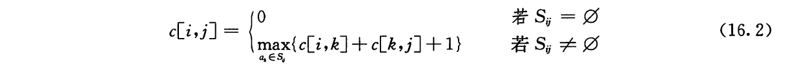
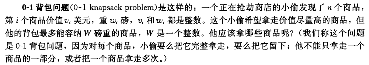
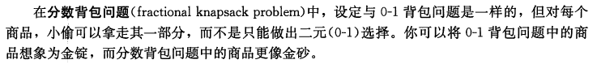

## 第16章 贪心算法

对于许多最优化问题，使用动态规划算法来求最优解有些杀鸡用牛刀了，可以使用更简单、更高效的算法。贪心算法(greedy algorithm)就是这样的算法，它在每一步都做出当时看起来最佳的选择。它总是做出局部最优的选择，寄希望这样的选择能导致全局最优解

贪心算法并不保证得到最优解，但对很多问题确实可以求得最优解

有很多利用贪心策略设计的算法，包括最小生成树(minimum-spanning-tree)算法、单源最短路径算法的Dijkstra算法，以及集合覆盖问题的Chvatal贪心启发式算法

### 16.1 活动选择问题

#### 问题描述

假定有一个 n 个活动(activity)的集合 S = {a<sub>1</sub>, a<sub>2</sub>, ..., a<sub>n</sub>}，这些活动使用同一个资源，而这个资源在某个时刻只能供一个活动使用。每个活动 a<sub>i</sub> 都有一个开始时间 s<sub>i</sub> 和一个结束时间 f<sub>i</sub>。

如果两个活动 a<sub>i</sub> 和 a<sub>j</sub> 满足 [s<sub>i</sub>, f<sub>i</sub>) 和 [s<sub>j</sub>, f<sub>j</sub>) 不重叠，则称它们是兼容的。

在活动选择问题中，我们希望选出一个最大兼容活动集。 

假定活动已经按照时间的单调递增顺序排序

f<sub>1</sub> <= f<sub>2</sub> <= ... <= f<sub>n-1</sub> <= f<sub>n</sub>

#### 活动选择问题的最优子结构

令 S<sub>ij</sub> 表示在 a<sub>i</sub> 结束之后开始，在 a<sub>j</sub> 开始之前结束的那些活动的集合。假定 A<sub>ij</sub> 是 S<sub>ij</sub> 的一个最大的相互兼容的活动子集，且包含活动 a<sub>k</sub>。由于最优解包含活动 a<sub>k</sub> ，我们得到了两个子问题: 寻找 S<sub>ik</sub> 中的最大兼容活动子集(在 a<sub>i</sub> 结束之后开始，在 a<sub>k</sub> 开始之前结束的活动)以及寻找 S<sub>kj</sub> 中的最大兼容活动子集(在 a<sub>k</sub> 结束之后开始，在 a<sub>j</sub> 开始之前结束的活动)。可得 |A<sub>ij</sub>| = |A<sub>ik</sub>| + |A<sub>kj</sub>| + 1 个活动

我们容易用剪切-粘贴法证明最优解A<sub>ij</sub>必然包含两个子问题S<sub>ik</sub>和S<sub>kj</sub>的最优解

可以得到如下递归式



于是接下来可以设计一种带备忘机制的递归算法或者使用自底向上法填写表项

#### 贪心选择

对于活动选择问题，什么是贪心选择？ 直觉告诉我们，应该选择S中最早结束的活动，因为它剩下的资源可供它之后尽可能多的活动使用

当做出贪心选择之后，只剩下一个子问题需要我们求解: 寻找在 a<sub>1</sub> 结束后开始的活动

令 S<sub>k</sub> = { a<sub>i</sub> ∈ S: s<sub>i</sub> >= f<sub>k</sub>}为在 a<sub>k</sub>结束后开始的任务集合。当我们做出贪心选择，选择了 a<sub>1</sub> 之后，剩下的 S<sub>1</sub> 是唯一需要求解的子问题

可以证明我们的直觉是正确的，证明过程略

贪心算法通常都是自顶而下的设计: 做出一个选择，然后求解剩下的那个子问题，而不是自底向上地求解出很多子问题，然后再做出选择

#### 递归贪心算法

过程 `RECURSIVE-ACTIVITY-SELECTOR` 的输入为两个数组 s 和 f，表示活动的开始和结束时间，下标 k 指出要求解的子问题 S<sub>k</sub>，以及问题规模 n 。它返回 S<sub>k</sub> 的一个最大兼容活动集。我们假定输入的 n 个活动已经按照结束时间的单调递增顺序排序好。为了方便算法初始化，我们添加了一个虚拟活动 a<sub>0</sub>，其结束时间为 f<sub>0</sub> = 0，这样子问题 S<sub>0</sub> 就是完整的活动集S。求解原问题即可调用 `RECURSIVE-ACTIVITY-SELECTOR(s, f, 0, n)`

````
RECURSIVE-ACTIVITY-SELECTOR(s, f, k, n)
    m = k + 1
    while m <= n and s[m] < f[k]
        m += 1
    if m <= n
        return { am } ∪ RECURSIVE-ACTIVITY-SELECTOR(s, f, m, n)
    else 
        return ∅
````

`RECURSIVE-ACTIVITY-SELECTOR` 算法运行时间 `Θ(n)`

#### 迭代贪心算法

我们可以很容易地将算法转换为迭代形式。过程 `RECURSIVE-ACTIVITY-SELECTOR` 几乎就是"尾递归": 它以一个对自身地递归调用再接一次并集操作结尾。将尾递归过程改为迭代过程是很直接的

过程 `GREEDY-ACTIVITY-SELECTOR` 是过程 `RECURSIVE-ACTIVITY-SELECTOR` 的一个迭代版本

````
GREEDY-ACTIVITY-SELECTOR(s, f)
    n = s.length
    A = {a1}
    k = 1
    for m = 2 to n
        if s[m] >= f[k]
            A = A U {am}
            k = m
    return A
````

`GREEDY-ACTIVITY-SELECTOR` 算法运行时间 `Θ(n)`


### 16.2 贪心算法原理

贪心算法通过做出一系列选择来求出问题的最优解。在每个决策点，它做出在当时看起来最佳的选择

我们可以按如下步骤设计贪心算法
1. 将最优化问题转化为这样的形式: 对其做出一次选择后，只剩下一个子问题需要求解
2. 证明做出贪心选择后，原问题总是存在最优解，即贪心选择总是安全的
3. 证明做出贪心选择后，剩余的子问题满足性质，其最优解与贪心选择组合即可得到原问题的最优解

在每个贪心算法之下，几乎总有一个更繁琐的动态规划算法

#### 贪心选择性质

贪心算法的一个关键要素是，贪心选择性质。即，我们可以通过做出局部最优选择来构建全局最优解。当进行选择时，我们直接选择做出在当前问题中看起来最优的选择，而不必考虑子问题的解。

贪心算法与动态规划

- 在动态规划和贪心算法中，每个步骤都要进行一次选择

- 但动态规划中，选择通常依赖于子问题的选择。因此，我们通常以一种自底向上的方式求解动态规划问题，先求解较小的子问题，然后是较大的子问题

- 在贪心算法中，我们总是做出当时看来最佳的选择，然后求解剩下的唯一的子问题。贪心算法进行选择时可能依赖之间做出的选择，但不依赖任何将来的选择或是子问题的解

- 贪心算法在进行第一次选择之前不求解任何子问题

但是我们必须证明每个步骤做出贪心算法能生成全局最优解

#### 最优子结构

如果一个问题的最优解包含其子问题的最优解，则称此问题具有最优子结构性质

当应用贪心算法时，我们通常使用更为直接的最优子结构。如前所述，我们可以假定，通过对原问题应用贪心选择即可得到子问题。我们真正要做的全部工作就是论证: 将子问题的最优解与贪心选择组合在一起就能生成原问题的最优解。这种方法隐含地对子问题使用了数学归纳法，证明了在每个步骤进行贪心选择会生成原问题的最优解

#### 贪心对动态规划

为了说明贪心算法和动态规划之间的细微差别，我们研究一个经典最优化问题的两个变形

0-1 背包问题的描述如下




分数背包问题的描述如下



我们用贪心策略可以求解分数背包问题，而不能求解 0-1 背包问题。为了求解分数背包问题，我们首先计算每个商品的每磅价值 v/w。遵循贪心策略，小偷首先尽量多地拿走每磅价值最高的商品。如果该商品已全部拿走而背包尚未满，他继续尽量多地拿走每磅价值第二高的产品，依次类推，直至达到重量上限W

这种贪心算法的运行时间为 `O(nlgn)`

拿走商品1的策略对 0-1 背包问题无效是因为小偷无法装满背包，空闲空间降低了方案的有效每磅价值