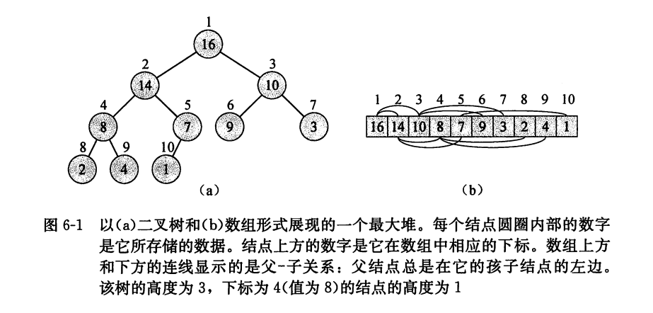
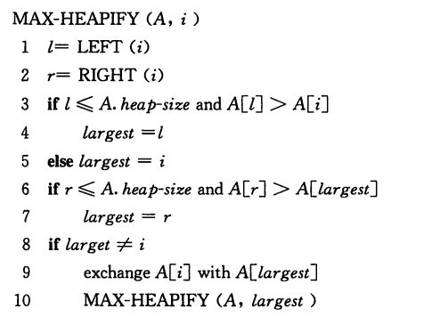
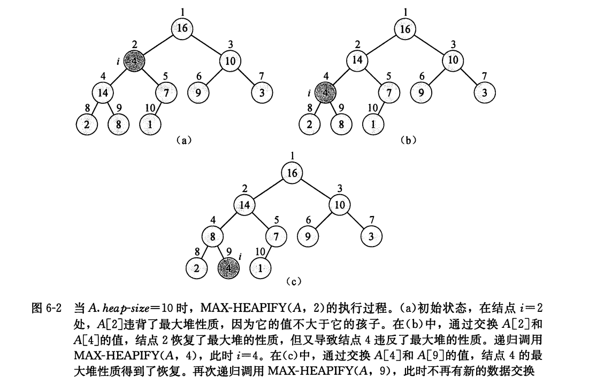
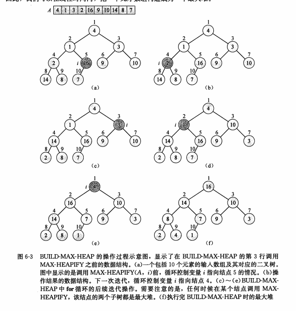
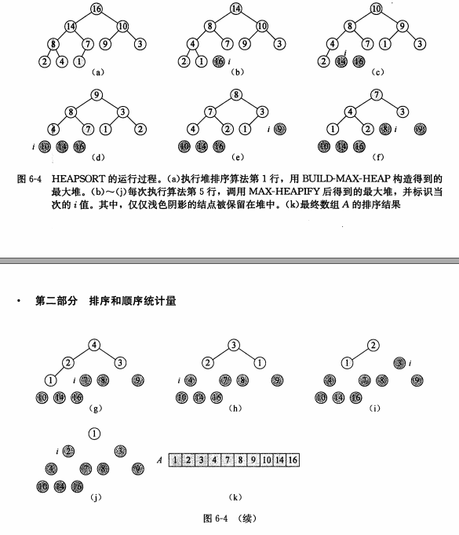

## 第六章 堆排序

- 与归并排序相同，堆排序的时间复杂度为O(nlgn)

- 与插入排序相同，堆排序同样具有空间原址性：任何时候都只需要常数个额外的元素空间存储临时数据
---
### 6.1 堆

- 堆的简介
    - 堆被存储在一个数组中，可近似看成是完全二叉树
    - 除了最底层外，该树是完全充满的，而且是从左到右填充
    - 如图
    

- 堆的分类
    - 最大堆和最小堆
    - 在这两种堆中，节点的值都要满足堆的性质，但一些细节定义则有所差异

- 最大堆性质
    - 在最大堆中，除了根以外的所有结点`i`都要满足: `A[PARENT(i)] >= A[i]`
    - 因此，堆中的最大元素存放在根节点

- 高度
    - 堆中节点的高度：该节点到叶节点最长简单路径上**边**的数目
    - 堆的高度：根节点的高度

- 对于堆的一些基本操作
    - MAX-HEAPIFY过程：其时间复杂度为O(lgn)，它是维护最大堆性质的关键
    - BUILD-MAX-HEAP过程：具有线性时间复杂度，功能是从无序的输入数据数组中构造一个最大堆
    - HEAPSORT过程：时间复杂度为O(nlgn)，功能是对一个数组进行原址排序
    - MAX-HEAP_INSERT、HEAP-EXTRACT-MAX、HEAP-INCREASE-KEY和HEAP-MAXIMUM过程：时间复杂度为O(lgn),功能是实现一个优先队列

---

### 6.2 维护堆的性质

- **MAX-HEAPIFY**简介
    - MAX-HEAPIFY用来维护最大堆性质
    - 它的输入是一个数组 `A` 和一个下标 `i`
    - 我们假定 `A[i]` 的值有可能小于它的孩子，但是节点 `i` 的左右子树都是最大堆
    - MAX-HEAPIFY的目的是让以`i`节点为根的子树重新遵循最大堆性质

- 伪代码描述
    

- 代码实现: `max_heapify` (python实现)
    ````py
    def max_heapify(i):
        # print("max_heapify: ", i)
        l = left(i)
        r = right(i)
        if l <= heap_size and arr[l] > arr[i]:
            largest = l
        else:
            largest = i
        if r <= heap_size and arr[r] > arr[largest]:
            largest = r
        if largest != i:
            arr[i], arr[largest] = arr[largest], arr[i]
            max_heapify(largest)
    ````

- 图片描述
    

- 文字描述
    1. 在程序的每一步中，从`A[i]`、`A[LEFT(i)]`、`A[RIGHT(i)]`中选出最大的，存储在largest中
    2. 如果A[i]是最大的，那么以i为根节点的子树已经是最大堆了，程序结束
    3. 否则，最大元素是i的某个孩子节点，则交换`A[i]`和`A[largest]`的值
    4. 在交换后，需要对该子树递归调用`MAX-HEAPIFY`

- 运行时间分析
    - 递归式
    
    - 运行时间:T(n) = O(lgn)

---

### 6.3 建堆

- 思路
    - 我们可以用自底向上调用 `max_heapify`，把一个数组转换为最大堆
    - 因为堆中从 `A(n/2 + 1, n)` 的元素都是树的叶节点，对于这些节点不需要调用 `max_heapify` 过程

- 代码实现： `build_max_heap`(python实现)
    ````py
    def build_max_heap():
        for i in range(int(len_arr() / 2), 0, -1):
            print(i)
            max_heapify(i)
    ````

- 时间复杂度 : O(n)，证明见书 `P88`

- 例子如图  


### 6.4 堆排序算法

- 思路 
    1. 首先，利用`build_max_heap`将输入数组建成最大堆
    2. 因为根节点保存的是最大元素，所以将根节点与`A[n]`互换
    3. 从堆中去掉节点n(通过减小heap_size的方式)
    4. 调用`max_heapify`保持堆的性质
    5. 重复执行步骤2，3，4，直到堆的大小降为`1`

- 代码实现: `heap_sort`(Python实现)
    ````py
    def heap_sort():
    global heap_size
    build_max_heap()
    for i in range(len_arr(), 1, -1):
        arr[i], arr[1] = arr[1], arr[i]
        heap_size -= 1
        max_heapify(1)
    ````

- 时间复杂度
    - O(nlgn)
    - 因为每次调用`build_max_heap`的时间复杂度为O(n)，而n-1次调用MAX-HEAPIFY，每次时间为O(lgn)

- 例子如图


### 6.5 优先队列

#### 6.5.1 优先队列的性质

- 简介
    - 优先队列是一种维护由一组元素构成的集合S的数据结构
    - 其中的每个元素都有一个相关的值，称为关键字(key)

- 最大优先队列支持的操作
    - `insert(S, x)` : 把元素 `x` 插入到集合 `S` 中
    - `maximum(S)` : 返回S中具有最大键字的元素
    - `extract_max(S)` : 去掉并返回S中的具有最大键字的元素
    - `increase_key(S, x, k)` : 把元素`x`的关键字值增加到`k`，这里假设`k`的值不小于`x`的关键字值

#### 6.5.2 通过堆来实现优先队列


