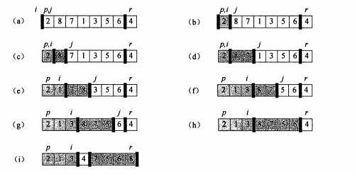
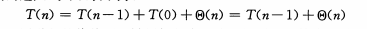

## 第 7 章 快速排序

- 快速排序通常是实际排序应用中最好的选择，因为它的平均性能比较好

- 它的期望时间复杂度是`O(nlgn)`，而且`O(nlgn)`中隐含的常数因子非常小

- 另外，它还能够进行原址排序，甚至在虚存环境中也能很好地工作
---
### 7.1 快速排序的描述

- 快速排序使用分治思想，下面是快排的三步分治过程
    1. 分解
        - 数组`A[p..r]`被划分为两个子数组`A[p..q-1]`和`A[q+1..r]`
        - 然后通过调整，使得`A[p..q-1]`中的每个元素都小于等于`A[q]`
        - 并且使得`A[q+1..r]`中的每个元素都大于`A[q]`
    2. 解决
        - 通过递归调用快排，对子数组`A[p..q-1]`和`A[q+1..r]`进行排序
    3. 合并
        - 因为都是原址排序，所以不需要合并操作

- 代码实现：快速排序
    ````py
    def partition(arr, p, r):
        """实现对子数组的原址重排"""
        i = p - 1
        for j in range(p, r):
            if arr[j] <= arr[r]:
                i += 1
                arr[i], arr[j] = arr[j], arr[i]
        arr[i + 1], arr[r] = arr[r], arr[i + 1]
        return i + 1


    def quick_sort(arr, p, r):
        if p < r:
            q = partition(arr, p, r)
            quick_sort(arr, p, q - 1)
            quick_sort(arr, q + 1, r)


    if __name__ == '__main__':
        arr = [4, 1, 3, 2, 16, 9, 10, 14, 8, 7]
        quick_sort(arr, 0, len(arr) - 1)
        print(arr)
    ````

- 例子：如图  


- `PARTITION` 在子数组 `A[p..r]` 上的时间复杂度为 `O(n)`

---

### 7.2 快速排序的性能

#### 7.2.1 简述

- 快速排序的运行时间依赖于划分是否平衡，而平衡与否又依赖于用于划分的元素

- 如果划分是平衡的，那么快速排序算法性能与归并排序一样

- 如果划分是不平衡的，那么快速排序的性能就接近于插入排序

#### 7.2.2 最坏情况划分

- 当划分产生的两个子问题分别包含了 `n - 1` 个元素和 `0` 个元素时，快速排序的最坏情况发生了

- 这种情况下算法运行时间的递归式  
    

- 最坏情况下时间复杂度为: O(n<sup>2</sup>)

#### 7.2.3 最好情况划分

- 在可能的最平衡的划分中，`PARTITION` 得到的两个子问题的规模都不大于 `n/2`

- 这种情况下算法运行时间的递归式  
    

- 最坏情况下时间复杂度为: O(nlgn)

#### 7.2.4 平衡的划分
`
- 快速排序的平均运行时间更接近于其最好情况

- 原因：任何一种常数比例的划分都会产生深度为O(lgn)的递归树，其中每一层的时间代价都是O(n)。因此，只要划分是常数比例的，算法的运行时间总是O(nlgn)

---

### 7.3 快速排序的随机化版本

- 背景
    - 在讨论快速排序的平均情况性能的时候，我们的前提假设是：输入数据的所有排序都是等概率的
    - 但是在实际工程中，这个假设并不会总是成立

- 解决
    - 可以采用一种称为**随机抽样**的随机化技术
    - 与始终采用`A[r]`作为主元的方法不同，随机抽样从子数组`A[p..r]`中随机选择一个元素作为主元
    - 为了达到这一目的，首先将`A[r]`与从`A[p..r]`中随机选出的一个元素交换

- 示例代码：快速排序的随机化版本
    ````py
    import random


    def random_partition(arr, p, r):
        t = random.randint(p, r)
        arr[r], arr[t] = arr[t], arr[r]
        i = p - 1
        for j in range(p, r):
            if arr[j] <= arr[r]:
                i += 1
                arr[i], arr[j] = arr[j], arr[i]
        arr[i + 1], arr[r] = arr[r], arr[i + 1]
        return i + 1


    def quick_sort(arr, p, r):
        if p < r:
            q = random_partition(arr, p, r)
            quick_sort(arr, p, q - 1)
            quick_sort(arr, q + 1, r)


    if __name__ == '__main__':
        arr = [4, 1, 3, 2, 16, 9, 10, 14, 8, 7]
        quick_sort(arr, 0, len(arr) - 1)
        print(arr)
    ````

