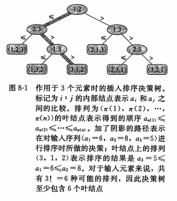

## 第8章 线性时间排序

- 在排序的最终结果中，各元素的次序依赖于它们之间的比较，我们把这类排序算法称为比较排序

- 任何比较排序在最坏情况下都要经过`O(nlgn)`次比较

---

### 8.1 排序算法的下界

#### 8.1.1 首先

- 在一个比较排序算法中，我们只使用元素间的比较来获得输入序列`<a1, a2, ..., an>`中的元素间次序的信息

- 我们不能用其他方法观测元素的值或者它们之间的次序信息

#### 8.1.2 决策树模型
    
- 比较排序可以被抽象为一颗决策树

- 决策树是一颗**完全二叉树**，它可以表示在给定输入规模情况下，某一特定排序算法对所有元素的比较情况

- 每个叶节点上都标注一个序列，每个内部节点都对应一次比较
    
- 排序算法的执行对应于一条从树的根节点到叶节点的路径
    
- 例如  

    
- 对一个正确的比较排序算法来说，n个元素的n!种可能的情况都应该出现在决策树的叶节点上
    
- 而且每个叶节点都必须是可以从根节点经由某条路径到达的

#### 8.1.3 最坏情况的下界
    
- 定理 8.1：在最坏情况下，任何比较排序算法都需要做O(nlgn)次比较
    
- 推论 8.2：堆排序和归并排序都是渐进最优的比较排序算法

---

### 8.2 计数排序

#### 8.2.1 简介

- 计数排序的前提：计数排序假设 `n` 个输入元素中的每一个都是在 `0` 到 `k` 区间内的一个整数，其中 `k` 为某个整数

- 计数排序的基本思想
    - 对于每个输入元素 `x`，确定小于 `x` 的元素个数
    - 利用这一信息，就可以直接把 `x` 放到它在输出数组中的位置上了
    - 例如，如果有17个元素小于 `x`，则 `x` 就应该在第18个输出位置上

#### 8.2.2 代码及解读

- 伪代码如下
    

- 解读
    1. `1-3` 行创建一个大小为 `k+1` 的数组并将其初始化为全 `0`
    2. 第 `4-5` 行的 `for` 循环遍历每个输入元素，如果一个输入元素的值为 `i`，就将 `C[i]` 值加 `1`，在第5行执行完后，`C[i]`中保存的就是等于 `i` 的元素的个数
    3. 第 `7-8` 行通过加总计算确定对每一个`i = 0, 1, ..., k`有多少输入元素是小于或等于 `i` 的
    4. 第 `10-12` 行的 `for` 循环部分，把每个元素 `A[j]` 放到它在输出数组 `B` 中的正确位置上

- 代码实现
    ````py
    def counting_sort(inputs, k):
    temp = [0 for _ in range(0, k)]

    for num in inputs:
        temp[num] += 1

    temp[0] -= 1

    for i in range(1, k):
        temp[i] += temp[i - 1]

    outputs = [0 for _ in range(0, len(inputs))]

    for i in range(len(inputs) - 1, -1, -1):
        outputs[temp[inputs[i]]] = inputs[i]
        temp[inputs[i]] -= 1

    return outputs


    if __name__ == '__main__':
        o = counting_sort([2, 5, 3, 0, 2, 3, 0, 3], 6)
        print(o)
    ````

#### 8.2.3 时间代价

- 时间复杂度: `O(n)`

- 计数排序的下界要优于O(nlgn)，因为**它并不是一个比较排序算法**；它的代码中完全没有输入元素之间的比较操作

- 计数排序的一个重要性质就是它是**稳定的**，具有相同值的元素在输出数组中的相对次序与它们在输入数组中的相对次序相同

---

### 8.3 基数排序

#### 8.3.1 简介

- **基数排序**是一种曾经用在卡片排序机上的算法

- 基数排序的基本思想是将整数按位数切割成不同的数字，然后按每个位数分别排序

- 例如  
    
#### 8.3.2 代码及解读

- 伪代码如下
    

- 解读
    1. 对每一位分别运行一个"位数"排序算法
    2. 为了确保基数排序的正确性，"位数"排序算法必须是稳定的

- 代码实现
    ````py
   def get_digit_val(num, digit):
        return int(num % pow(10, digit) / pow(10, digit - 1))


    def counting_sort(inputs, digit):
        temp = [0 for _ in range(0, 10)]

        for num in inputs:
            digit_val = get_digit_val(num, digit)
            temp[digit_val] += 1

        temp[0] -= 1

        for i in range(1, 10):
            temp[i] += temp[i - 1]

        outputs = [0 for _ in range(0, len(inputs))]

        for i in range(len(inputs) - 1, -1, -1):
            digit_val = get_digit_val(inputs[i], digit)
            outputs[temp[digit_val]] = inputs[i]
            temp[digit_val] -= 1

        return outputs


    def radix_sort(arr, digits):
        for digit in range(1, digits + 1):
            arr = counting_sort(arr, digits)
        return arr


    if __name__ == '__main__':
        o = radix_sort([12, 5, 23, 50, 72, 33, 90, 13], 2)
        print(o)
    ````

#### 8.3.3 时间代价

- 时间复杂度: `O(n)`

- 当位数`d`为常数时，基数排序具有线性的时间复杂度

#### 8.3.4 基数排序与基于比较的排序的对比

- 在处理的n个关键字时，尽管基数排序执行的循环轮数会比快速排序要少，但每一轮它所消耗的时间要长的多

- 此外，利用计数排序作为位数排序算法的基数排序不是原址排序，而很多`O(nlgn)`的排序算法都是原址排序

---

### 8.4 桶排序

#### 8.4.1 简介

- 桶排序简介
    - 桶排序假设输入数据服从均匀分布，平均情况下它的时间代价为`O(n)`

- 桶排序所做的假设
    - 更确切的说，桶排序假设输入是由一个随机过程产生，该过程将元素均匀、独立地分布在`[0, n)`的区间上
    - 因为对输入数据进行了某种假设，所以桶排序的速度也很快

- 桶排序的思路
    - 桶排序将`[0, n)`的区间划分为n个相同大小的子区间，或称为桶
    - 然后，将n个输入数分别放到各个桶中
    - 我们先对每个桶中的数进行排序，然后遍历每个桶，按照次序把各个桶中的元素列出来即可

- 桶排序举例  
    

#### 8.3.2 代码及解读

- 伪代码如下  
    

- 代码实现
    ````py
    import math


    def bucket_sort(arr):
        n = math.ceil(max(arr) / len(arr))
        buckets = [[] for _ in range(0, n)]

        for item in arr:
            index = int(item / n)
            buckets[index].append(item)

        for bucket in buckets:
            bucket.sort()

        output = []
        for bucket in buckets:
            for item in bucket:
                output.append(item)
        return output


    if __name__ == '__main__':
        o = bucket_sort([12, 5, 23, 50, 72, 33, 90, 13])
        print(o)
    ````

#### 8.3.3 时间代价

- 时间复杂度: `O(n)`

- 即使输入数据不服从均匀分布，桶排序也仍然可以线性时间内完成，只要输入数据满足如下性质:所有桶的大小的平方和与总的元素数呈线性相关

---

