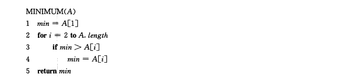
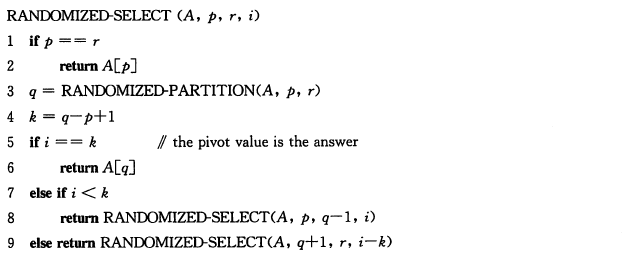

## 第 9 章 中位数和顺序统计量

- 顺序统计量
    - 在一个由n个元素组成的集合中，第i个**顺序统计量**(order statistic)是该集合中第i小的元素
    - 例如，在一个元素集合中，**最小值**是第1个顺序统计量，**最大值**是第n个顺序统计量(i=n)

- 一个中位数是它所属集合的中点元素

### 9.1 最小值和最大值

#### 9.1.1 在一个有n个元素的集合中，需要做多少次比较才能确定其最小元素呢

- 例程: MINIMUM算法  
    

- 结论: 为了确定最小值，至少要做`n-1`次比较

#### 9.1.2 同时找到最小值和最大值

- 我们只需要最多 `3 * Math.floor(n/2)` 次比较就可以同时找到最小值和最大值

- 具体方法如下
    0. 我们需要记录已知的最小值和最大值
    1. 我们将一对输入元素相互进行比较
    2. 我们将较小的与当前最小值比较，将较大的与当前最大值比较，这样，对每两个元素共需要3次比较

- 如何设定已知的最小值和最大值的初始值依赖于n是奇数还是偶数
    - 如果n是奇数，我们就将最小值和最大值的初值都设为第一个元素的值，然后成对地处理余下地元素
    - 如果n是偶数，就对前两个元素做一次比较，以决定最小值和最大值的初值，然后与n是奇数的情形一样，成对处理剩下的元素

- 代码实现: 同时求解最大值和最小值
    ````py
    def minimum_and_maximum(arr):
        arr_len = len(arr)
        print(arr_len)
        if arr_len == 0:
            raise IndexError("param: arr is empty")
        if arr_len % 2:
            max_val, min_val = arr[0], arr[0]
            start = 1
        else:
            max_val, min_val = (arr[0], arr[1]) if (arr[0] > arr[1]) else (arr[1], arr[0])
            start = 2

        for i in range(start, arr_len, 2):
            temp_max, temp_min = (arr[i], arr[i + 1]) if (arr[i] > arr[i + 1]) else (arr[i + 1], arr[i])
            if temp_max > max_val:
                max_val = temp_max
            if temp_min < min_val:
                min_val = temp_min

        return max_val, min_val


    if __name__ == '__main__':
        arr = [-3, 19, -2, 4, 1, 3, 2, 16, 9, 10, 14, 8, 7, 17, 0, -1, 18]
        max_val, min_val = minimum_and_maximum(arr)
        print(max_val, min_val)

    ````

### 9.2 期望为线性时间的选择算法

- 选择算法: 用于选择序列中的第i个顺序统计量

- 伪代码  
    

- 解释
    1. 第一行检查递归的基本情况
    2. 若不符合基本情况，第三行调用`RANDOMIZED-PARTITION`将数组`A[p...r]`划分为两个子数组`A[p..q-1]`和`A[q+1..r]`，使得`A[p..q-1]`中的每个元素都小于或等于`A[q]`，而`A[q+1..r]`中的元素都大于`A[q]`
    3. 然后检查`A[q]`是否是第i个统计量
    4. 若不是则继续递归的调用此算法

- 代码实现: `RANDOMIZED-SELECT`算法
````py
import random


def randomized_partition(arr, p, r):
    t = random.randint(p, r)
    arr[t], arr[r] = arr[r], arr[t]
    i = p - 1
    for j in range(p, r):
        if arr[j] < arr[r]:
            i += 1
            arr[i], arr[j] = arr[j], arr[i]
    arr[i + 1], arr[r] = arr[r], arr[i + 1]
    return i + 1


def randomized_select(arr, p, r, i):
    if p == r:
        return arr[p]
    q = randomized_partition(arr, p, r)
    k = q - p + 1
    if k == i:
        return arr[q]
    elif k > i:
        return randomized_select(arr, p, q, i)
    else:
        return randomized_select(arr, q+1, r, i - k)


if __name__ == '__main__':
    arr = [4, 1, 3, 2, 16, 9, 10, 14, 8, 7]
    o = randomized_select(arr, 0, len(arr) - 1, 1)
    print(o)

````

- 时间复杂度
    - 最坏情况
        - O(n<sup>2</sup>)
        - 每次划分都极不走运地总是按余下地元素中最大地来进行划分
    - 平均情况
        - O(n)
        - 又因为它是随机化的，所以不存在一个特定的会导致其最坏情况发生的输入数据

---

### 9.3 最坏情况为线性时间的选择算法

#### 9.3.1 简介

- `SELECT`算法通过对输入数组的递归划分来找出所需元素，但是，在该算法中能够保证得到对数组的一个好的划分

#### 9.3.2 算法步骤

1. 将输入数组的n个元素划分为`floor(n / 5)`组，每组有5个元素，且至多只有一组由剩下的`n % 5`个元素组成

2. 寻找这`ceil(n / 5)`组中每一组的中位数: 首先对每组元素进行插入排序, 然后确定每组有序元素的中位数

3. 对第二步中找到的`ceil(n / 5)`个中位数，递归调用`SELECT`以找出其中位数`x`

4. 通过`PARTITION`函数按照`x`对输入数组进行划分, 假设`x`是数组的第`k`个顺序统计量

5. 如果`i=k`,则返回`x`; 如果`i<k`,则在低区递归调用`SELECT`来找出第`i`小的元素;如果`i>k`,则在高区递归查找第`i-k`小的元素

#### 9.3.3 算法实现:Python

````py
import math
import random


def divide_arr(arr, start, end):
    labels = [i for i in range(start, end, 5)]
    if end != start[-1]:
        labels.append(end)
    return labels


def find_median(arr, labels):
    for i in range(0, len(labels) - 1):
        insertion_sort(arr, labels[i], labels[i + 1])
    medians = []
    for i in range(0, len(labels) - 1):
        medians.append(arr[math.floor((labels[i] + labels[i + 1]) / 2)])
    return medians


def insertion_sort(arr, start, end):
    if start >= end + 1:
        return
    for i in range(start + 1, end):    
        key = arr[i]
        j = i - 1
        while j > start - 1 and arr[j] > key:
            arr[j + 1] = arr[j]
            j -= 1
        arr[j + 1] = key
        


def select(arr, start, end, i):
    if start == end - 1:
        return arr[start]
    elif start > end - 1:
        return arr[end - 1] 
    else:
        labels = divide_arr(arr, start, end)
        medians = find_median(arr, labels)
        x = select(medians, 0, len(medians), math.floor((len(medians)-1) / 2))
        o = partition(arr, start, end, x)
        if o + 1 - start == i:
            return arr[o]
        elif o + 1 - start < i:
            return select(arr, o + 1, end, i - (o + 1 - start))
        else:
            return select(arr, start, o, i) 


def partition(arr, p, r, x):
    i = p - 1
    n = i
    for j in range(p, r):
        if arr[j] <= x:
            i += 1
            arr[i], arr[j] = arr[j], arr[i]
            if arr[i] == x:
                n = i
    arr[i], arr[n] = arr[n], arr[i]
    return i


if __name__ == "__main__":
    for i in range(1, 11):
        print()
        arr = [8, 9, 3, 5, 4, 1, 7, 2, 0, 6]
        print(arr)
        o = select(arr, 0, len(arr), i)
        print(arr)
        print(o)
````

#### 9.3.4 时间复杂度

- 最坏情况下的递归式   
    

- 最坏情况下的时间复杂度
    - `O(n)`, 带入主方法可以证明


